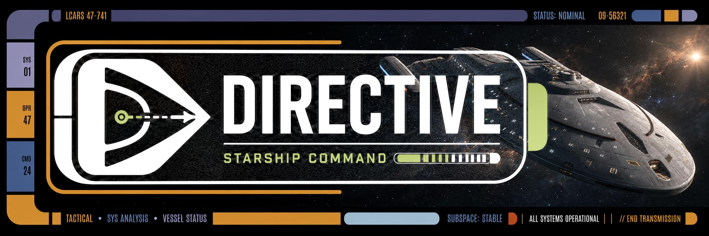
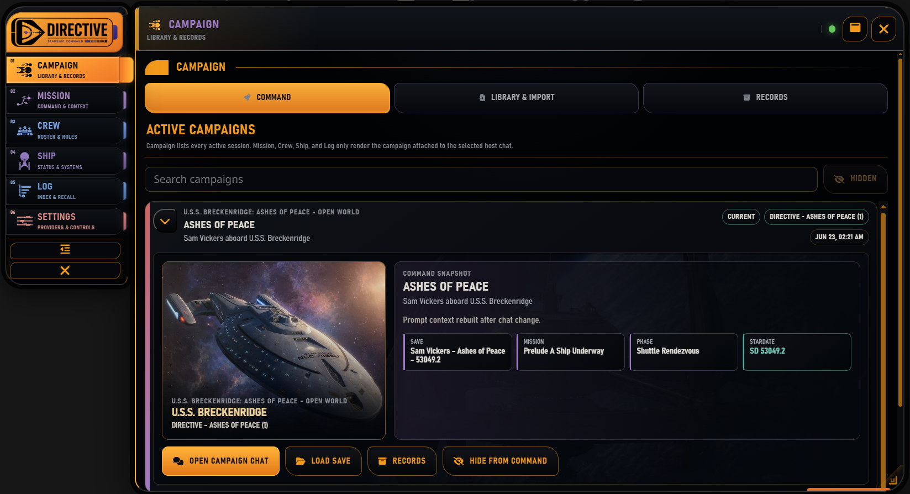
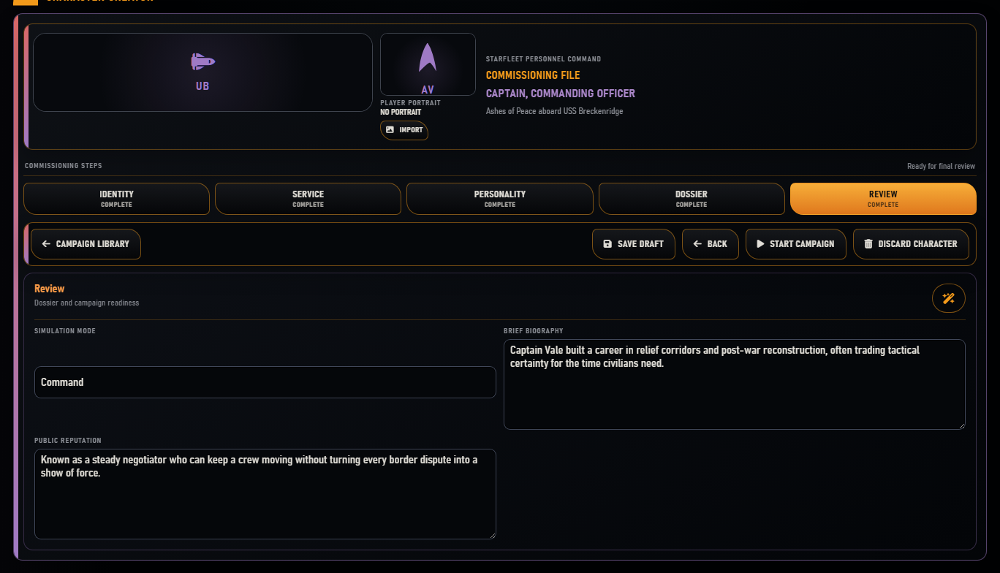

<p align="center">
  
</p>

# Directive

**Directive is a pre-alpha, host-portable extension engine for a persistent, freeform Star Trek command RPG.**

The primary playable campaign package is **Ashes of Peace**, centered on the player as the new Starfleet Commander and Executive Officer aboard the Intrepid-class U.S.S. Breckenridge. Directive is not hardcoded to one ship: the bundled package set also includes the draft U.S.S. Glass Harbor campaign **Drowned Constellation**, and the product model revolves around loadable campaign packages that define the ship, crew, campaign frame, mission types, local worldbuilding, end conditions, and package-specific guardrails.

Directive is chat-first. The player acts through ordinary roleplay prose, while the extension maintains authoritative structured state behind the scenes. Player prose declares intent and attempted action; it does not directly rewrite reality.

Current development state: `0.1.0-pre-alpha.1`. SillyTavern support is described by `manifest.json` and requires SillyTavern `1.12.0` or newer. Lumiverse support is described by `spindle.json` and is under active local smoke testing.

<p align="center">
  
</p>

## Contents

- [Fast Start](#fast-start)
- [Key Features](#key-features)
- [Documentation](#documentation)
- [Roadmap](#roadmap)
- [Security](#security)
- [Project Layout](#project-layout)
- [Storage](#storage)
- [Authoring Campaign Packages](#authoring-campaign-packages)
- [Verification](#verification)
- [Source Material](#source-material)
- [License](#license)

## Fast Start

### SillyTavern

1. Install Directive from the repo git URL in SillyTavern (**Extensions > Install Extension**) and reload the page.
2. Open **Extensions > Directive**. In **Settings > Providers**, install or update the [Directive SillyTavern preset](docs/user/SILLYTAVERN_PRESET.md), then configure your Utility Provider (fast and cheap model, e.g. nvidia/nemotron-3-ultra-550b-a55b:thinking) and Reasoning Provider (GLM-5.2, Deepseek-V4 Pro, Opus 4.8, and other frontier models).
3. In **Campaign > Library & Import**, select **Ashes of Peace** and choose **Create Character**.
4. Complete the guided character creation, choose the difficulty mode, use **Save Draft** if you need to pause, then select **Start Campaign**.
5. Directive creates and selects its own host character card, opens a fresh campaign chat, posts the intro once, installs player-safe campaign context, and marks the first save active. You do not need to create or select a SillyTavern character/group first.
6. Play by writing normal in-character posts in the campaign chat. Use **Mission** for active context, pause decisions, Open Threads/Open World work, committed outcomes, and recovery; use **Campaign** for saves, records, package import, and chat-binding recovery.

<p align="center">
  
</p>

Use [First Campaign Workflow](docs/user/FIRST_CAMPAIGN_WORKFLOW.md) for the play path and [Directive Operator Manual](docs/user/DIRECTIVE_OPERATOR_MANUAL.md) for runtime details.

### Lumiverse

Lumiverse retains the shared engine and Spindle host adapter. The chat-native transaction and state services are host-neutral, but this checkpoint's automatic chat creation, SillyTavern event observation, and `setExtensionPrompt` bridge are implemented and tested for the SillyTavern adapter. See [Lumiverse Installation And Smoke Testing](docs/user/LUMIVERSE_INSTALLATION.md) for the current Lumiverse surface.

## Key Features

| Surface | What it does |
| --- | --- |
| **Chat-Native Campaign Activation** | Accepts the Character Creator draft, creates the first save, creates a fresh campaign chat, posts one intro, installs prompt context, and resumes safely after partial failure. |
| **Dual Provider Routing** | Separates low-cost Utility work from deeper Reasoning work, lets operators route individual model-call roles between lanes, and supports the current host model, SillyTavern Connection Profiles, and session-key OpenAI-compatible endpoints. |
| **Utility Turn Gate** | Classifies every bound-chat player post through deterministic fast paths or a low-cost provider fallback, then recommends only the workers needed for that turn. |
| **Mission Director** | Resolves consequential freeform intent through deterministic-first mission, adjudication, retrieval, state-delta, narrator, and Command Log packets. |
| **Mechanics-First Durability** | Persists committed mechanics before narration or host posting, so retries reuse the same outcome rather than rerolling it. |
| **Deep Campaign Tracking** | Maintains revisioned, bounded snapshots plus ingress, response, recovery, sidecar, and pending-interaction journals scoped to the campaign/chat binding. |
| **Validated Sidecars** | Runs continuity, relationship, crew, ship, Command Bearing, and side-work workers as proposal-only jobs whose operations require authorized roots and a current base revision. |
| **Player-Safe Prompt Context** | Builds explicit campaign, player, scene, fact, crew, ship, log, pressure, and narrator blocks; supports install, update, clear, rebuild, inspection, and chat-switch suspension. |
| **Command Competence And Bearing** | Supplies routine Starfleet procedure while preserving player judgment, and offers transaction-safe Inspiration/Resolve interventions at eligible pauses. |
| **Persistent Saves And Recovery** | Supports drafts, first saves, autosaves, branches, load, edit/delete reconciliation, prompt rebuild, response retry, narration rewrite, outcome rerun, and rollback. |
| **Campaign Conclusion** | Commits a recoverable closing record, posts the final scene, completes the save, clears injection, and exposes archival. |
| **Host Boundary** | Keeps engine services host-neutral while SillyTavern and Lumiverse use separate storage, generation, prompt, chat, event, and shell adapters. |

<p align="center">
  
</p>

## Documentation

Release notes:

- [Directive 0.1.0-pre-alpha.1](docs/release/0.1.0-pre-alpha.1.md)
- [Chat-Native Target Flow Checkpoint](docs/release/CHAT_NATIVE_TARGET_FLOW_CHECKPOINT.md)

Release-facing docs:

- [Documentation Index](docs/DOCUMENTATION_INDEX.md)
- [First Campaign Workflow](docs/user/FIRST_CAMPAIGN_WORKFLOW.md)
- [Directive Operator Manual](docs/user/DIRECTIVE_OPERATOR_MANUAL.md)
- [Directive Technical Manual](docs/technical/DIRECTIVE_TECHNICAL_MANUAL.md)
- [Campaign Authoring Guide](docs/authoring/CAMPAIGN_AUTHORING_GUIDE.md)
- [SillyTavern Preset](docs/user/SILLYTAVERN_PRESET.md)
- [Lumiverse Installation And Smoke Testing](docs/user/LUMIVERSE_INSTALLATION.md)
- [Storage And State Safety](docs/user/STORAGE_AND_STATE_SAFETY.md)
- [Model Calls And Provider Routing](docs/technical/MODEL_CALLS_AND_PROVIDER_ROUTING.md)
- [Player Turn Sequence](docs/technical/PLAYER_TURN_SEQUENCE.md)
- [Campaign Package Model](docs/packages/CAMPAIGN_PACKAGE_MODEL.md)
- [Campaign Package Schema](docs/packages/CAMPAIGN_PACKAGE_SCHEMA.md)
- [Campaign Schema Reference](docs/authoring/CAMPAIGN_SCHEMA_REFERENCE.md)
- [LLM Campaign Authoring Guide](docs/authoring/LLM_CAMPAIGN_AUTHORING_GUIDE.md)
- [Glass Harbor / Drowned Constellation](docs/campaigns/GLASS_HARBOR_DROWNED_CONSTELLATION.md)
- [Chat-Native Runtime](docs/architecture/CHAT_NATIVE_RUNTIME.md)
- [Mission Director As-Coded](docs/architecture/MISSION_DIRECTOR_AS_CODED.md)
- [Testing Strategy](docs/testing/TESTING_STRATEGY.md)
- [Command Spine Migration](docs/planning/COMMAND_SPINE_MIGRATION.md)

Development notes live in [docs/development](docs/development/) and [docs/planning](docs/planning/) until promoted, rewritten, or archived as release-facing docs.

## Roadmap

- Run repeatable live SillyTavern smoke for automatic chat creation, interceptor ordering, Connection Profile calls, prompt placement, message edit/delete payloads, and post/save failure recovery.
- Extend the same chat-native host contract across Lumiverse once its chat and prompt lifecycle exposes equivalent control points.
- Deepen provider-assisted relationship, crew, ship, and continuity proposals while keeping state mutation revision-checked and proposal-only.
- Expand package management with export, delete, update comparison, and richer trust review.
- Add richer branch comparison and campaign archive/export UX without weakening the authoritative save model.

## Security

Directive runs as a browser-side SillyTavern extension and as a Lumiverse Spindle extension. It does not require a SillyTavern server plugin for the current SillyTavern storage model.

Campaign package imports are intended to be data-only. The current `.directive-campaign.zip` normalizer rejects unsafe paths and active file types such as scripts, HTML, executables, scriptable SVG, and WebAssembly. Imported packages can still affect prompt content after you load and use them, so treat packages from unknown sources as untrusted prompt material.

Utility and Reasoning requests route through the selected host model, SillyTavern Connection Profile, or direct OpenAI-compatible endpoint. Per-role routing overrides are persisted as non-secret settings. Direct endpoint keys are session-only and are not serialized into extension settings or campaign saves.

Narration routes through the active host generation adapter. Provider or host-post failures after a structured mechanics commit are retried from the same committed packet instead of rerolling mechanics.

## Project Layout

```text
assets/                 Branding, icons, documentation assets, and passive package assets.
content/                Authoring-source campaign content before normalization.
docs/                   Release-facing docs, architecture notes, planning, testing, and source briefs.
packages/               Normalized bundled and example campaign package records.
schemas/                JSON schemas for packages, campaign projection, and mission contracts.
src/                    Runtime source split by ownership.
styles/                 Directive CSS entrypoints.
tests/                  Fixtures, browser, visual, storage, unit, and contract test notes.
tools/scripts/          Dependency-free validators, contract tests, and alpha gate scripts.
```

Important runtime modules:

- `src/extension/index.js`: SillyTavern manifest-facing entrypoint shim.
- `src/hosts/sillytavern/`: SillyTavern lifecycle, chat creation/binding, message observation, prompt injection, dual-provider routing, storage, generation, and shell integration.
- `src/hosts/lumiverse/`: Lumiverse Spindle backend/frontend entrypoints, storage, generation, tools, prompt blocks, and runtime bridge.
- `src/ui/directive-command-spine-shell.js`: SillyTavern left command spine, single drawer, mobile fallback, and resize handle.
- `src/ui/directive-shell-layout.mjs`: persisted drawer geometry and viewport constraints.
- `src/ui/directive-compact-shell.js`: legacy compact shell still mounted by Lumiverse during migration.
- `src/runtime/runtime-shell.js`: Directive route state, drawer/full-screen behavior, resizing, and panel routing.
- `src/runtime/runtime-app.mjs`: composition root for package loading, activation, chat orchestration, Director commit, prompt synchronization, recovery, conclusion, and UI projections.
- `src/runtime/chat-turn-orchestrator.mjs`: serialized ingress, utility routing, pause handling, exact-one response arbitration, and response recovery.
- `src/runtime/state-delta-gateway.mjs`: revisioned state mutation, bounded snapshots, journals, authorization, and recovery.
- `src/providers/directive-provider-settings.mjs`: independent Utility and Reasoning provider configuration.
- `src/runtime/campaign-start-controller.mjs`: Campaign and Character Creator view models over the campaign-start service.
- `src/mission/director.mjs`: current deterministic Mission Director loop.
- `src/campaign/transaction-state.mjs`: commit, swipe, rerun, delete, restore, and branch-safe state mutation.
- `src/competence/`: Command Competence packet builders and policy helpers.
- `src/pressures/`: pressure ledger, scoring, cooldowns, side-mission candidate selection, Open Orders review state, assignment scene activation/beats, and assignment resolution/progress state.
- `src/packages/campaign-package-importer.mjs`: `.directive-campaign.zip` import normalizer.
- `src/storage/directive-storage-repository.mjs`: indexed JSON storage repository for drafts and campaign saves.

## Storage

Settings should stay compact: preferences, pointers, active package/save references, and lightweight diagnostics. Drafts, campaign saves, turn ledgers, Command Log records, imported package payloads, and future creator projects should live as Directive-owned logical JSON records. SillyTavern maps those records to flat files under `/user/files`; Lumiverse maps them to scoped Spindle storage.

Directive separates reusable package data from campaign-owned state. A package defines the ship and campaign template; a save records what happened in one playthrough. Campaign state is authoritative over narration and Command Log prose.

See [Storage And State Safety](docs/user/STORAGE_AND_STATE_SAFETY.md) for the current storage contract.

## Authoring Campaign Packages

Directive packages use the approved top-level spine:

```text
manifest
ship
crew
characterCreation
world
storyArcs
endConditions
questTemplates
threadTemplates
reactionRules
directorCards
contextPolicy
guardrails
assets
```

The primary reference package is [packages/bundled/breckenridge/ashes-of-peace.campaign-package.json](packages/bundled/breckenridge/ashes-of-peace.campaign-package.json). The second bundled draft package is [packages/bundled/glass-harbor/drowned-constellation.campaign-package.json](packages/bundled/glass-harbor/drowned-constellation.campaign-package.json). Start with [Campaign Authoring Guide](docs/authoring/CAMPAIGN_AUTHORING_GUIDE.md), [Campaign Package Structure](docs/authoring/CAMPAIGN_PACKAGE_STRUCTURE.md), [Campaign Schema Reference](docs/authoring/CAMPAIGN_SCHEMA_REFERENCE.md), [Campaign Package Model](docs/packages/CAMPAIGN_PACKAGE_MODEL.md), and [Campaign Package Schema](docs/packages/CAMPAIGN_PACKAGE_SCHEMA.md).

Reference-quality packages should be data-only, schema-valid, mission-graph driven, and explicit about hidden truth, reveal gates, Character Creator constraints, Command Competence metadata, quest templates, thread templates, reaction rules, Director cards, context policy, guardrails, assets, and player-facing safety.

## Verification

Run the current alpha gate:

```powershell
node tools\scripts\run-alpha-gate.mjs
```

The gate validates the extension shell, dual-provider routing, SillyTavern chat/prompt/event lifecycle, campaign activation, utility classification, exact-one response behavior, mechanics-first recovery, player-safe prompt projection, state-delta authorization, sidecar scheduling, message reconciliation, campaign conclusion, package contracts, existing Mission Director behavior, storage, transaction safety, dual-host adapters, and repository structure.

For a local Lumiverse server, run the default no-generation smoke with host credentials supplied through environment variables:

```powershell
$env:LUMIVERSE_BASE_URL='http://localhost:7860'
$env:LUMIVERSE_USERNAME='<username>'
$env:LUMIVERSE_PASSWORD='<password>'
$env:DIRECTIVE_LIVE_GENERATION='0'
node tools\scripts\smoke-lumiverse-live.mjs
```

## Source Material

The initial documentation and package contracts were derived from repo-local source briefs:

- [Directive Game Design Document](docs/source/Directive_Game_Design_Document.md)
- [Star Trek Command RPG Extension Project Brief](docs/source/Star_Trek_Command_RPG_Extension_Project_Brief.md)
- [Directive Ashes of Peace Campaign v0.2](docs/source/Directive_Ashes_of_Peace_Campaign_v0.2.md)
- [Directive Breckenridge Senior Staff Character Bible](docs/source/Directive_Breckenridge_Senior_Staff_Character_Bible.md)
- Saga as a reference for Utility/Reasoning provider separation and SillyTavern provider routing.
- SillyTavern Multihog DnD Framework as a reference for chat-scoped tracking, history, restoration, and durable state updates.
- See [THIRD_PARTY_NOTICES.md](THIRD_PARTY_NOTICES.md) for attribution and license text.

## License

See [LICENSE](LICENSE) and [THIRD_PARTY_NOTICES.md](THIRD_PARTY_NOTICES.md).
