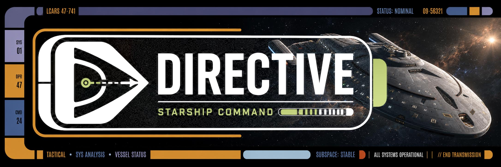

<p align="center">
  
</p>

# Directive

Directive is a pre-alpha SillyTavern extension for a persistent, freeform Star Trek command RPG. V1 is story-first: models write natural prose and recognize bounded authored evidence, while deterministic reducers own campaign truth.

Ashes of Peace is the only playable V1 campaign. The player is the new executive officer aboard the U.S.S. Breckenridge, with Captain Mara Whitaker and an autonomous senior staff participating in the story. Other campaign names and images may appear as locked previews; they have no runtime packages or activation path.

## Fast start

1. Install this repository as a SillyTavern extension and reload.
2. Click the ship icon beside SillyTavern's composer.
3. In Settings, install the bundled Directive preset and configure the Utility and Reasoning model lanes.
4. On Campaign, start Ashes of Peace and complete character creation.
5. Play in the campaign chat using ordinary roleplay prose.

Assistant replies are provisional. You may swipe freely; a selected reply becomes accepted only when you send the next player message. Mission state, Story Settlement, story time, ship status, people moments, and Command Bearing derive only from validated accepted sources.

## V1 surfaces

| Route | Purpose |
|---|---|
| Campaign | Start/resume Ashes, manage exact V1 saves and checkpoints, view locked previews. |
| Mission | See visible primary/optional objectives, known facts, known clocks, support, outcomes, and mission completion. |
| People | Use Command Bearing and see its reserve, public crew profiles, visible posture, and a few defining moments. |
| Ship | See identity, capability, one operational aggregate, and material limitations. |
| Settings | Configure providers/preset and verify or export support state. |

## Architecture

```text
accepted assistant/player pair
  -> closed model interpretation
  -> deterministic validation and mission reduction
  -> revisioned, domain-bounded V1 state commits
  -> aggregate Story Settlement
  -> concise player projections and chat-bound prompt context
```

Directive V1 does not load or migrate other Directive state layouts. It contains no compatibility hydration, parallel semantic writers, command log, thread ledger, reconciliation workflow, sidecar scheduler, or per-mention issue tracker.

## Project layout

```text
assets/                 Branding and package media.
docs/                   Current V1 architecture, authoring, operations, and source references.
packages/               Ashes package, concise crew/ship datasets, mission definitions, preview registry.
presets/                Bundled SillyTavern preset.
schemas/                Exact V1 JSON contracts.
src/                    Runtime, host integration, reducers, projections, and UI.
styles/                 Directive UI stylesheet.
tests/fixtures/          Ashes scenario matrices and bounded story fixtures.
tools/scripts/          Focused V1 contract gate.
```

## Verification

```powershell
npm.cmd test
```

`test`, `verify`, and `v1-gate` run the same focused V1 gate. Release confidence additionally requires an installed-copy SillyTavern soak covering new campaign start, swipes, source mutation, objective progress, mission transition, restart/resume, and mobile UI.

## Documentation

Start with the [V1 documentation index](docs/DOCUMENTATION_INDEX.md), [first campaign workflow](docs/user/FIRST_CAMPAIGN_WORKFLOW.md), and [V1 gameplay architecture](docs/architecture/V1_GAMEPLAY_ARCHITECTURE.md).

## Security and providers

Directive runs as a browser-side SillyTavern extension. Utility and Reasoning calls may use the current SillyTavern model, a connection profile, or an explicitly configured OpenAI-compatible endpoint. Direct endpoint API keys are session-only. Model output never mutates semantic state without deterministic validation.

## Source and license

Creative source documents are retained under `docs/source/`; runtime package data is authoritative during play. See [THIRD_PARTY_NOTICES.md](THIRD_PARTY_NOTICES.md) for borrowed-behavior attribution and [LICENSE](LICENSE) for license terms.
