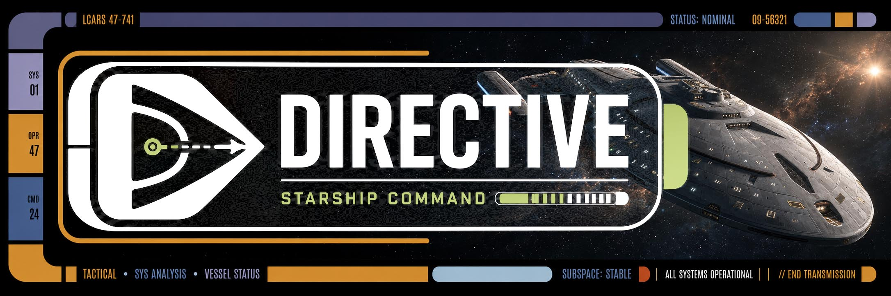
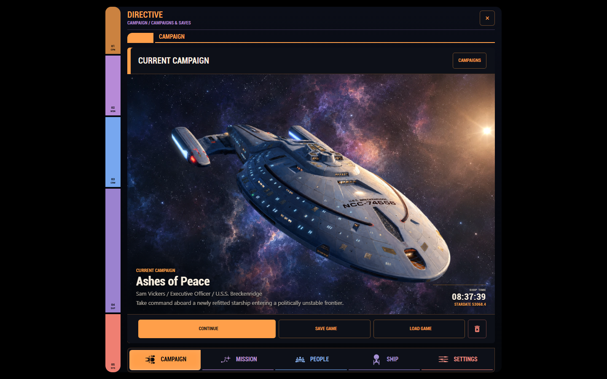
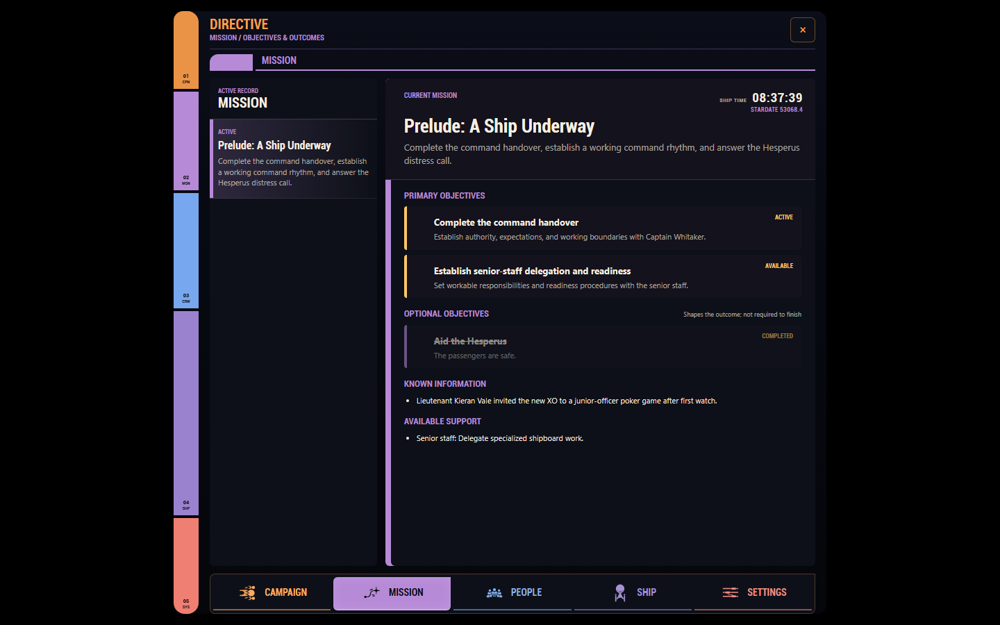
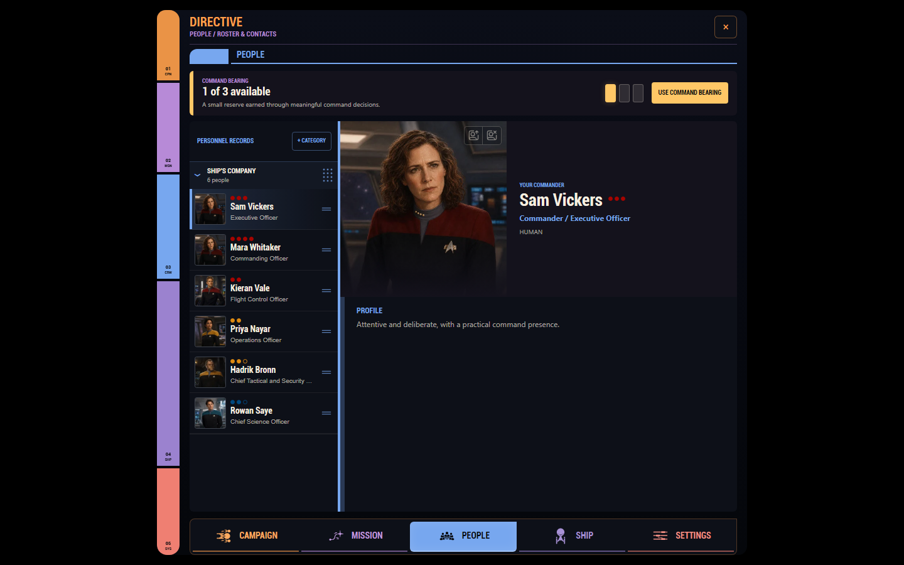
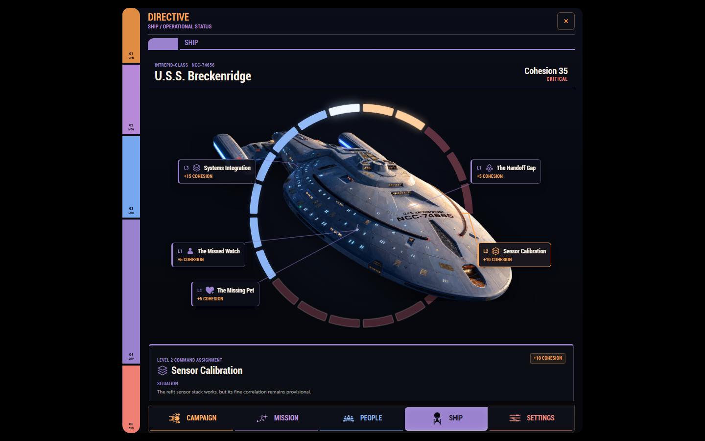
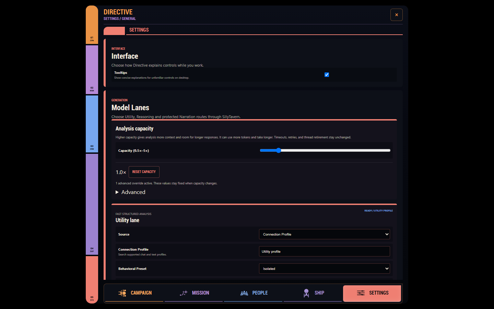

  

# Directive

**Take your place on the bridge.** Directive is a SillyTavern extension for persistent, Star Trek-inspired roleplay: lead a starship crew through an unfolding campaign, make choices that shape missions, and watch the ship and its people respond.

Directive is an ambitious alpha experiment. It combines AI-generated roleplay with structured campaign, mission, ship, and relationship systems. A lot of it works today, and there is a substantial campaign to explore.

## Development status

Development is paused indefinitely. I’m taking a break from my SillyTavern extension projects and from agentic coding as a hobby because more of it is becoming part of my day job. The broader vision—keeping a deep story, missions, lore, ship operations, relationships, and player growth coherent across both language-model calls and deterministic systems—is still unfinished. AI roleplay is an early and rapidly evolving technology, and building all of those interdependent parts into one experience is a real challenge. My pause is a personal break from the hobby.

That larger vision is unfinished, but the current alpha is here to explore and enjoy. Treat it as a playable snapshot: some rough edges and inconsistencies remain, and there is no active development roadmap.

## Your first assignment

The current playable campaign is **Ashes of Peace**. Serve as executive officer aboard the U.S.S. *Breckenridge* under Captain Mara Whitaker. Begin with a command handover and a ship in need of steady leadership; build trust with the senior staff, answer calls for help, and see where your decisions take the campaign.

Directive gives you more than a roleplay prompt. Its campaign and mission views track objectives and outcomes, People keeps a roster of important characters and relationship moments, and Ship models the vessel’s operational state and ongoing work. Your chat remains the heart of play: write what your character says or does in natural roleplay prose, then use Directive’s other views to follow the consequences.

## Screenshots

Explore the five main views. These are representative captures of the current interface from the project's UI preview, populated with example Ashes of Peace data; your campaign state and generated narration will differ.

<table>
  <tr>
    <td align="center"><strong>Campaign</strong> </td>
    <td align="center"><strong>Mission</strong> </td>
  </tr>
  <tr>
    <td align="center"><strong>People</strong> </td>
    <td align="center"><strong>Ship</strong> </td>
  </tr>
  <tr>
    <td align="center"><strong>Settings</strong> </td>
    <td></td>
  </tr>
</table>

## Fast start

1. In SillyTavern, open **Extensions → Install extension** and install Directive from [`https://github.com/MentallyQuill/Directive`](https://github.com/MentallyQuill/Directive). Reload SillyTavern when the installation finishes.
2. Open a chat and select the Directive ship icon beside the message input.
3. In **Settings**, install the bundled Directive preset and configure both model lanes: **Utility** for fast structured analysis and **Reasoning** for deeper story decisions. You can use your current SillyTavern model or connection profiles.
4. Open **Campaign**, choose **Ashes of Peace**, and create your character.
5. Continue the opening scene in the chat. Write in roleplay prose, send your actions, and check Mission, People, and Ship as the story develops.

Model replies are drafts until you choose and send one. You can swipe through alternatives before accepting a reply.

## The bridge at a glance

- **Campaign** — start or continue a campaign and manage saves.
- **Mission** — follow current objectives, known information, and recorded outcomes.
- **People** — browse important characters and relationship developments.
- **Ship** — review ship status, crew work, and operational changes.
- **Settings** — configure model lanes and presets, and check storage and diagnostics.

## A few alpha notes

- Only **Ashes of Peace** is currently playable. Other campaign names and packages may be previews or source material.
- Behavior and saves can have rough edges. Keep local backups when possible, and check **Settings → Storage** before attempting manual save edits.
- If something looks out of sync, verify the campaign is bound to the chat you are using, then refresh Directive and check Storage in Settings.
- Directive supports the current V1 gameplay format. It does not migrate pre-V1 gameplay formats.

## Keep exploring

- [Documentation index](docs/DOCUMENTATION_INDEX.md)
- [First Campaign Workflow](docs/user/FIRST_CAMPAIGN_WORKFLOW.md) — setup and a guided first session
- [Directive Operator Manual](docs/user/DIRECTIVE_OPERATOR_MANUAL.md)
- [SillyTavern Preset Guide](docs/user/SILLYTAVERN_PRESET.md)
- [V1 Gameplay Architecture](docs/architecture/V1_GAMEPLAY_ARCHITECTURE.md) — for builders and curious readers

Creative source documents live in `docs/source/`; runtime package data controls what is active while playing. Directive is a browser-side SillyTavern extension. Model calls use your configured SillyTavern model or connection profile, and proposed runtime state changes are validated before they are applied.

See [THIRD_PARTY_NOTICES.md](THIRD_PARTY_NOTICES.md) and [LICENSE](LICENSE).
