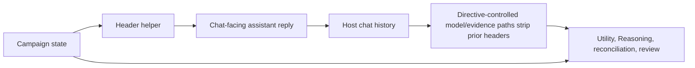

# Timekeeping System

## Status

Implemented pre-alpha reply-header layer plus design contract for deterministic campaign time advancement.

The current code guarantees a deterministic display header for Directive-owned replies and injects a current-header contract for host-native SillyTavern generations. It also strips prior display headers from model-side transcript/evidence paths that Directive controls, so prior headers do not become evidence that time advanced.

Broader time adjudication, such as deciding how many minutes pass during an arbitrary conversation or cut, remains a planned layer on top of the current world-time and prompt-header foundation.

## Product Contract

Every assistant reply in a bound Directive campaign chat should begin with:

```text
*Stardate #####.# | HHMM hours*
```

Examples:

```text
*Stardate 53049.2 | 0830 hours*
*Stardate 53049.2 | 1830 hours*
```

The header is display-only. It is generated from Directive campaign state and must not be treated by an LLM as diegetic evidence, elapsed-time proof, or permission to advance time. The authoritative clock is campaign state plus deterministic time-boundary operations.

## Stardate And Ship Time

The TNG/DS9/Voyager-era production shape is:

```text
4 S DDD.d
```

Where:

| Segment | Meaning |
| --- | --- |
| `4` | 24th century production-era prefix. |
| `S` | Season/year index in the TNG-era production system. |
| `DDD` | Progress through that production season/year, `000` to `999`. |
| `.d` | Fractional day marker, commonly treated as a tenth of a day. |

Directive's current implementation does not derive stardates from a Gregorian calendar. Campaign packages and saves own opening/current stardate values, and the open-world World Director advances them by elapsed hours using package world layout policy.

Ship time uses Starfleet-style 24-hour clock display:

```text
HHMM hours
```

The display helper accepts explicit ship-clock state when present. Otherwise it derives ship time from the campaign opening minute plus elapsed campaign minutes or hours.

Bundled campaign projections author varied `openingMinuteOfDay` values so a fresh campaign does not imply that every opening scene begins at midnight or at the same watch:

| Campaign | Opening ship time | Rationale |
| --- | --- | --- |
| `Black Current` | `0315 hours` | Overnight Wreckfall Alpha hazard watch turns into an emergency salvage and command-loss incident. |
| `Unseen Border` | `0645 hours` | Early patrol departure and acting-command setup before the blank route reveals itself. |
| `Ashes of Peace` | `0830 hours` | Morning command handover and readiness work during a routine shakedown transit. |
| `Broken Accord` | `1015 hours` | Scheduled Crown Station approach and lattice review while diplomatic and technical teams are active. |
| `Drowned Constellation` | `1415 hours` | Post-noon convoy escort, survey-buoy custody, and gate traffic before the inversion. |
| `Enemy's Garden` | `1720 hours` | Late harvest/processing-tower emergency, putting evacuation and quarantine pressure into the evening. |

## Authoritative Time Model

Time advances only at deterministic boundaries:

- explicit runtime calls such as `advanceOpenWorldTime`;
- travel transitions through the World Director;
- authored quest, front, clock, and reaction predicates that depend on elapsed time or stardate;
- future time-adjudication commits that write a structured state delta.

Time does not advance because:

- the player sent another chat message;
- the model wrote a new header;
- chat history contains older headers;
- an LLM inferred that a scene "felt long";
- a prompt-side instruction guessed a clock value.

This lets a good conversation remain a few in-universe minutes while still allowing hard deadlines, travel durations, watches, and "cut to dinner" transitions to move the campaign clock when a boundary explicitly says so.

## Current Implementation

### Header Helper

`src/time/campaign-time-header.mjs` owns formatting and display sanitization:

| Function | Responsibility |
| --- | --- |
| `formatStardate(value)` | Formats one-decimal stardates and pads short whole parts to five digits. |
| `formatShipTime(value)` | Formats minute-of-day values as `HHMM hours`. |
| `resolveCampaignStardate(campaignState)` | Reads current stardate from campaign-time, time-ledger, world-state, or campaign roots. |
| `resolveCampaignMinuteOfDay(campaignState)` | Reads explicit ship clock roots or derives minute-of-day from opening minute plus elapsed time. |
| `buildCampaignReplyHeader(campaignState)` | Produces `*Stardate #####.# | HHMM hours*`. |
| `stripCampaignReplyHeader(text)` | Removes a leading prior display header. |
| `prefixCampaignReplyHeader(text, campaignState)` | Replaces any stale leading header and prepends the current one. |
| `createCampaignReplyHeaderPromptBlock(campaignState)` | Emits the host prompt block requiring the current header and warning that prior headers are display artifacts. |

The helper recognizes future state shapes such as `campaignTime.shipClock`, `campaignTime.shipTime`, `timeLedger.shipClock`, `worldState.shipClock`, `worldState.minuteOfDay`, `campaign.openingMinuteOfDay`, `worldState.elapsedMinutes`, and `worldState.elapsedHours`.

### Reply Surfaces

Directive-owned reply paths physically prefix the header before posting to chat:

| Surface | File |
| --- | --- |
| Standard committed/pause/routine posts | `src/runtime/response-dispatcher.mjs` |
| Campaign introduction post and intro swipe reroll | `src/runtime/campaign-activation-coordinator.mjs` |
| Campaign conclusion post | `src/runtime/campaign-conclusion-service.mjs` |
| Terminal checkpoint post | `src/runtime/campaign-end-condition-service.mjs` |
| Directive-owned assistant response swipe reroll | `src/runtime/chat-turn-orchestrator.mjs` |
| Outcome Integrity accepted edit swipe | `src/runtime/runtime-app.mjs` |

The durable intro packet, conclusion recap text, and revision records remain header-free. The header is a chat-facing display wrapper, not part of stored prose.

### Host-Native Generation

Host-native SillyTavern generations cannot be deterministically post-processed by Directive after the host model emits text. For that path, Directive installs a high-priority `[Directive: Reply Header]` prompt block from `src/context/context-orchestrator.mjs` and the bundled SillyTavern preset repeats the rule.

The injected block says:

- begin every assistant reply with the exact current header line;
- prior reply headers in chat history are display artifacts;
- do not infer time passage from prior headers;
- do not recalculate or alter the header.

This is the strongest available contract for host-native output. Directive-owned output remains deterministic because it is posted through Directive services.

## Model Boundary And Header Sanitization

Prior headers are stripped before model-side paths that Directive controls:

| Path | File | Reason |
| --- | --- | --- |
| Response-swipe generation transcript snippets | `src/runtime/chat-turn-orchestrator.mjs` | Alternate prose should not treat old headers as scene text. |
| Utility classifier recent-chat context | `src/runtime/chat-turn-orchestrator.mjs` | Classification should not infer a time skip from visible headers. |
| Outcome Integrity review current/proposed text | `src/runtime/outcome-integrity.mjs` | Prose edit review should compare commitments, not clock wrappers. |
| Scene Reconciliation message normalization | `src/runtime/scene-reconciliation.mjs` | Transcript evidence and hashes should track narrative content, not display headers. |

This creates a write-only display behavior:



The model may see the current header instruction when it is responsible for host-native prose, but prior visible headers are not allowed to become state evidence in Directive-owned model calls.

## Time Advancement Design

The timekeeping system is split into three layers.

### Layer 1: Display

Implemented.

The display layer reports current state using the reply header and never mutates time.

### Layer 2: Deterministic Boundaries

Implemented through open-world time, travel, and the campaign time ledger.

Boundaries should be explicit operations with:

- source action id;
- prior stardate and ship minute;
- new stardate and ship minute;
- elapsed minutes or hours;
- reason;
- affected deadlines, fronts, clocks, quests, or reactions;
- prompt-context rebuild requirement;
- save/revision record.

Implemented examples:

- `src/world/world-director.mjs` advances `worldState.elapsedMinutes`, `worldState.elapsedHours`, and `worldState.currentStardate`.
- `src/directors/director-coordinator.mjs` synchronizes `campaign.currentStardate` from `worldState.currentStardate` and appends `timeLedger.entries`.
- `src/runtime/runtime-app.mjs` exposes `advanceOpenWorldTime`.
- `src/time/campaign-time-state.mjs` backfills authored opening ship time from package projection and maintains the normalized time ledger.

### Layer 3: Time Adjudication

Implemented for deterministic cases with Utility-model backup for ambiguity.

This layer decides how much time passes when the player asks for a cut, takes an ambiguous action, holds a long conversation, waits for work to finish, or tries to do too much in one day.

The implemented shape is:

1. Deterministic parser identifies obvious cases.
2. Utility model proposes a bounded time delta only when deterministic rules are ambiguous.
3. Deterministic validator clamps the proposal against schedules, travel tables, scene state, crew availability, and package-authored constraints.
4. State-delta gateway commits the approved time boundary.
5. Prompt context rebuilds.
6. The next reply header displays the committed clock.

The Utility proposal should never write time directly. It should return structured intent:

```json
{
  "kind": "directive.timeAdvanceProposal.v1",
  "elapsedMinutes": 570,
  "reason": "scene-cut",
  "confidence": 0.82,
  "rationale": "The player explicitly asked to cut to dinner time from the current morning watch."
}
```

Directive then performs deterministic validation and commits or rejects the boundary.

The `timeAdvanceAdjudicator` model role has no state roots and cannot inject prompts. It receives visible source text and the current clock summary only. Runtime code validates, clamps, and commits the result through `timeAdvanceBoundary`.

## Host-Native Scene Movement

Host-native SillyTavern prose cannot be mutated after generation. Directive therefore advances time from host-native prose only after the next player reply accepts or acts on that prose.

The flow is:

1. Host-native assistant reply is visible in chat.
2. Player replies.
3. Scene Handshake evaluates the immediately previous assistant/player pair.
4. If accepted, Scene Handshake commits player-safe facts and runs the time adjudicator over the same accepted pair.
5. If elapsed minutes are approved, `timeAdvanceBoundary` commits `worldState`, `timeLedger`, world consequences, and prompt dirty state.
6. The prompt is rebuilt before the current player reply is classified or the next host generation continues.

This prevents arbitrary per-message clock drift while still allowing accepted movement such as shuttle bay to ready room, reviewing a briefing packet, explicit waits, rest, travel, and "cut to dinner" scene cuts to move time.

## Scene Cuts And Deadlines

Scene cuts need a dedicated time-boundary contract because they are intentional compression, not automatic per-message time.

Examples:

| Player input | Intended handling |
| --- | --- |
| "Cut to dinner time." | Resolve the target clock from the current ship day, advance to that minute if possible, trigger overdue checks, then start the dinner scene. |
| "We spend the afternoon repairing the relay." | Validate crew/tools/access, estimate elapsed work block, commit time and partial/complete progress, then narrate. |
| "I keep asking questions." | Usually no large advance. Conversation may remain minutes unless a deterministic pressure or explicit wait applies. |
| "Wake me at 0600." | Commit rest/watch boundary, run overnight clocks, then resume at `0600 hours`. |

Deadline systems should read committed campaign time only. They should not read prior chat headers or model-generated wording.

## Failure Modes

### Duplicate Or Stale Header

`prefixCampaignReplyHeader` strips a leading existing header before adding the current header. Rerolls and accepted edits should not accumulate duplicate header lines.

### LLM Advances Time From Header History

Directive mitigates this by:

- labeling prior headers as display artifacts in the prompt block and preset;
- stripping headers from Utility recent-chat context;
- stripping headers from response-swipe generation requests;
- stripping headers from Scene Reconciliation normalization;
- stripping headers from Outcome Integrity review prompts.

The residual risk is host-native SillyTavern generation, because the host model may still see ordinary chat history. The prompt/preset contract is the current boundary there.

### Header Does Not Match State

This indicates a deterministic state or prompt-sync bug, not a prose bug. Inspect:

- `campaign.currentStardate`;
- `worldState.currentStardate`;
- `worldState.elapsedHours`;
- any explicit `campaignTime` or `timeLedger` clock roots;
- the current prompt context revision;
- whether the visible reply path was Directive-owned or host-native.

### Time Passed But Header Did Not Change

Confirm the time boundary updated campaign state and rebuilt prompt context. The display helper only reads state; it does not advance time.

For old saves, also confirm `campaign.openingMinuteOfDay`, `worldState.openingMinuteOfDay`, and `timeLedger.openingMinuteOfDay` were backfilled from the active package projection. Ashes of Peace should backfill to `510`, displayed as `0830 hours`.

## Verification

Focused tests:

| Test | Coverage |
| --- | --- |
| `tools/scripts/test-campaign-time-header.mjs` | Formatting, source resolution, old-save opening-minute backfill, stale-header replacement, prompt block wording. |
| `tools/scripts/test-time-advance-adjudicator.mjs` | Zero-time dialogue, explicit scene cuts, intra-ship transitions, review work, Utility fallback, and deterministic clamping. |
| `tools/scripts/test-player-safe-prompt-context.mjs` | Player-safe prompt packets include the reply-header block. |
| `tools/scripts/test-open-world-context-plan-contracts.mjs` | Context plans include `[Directive: Reply Header]`. |
| `tools/scripts/test-chat-turn-orchestrator.mjs` | Directive-owned posts/swipes include headers and response-swipe prompts strip prior headers. |
| `tools/scripts/test-chat-native-activation-conclusion.mjs` | Intro, intro reroll, and conclusion posts include headers. |
| `tools/scripts/test-campaign-end-condition-service.mjs` | Terminal checkpoint posts include headers. |
| `tools/scripts/test-outcome-integrity.mjs` | Outcome Integrity review requests strip prior headers. |
| `tools/scripts/test-scene-reconciliation-open-world.mjs` | Reconciliation normalization strips prior headers before previews/hashes. |
| `tools/scripts/test-open-world-director-coordinator-contracts.mjs` | Travel, hour advancement, minute advancement, and time-ledger boundary entries. |
| `tools/scripts/test-sillytavern-preset-manager.mjs` | Bundled preset version and reply-header prompt contract. |

Repo gate:

```text
node tools/scripts/run-alpha-gate.mjs
```

## Open Work

- Add UI surfaces for current ship time, active deadlines, and next scheduled pressure.
- Add live SillyTavern smoke coverage for host-native header compliance.
- Decide whether host-native generated replies should be post-processed by a host adapter hook when SillyTavern exposes a safe after-generation mutation boundary.
