# Ashes of Peace Campaign Enrichment

**Status:** Approved living campaign-data audit; implementation in progress  
**Scope:** Ashes of Peace package, crew data, mission definitions, authored scenarios, and source continuity  
**Out of scope:** Runtime architecture, schemas, UI behavior, storage, and compatibility

## Purpose

This document evaluates whether every Ashes of Peace mission offers enough meaningful player choice for its dramatic purpose. It records the playable story shape of each mission, identifies thin or over-abstracted areas, and defines campaign-data enrichment without adding runtime architecture.

This is not a proposal to store literal story graphs in campaign data. Mermaid diagrams in this document are optional authoring aids: compact pictures of routes already expressible through the existing facts, events, objectives, outcomes, reports, and authored scenarios. The deliverable is richer compatible campaign data, not a new graph system.

The standard is not merely that a mission has many outcomes. A rich mission gives the player:

- more than one credible way to discover important information;
- independent problems that can be approached in different orders when the fiction permits;
- more than one credible method for solving at least some important problems;
- named people with motives, knowledge limits, and pressure;
- decisions whose methods matter as much as their declared positions;
- conclusions that reflect what the player protected, risked, learned, or left unresolved;
- visible failure-forward routes;
- consequences that later scenes can acknowledge;
- no punishment for failing to discover information the story never fairly surfaced.

Not every mission needs branches at every beat. A linear sequence is appropriate when chronology, an emergency, or a revelation requires it. The concern is an entire mission that repeatedly reduces play to receiving the next prescribed scene. Even a mostly linear mission can remain interesting through alternate hooks, different investigative or diplomatic methods, optional fronts, delegation, costly tradeoffs, and conclusions that are not cosmetic variants of the same result.

## Current Baseline

Ashes currently contains thirteen V1 mission definitions and 221 authored scenarios. The focused Ashes gate passes all thirteen contracts and all 221 scenarios.

Every mission has scenario evidence for non-linear ordering, alternate resolution, freeform settlement, or independent objective handling. That proves the current architecture can preserve varied play. It does not prove that the authored story consistently offers multiple visible hooks, approaches, and satisfying conclusions. Some missions have genuine choice-rich situations; others currently expose several result fields around a comparatively linear dramatic sequence.

This creates an important distinction:

- **State richness:** How many valid outcomes and objective orders the existing reducer can preserve.
- **Route richness:** How many fair hooks, approaches, orders of operation, and recovery routes the player can actually perceive and use.
- **Conclusion richness:** Whether endings meaningfully differ in cost, relationships, authority, knowledge, and unresolved obligations.
- **Story richness:** How grounded scenes, people, discoveries, complications, and consequences make those routes and conclusions feel earned.

Ashes is generally strong in state richness. Story richness is uneven.

### Working answer

The campaign is not thirteen rigid A-to-B-to-C-to-D stories, but it is also not uniformly choice-rich yet.

- **Genuinely multi-route now:** *Dead Letters*, *The Colony That Stayed*, *Old Lessons*, and *The Last Directive* contain multiple fronts or dispositions whose order and method can materially change play.
- **Strong campaign-level choice, thin assignment-level play:** all three *Open Orders* chapters let the player choose work and sequence, but the individual assignments are often summarized as one assessment followed by one result.
- **Flexible state, comparatively thin dramatic routes:** *The Empty Convoy* and *False Colors* support alternate orders and outcomes, but need more visible entry hooks, witnesses, and methods so their flexibility is experienced rather than merely recorded.
- **Many conclusions, narrow route to reach them:** *The Cost of Knowing* and *A Peace of Their Own* have unusually rich outcome matrices but sparse event and discovery data. These are the clearest risk of a procedural A-to-B-to-decision structure wearing a large set of ending labels.
- **Intentionally convergent:** the epilogue should converge, but its several settlement axes need personal, relationship, and obligation-based conclusions so it does not feel like a results screen.
- **Being rebuilt:** the current Prelude is compressed and administrative; its approved three-day version adds optional hooks, parallel investigation, alternate evidence routes, lawful and non-custodial conclusions, and failure-forward continuation.

The enrichment goal is therefore selective. Preserve missions whose linear momentum serves urgency or revelation; add routes where the player currently lacks a meaningful way to choose how command is exercised.

## Enrichment Rubric

Each mission is reviewed across eight dimensions.

1. **Opening pressure:** A concrete situation that demands command rather than exposition.
2. **Discovery:** Multiple fair routes to information, with clear knowledge boundaries.
3. **Approach choice:** At least some important problems support materially different methods, not merely different dialogue wording.
4. **Independent fronts:** Problems can be approached in different orders or delegated when the fiction permits.
5. **Character agency:** NPCs pursue recognizable goals and can surface, obstruct, or reinterpret information.
6. **Conclusion range:** Resolutions differ in cost, trust, authority, evidence, safety, or future obligation.
7. **Failure forward:** Loss, refusal, delay, or incomplete knowledge changes cost rather than stopping the campaign.
8. **Continuity:** Outcomes create later acknowledgements, constraints, relationships, or unresolved obligations.

## Campaign Sequence

The chapter order is intentionally linear. This campaign-level diagram is only an authoring reference. Individual missions may be linear, branching, hub-like, or parallel-front structures according to their dramatic needs.

## Initial Richness Matrix

Counts describe the current authoritative mission data, not the proposed enrichment.

| Mission | Facts | Events | Outcomes | Objectives | Scenarios | Current structural assessment | Primary enrichment need |
|---|---:|---:|---:|---:|---:|---|---|
| Prelude | 7 | 8 | 8 | 5 | 12 | Hesperus branches well; onboarding is compressed and administrative | Replace orientation with the approved three-day poker, redline, and Hesperus crucible |
| Empty Convoy | 4 | 2 | 4 | 4 | 12 | Parallel relief, authority, hardware, and cooperation fronts | Add survivor, Ivers, and Compact character routes; diversify discovery |
| False Colors | 4 | 2 | 4 | 4 | 12 | Multiple legitimate verification and medical outcomes | Turn accusation and verification into lived scenes with distinct witnesses |
| Open Orders I | 4 | 3 | 7 | 4 | 17 | Strong choose-two-of-three structure | Give each assignment more than one scene, person, and complication |
| Dead Letters | 4 | 4 | 5 | 3 | Strong access, evidence, relay, and archive custody choices | Add the human owners of the archive and clearer investigative triggers |
| Colony That Stayed | 4 | 3 | 7 | 3 | 18 | Strong process, truth, Solenn, and interface dispositions | Deepen Marr, Solenn, witnesses, and the negotiated inquiry |
| Old Lessons | 4 | 3 | 7 | 3 | 19 | Strong multi-front crisis and failure-forward handling | Make civilian captains, Holt, Ivers, and Bronn's competing experience more present |
| Open Orders II | 5 | 4 | 7 | 4 | 19 | Strong choose-two-of-three recovery structure | Expand Tonn, Vos, patients, scientists, and local stakeholders |
| Cost of Knowing | 3 | 1 | 9 | 3 | 19 | Very rich outcome matrix; sparse discovery and event data | Break the abstract authority dispute into people, evidence, and operational scenes |
| A Peace of Their Own | 3 | 1 | 11 | 3 | 20 | Very rich settlement matrix; risk of feeling procedural | Add civilian, Compact, Starfleet, and security triggers before settlement |
| Open Orders III | 5 | 4 | 7 | 4 | 23 | Strong assignment choice and readiness convergence | Deepen partners and crew preparation; strengthen prior-consequence echoes |
| Last Directive | 5 | 5 | 6 | 5 | 16 | Strong five-front finale and quorum structure | Ensure each front has faces, local agency, and legible cross-front costs |
| Epilogue | 3 | 3 | 9 | 4 | 15 | Strong multi-axis settlement | Add earned crew and NPC codas instead of only institutional summaries |

## Completion and Payoff Audit

All thirteen current mission definitions are mechanically closable. Each has an authored `closeWhen` predicate, prioritized terminal dispositions, a deterministic transition, player-facing terminal text, and transition narration requirements. The Ashes campaign gate currently exercises all thirteen contracts and 221 authored scenarios; those scenarios collectively reach every authored terminal disposition.

That establishes architectural completion safety. It does not establish equal reward quality. Current rewards fall into four existing compatible forms:

1. **Terminal acknowledgement:** a titled terminal disposition, summary, resolved-objective text, and required transition narration.
2. **Command Bearing:** an idempotent point award tied to a specific optional objective and eligible dispositions.
3. **Earned capability:** a later mission imports an archived outcome dimension as a named, player-visible capability.
4. **Campaign conclusion:** the epilogue commits the authored conclusion receipt instead of transitioning to another mission.

No new reward subsystem is needed for enrichment. Campaign data should use these forms deliberately rather than inventing unrecognized reward fields.

| Mission | Deterministic closure | Current explicit payoff | Payoff assessment |
|---|---|---|---|
| Prelude | Four required dispositions; 3 terminal results | +1 Command Bearing for Hesperus accountability | Current payoff exists, but the approved Rhee award creates a two-early-point balance decision |
| Empty Convoy | Three required dispositions; 4 terminal results | +1 Command Bearing for the optional shared record | Clear optional recognition; broader convoy consequences need stronger later acknowledgement |
| False Colors | Three required dispositions; 4 terminal results | +1 Command Bearing for the optional joint framework | Clear optional recognition; medical, political, and security methods otherwise resolve mostly through narration |
| Open Orders I | Conclusion objective; 5 terminal results | Up to three assignment awards; three finale capabilities | Strongest early payoff loop, although individual assignment rewards need more dramatic earning scenes |
| Dead Letters | Three required dispositions; 6 terminal results | Preserved Hecate Relay capability in Chapter 8 | Strong downstream payoff for preservation; other costly successes rely on terminal narration |
| Colony That Stayed | Three required dispositions; 6 terminal results | Demeris Archive capability in Chapter 8 | Strong downstream evidence payoff; NPC and legitimacy rewards need more visible acknowledgement |
| Old Lessons | Three required dispositions; 6 terminal results | Terminal result and consequence narration only | Clearest payoff gap: no Command Bearing award or imported finale capability |
| Open Orders II | Conclusion objective; 5 terminal results | Up to three assignment awards; three finale capabilities | Strong mechanical and strategic payoff coverage |
| Cost of Knowing | Three required dispositions; 6 terminal results | Farwatch Evidence Package in Chapter 8 and the epilogue | Strong only when the evidence package is secured; other responsible resolutions need distinct closure recognition |
| A Peace of Their Own | Three required dispositions; 7 terminal results | Provisional Accord or Armed Stand-down capability in Chapter 8 and the epilogue | Strong successful-state continuity; mixed settlements mainly receive transition narration |
| Open Orders III | Conclusion objective; 5 terminal results | Up to three assignment awards; three finale assets plus distributed-readiness capability | Strong preparation payoff coverage, subject to Command Bearing capacity |
| Last Directive | Five required dispositions; 5 terminal results | Complete Nightfall aftermath record imported into the epilogue | Strong consequence bridge, but this is an aftermath record rather than a success reward |
| Epilogue | Four required dispositions; 3 terminal results | Authored campaign-conclusion receipt and final scene | Appropriate terminal payoff; emotional satisfaction depends on stronger personal codas |

### Enrichment acceptance contract

Every revised mission or substantial optional thread should document, using only existing campaign-data mechanisms:

- the exact evidence-backed event, fact, outcome, or objective disposition that marks the work complete;
- whether the thread is required, conditional-required, or optional;
- the mission `closeWhen` relationship, including why ignored undiscovered optional content cannot block closure;
- the terminal or objective text that tells the player what was accomplished and what it cost;
- any Command Bearing award, with a narrow eligibility boundary and player-facing reason;
- any later capability derived from an archived outcome dimension, including the later mission that consumes it;
- transition narration that acknowledges the result without upgrading partial success or concealing failure;
- at least one authored scenario for every new completion, award, capability, costly-success, and failure-forward route.

Rewards should not be universal participation prizes. Some missions should pay off through preserved lives, trust, evidence, authority, or a later strategic option rather than Command Bearing. The minimum requirement is that the payoff be specific, persisted where later use is promised, and clearly acknowledged when earned.

## Mission Path Audits and Enrichment Notes

The Mermaid diagrams below are diagnostic sketches, not required data artifacts or implementation specifications. They help reveal where a mission contains real alternate hooks, approaches, ordering, and conclusions—and where apparent branches are only labels around the same sequence. They may be revised or removed once each mission's enrichment is captured in the existing data forms.

### Prelude: A Ship Underway

#### Approved target path sketch

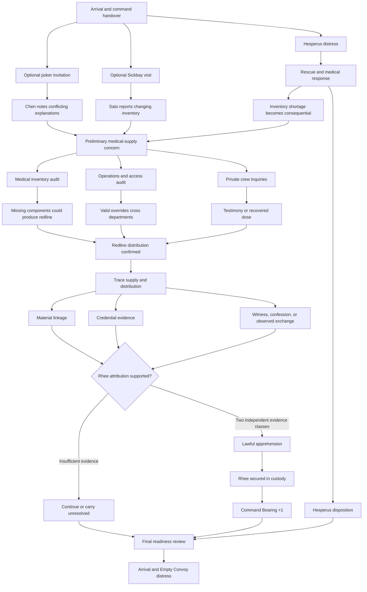

#### Approved design commitments

- Re-anchor the player to three days before the Reach and update every dependent date and transit reference consistently.
- Kieran invites the player to poker; Rhee is not present.
- Lysa Chen raises conflicting explanations after ordinary table conversation and asks the player directly if the hook is missed.
- Commander Miriam Sato independently reports small, repeatedly changing inventory discrepancies without initially knowing they can produce redline.
- Redline is an improvised Valorous-era field stimulant made from individually legitimate supplies in unsafe proportions.
- Hesperus remains an unrelated civilian emergency. Its medical preparation makes the shortage consequential without forcing casualties.
- Rhee attribution requires two independent evidence classes: access, material linkage, or human evidence.
- Actual lawful custody, personally or through an executed security order, awards one Command Bearing point.
- Identifying Rhee, issuing an unexecuted order, collective searches, or unsupported apprehension does not award the point.
- Failure, delay, or incomplete investigation carries visible consequences rather than preventing Chapter 1.

#### Implemented Prelude checkpoint

- The chronology is re-anchored to stardate 53068.4 and compressed to four labeled days, Day 0 through Day 3, while preserving the thirty-hour Hesperus response clock.
- Kieran's invitation, ordinary poker rounds, Chen's indirect and direct hook timing, Sato's independent inventory hook, and the Hesperus shortage hook are source-authored and represented by compatible mission facts, events, policies, and reports.
- Chen, Rhee, and Daro have bounded profiles, motives, knowledge limits, and confidentiality constraints. They remain transient campaign characters rather than members of the senior-staff dataset.
- The redline case distinguishes access, material, and human evidence; requires two independent classes for supported attribution; and keeps Daro's care separate from proof.
- Lawful custody, treatment without custody, responsible handoff, unresolved continuation, compromised-evidence escape, and wrongful detention have distinct state and narration outcomes.
- The existing Hesperus-accountability award and the Rhee-apprehension award are independently and jointly reachable. The latter requires executed lawful custody and never awards for accusation, an unexecuted order, treatment, handoff, escape, or wrongful detention.
- The focused campaign gate now covers 232 authored scenarios, including all nine required Prelude route/reward scenarios plus Daro-care and compromised-evidence failure-forward cases.
- Later Story Settlement echoes in Open Orders I, Open Orders II, and the epilogue remain scheduled in their respective mission-enrichment checkpoints.

### Chapter 1: The Empty Convoy

#### Current playable path sketch

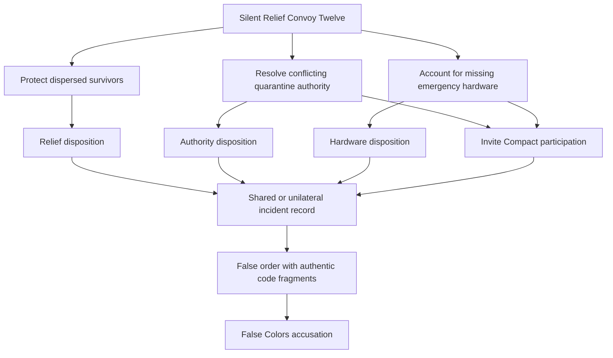

#### Assessment

The objective structure is genuinely parallel, and fixtures prove non-linear order, handoff, informed failure, and undiscovered-content safety. The story data is thin relative to the situation: survivors, convoy officers, Compact custodians, and Captain Nella Ivers have little authored presence.

#### Implemented checkpoint

- Captain Ivers's recorded testimony and the cross-reference between Dr. Samira Nadi's limited patient manifest and Olan Brin's cargo release trace now provide two embodied alternatives to technical reconstruction.
- Ivers, Nadi, and Brin have bounded motives and knowledge limits; neither medical privacy nor a single incomplete record is treated as automatic proof.
- The Compact custody discussion can open before hardware recovery or final jurisdiction, while the existing required-objective closure contract remains unchanged.
- A completed joint incident record now persists into Chapter 2 as the **Shared Convoy Record** capability. It provides a tested evidence-comparison chain but cannot automatically vindicate the Breckenridge.
- Four new scenarios cover testimony-first, manifest-before-authority, custody-first, and the imported shared-record payoff. The focused campaign gate now covers 236 scenarios.
- Prelude readiness and medical echoes remain scheduled for the Open Orders and later medical checkpoints, where they can color participation without changing success thresholds.

### Chapter 2: False Colors

#### Current playable path sketch

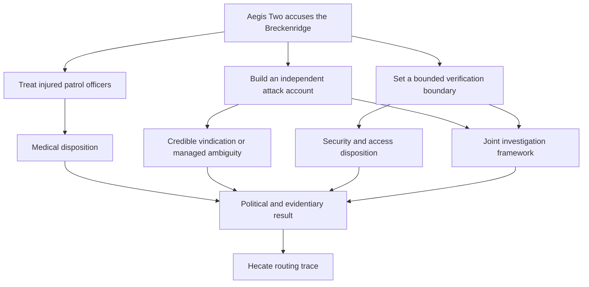

#### Assessment

The mission supports joint legitimacy, unilateral vindication, ambiguity, handoff, rupture, and non-linear core order. Its weakness is not branching but embodiment: injured accusers, Compact leaders, and independent witnesses are mostly represented as aggregate facts.

#### Implemented checkpoint

- Lieutenant Tov Saren and Specialist Jexa Renn give the injured patrol crew distinct medical, experiential, and technical boundaries; neither care nor testimony is made conditional on the other.
- Kessler's demand for contestable joint verification is explicitly separated from Holt's pressure for broad access to live command-authentication architecture.
- Four visible methods now seed the evidence work: Sato's neutral medical timeline, Kieran's maneuver-envelope reconstruction, Imani and Rowan's bounded systems baseline, and a joint witness session.
- Five new scenarios prove each method can come first, that a baseline can be established without joint access, that a joint witness route can earn the framework, and that partial evidence reaches Hecate as managed ambiguity rather than false vindication.
- A joint framework persists into Open Orders I as the **Compact Verification Framework** capability. It promises a functioning bounded channel, not trust, agreement, or a favorable finding.
- The focused campaign gate now covers 241 scenarios.

### Open Orders I: Work Worth Doing

#### Current playable path sketch

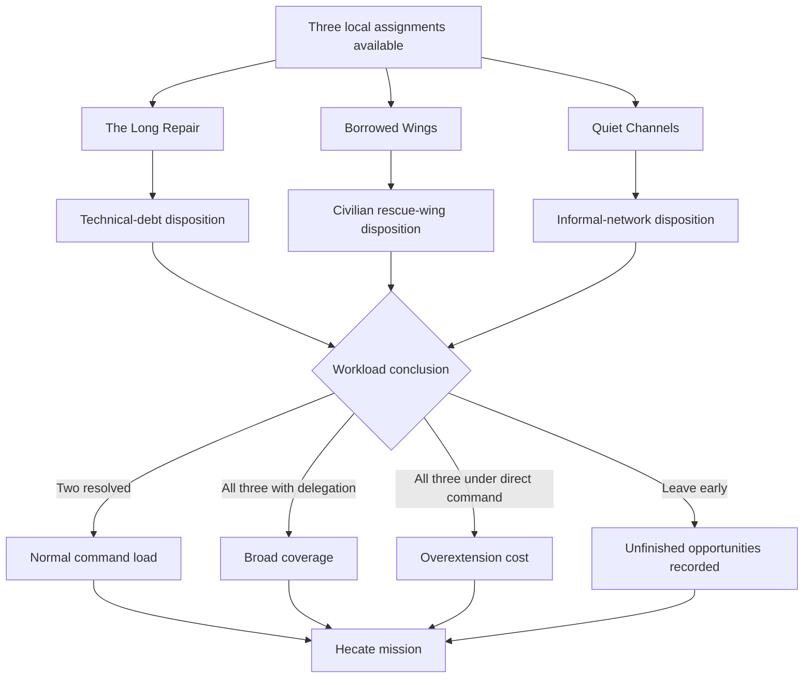

#### Assessment

The assignment selection is strong and explicitly non-linear. Each assignment is currently compressed into one aggregate assessment and one result, which risks making a side mission feel like a summary rather than an episode.

#### Implemented checkpoint

- Every selected assignment now requires its player-known assessment followed by a distinct complication event before any result can be accepted.
- Dev Adebayo exposes The Long Repair's combined-load limit; Lena Ors's trauma response can surface through self-disclosure, controlled observation, or training; Mara Venn presents a concrete Quiet Channels obligation and accountability boundary.
- A handled Prelude redline case imports as **Medical Supply Accountability**, sharpening Quiet Channels scrutiny without making the network causal. The Chapter 2 verification framework remains separately available.
- Delegation remains a substantive command method: all three assignments can be completed through credible delegation without the direct-command overextension result.
- Explicit reward scenarios prove each assignment's success can make its own Command Bearing award eligible, each failure cannot, and all three successful delegated assignments may expose all three authored awards to the existing reserve rules.
- Six new scenarios bring the focused campaign gate to 247 scenarios.

### Chapter 3: Dead Letters

#### Current playable path sketch

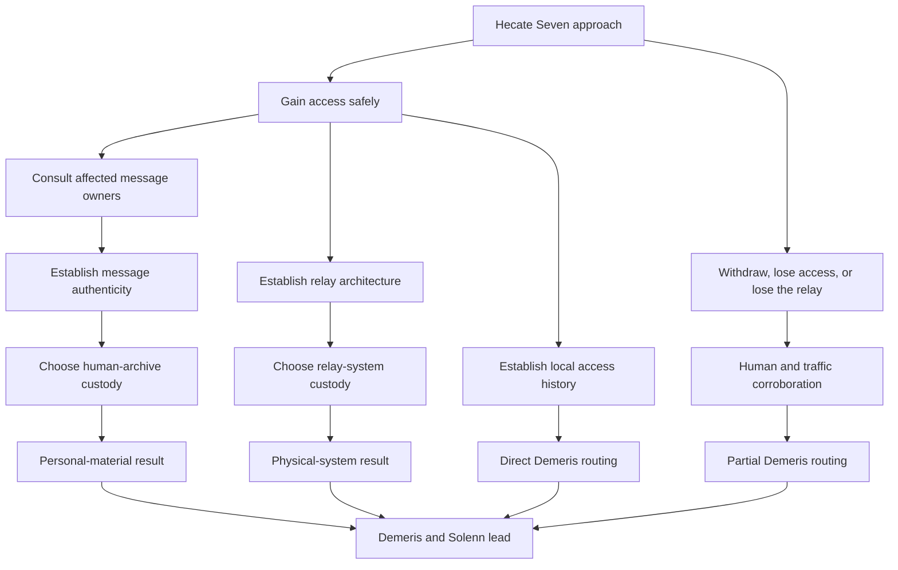

#### Implemented checkpoint

Dead Letters now preserves its strong independent access, relay, archive, and evidence states while giving the human archive identifiable owners and resilient clue routes.

- Captain Nella Ivers permits bounded operational use of her crew's messages but refuses broad publication of the private originals.
- Director Nia Kessler demands independently auditable custody with standing to challenge Starfleet access.
- Administrator Asha Prel protects named relief recipients and offers guarded Cardassian convoy ledgers as a corroboration route.
- Message authenticity, relay architecture, local postwar access, and Demeris routing are independently discoverable findings rather than one aggregate readout.
- The relay can still be isolated, observed, destroyed, seized, or left in place, and the archive can still receive joint, restricted, broad, opaque, lost, or unrecovered custody outcomes.
- Ivers's retained traffic or Prel's protected records can corroborate the Demeris route after destruction, seizure, forced withdrawal, or non-recovery without recreating lost evidence or upgrading Solenn into a proven controller.
- Four new scenarios prove owner consultation before custody, restricted family disclosure, post-destruction corroboration, and a surviving alternate lead when the archive is not recovered.
- The focused campaign gate now covers 251 authored scenarios.

### Chapter 4: The Colony That Stayed

#### Current playable path sketch

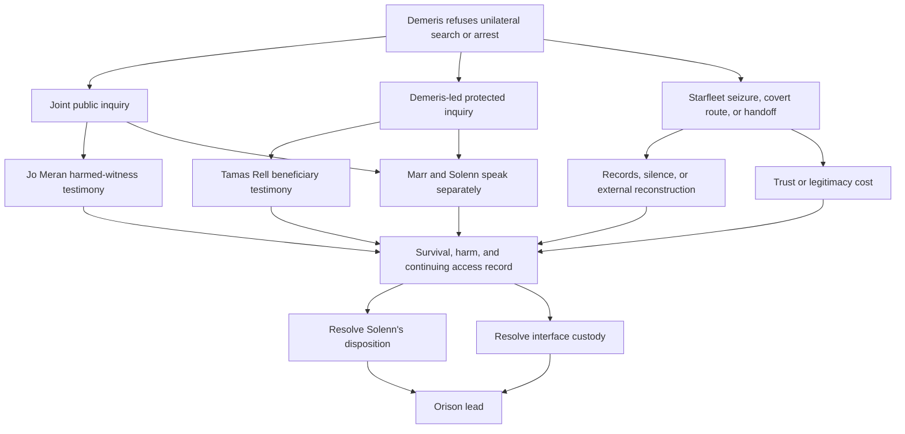

#### Implemented checkpoint

The Colony That Stayed retains its six terminal dispositions and independent personal and technical custody choices while making truth access visibly process-dependent.

- Marr now protects Demeris jurisdiction and a durable survival record; Solenn separately seeks to prevent further interface harm while preserving both benefit and culpability in the account. Neither speaks for the other.
- Tamas Rell supplies a bounded beneficiary account under a Demeris-led protected inquiry.
- Jo Meran supplies a bounded harmed-witness account under a joint public inquiry.
- Starfleet seizure can preserve records while causing voluntary witness silence; it no longer reads as the same truth route with a different custody label.
- An exposed covert route preserves usable evidence while recording a concrete trust cost in participation and later custody.
- Solenn can provide protected technical cooperation while the interface remains under an accountable Demeris seal, keeping her personal disposition separate from hardware custody.
- Five new scenarios prove the local, shared, seizure, cooperative-local, and covert-trust routes without letting any process automatically create the strongest truth result.
- The focused campaign gate now covers 256 authored scenarios.

### Chapter 5: Old Lessons

#### Current playable path sketch

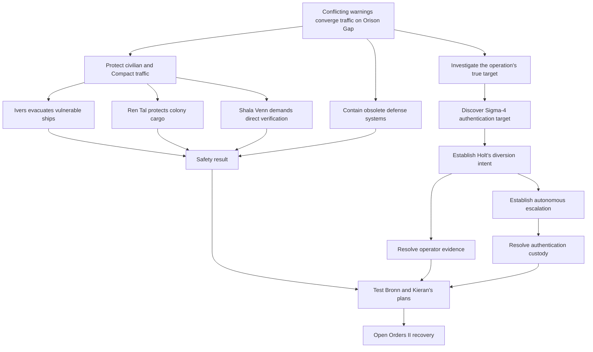

#### Implemented checkpoint

Old Lessons retains its multi-front, costly, cascade, partial, handoff, and evidence-loss endings while putting identifiable captains and independently supportable responsibility findings on those fronts.

- Nella Ivers prioritizes passenger and medical vessels even at risk to her own relief ships.
- Ren Tal refuses to abandon atmospheric processors promised to an isolated colony but accepts a verified cargo-preserving corridor.
- Shala Venn distrusts all network orders after false colors and requires direct visual and ship-to-ship verification.
- Holt's deliberate diversion to expose and secure Sigma-4 is independently discoverable from Pale Lantern's autonomous platform escalation; neither finding substitutes for the other.
- Bronn's conservative authentication and fire-control contingency and Kieran's direct-challenge manual corridor can both be tested before the existing command-posture decision records integration, untested obedience, an evidence-based alternative, dismissal, or humiliation.
- Open Orders II now imports an Orison Authentication Record when Sigma-4 is secured or destroyed with a usable record. It supplies technical leverage without deciding Tonn's consent or automatically awarding defense codes.
- Five new scenarios prove the civilian, responsibility, advice, and downstream-payoff paths.
- The focused campaign gate now covers 261 authored scenarios.

### Open Orders II: What Survives

#### Current playable path sketch

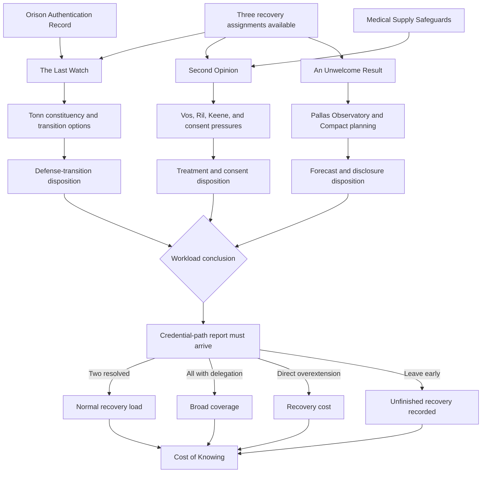

#### Implemented checkpoint

Open Orders II retains its choose-two, delegated-three, overextension, early-departure, reward, and credential-report closure contracts while making each assignment a scene-complete episode.

- The Last Watch now gives Tonn a constituency of platform crews and settlements. The Orison record supplies technical leverage without supplying consent or automatic codes, and deactivation, shared control, conversion, and bounded retention must be weighed before resolution.
- Second Opinion now separates Doctor Eren Vos's clinical framework, Aven Ril's informed refusal, Marta Keene's desire for treatment, duty fitness, and employment pressure.
- Medical Supply Safeguards import only from responsible Prelude outcomes. They can prompt volunteered information, never alter treatment efficacy or imply that Vos's therapy is redline.
- An Unwelcome Result now gives Pallas Civil Observatory and Compact planner Jori An independent evidence and consequence ownership. Correction, review, bounded warning, suppression, and handoff carry distinct authored costs.
- Each assignment requires an assessment and a substantive complication/ownership event before its result can be recorded.
- Explicit reward expectations prove that completed and responsibly costly assignment dispositions expose their existing independent Command Bearing awards, including two delegated assignments.
- The redline continuity scenario proves the trust fact remains unavailable when the required Prelude capability is absent.
- Five new scenarios bring the focused campaign gate to 266 authored scenarios.

### Chapter 6: The Cost of Knowing

#### Current playable path sketch

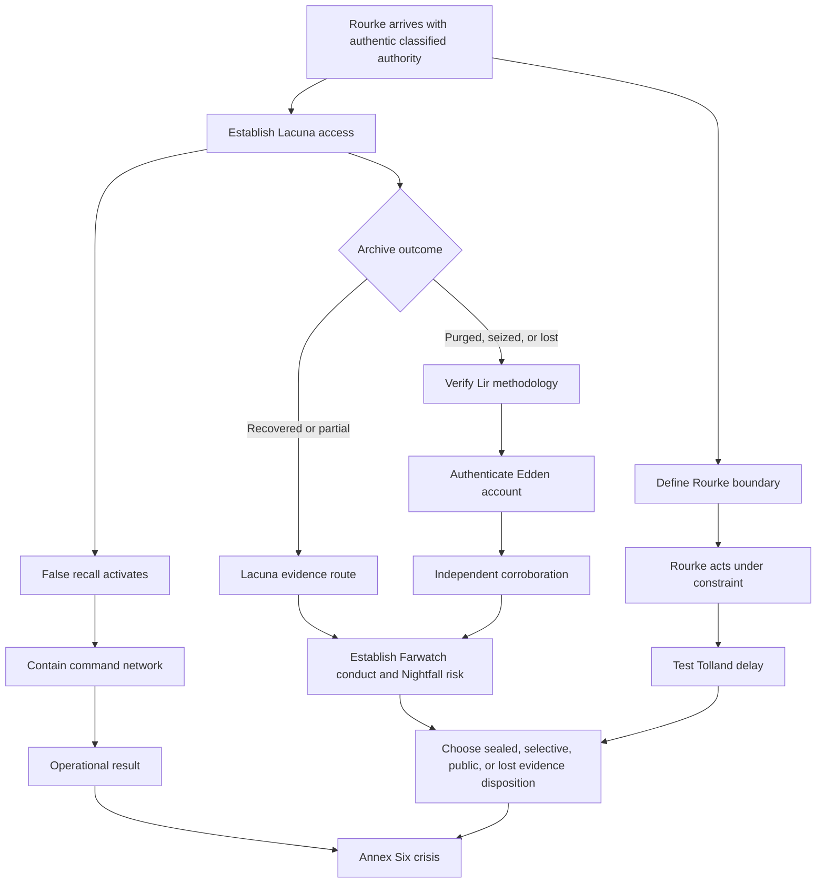

#### Implemented checkpoint

The mission now separates Lacuna access, false-recall activation, command-network containment, archive resolution, and independent corroboration without making all five mandatory. Five discovery-order scenarios bring the campaign suite to 271 authored scenarios while preserving all six terminal dispositions and the existing Farwatch Evidence Package award condition.

#### Enrichment delivered

- The Lacuna operation now has concrete access, containment, archive, and corroboration beats.
- Rourke's safeguards and recall enforcement reveal his operational constraint through action.
- Tolland's bounded protective delay has a defined transition into institutional concealment.
- Keva Lir, Bram Edden, and a protected-record owner create independent, limited evidence routes and a credible sealed-review alternative to a data dump.

### Chapter 7: A Peace of Their Own

#### Current playable path sketch

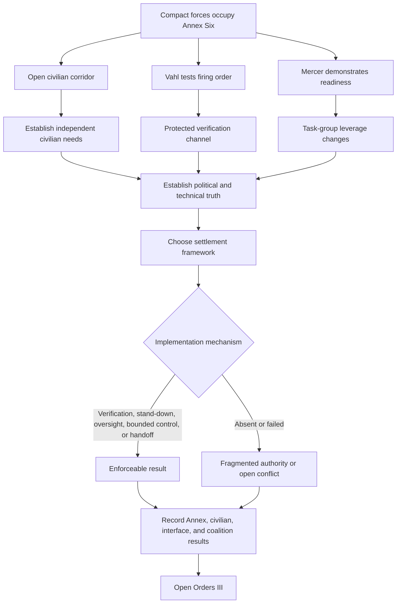

#### Implemented checkpoint

The standoff now exposes civilian needs, a Compact officer's lawful refusal, and Mercer's constrained escalation before the constitutional result. Five lived-standoff scenarios bring the campaign suite to 276 authored scenarios. Every terminal settlement now carries an implementation-mechanism result, including an explicit failed-or-absent value for bounded failure forward.

#### Enrichment delivered

- The medical corridor, separated families, and trapped workers remain independent of Kessler's and Holt's authority claims.
- Lieutenant Teren Vahl can refuse an unauthenticated strike while continuing to defend Annex Six.
- Captain Joelle Mercer changes leverage through a lawful readiness demonstration and a defined verification boundary.
- Shared verification, authenticated stand-down, civilian oversight, bounded restoration/control, and responsible handoff are explicit implementation paths; absent enforcement resolves as fragmentation or conflict.

### Open Orders III: Before the Lamps Go Out

#### Current playable path sketch

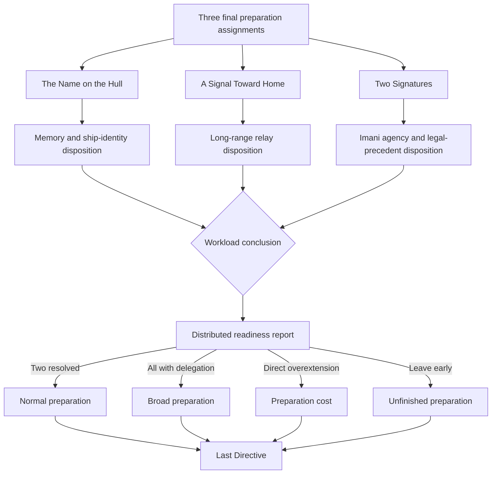

#### Assessment

This is the most thoroughly scenario-tested Open Orders interval. Its three assignments are thematically distinct and the readiness report creates a strong convergence gate. The people outside the senior crew remain comparatively thin.

#### Enrichment direction

- Establish memorial representatives, relay collaborators, and legal advocates as recurring people.
- Let prior command patterns affect how partners approach the player without predetermining results.
- Use the interval to close or deliberately carry unresolved crew threads before the finale.

### Chapter 8: The Last Directive

#### Current playable path sketch

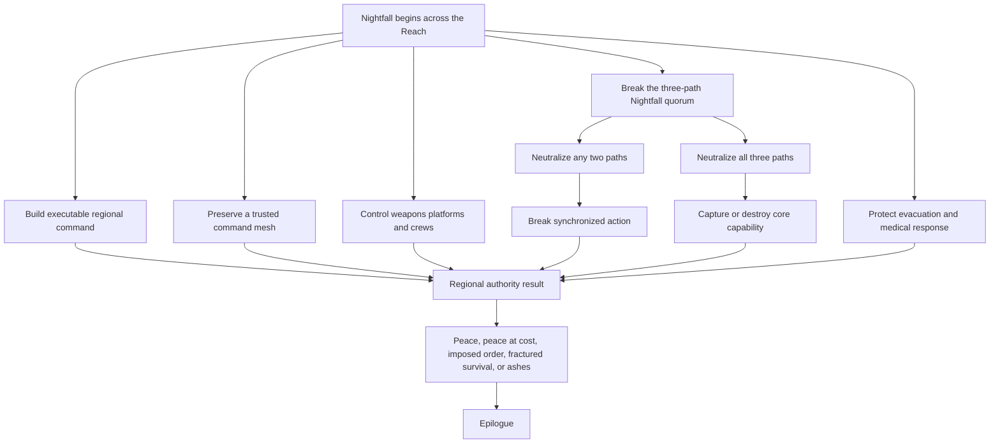

#### Assessment

The finale has five independent fronts, a quorum mechanic, non-linear front resolution, costly peace, imposed-order outcomes, fragmentation, and catastrophic failure forward. It is structurally the richest mission. Its main enrichment need is human legibility under scale.

#### Enrichment direction

- Assign named local actors and senior officers to each front without making them passive messengers.
- Make cross-front tradeoffs explicit when resources or trusted channels move.
- Preserve the distinction between stopping synchronized Nightfall and solving every local crisis.
- Ensure previous assets and relationships create visible opportunities, not automatic victories.

### Epilogue: The Terms We Keep

#### Current playable path sketch

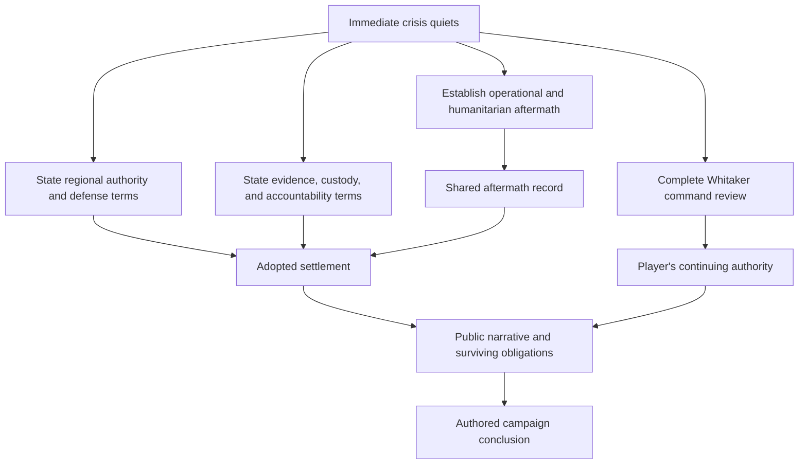

#### Assessment

The epilogue supports multiple settlement axes and flexible order, but most results are institutional summaries. Individual crew and regional NPC futures are intentionally not invented, leaving a data gap that can make the conclusion emotionally thin.

#### Enrichment direction

- Author bounded codas for the senior crew, Lysa, Rhee, Daro, and major regional NPCs.
- Select codas only from supported accepted outcomes and Story Settlement consequences.
- Preserve ambiguity where the campaign did not establish a future.
- End with both institutional terms and specific people living under them.

## Campaign-Wide Enrichment Priorities

1. Complete the Prelude rewrite and its scenario matrix.
2. Repair the confirmed Chapter 5 payoff gap with a specific existing-architecture consequence or later capability; do not default to another Command Bearing point.
3. Review every mission for visible hooks, materially different approaches, failure-forward routes, and distinct conclusions, starting with the missions whose outcome matrices are richer than their scenes: Chapters 6 and 7.
4. Add bounded character data and discovery routes for recurring regional NPCs.
5. Expand each Open Orders assignment from one aggregate assessment into a compact episode shape.
6. Add explicit, conditional cross-mission echoes through existing Story Settlement and transition narration data.
7. Add epilogue codas supported by accepted outcomes.
8. Re-run contract, spoiler, scenario, transition, projection, and live narrative certification after each bounded mission revision.

## Approved Payoff Policy

- Command Bearing remains a scarce recognition of exceptional optional command decisions, not a routine mission-completion reward.
- Most accomplishments should pay off through named capabilities, relationships, preserved evidence, lawful authority, protected lives, accepted obligations, and later acknowledgement.
- A promised later benefit must be persisted through an existing supported mechanism, normally an outcome dimension consumed as an entry capability, rather than left to narrator memory alone.
- Costly success and responsible handoff require distinct acknowledgement even when they do not grant the mission's strongest capability.
- Chapter 5 is a confirmed payoff gap and must receive a deliberate data-compatible consequence or later use.
- The approved Rhee-apprehension and Hesperus-accountability awards remain independent. The Prelude intentionally permits up to two points because a first playthrough may surface only one opportunity.

## Data-Only Guardrails

- Do not add a new global tracker or relationship meter.
- Do not add fields that require a new schema or runtime consumer.
- Do not make all ordinary failures part of Pale Lantern.
- Do not turn every crew scene into an objective.
- Do not use hidden optional content as a silent penalty.
- Do not let an NPC know facts their authored knowledge boundary excludes.
- Do not award Command Bearing for tone, sentiment, or model judgment.
- Do not replace freeform player methods with menu-like prescribed solutions.
- Do not let extra data become prompt noise; prefer small, consequential authored facts and character cues.

## Review State

The Prelude direction and redline investigation paths are approved and implemented in the first campaign-data checkpoint. The Prelude may intentionally award both the Hesperus-accountability and Rhee-apprehension points. The campaign-wide expansion, enrichment, and payoff policy are approved. Remaining implementation is sequenced in `docs/superpowers/plans/2026-08-10-ashes-of-peace-campaign-enrichment.md`; the path sketches remain authoring aids rather than campaign graph data.
