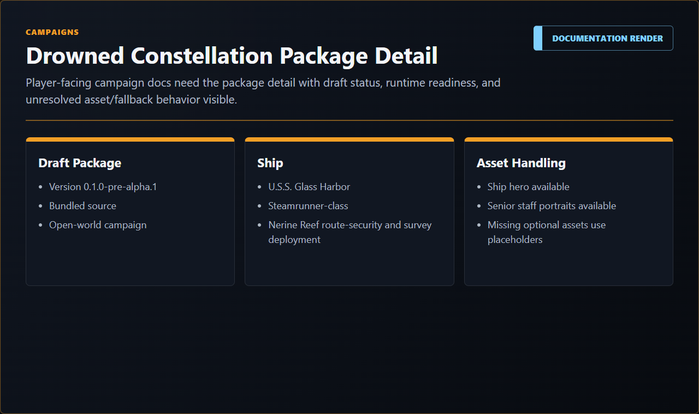
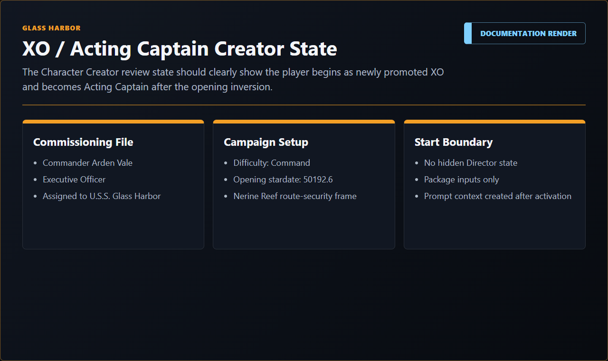
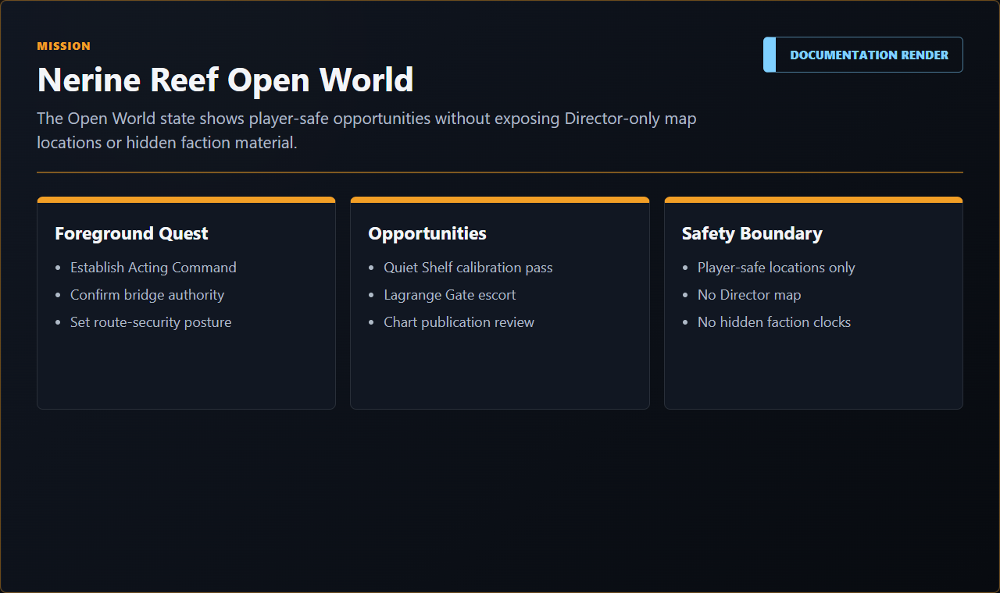
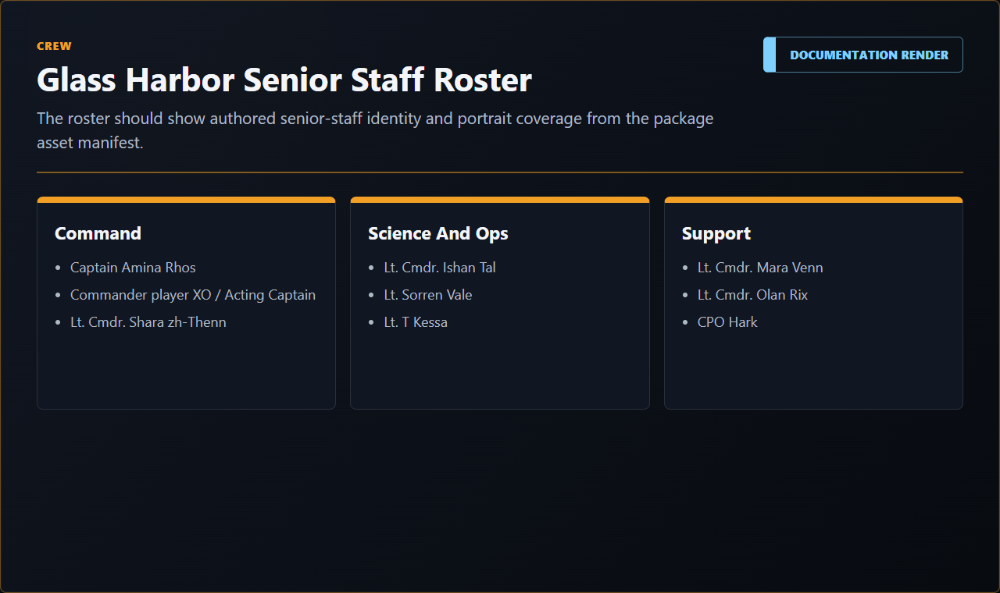

# Glass Harbor / Drowned Constellation

Drowned Constellation is the bundled draft campaign package for the U.S.S. Glass Harbor. It is runtime-registered as package id `directive:campaign-package:glass-harbor-drowned-constellation` and uses the schema-v2 open-world architecture.

This document is release-facing orientation for operators, authors, and implementers. The full source material under `content/campaigns/glass-harbor/` contains spoilers and should be treated as authoring source, not player-safe documentation.

## Status

- Package status: `draft`.
- Runtime package: `packages/bundled/glass-harbor/drowned-constellation.campaign-package.json`.
- Campaign projection: `packages/bundled/glass-harbor/drowned-constellation.campaign-projection.json`.
- Crew dataset: `packages/bundled/glass-harbor/glass-harbor-senior-staff.crew-dataset.json`.
- Tactical graphs:
  - `packages/bundled/glass-harbor/mission-graphs/prelude-soundings.mission-graph.json`
  - `packages/bundled/glass-harbor/mission-graphs/chapter-1-aster-basin.mission-graph.json`
  - `packages/bundled/glass-harbor/mission-graphs/chapter-2-caligo-sounding.mission-graph.json`

Glass Harbor is bundled and validated by the alpha gate, but it is not yet promoted to the same playtest confidence level as Ashes of Peace. Its package README tracks draft caveats: end-condition deepening, richer crew reveal cards and indexes, and deeper tactical graph authoring.

## Campaign Identity

- Ship: U.S.S. Glass Harbor, Steamrunner-class, NCC-52247.
- Opening stardate: `50192.6`.
- Opening year: 2373.
- Theater: Nerine Reef.
- Player role: newly promoted Commander/XO and, after the prelude, Acting Captain.
- Expected campaign length: 40-60 sessions.
- Runtime architecture: `directive.openWorldCampaign.v2`.

The campaign promise is that the player takes acting command after Captain Amina Rhos and her shuttle disappear during a gravitic inversion. The Glass Harbor must conduct rescue, survey, escort, diplomacy, salvage safety, and regional crisis response in a place where reliable charts can save lives, expose sanctuaries, create borders, or become weapons.

## Open-World Scope

The authored package currently includes:

- 20 quests;
- 12 locations;
- 19 routes;
- 6 factions;
- 10 recurring regional actors;
- 5 active fronts;
- 6 story arcs;
- 14 thread templates;
- 27 reaction rules;
- 109 Director cards.

The Nerine Reef is persistent world data. Travel advances stardate. Routes have confidence, condition, and political access. Factions may act while another quest is foregrounded. Location state, chart custody, ship damage, and local relationships persist between assignments.

## Core Campaign Pressures

The campaign's central question is who may create, verify, hold, revise, share, revoke, and act upon navigational knowledge when communities depend on both mobility and concealment.

Important axes include:

- rescue versus route safety;
- public charting versus sanctuary protection;
- Starfleet authority versus local sovereignty;
- salvage law versus security risk;
- Captain Rhos's absence versus the player's acting command;
- hidden infrastructure truth versus accountable regional governance.

## Ending Families

The source campaign assembles endings from committed state rather than from one hidden morality score. Core ending families are:

- Open Sea: durable mobility, rescue capacity, autonomy, and no single armed actor controlling passage.
- Charted and Conquered: reliable routes but sovereignty failure through exposure or coercive access control.
- Sanctuary of Shadows: concealed communities preserved, but the Reef remains dangerous and locally navigated.
- A Crown in the Deep: raider or coercive power consolidates route control.
- Drowned Constellation: multiple nodes fail, Aster Basin is lost or evacuated at catastrophic cost, and the Reef becomes largely impassable.

Command succession is tracked separately: the player may be confirmed as captain, return to XO under Rhos, remain acting captain during recovery, transfer, or face inquiry.

## Source Map

| Source | Purpose |
| --- | --- |
| `content/campaigns/glass-harbor/campaign/THE_DROWNED_CONSTELLATION_CAMPAIGN.md` | Spoiler baseline, campaign promise, structure, truths, endings, and failure policy. |
| `content/campaigns/glass-harbor/campaign/THE_DROWNED_CONSTELLATION_OPEN_WORLD.md` | Open-world implementation: locations, routes, factions, fronts, tracks, arcs, quests, and finale inputs. |
| `content/campaigns/glass-harbor/campaign/ENDINGS_AND_EPILOGUE.md` | Ending axes, operational bands, political bands, accountability, succession, and epilogue families. |
| `content/campaigns/glass-harbor/campaign/DIRECTOR_REFERENCE.md` | Director-facing actor, faction, and hidden-knowledge reference. |
| `content/campaigns/glass-harbor/crew/GLASS_HARBOR_SENIOR_STAFF_CHARACTER_BIBLE.md` | Senior staff authoring source. |
| `content/campaigns/glass-harbor/missions/` | Prelude, Chapter 1, and Chapter 2 mission source. |
| `content/campaigns/glass-harbor/quests/MAIN_QUESTS.md` | Main quest source. |
| `content/campaigns/glass-harbor/side-missions/DESIGNED_SIDE_ASSIGNMENTS.md` | Side assignment source. |
| `content/campaigns/glass-harbor/world/NERINE_REEF_GAZETTEER.md` | Region, route, and map source. |

## Render Needs

  

  

  

  

## Related Docs

- [Glass Harbor Authoring Reference](../authoring/GLASS_HARBOR_AUTHORING_REFERENCE.md)
- [Campaign Authoring Guide](../authoring/CAMPAIGN_AUTHORING_GUIDE.md)
- [Campaign Package Schema](../packages/CAMPAIGN_PACKAGE_SCHEMA.md)
- [Open-World Campaign Architecture](../architecture/OPEN_WORLD_CAMPAIGN_ARCHITECTURE.md)
- [Campaign End Conditions](../design/CAMPAIGN_END_CONDITIONS.md)
