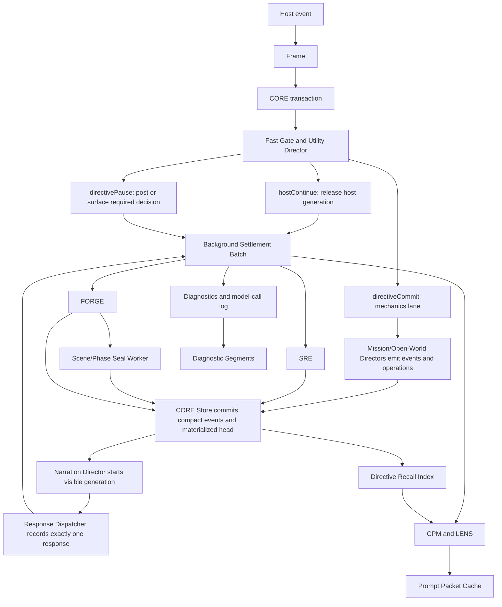

# Architecture Redesign Proposal

## Status

Discovery-backed proposal for a forward-only pre-alpha architecture break.

This document is not a compatibility plan. Directive is pre-alpha, so the redesign should replace the current save/runtime shape in place. A one-time importer from old full-save records is acceptable only as a development convenience; the runtime should stop writing the old architecture once the new one lands.

## Executive Decision

Directive should move from a distributed, save-centered turn pipeline to a transaction-centered runtime:

```text
Host event
  -> Frame
  -> CORE transaction
  -> fast route decision
  -> visible response lane
  -> background settlement/projection lane
  -> compact event store and materialized campaign head
```

The core change is ownership. Today, Scene Handshake, classification, Directors, response dispatch, prompt sync, sidecars, recovery, model-call journals, and save persistence each mutate campaign state through their own local rhythm. The redesign makes CORE own a player message from ingress through visible response and background settlement. Storage stops treating the full campaign save as the transaction log.

## Captured Design Decisions

These decisions capture the current product and architecture direction for the redesign. They should be treated as constraints for implementation planning, agent work, and future docs updates.

- Directive is pre-alpha, so the redesign may replace the old runtime/save architecture in place. Do not preserve old write paths as long-term compatibility layers after the cutover proves old development saves can be imported or rewritten.
- The combined source object is named Frame, not SEED Frame. Frame is the human-facing architecture name for turn source provenance and range source provenance.
- External SillyTavern context-extension tools remain independent systems. Directive supports user compatibility with ST-Lorebooks / ST Lorebooks / World Info, Memory Books, Summaryception, and VectFox by preserving prompt ownership, source identity, visibility semantics, latency attribution, privacy boundaries, and bounded diagnostics. It does not directly integrate with, import, trust, rewrite, repair, or replace those tools by default.
- The per-extension planning implications in this document are redesign scope, not appendix material. ST Lorebooks / World Info, Memory Books, Summaryception, and VectFox each create different prompt, source-visibility, latency, privacy, storage, and proof pressures; Directive combines only the shared LENS/Frame/REPAIR/CORE evidence boundaries needed for coexistence.
- External-context proof must be one normalized LENS/Frame diagnostic contract shared by fixture prep, disk/browser probes, prompt-adapter summaries, readiness fixture-depth checks, and generation proof. Do not let each layer invent a separate definition of "rich active external context."
- The redesign pivots to include the transferable Narrative Engine ideas as first-class Directive-native capabilities: a hybrid Recall Index over CORE/Frame evidence, LENS prompt budget lanes, witness-scoped continuity facts, FORGE scene/phase seals, and evidence-backed Correct-as-Swipe. These are not a separate app architecture and do not replace the CORE/Frame/SRE/REPAIR/FORGE/LENS ownership model.
- Narrative Engine code should be referenced heavily but borrowed sparingly. Reimplement the architecture patterns inside Directive's contracts; do not port its app shell, server routes, storage model, UI, world simulator, local archive format, or vector database dependency. Any direct nontrivial code copy must keep MIT attribution and remain isolated behind Directive-native tests.
- The save-size issue is not a tuning problem. A live save reaching tens of megabytes around message 33 means the full-save-as-runtime-log pattern cannot scale to the 5000-message target.
- The turn-delay issue is not only provider latency. Directive must record and reduce submit-to-generation-start time separately from provider completion, external extension retrieval/interceptor delay, and background settlement.
- Persisted generation-start proof belongs to CORE Store projections. Runtime snapshots are useful live diagnostics, the v1 save payload is a manual/checkpoint bridge, and the v2 active-save facade is a compact resume/index bridge; none of those should become the durable timing authority for architecture certification.
- Combining systems is valuable only where it reduces conflicting ownership. SRE, CORE, REPAIR, FORGE, Frame, and LENS consolidate authority boundaries; they must not become new catch-all services.

## Naming

These names are the human-facing architecture names. The implementation names in parentheses can remain as schema/API aliases during migration.

| Name | Expansion | Replaces |
| --- | --- | --- |
| SRE | Source Reconciliation Engine | Source Settlement Service / Scene Handshake / Scene Reconciliation source handling |
| CORE | Campaign Operation & Runtime Engine | Turn transaction runtime plus transaction store |
| REPAIR | Recovery Engine for Player/Assistant Integrity Repair | Recovery Director |
| FORGE | Follow-On Runtime Generation Engine | Post-turn projection batch / sidecar scheduler |
| Frame | Turn source frame | Turn source frame / range source frame |
| LENS | Live Evidence & Narrative Scheduler | Prompt projection scheduler / prompt dirty cache |

The target architecture has two hard product requirements:

1. Scale a single campaign chat beyond 5000 player/assistant messages without save payload growth becoming a turn-latency multiplier.
2. Keep player-submit-to-generation-begins under 60 seconds, even after thousands of messages.

For this metric:

- `hostContinue` generation begins when Directive releases the host-native generation path.
- `directiveCommit` generation begins when Directive starts the narration model call for the committed outcome.
- Provider completion time is tracked separately. A slow narration provider can still take longer than 60 seconds to finish, but Directive should not spend more than 60 seconds before starting that generation.

## Discovery Inputs

This proposal was built from current worktree discovery, the June 28 live Sam Vickers latency audit, and five parallel discovery lanes:

- Sidecars and auxiliary checks: host ingress, turn spine, journals, sidecar scheduler, thread director, recovery, Stop/cancellation.
- Directors and turn orchestration: chat orchestrator, provisional/commit flow, Mission Director, open-world coordinator, recovery boundaries.
- CPM and Handshake: continuity source frame, prompt projection, selected swipes, Scene Handshake, Scene Reconciliation.
- Data and persistence: save record shape, storage repository, runtime snapshots, turn ledger snapshots, full-save rewrite sequence.
- External context-extension compatibility: native ST Lorebooks/World Info, Memory Books, Summaryception, and VectFox installed-surface audit, prompt-key ownership, visibility mutation behavior, and redacted live-proof artifact design.
- Narrative Engine transfer review: hybrid scene recall, prompt budget lanes, `knownBy` / witness-scoped facts, scene/phase seal sidecars, evidence-backed correction-as-swipe, structured lore/RAG metadata, and a code-borrowing policy that favors design reference over direct porting.

Primary current files inspected:

- `src/runtime/chat-turn-orchestrator.mjs`
- `src/runtime/runtime-app.mjs`
- `src/runtime/state-delta-gateway.mjs`
- `src/runtime/turn-commit-coordinator.mjs`
- `src/runtime/response-dispatcher.mjs`
- `src/runtime/message-reconciler.mjs`
- `src/runtime/scene-handshake-settler.mjs`
- `src/runtime/scene-reconciliation.mjs`
- `src/jobs/campaign-sidecar-scheduler.mjs`
- `src/directors/open-world-turn-coordinator.mjs`
- `src/mission/director.mjs`
- `src/generation/player-safe-prompt-context-builder.mjs`
- `src/continuity/*`
- `src/retrieval/recall-lanes.mjs`
- `src/retrieval/dataset-index.mjs`
- `src/retrieval/card-hydration.mjs`
- `src/runtime/define-selection.mjs`
- `src/storage/save-records.mjs`
- `src/storage/directive-storage-repository.mjs`
- `docs/development/TURN_LATENCY_AUDIT_2026_06_28.md`

### Live Campaign Evidence Anchors

The Sam Vickers audit is the source record for the redesign's latency, recovery, and save-growth pressure. The full timeline remains in [Turn Latency Audit 2026-06-28](../development/TURN_LATENCY_AUDIT_2026_06_28.md); the architecture proposal preserves the following anchors so the redesign can be evaluated without losing the live context.

| Evidence | What happened | Architecture implication |
| --- | --- | --- |
| Numbering layers | SillyTavern chat row `30` was Directive ingress `hostMessageId: "29"`; chat row `31` was the host-native assistant response to that same player turn; chat row `32` was the next player ingress, recorded as `hostMessageId: "31"`. | Design and diagnostics must label visible chat row, host message id, ingress id, response id, and CORE transaction id separately. Ambiguous "turn number" debugging hides ownership bugs. |
| Turn 29 / chat row 30 counsel handoff | The counsel turn spent about `93s` before response ledger handoff, including a `30,011ms` Scene Handshake timeout, Utility classification, and blocking `missionDirectorAdvisor`; the native assistant row arrived later with SillyTavern provider timing of `41,925ms` to first token. | Fast-gate proof must measure Directive submit-to-generation-start separately from host/provider completion. Advisory enrichment cannot block ordinary `hostContinue` release. |
| Chat row 31 assistant response | The assistant row was the host-native response to the prior player row, not a new Directive player turn. | SRE/Frame/CORE evidence must bind responses to source rows and selected variants instead of relying on adjacent row numbers. |
| Turn 31 / chat row 32 committed outcome | The committed turn posted a Directive-owned response after about `171s`; the dominant pre-response cost was `96,493ms` narration, with additional pre-narration and post-narration overhead. Post-turn work continued after the source was edited and later rejected stale sidecars. | `directiveCommit` must record generation-start before provider completion, move post-visible workers into FORGE, and cancel stale background work before provider calls where possible. |
| Edited retry after `Sam waited for her reply.` | The same `hostMessageId: "31"` had an original committed ingress marked `recoveryRequired` and a replacement ingress reobserved as `sceneColor` / `injectAndContinue`, stranded at `classified`. | A dependent edited player row must enter REPAIR review, rollback, or dependent-row replacement. It must not re-enter normal classification unless it is still the latest source boundary. |
| Save size around message 33 | The active save was `73,166,880` bytes around the low-30s chat rows. `turnLedger` was `21,836,975` minified bytes and `runtimeTracking` was `14,090,539`; retained turn packets nested large `runtimeTracking` copies inside open-world `rootsSet`. | Full-save-as-runtime-log cannot scale to 5000 messages. CORE Store needs compact event segments, bounded diagnostics, host refs/hashes, and materialized heads instead of hot full-save rewrites. |
| June 30 bounded three-lane regression | Artifact `artifacts/live-soak/continuity-projection-matrix-five-user/2026-06-30T00-18-07-165Z/report.json` passed factual grounding, story-quality model review, continuity prompt/source proof, external-context generation proof, and model-call failure policy for `ashes-command-bearing-endings`, `ashes-drawer-projection`, and `ashes-sidecars-timekeeping` at turn limit 3. It still failed aggregate CORE timing/completion proof and lane artifact completeness because the harness retained early per-turn warnings and an external-context summary artifact mismatch even after final CORE reobserve had better evidence. | The remaining blocker is not just runtime behavior. Certification tooling must read final save-scoped CORE projections after reobserve, not stale v1 save ledgers, stale runtime summaries, or turn-end proof snapshots captured before host-native completion reconciliation finished. |
| June 30 CORE-targeted bounded rerun | Artifact `artifacts/live-soak/continuity-projection-matrix-five-user/2026-06-30T01-05-30-310Z/report.json` reran the same three Ashes lanes at turn limit 3 after targeting proof by explicit player host ids and CORE transaction ids. It passed external-context readiness and fixture depth, host-native turn coverage, continuity prompt/source proof, external-context generation proof, generation-start CORE timing, host-native CORE completion, model-call failure policy, factual grounding, story-quality model review, and lane artifact completeness. The report stayed `warning` only because it was intentionally bounded to three lanes and three turns. | This closes the stale-runtimeTracking proof-pipeline false failure for bounded proof. The next certification question is no longer whether final CORE projections can prove the turn; it is whether the same CORE-targeted evidence holds in the full five-lane, 52-turn Ashes run with scale budgets and complete artifact coverage. |
| V2 split evidence from June 30 | A current v2 save index entry had `runtimeStorageFormat: "v2"` and `v2RuntimePersistedAt: 2026-06-30T00:23:40.098Z` while the old v1 save payload stayed stale by design because the bridge wrote `wroteV1Payload: false`. The same save showed a compact CORE split (`core-head` about 3.9 KB, host map about 5.9 KB, events about 58.6 KB, turns about 1.7 KB, diagnostics about 144.7 KB), but the non-core v2 head was still about 333.5 KB after only three turns. | The split validates the CORE direction, but the active head still needs stricter size budgets. Tools and operators must follow the save index and manifest into the v2/core layout; an empty or old v1 `runtimeTracking` ledger is not authoritative evidence that CORE did not persist the turn. |

## Current Architecture Summary

### Current Turn Spine

The current chat-native path is broadly:

```text
SillyTavern event
  -> runtime bridge
  -> chat-turn orchestrator
  -> ingress record and save
  -> Scene Handshake settlement
  -> Utility classification
  -> classification record and save
  -> route
     -> host continuation, pause, routine/counsel, or consequential Director turn
  -> mechanics commit and save
  -> narration or host handoff
  -> response record and save
  -> post-commit processors
  -> prompt sync and save
  -> sidecar queue
  -> sidecar journals/applies/prompt sync/save
```

The pieces are individually defensible, but the combined path is too broad. The visible turn path can include Scene Handshake, time adjudication, classification, advisory generation, Director preview, mechanics commit, narration, response dispatch, end-condition checks, post-commit conversation extraction, prompt rebuild, full-save persistence, and sidecar scheduling.

### Current Sidecar Shape

`campaign-sidecar-scheduler.mjs` has fixed workers:

- `continuity`
- `relationship`
- `crew`
- `ship`
- `commandBearing`

The scheduler snapshots campaign state and turn context for each worker, runs generation concurrently when possible, then applies results one worker at a time. Each worker can journal, persist, apply operations, and trigger prompt sync. The live audit showed sidecar generation was concurrent, but apply/reject/persist/prompt work stretched across later offsets.

### Current Director Shape

Mission Director is mostly deterministic and returns a turn packet. Runtime wraps that packet in provisional/commit behavior and then performs narration, command-log summary, end-condition checks, response dispatch, and prompt sync.

Open-world coordination currently computes a projected campaign state by committing once inside the coordinator, then packages broad `openWorld.rootsSet` replacements for the runtime commit. That makes preview/finalization heavy and encourages large root replacement deltas.

### Current CPM And Handshake Shape

CPM is a source-backed projection service with source frames, fact materializers, fact index, planner validation, prompt lanes, Director packets, diagnostics, and sidecar handoff.

Scene Handshake is a pre-classification pass. It reads the previous assistant message and current player reply, normalizes the selected assistant variant, calls a Utility model, validates narrow operations, records settlement, and may commit accepted-scene time before the current player message is classified.

Manual Scene Reconciliation is a separate service over selected ranges, with overlapping source anchoring, extraction, validation, pending review, prompt rebuild, and stale-source invalidation concerns.

### Current Data Shape

`save-records.mjs` stores:

```text
directive.campaignSave
  metadata
  payload.campaignState
```

Runtime persistence generally calls `controller.saveCurrentGame`, which overwrites the full save payload. Indexes are lightweight, but the active save itself contains game state, runtime journals, retained snapshots, turn ledger entries, prompt metadata, model-call summaries, sidecar journals, Scene Handshake records, and recovery records.

Two rollback/history systems coexist:

- `turnLedger.entries[].snapshotBefore`
- `runtimeTracking.history[].snapshot`

The June 28 audit measured a live save at 73,166,880 bytes at only about 33 chat rows. The largest roots were `turnLedger` at 21,836,975 minified bytes and `runtimeTracking` at 14,090,539 minified bytes. A follow-up code change now compacts nested `stateDelta.openWorld.rootsSet.runtimeTracking` inside retained turn-ledger deltas, but the larger architectural problem remains: runtime history and operational journals still live inside the hot save payload.

The June 30 v2 bridge evidence narrows the storage target. CORE layout files were already much smaller than the old monolithic save roots, and host-map/source-frame/event projections retained the actual player and assistant bindings even when legacy `runtimeSummary` counts lagged. That is the desired authority boundary. The non-core active head still remained large for a three-turn run, so the redesign cannot stop at moving timing and host maps into CORE. Runtime resume heads, prompt/cache summaries, diagnostics pointers, and manual checkpoint bridges need explicit size budgets and write-frequency budgets before the 5000-message target is credible.

## Root-Cause Findings

### 1. The Visible Path Is Too Monolithic

The current design lets every local system decide whether it is part of the awaited turn path. Utility-lane work is not automatically non-blocking. In the live audit, `sceneHandshakeSettler` consumed a full 30 second timeout before classification, `utilityTurnClassifier` then ran, and `missionDirectorAdvisor` blocked a counsel turn before host handoff. For the directive-owned turn, narration took about 96.5 seconds, but there was still material pre-narration and post-narration overhead before visible response.

The follow-up counsel/advisory audit made the blocker concrete. The counsel path reports blocking activity, awaits `generationRouter.generate('missionDirectorAdvisor', ...)`, commits the advisory record, and runs prompt sync before reaching `dispatchAndRecord(... strategy: 'injectAndContinue' ...)`. Only that dispatch reaches `response-dispatcher.mjs`, where `continueHostGeneration(... waitForCompletion: false)` actually releases host-native generation. The target split is a deterministic fallback advisory shell plus immediate host release, followed by background advisory enrichment through FORGE/CORE with source-freshness checks before provider work and before apply. Model-call diagnostics must attach to the originating transaction even after the ingress has advanced beyond `classified`.

The redesign must make the blocking boundary explicit:

- Blocking work is only what is required to decide route, preserve state safety, commit required mechanics, and start visible generation.
- Everything else is background or recovery.

### 2. The Save Is Doing Too Many Jobs

The active save is currently:

- materialized campaign state;
- runtime transaction log;
- model-call diagnostic store;
- sidecar journal;
- recovery journal;
- prompt cache;
- rollback snapshot store;
- turn packet archive;
- manual save payload.

This makes every small runtime record a full-save rewrite. It also makes every retained snapshot grow with campaign size.

### 3. Recovery Has No Single Owner

Message edits and deletes touch:

- message reconciler;
- ingress ledger;
- response ledger;
- recovery journal;
- turn ledger snapshots;
- Scene Handshake invalidation;
- mission-component source status;
- sidecar stale checks;
- prompt sync;
- reobserve behavior in the orchestrator.

The June 28 edited-message loop is the failure shape: after the previous player reply was edited by adding `Sam waited for her reply.`, the original ingress became `recoveryRequired`, the edited text was reobserved as a fresh `sceneColor` ingress, old post-turn work continued, stale sidecars rejected late, and the replacement ingress was stranded at `classified`.

That is evidence of overengineered ownership, not merely a missing condition. Too many systems independently decide whether they are observing, recovering, reviewing, classifying, journaling, saving, or applying the same source mutation. The redesigned boundary is that REPAIR decides whether the edited source may re-enter the normal turn path, SRE extracts/settles only after REPAIR permits it, and CORE Store persists one recovery/transaction state.

The release proof must therefore be actuation proof, not discovery proof. A script that only finds SillyTavern edit/delete/swipe controls proves host affordances exist; it does not prove Directive can survive the mutation. Certification needs a single message-mutation artifact that records non-human-user host actuation for source edit, source delete, assistant edit, assistant delete, and selected-swipe change. Each scenario must show the native host control moved, REPAIR/CORE/SRE recorded the expected compact recovery or source-integrity decision, prompt and transaction refs stayed source-bound, raw replacement text was redacted, served extension freshness was checked, and `default-user` was not touched.

This is another overengineering pressure point. `run-sillytavern-message-action-live.mjs` can prove Directive reconciliation buttons still respond, but it is not source-mutation actuation because it does not edit host text, delete host rows, or select swipes. The preferred shape is one strict proof producer that composes the existing live edit/delete runners and a focused selected-swipe path, then emits `directive.sillytavernMessageMutation.actuationProof.v1` for the release bundle. The release-bundle preflight may remain a high-level gate, but the proof producer must be stricter than the bundle gate so shallow `{ id, status }` scenario shells cannot pass as real evidence.

### 4. Open-World State Replacement Is Too Heavy

Open-world should emit bounded events and operations. It should not create broad root replacement payloads or run a transaction commit to project future state, then ask runtime to commit a broad projected root set again.

### 5. CPM Is Conceptually Strong But Operationally Too Entangled

CPM should remain the source-backed prompt and Director-packet projection service. The problem is not CPM's contract. The problem is when and how often prompt projection is rebuilt, recorded, and persisted.

Prompt sync should be dirty-domain driven and bounded. It should not become another full-save write after every minor journal mutation.

### 6. Sidecars Are Proposal-Safe But Persistence-Expensive

Sidecars correctly validate roots and stale revisions. The cost problem is that they can still spend provider time after source invalidation and then persist/journal/apply one worker at a time.

Stale checks must happen before provider calls when possible, not only before apply.

The June 28 FORGE audit sharpened the production gap. The synthetic FORGE coordinator already proves the intended shape: source preflight, worker fan-out, conflict rejection, CORE `commitBackgroundBatch(...)`, diagnostics, and LENS prompt flush. The first production bridge now moves regular campaign sidecars closer to that target in two steps: provider fan-out enters `createForgeCoordinator(...).runProviderBatch(...)` for provider idempotency and redacted provider diagnostics, then accepted worker results enter `settleAcceptedBatch(...)` for CORE background settlement. `campaign-sidecar-scheduler.mjs` still owns the temporary v1 parsing, validation, aggregate state-delta apply, prompt sync, and old sidecar journals, but it now records a stable sidecar-batch replay barrier so cached provider packets cannot duplicate those bridge mutations, and its remaining prompt-sync bridge emits LENS-normalized dirty domains plus stable sidecar-batch prompt idempotency keys instead of treating every accepted sidecar as a full prompt rebuild. The Command Log summary bridge now keeps its specialized presentation-only worker and separate post-visible-response queue, but successful settlement also writes a sanitized CORE background effect batch with outcome/source refs and assisted-summary hashes only. The Narrative Thread bridge now follows the same pattern for post-commit conversation work: committed chat-native turns queue extraction after the visible response, record redacted CORE sidecar diagnostics, guard source freshness before provider/apply stages, and commit successful settlement as a sanitized `narrative-thread:*` CORE background batch. The advisory enrichment bridge now uses the same settlement semantics for counsel turns: host generation releases with a deterministic fallback advisory, `missionDirectorAdvisor` runs post-release, and successful enrichment patches the same advisory id through a sanitized `advisory-enrichment:*` CORE background batch. This is the preferred convergence shape: shared FORGE/CORE/LENS settlement semantics without pretending every worker belongs inside one generic sidecar prompt.

## Target Architecture

### High-Level Diagram



### Core Runtime Objects

#### Frame (`TurnSourceFrame`)

One canonical source boundary replaces separate ad hoc source frames for CPM, Scene Handshake, sidecars, and reconciliation.

Required fields:

```text
kind: directive.turnSourceFrame.v1
sourceKind: playerIngress | latestPair | explicitRange | recoveryRepair
campaignId
saveId
branchId
chatId
hostId
ingressId
turnId
outcomeId
responseId
responseMessageId
currentPlayer:
  hostMessageId
  messageOrdinal
  textHash
  textPreview
  fullTextRef
previousAssistant:
  hostMessageId
  responseKind
  selectedVariantId
  selectedSwipeIndex
  swipeCount
  selectedTextHash
  visibleTextHash
  sourceIntegrity:
    status
    reasons
  textPreview
  fullTextRef
stateRevision
mechanicsRevision
promptRevision
scene:
  locationId
  activeQuestId
  activeMissionId
  activePhaseId
  presentActorIds
sourceHash
rangeHash
```

Rules:

- Host adapters normalize accepted assistant variants. Downstream systems do not inspect raw SillyTavern swipe fields.
- If `sourceIntegrity` is stale or mismatched, automatic settlement is skipped and recovery/reconciliation owns the result.
- Full chat text is referenced by host message id and hash. Directive does not duplicate the whole chat transcript in the campaign save.
- Frame (`TurnSourceFrame`) is a compact provenance token, not a prompt packet, transcript copy, sidecar snapshot, rollback snapshot, or diagnostics record.
- CPM, latest-pair settlement, explicit-range reconciliation, and post-turn sidecars consume this token or a `RangeSourceFrame` composed from these tokens.
- Automatic settlement and sidecar apply are forbidden when source integrity is not clean: wrong chat/save/branch, deleted or invalidated source, selected-swipe mismatch, text-hash mismatch, mechanics revision mismatch, or range-hash drift.
- Do not store raw host swipe arrays, full prompt blocks, provider prompts/results, hidden Director state, sidecar full-state snapshots, or rollback snapshots in the source frame.
- Background workers and CORE diagnostics may carry a compact `turnSourceFrameRef` and `sourceToken` derived from the Frame. That ref is allowed to include ids, hashes, selected-variant hash, external prompt-environment ref, source revision, and visibility metadata; it must not include raw player text, assistant text, prompt bodies, provider output, or sidecar snapshots.

For explicit transcript ranges, `RangeSourceFrame` stores ordered source-frame ids, range hash, neighbor hashes, bounded previews, and derived ingress/turn/outcome ids. Full transcript text remains behind host/message references.

#### CORE Transaction (`TurnTransaction`)

One transaction owns all work for one player source revision.

```text
kind: directive.turnTransaction.v1
id
sourceFrame
phase
route
abortToken
startedAt
generationStartedAt
visibleResponsePostedAt
closedAt
classification
mechanics:
  outcomeId
  turnId
  operationEventIds
response:
  responseId
  hostMessageId
  strategy
  idempotencyKey
background:
  requestedEffects
  batchId
recovery:
  status
  reason
diagnosticsRef
```

Phases:

```text
ingressed
gated
routed
mechanicsCommitted
visibleGenerationStarted
visibleResponsePosted
backgroundSettling
recoveryRequired
closed
```

Only the transaction runtime advances phases. Other systems return proposals, events, or results.

#### CORE Ledger Ownership

Decision: ingress ledger, response ledger, turn ledger, runtime-tracking writes, and recovery status combine under CORE ownership and CORE Store (`TransactionStore`) persistence. They are not separate mutable campaign-state roots in v2.

The store may expose read projections named ingress ledger, response ledger, turn ledger, and recovery journal for UI and compatibility during migration. The only write path is typed transaction/store events:

```text
beginTurn(sourceFrame)
advanceTurn(txnId, phasePatch)
commitMechanics(txnId, operationBundle)
recordVisibleResponse(txnId, responseRef)
markRecoveryRequired(txnId, recoveryBundle)
commitBackgroundBatch(txnId, operationBundle)
appendDiagnostics(txnId, diagnosticsEvent)
```

CORE Runtime (`TurnTransactionRuntime`) owns phase movement and exactly-one visible response/delegation. CORE Store (`TransactionStore`) owns durable writes. This avoids the current pattern where ingress, classification, response dispatch, recovery, sidecars, model-call journals, prompt sync, and save persistence each mutate hot runtime roots independently.

#### Durable Timing Proof Authority

Architecture latency proof must read persisted transaction timing from CORE Store read projections, not from the old save payload. `turnTiming` is derived from durable `phaseAdvanced` and `visibleResponseRecorded` events in the save-scoped CORE layout.

The v1 save record may remain a manual Save/Save As checkpoint and a save-index locator during the bridge. The v2 active-save facade may remain the compact active resume/index owner. Live smoke scripts may still report runtime-snapshot timing as diagnostic evidence. None of those surfaces should be re-inflated with full `runtimeTracking.responseLedger` data just to satisfy latency proof. If persisted proof is empty while runtime snapshots pass, the correct closeout is to read or produce CORE projections, not to make `saves/{saveId}.v1.json` hot again.

CORE may store a raw route such as `directivePosted` for every Directive-owned assistant post, but latency proof must derive the checked category from `route + responseKind + generation timestamps`. Generated responses such as `committedOutcome` require `directiveGenerationStartedAt`. Host continuations require `hostGenerationReleasedAt`. Deterministic/control posts such as `clarificationNeeded`, `routineCommand`, `locationTransition`, `riskConfirmationNeeded`, campaign intros, and terminal checkpoints are recorded as skipped non-generation evidence; they do not fail missing generation-start timing, but they also cannot make a run pass by themselves.

Required timing projection fields:

- `txnId`, `sourceFrameId`, `campaignId`, `saveId`, and `chatId`;
- route: `hostContinue`, `directiveCommit`, or `directivePause`;
- `playerSubmittedAt`, `turnObservedAt`, `routeDecidedAt`, and route-specific generation-start field;
- `hostGenerationReleasedAt` and `hostGenerationReleaseMode` for `hostContinue`;
- `directiveGenerationStartedAt` for `directiveCommit`;
- `visibleResponsePostedAt` when a Directive-owned response is posted;
- `generationStartLatencyMs`, `architectureWithin60s`, and `timingSource: "coreProjection"`;
- separate provider-completion timing when available.

The saved artifact contract may expose this as `generationTiming.persisted`, but the source must be CORE projection data. A `generationTiming.persisted.entries[]` array populated from stale v1 save ledgers would be a false pass.

The skipped-entry contract is explicit: `generationTiming.persisted.entries[]` is only latency-bearing proof, while deterministic non-generation posts belong in `generationTiming.persisted.skippedEntries[]` with `timingStatus: "skipped-non-generation"`. A full artifact passes only when at least one persisted CORE latency-bearing entry passes and there are no failed or unresolved warning entries. Compact `report-summary.json` timing fields and runtime-snapshot timing are diagnostic only; the five-user coordinator must require full `report.json` CORE projection proof before reporting `live-generation-start-timing` as passing.

#### CORE Event And Diagnostics Contract

The first CORE Store implementation should prove the transaction contract synthetically before routing live runtime writes through it. The target is a narrow store layer over the v2 storage substrate that can record one compact turn, replay its projections, and prove that diagnostics and old ledger shapes no longer require a full save rewrite.

Canonical gameplay/runtime events use one envelope:

```text
kind: directive.coreEvent.v1
schemaVersion: 1
id
txnId
campaignId
saveId
chatId
sourceFrameId
sequence
type
occurredAt
idempotencyKey
revisionsBefore
revisionsAfter
payload
```

The API event payloads should stay compact:

- `beginTurn(sourceFrame)` emits `turnObserved` with source frame reference fields only: host message id, text hash, selected assistant variant hash, external prompt environment reference, source revision, and dedupe key. It must not persist raw transcript text.
- `advanceTurn(txnId, phasePatch)` emits `phaseAdvanced` with from/to phase, route, timing fields, and optional Directive context revision used.
- `commitMechanics(txnId, operationBundle)` emits `mechanicsCommitted` with outcome id, base mechanics revision, bounded operations, operation bundle hash, dirty domains, and optional background effect refs.
- `recordVisibleResponse(txnId, responseRef)` emits `visibleResponseRecorded` with response kind, response id, host message id, outcome id, idempotency key, generation timing, posted time, and text hash. It must not persist raw provider output.
- `markRecoveryRequired(txnId, recoveryBundle)` emits `recoveryRequired` with recovery case id, reason, source mutation, dependent outcome/response refs, and allowed actions.
- `commitBackgroundBatch(txnId, operationBundle)` emits `backgroundBatchCommitted` with batch id, base mechanics revision, accepted bounded operations, rejected or stale result refs, dirty domains, and operation bundle hash.

Diagnostics are not gameplay/runtime events. They use a separate diagnostics segment entry:

```text
kind: directive.coreDiagnostic.v1
schemaVersion: 1
id
txnId
sourceFrameId
diagnosticRevision
type
status
severity
observedAt
redactedPayload
sourceHash
```

Revision rules:

- `mechanicsRevision` advances only when authoritative gameplay/head state changes: `commitMechanics`, and `commitBackgroundBatch` only when accepted operations are applied.
- `runtimeRevision` advances when transaction/read-projection state changes: `beginTurn`, `advanceTurn`, `commitMechanics`, `recordVisibleResponse`, `markRecoveryRequired`, and accepted `commitBackgroundBatch`.
- `diagnosticRevision` advances only for `appendDiagnostics`.
- `promptRevision` belongs to LENS prompt installation. CORE Store records prompt revision used and emits dirty domains, but should not increment prompt revision in the first synthetic slice.

The store must reject stale `baseMechanicsRevision`, invalid phase transitions, a second visible response, and duplicate non-idempotent commits before writing anything. A repeated call with the same idempotency key should replay the existing result without advancing revisions.

Read projections should preserve the old caller-facing shapes during migration without reviving old write paths. `ingressLedger`, `responseLedger`, `turnLedger`, `recoveryJournal`, `modelCallDiagnostics`, and `sidecarDiagnostics` are projections over event, turn, and diagnostics segments, not mutable roots in `campaignState.runtimeTracking`.

### Lane Split

#### Fast Gate Lane

Hard budget: target 5 seconds, maximum 20 seconds.

Responsibilities:

- normalize host source;
- dedupe source revision;
- enforce latest-boundary and active-chat guards;
- detect edits/deletes/recovery-required state;
- run deterministic route checks;
- run Utility classification only when deterministic checks are insufficient;
- decide one route:
  - `hostContinue`;
  - `directiveCommit`;
  - `directivePause`;
  - `recoveryReview`.

Not allowed:

- advisory generation;
- model-backed Scene Handshake unless explicitly required by the route;
- prompt rebuild;
- sidecars;
- Command Log assisted summary;
- thread extraction;
- broad save writes.

#### Visible Response Lane

Hard budget: generation must start within 60 seconds of player submit.

For `hostContinue`:

- release host generation as soon as source safety and route are known;
- do not wait for Scene Handshake, advisory records, prompt rebuild, or sidecars;
- if prompt was dirty, mark the current host generation as using the prior prompt revision and rebuild for the next generation.

For `directiveCommit`:

- abort/default-stop host generation quickly once Directive owns the response;
- run required mechanics;
- commit compact outcome events and materialized head;
- start narration immediately after mechanics commit;
- record `generationStartedAt` before waiting for provider completion.

For `directivePause`:

- post or surface the required clarification/checkpoint as the visible response;
- defer advisory/context enrichments.

#### Background Settlement Lane

Runs after visible generation starts or after a visible pause/response is posted.

Responsibilities:

- model-backed Scene Handshake and range settlement when not critical;
- thread extraction;
- quest promotion;
- Command Log assisted summaries;
- sidecar projection workers;
- prompt rebuild;
- diagnostics;
- non-blocking advisory records.

The background lane has source tokens and abort signals. Edits, deletes, Stop, branch changes, or newer source revisions cancel work before provider calls when possible.

## Director Redesign

### Utility Director

Owns fast routing only.

Inputs:

- Frame (`TurnSourceFrame`);
- compact player-safe state projection;
- pending interaction summary;
- active prompt/route metadata.

Outputs:

```text
route
classification
confidence
requiredMechanics
requiredPause
backgroundEffects
```

It does not produce advisory prose and does not mutate state.

### Mission Director

Mission Director should stay deterministic-first and tactical.

Required change:

- return bounded operations/events instead of large packets that need broad retained state deltas;
- separate `preview` from `commit`;
- keep narration out of mechanics commit.

### Open-World Director

Replace `rootsSet` with event reduction.

Current shape:

```text
commit projected state inside coordinator
return openWorld.rootsSet with broad roots
runtime commits again
```

Target shape:

```text
foreground event
  -> open-world reducers
  -> bounded operation list
  -> event ids
  -> transaction store applies once
```

Open-world reducers own:

- quest lifecycle transitions;
- world boundary events;
- reaction rules;
- story milestone reconciliation;
- quest availability changes;
- campaign asset grants;
- event ledger entries.

They do not own `runtimeTracking`, prompt metadata, or broad root replacement.

### Narration Director

Owns visible prose generation from committed outcome data.

Rules:

- input is the committed outcome packet plus player-safe prompt context;
- cannot mutate mechanics;
- receives an abort token;
- starts within the 60 second submit-to-generation-start budget;
- response retry reuses the same outcome and idempotency key.

### REPAIR

Recovery becomes one service, not a side effect of several systems.

Rules:

- Edited latest player row with no dependent assistant response: cancel active work and restart the same transaction with the new text hash.
- Edited/deleted player row with a dependent Directive outcome: do not reobserve as a normal turn. Mark recovery required and offer rollback, replay, branch, or dependent-row replacement.
- Edited/deleted host assistant or selected-swipe change: invalidate derived source facts and require settlement/reconciliation before they can be continuity.
- Retry visible response: reuse outcome and response idempotency. Never rerun mechanics.
- Rerun outcome: create an explicit branch candidate from the retained checkpoint and require acceptance.
- CORE-backed source mutation: write one sanitized recovery case keyed to the transaction before any old-ledger projection. The recovery case stores ids, hashes, source Frame refs, dependent refs, allowed actions, and revision refs, not raw replacement text.
- Visibility-only host mutations: observe hidden, ghosted, unhidden, summarized, and prompt-excluded rows as source-visibility facts. They may append bounded CORE diagnostics, but they must not dirty prompt context, create recovery cases, save the campaign head, or re-enter normal turn classification unless source-existence evidence says the row was truly edited/deleted.

REPAIR owns:

- source invalidation;
- dependent turn lookup;
- snapshot/checkpoint selection;
- branch/replay/replace options;
- CORE recovery case creation and old-ledger projection during migration;
- visibility-only mutation decisions and bounded source-visibility diagnostics;
- prompt dirtying after recovery;
- cancellation of stale background work.

## CPM And Prompt Redesign

CPM remains a core system. The redesign changes operational placement.

### Keep

- source-backed fact materializers;
- fact index;
- visibility gates;
- hard floors and contradiction guards;
- six stable prompt lanes;
- Director packets by audience;
- selected assistant variant as the only accepted assistant source;
- diagnostic hashes and source ids.

### Change

- Deterministic CPM is default for hot-path prompt construction.
- Utility planner becomes background hinting/compression, not a blocking requirement.
- Prompt rebuild is dirty-domain driven.
- Prompt packet cache is stored outside the campaign head.
- Projection runs are compact and bounded; full prompt block bodies are not embedded in runtime history snapshots.

### LENS

Combine prompt dirtying, prompt rebuild scheduling, and prompt-cache writes behind LENS (`PromptProjectionScheduler`). Do not merge CPM into LENS. CPM remains the deterministic source-backed projection builder; CORE Store emits dirty domains and background effects; LENS decides when a prompt packet is built, reused, installed, or deferred.

#### Prompt Budget Lanes

The Narrative Engine review reinforced that prompt assembly needs explicit lanes with budgets, floors, and trace output. Directive already has CPM lanes, but the redesign should make LENS the owner of runtime prompt budgeting so retrieval, recent transcript, external-context diagnostics, and volatile turn state do not compete by accident.

LENS prompt packets should be assembled from named lanes:

| Lane | Purpose | Budget behavior | Source authority |
| --- | --- | --- | --- |
| `stableRules` | Directive rules, package rules, safety/style constraints, and fixed system instructions. | Reserved floor; cacheable across turns until package/preset/policy revision changes. | Directive package and preset contracts. |
| `protectedContinuity` | Source-backed facts that must not be forgotten or contradicted. | Reserved floor with omission warnings if exceeded. | CORE/CPM/SRE accepted facts only. |
| `activeScene` | Current location, time, mission phase, stakes, immediate scene state, and scene-seal summary. | Reserved floor, refreshed on scene/phase dirty domains. | CORE materialized head, FORGE scene seal, current Frame. |
| `activeCast` | Present characters, known relationships, observed injuries/status, and witness-scoped knowledge relevant now. | Reserved floor plus active-actor boosts. | CORE/CPM facts with `knownBy` / `witnessedBy` metadata. |
| `missionPressure` | Open orders, pressure ledger, unresolved command obligations, and timekeeping stakes. | Bounded rolling budget; stale lower-priority items may be summarized or omitted with trace. | Mission/Open-World reducers and FORGE digests. |
| `recentTranscript` | Last accepted player/assistant source refs and compact previews needed for local coherence. | Sliding window; raw text remains host-owned and only bounded previews/refs enter Directive artifacts. | Frame/host refs and selected assistant variant hashes. |
| `recall` | Hybrid scene recall hits, package/card facts, prior callbacks, and branch-relevant scene seals. | Dynamic budget after reserved floors; deterministic hits precede semantic candidates. | Directive Recall Index, package datasets, reviewed imports. |
| `volatileTurn` | Current route hints, current player text projection, pending choices, and immediate utility output. | Short-lived overlay; excluded from long-lived base prompt cache. | Current transaction only. |
| `externalEnvironment` | Redacted awareness that external SillyTavern tools may add context or latency. | Diagnostic only; never consumes authority budget and never stores raw external content. | LENS external prompt environment observer. |

Every LENS prompt build should emit a prompt budget trace:

```text
kind: directive.lensPromptBudgetTrace.v1
packetId
promptRevision
cacheKey
lanes:
  - id
    budgetTokens
    estimatedTokens
    reservedFloor
    includedRefs
    omittedRefs
    omissionReasons
    authority
cacheInputs:
  mechanicsRevision
  promptDomainVector
  recallIndexRevision
  sceneSealRevision
  packageRevision
  externalPromptEnvironmentRef
```

The trace is a diagnostics/proof artifact, not a prompt body archive. It may store ids, hashes, token estimates, lane names, and omission reasons. It must not store raw prompt text, raw transcript text, provider prompts/results, external Memory Books text, Summaryception summaries, VectFox vector hits, embeddings, or secrets.

Manual Directive prompt clear and runtime-owned global cleanup clears are now part of this ownership boundary. Runtime manual clear, campaign-complete conclusion cleanup, completed-campaign load cleanup, completed-campaign archive cleanup, active-save deletion cleanup, no-active-campaign chat-change cleanup, and extension-disabled runtime cleanup call `LENS.clearDirectivePrompt(...)` rather than the host adapter directly when the runtime app bridge is available; the host adapter still performs the actual Directive-key clear, but LENS owns installed-lane cache invalidation and failure semantics. Because SillyTavern clear is global for Directive prompt keys, these clears invalidate all LENS installed lanes. If the host clear reports failure, LENS keeps installed state instead of pretending the prompt cache was cleared; conclusion cleanup records that failed LENS result instead of marking the prompt cleared. Preserve-packet chat suspension now uses `LENS.suspendDirectivePrompt(...)`: wrong-chat, unbound-chat, and activation-failed paths call the host clear with `preservePacket: true`, keep installed-lane cache records, record active/bound chat identity when available, and force reinstall when the bound chat is restored or activation retries instead of falsely reusing a clean cache key. Failed suspension preserves installed cache without marking the lane suspended. Extension-disabled keeps a direct host clear fallback only for bridge-unavailable teardown. Campaign activation prompt install now uses an injected LENS-backed lifecycle from runtime-app so activation can install while the campaign is still `activating` without direct host prompt calls; activation packet content construction still lives in the activation coordinator during this bridge. SillyTavern adapter internal rebuild/install-failed/syncForChat preserves remain host-local transport internals until adapter semantics move behind LENS.

Dirty domains should be prompt-level categories, not raw storage roots only:

```text
identity
sceneTime
missionQuestThread
crewShipRelationship
command
continuity
sourceBinding
terminalRecovery
```

Diagnostics-only, model-call, journal-only, and activity-indicator writes must not dirty prompt context.

Prompt cache keys must include:

- cache audience/profile;
- campaign/save/branch/chat identity;
- mechanics revision or prompt-domain version vector;
- CPM `sourceHash` and `policyHash`;
- static prompt key version;
- package, crew, ship, and projection revisions;
- turn-source hash when player text, recent messages, or selected assistant variant are part of the packet.

Long-lived base CPM cache entries should be separate from turn-local prompt-frame overlays. Fact-use stats need special care: if prompt installation mutates fact-use stats and those stats are part of the cache key, prompt rebuild can self-invalidate without gameplay changes.

Prompt dirty rules:

| Dirty source | Rebuild timing |
| --- | --- |
| route-only ingress/classification | no rebuild |
| committed mechanics affecting prompt roots | before next visible generation when Directive owns response; otherwise next generation |
| background sidecar accepted | one rebuild after batch |
| recovery/rollback | rebuild after recovery transaction |
| diagnostics-only update | no rebuild |

For host-native generation, Directive must pick one honest product rule:

- If prompt correctness is critical for the immediate host response, Directive must hold or abort host generation until prompt sync is complete.
- Otherwise, Directive releases host generation quickly and records that the rebuild applies to the next response.

This proposal chooses the second rule for ordinary `hostContinue` turns because the under-60-second generation-start requirement is explicit.

## External Context Extension Compatibility

Directive must be compatible with users who run SillyTavern context-extension tools alongside Directive campaigns. Compatibility does not mean Directive owns, rewrites, imports, or directly coordinates those tools by default. It means Directive can coexist with their prompt contributions, visibility changes, summaries, and retrieval layers without confusing them for Directive-owned continuity.

The architectural rule is:

```text
External context may influence generation.
Only Directive-owned records may influence Directive authority.
```

Directive should therefore expose an External Context Compatibility Boundary with three support levels:

| Level | Product promise | Architecture promise |
| --- | --- | --- |
| Coexistence baseline | Directive does not break when known context-extension tools are installed or enabled. | Host adapters clear only Directive-owned prompt keys, tolerate external prompt keys, and normalize host messages with extension visibility metadata. |
| Awareness and diagnostics | Operators can see when external context may have affected a generation. | LENS records external prompt environment snapshots with settings hashes, active flags, counts, prompt keys, and redacted diagnostics. |
| Optional reviewed interop | Future flows may let users import or export reviewed material. | CORE accepts external memory only through explicit review/approval records, never as automatic campaign truth. |

This is intentionally not a request to replace ST Lorebooks, Memory Books, Summaryception, or VectFox. Users want those tools for context extension. Directive should make their presence legible and safe, not absorb their architectures.

The support promise from this review is therefore operational compatibility:

| Support dimension | What Directive must do | What Directive must not do |
| --- | --- | --- |
| Coexistence | Continue correct turn, prompt, recovery, and save behavior when these tools are installed, enabled, disabled, unavailable, or actively contributing context. | Require users to disable them before using Directive, or make Directive correctness depend on their private implementation details. |
| Preservation | Preserve host-owned prompt keys, native World Info surfaces, chat metadata, visibility markers, settings, and external prompt contributors where observable. | Clear, rewrite, reorder, or disable external context as a side effect of Directive prompt lifecycle. |
| Provenance | Record compact, redacted evidence that external context may have influenced a generation or added latency. | Claim that Directive's prompt revision is the complete model prompt, or store raw external prompt bodies, summaries, memories, vector hits, embeddings, secrets, or provider payloads. |
| Authority | Keep Directive truth anchored in Frame, CORE, SRE, REPAIR, reviewed imports, and committed Directive events. | Treat lorebook entries, generated memories, Summaryception summaries, or VectFox retrieval hits as committed campaign state by default. |
| Recovery | Distinguish true source edits/deletes from hidden, ghosted, summarized, unhidden, or prompt-excluded rows. | Let extension visibility churn create false deletes, replacement player ingress, stale-source loops, or automatic rollback decisions. |
| Scale | Keep compatibility diagnostics bounded and segmented so they do not recreate full-save-as-runtime-log growth. | Add external-context snapshots, raw prompts, or generated memory bodies to the hot campaign save. |

This keeps the redesign focused on Directive's responsibilities: prompt ownership, source identity, recovery correctness, timing attribution, privacy, and bounded evidence. Direct interop can still exist later, but only as an explicit reviewed import/export flow with provenance and approval state.

This is also a boundary lesson from the broader Sam Vickers audit. The problem is not that Directive has many specialized systems, or that users have external context tools installed. The problem appears when each system records, saves, validates, or interprets a slightly different version of the same turn truth. The redesign should preserve independent feature ownership where it is useful, but combine the evidence spine: Frame identifies the source, CORE records the transaction, REPAIR/SRE decide source integrity, LENS records prompt/external environment provenance, and FORGE settles background work through bounded batches.

### Shared Compatibility Contract

Frame, LENS, CORE, REPAIR, SRE, and FORGE each need a narrow responsibility:

| Owner | Compatibility responsibility |
| --- | --- |
| Frame | Carries an `externalPromptEnvironmentRef` or compact snapshot hash for the turn. It stores observations and hashes, not external prompt bodies by default. |
| LENS | Owns external prompt-environment observation, prompt-key hygiene, prompt-order diagnostics, and honest prompt revision wording. |
| CORE | Stores external context diagnostics separately from mechanics. External summaries, lore entries, or vector hits do not advance campaign authority without review. |
| REPAIR | Treats hidden/ghosted rows as visibility mutations, not edit/delete truth. It routes source recovery by accepted host ids, text hashes, and selected variants. |
| SRE | May cite external context as explanatory evidence, but never as committed source truth. Directive state wins over conflicting external context. |
| FORGE | Remains Directive's native background worker system. External summarizers/vectorizers can coexist but do not replace Directive source-token, stale-check, and batch-apply contracts. |

The prompt metadata wording should distinguish Directive context from the final host prompt. `promptContextRevision` or its v2 replacement should mean "Directive-owned context revision used or scheduled," not "complete prompt sent to the model," because SillyTavern may add native World Info, Summaryception, VectFox, or other extension prompt material after Directive installs its own blocks.

Prompt provenance therefore has three separate layers:

| Layer | What it means | Authority status |
| --- | --- | --- |
| Directive-owned prompt packet | The prompt packet, prompt revision, and cached context that LENS builds from Directive state. | Directive authority for what Directive intended to provide. |
| Host final prompt composition | SillyTavern's assembled prompt after native World Info, Memory Books-created WI, Summaryception, VectFox, presets, Author's Note, examples, and unknown prompt contributors have run. | Host/model influence evidence, not Directive state. |
| Model-visible generation environment | The actual generation path after host interceptors, retrieval hooks, provider transforms, and external extension work. | Latency/privacy/provenance evidence only unless a future reviewed import accepts specific material. |

`externalPromptEnvironmentRef` is the bridge between these layers. It can say that external prompt material may have been active for a turn, but it cannot promote that material into CORE facts, SRE source truth, REPAIR rollback authority, FORGE output, or CPM accepted facts.

The compatibility boundary also needs a redaction rule. External diagnostics may include active flags, model/provider names, prompt keys, prompt positions, counts, hashes, and latency. They must not persist API keys, Qdrant secrets, raw vector payloads, raw external prompt bodies, or hidden/Director-only material.

The privacy/diagnostics contract is intentionally stricter than ordinary debug logging:

| External material | Allowed diagnostic | Prohibited capture |
| --- | --- | --- |
| ST Lorebooks / World Info | World ids or stable hashes, prompt-position classes, depth/role counts, settings hashes, active/disabled/unavailable status. | Entry bodies, raw keywords, comments, prompt text, character/persona private text. |
| Memory Books | STMB marker counts/hashes, range diagnostics, risky-mode flags, chat-bound `world_info` hash, generated-memory identity hashes. | Generated memory text, side prompts, raw titles/comments/keys, provider requests or responses. |
| Summaryception | Prompt-key metadata, layer counts, byte lengths, range extrema, ghosted counts, staleness flags. | Summary layer text, prompt template text, hidden transcript bodies, provider outputs or errors. |
| VectFox | Prompt-key metadata, backend label bucket, hook/interceptor presence, timing buckets, redacted settings hashes, collection counts. | Vector hits, embeddings, Qdrant secrets, raw endpoint URLs, collection names when identifying, payload bodies. |
| Unknown external context | Prompt-key prefix/hash, owner class if observable, placement, byte count, unavailable reason, redaction reason. | Raw prompt block values, secrets, provider bodies, private extension state. |

### Evidence Artifact Contract

External compatibility is not proven by prose in a report. It needs concrete, stable artifacts that other gates can parse:

- `prompt-inspection/` records generation-time prompt snapshots with `externalPromptEnvironmentRef`, known external prompt keys, target summaries, final-host-prompt inclusion flags, unavailable signals, and redaction reasons.
- `host-extensions/` records readiness and generation-time external-context summaries. Readiness probes belong to the live readiness artifact root; delegated generation summaries belong to the lane or single-lane smoke artifact root.
- `external-context-summary.json` is diagnostics and provenance only. It may aggregate refs, hashes, prompt keys, target statuses, redaction reasons, and fixture-depth labels, but it must explicitly mark `directiveAuthority: false` and must not store raw lorebook text, generated Memory Books text, Summaryception summaries, vector payloads, embeddings, secrets, endpoint URLs, provider bodies, or hidden Director material.
- Report schemas, checkpoint snapshots, coordinator summaries, and deterministic tests must all surface the same artifact paths. A `host-extensions/` directory mentioned only in docs is not evidence.

This turns the June 29 artifact audit into an architecture rule: every layer may remain independently focused, but each layer must contribute to the same LENS/Frame evidence contract rather than inventing another external-context pass condition.

#### ST Lorebooks And Memory Books Guarantees

Native ST Lorebooks / World Info and Memory Books need an explicit guarantee because they often surface through the same SillyTavern World Info machinery rather than through one stable extension prompt key:

- Directive never clears, rewrites, disables, or reorders host-owned World Info prompt surfaces as part of ordinary prompt install, rebuild, or clear flows.
- Directive treats Memory Books as ST World Info plus STMB metadata, range markers, and visibility markers. It does not require or expect a dedicated Memory Books prompt key.
- Missing Memory Books-specific prompt keys must not be interpreted as Memory Books absence. Compatibility proof must accept ST World Info entries, `chat_metadata.STMemoryBooks`, chat-bound `world_info`, and range diagnostics as the observable surfaces.
- Memory Books generated text, World Info entry bodies, comments, keys, side prompts, and provider details are never committed as Directive truth without a future reviewed import/export flow.

### Installed Extension Evidence

The June 28, 2026 agent audit inspected the local SillyTavern tree at `F:\SillyTavern\SillyTavern` and found the named context-extension systems installed or represented in the `default-user` profile:

| Target | Observed local evidence | Planning consequence |
| --- | --- | --- |
| Native ST Lorebooks / World Info | `public/scripts/world-info.js`, `src/endpoints/worldinfo.js`, and `data/default-user/worlds/*.json` were present. | Treat World Info as the baseline host context subsystem. It is not optional edge behavior. |
| Memory Books / STMemoryBooks | `data/default-user/extensions/SillyTavern-MemoryBooks` was present, versioned as 7.2.1 in the installed package. It writes ST World Info entries and `chat_metadata.STMemoryBooks`; no stable Memory Books-specific `setExtensionPrompt` key was found in the installed source. | Preserve World Info and Memory Books-created WI entries rather than looking for one Memory Books prompt key. |
| Summaryception | `data/default-user/extensions/Extension-Summaryception` was present and writes prompt key `summaryception`, `chatMetadata.summaryception`, `summarizedUpTo`, `ghostedIndices`, and `extra.sc_ghosted`. | Model Summaryception as prompt/context influence plus visibility mutation, not source deletion or Directive summary authority. |
| VectFox | `data/default-user/extensions/VectFox` was present and writes `3_vectfox*` prompt keys, registers generation-path behavior, uses vector/Qdrant settings, and supports EventBase, summarizer injection, semantic WI, agentic retrieval, and prompt ghosting. | Record VectFox as external retrieval/interceptor influence with separate latency and privacy diagnostics. |

The audit also found an important live-proof caveat: `default-user` contains the richest installed evidence, while current `directive-soak-*` users may have settings copied without matching extension directories or fixture data. Therefore live compatibility proof must be per-user and browser/runtime-confirmed. Disk-present under `default-user` is planning evidence, not a pass for five-user soak compatibility.

The June 29, 2026 local recheck found Summaryception 5.5.3 and VectFox 3.6.0 readable under `data/default-user/extensions`. This remains planning evidence only; live compatibility still requires per-soak-user browser/runtime confirmation and served-extension freshness checks.

### Compatibility Planning Principles

The important product interpretation is coexistence, not direct integration. Users will reasonably expect to keep using ST Lorebooks, Memory Books, Summaryception, and VectFox as context-extension tools. Directive should therefore avoid surprising them by clearing their prompt material, misclassifying their visibility changes as deletes, or claiming that Directive's prompt revision is the complete host prompt. It should also avoid overcorrecting by absorbing those systems into Directive's state model.

Planning principles:

- Treat the final SillyTavern prompt as a composite host artifact. Directive can own its own prompt packet and revision, but the host may add World Info, Summaryception, VectFox, Memory Books material, and other extension blocks after Directive installs its packet.
- Treat external extension content as influence, not authority. It may explain why a model answered a certain way, but it does not become campaign truth unless a future review/import flow explicitly accepts it.
- Keep source identity independent from prompt visibility. A row hidden, ghosted, summarized, or prompt-excluded by an extension still has source identity if it exists in the host transcript.
- Store extension observations as diagnostics and compact hashes, not as mechanics, rollback snapshots, prompt bodies, vector payloads, or generated memory text.
- Prefer warnings and provenance over hard blocking. A user may deliberately run VectFox, Summaryception, or Memory Books; Directive's job is to disclose risk and preserve its own integrity boundary.
- Separate readiness from influence. The live external-context probe proves what is installed, enabled, disabled, unavailable, or observable before a soak. Turn-level diagnostics later record whether external prompt keys, interceptors, or retrieval layers may have affected a specific generation.
- Do not let compatibility create another hot-path persistence problem. External snapshots must be bounded diagnostics, not full-save rewrites or prompt-dirty triggers by themselves.

Compatibility means these user expectations are supported:

| User expectation | Directive architectural response |
| --- | --- |
| "I can keep using my Lorebooks, Memory Books, Summaryception, or VectFox setup." | Directive preserves host-owned prompt keys, World Info surfaces, visibility metadata, and extension settings. It reports what it can observe instead of disabling or rewriting them. |
| "Directive still knows what it owns." | CORE, Frame, SRE, and REPAIR only treat Directive/host source tokens, selected swipes, committed events, and reviewed imports as authority. External content remains context influence. |
| "If an extension hides or summarizes old rows, Directive should not lose source truth." | REPAIR receives normalized source-existence and visibility-reason fields before deciding edit/delete/recovery behavior. Hidden, ghosted, summarized, unhidden, and prompt-excluded rows are distinct from deleted, and visibility-only observations are diagnostic-only. |
| "If external tools slow a turn down, diagnostics should say so." | LENS and live proof record external prompt keys, unavailable signals, and observable interceptor/retrieval timing separately from Directive architecture latency. |
| "My save should not balloon because compatibility diagnostics exist." | CORE stores bounded counts, hashes, refs, statuses, and redaction summaries only. Raw external prompt text, generated memories, summaries, vector hits, embeddings, provider errors, and secrets are excluded. |

Compatibility explicitly does not mean Directive directly integrates with, replaces, imports, trusts, synchronizes, or repairs these extensions by default. Any future deeper interop must be a reviewed import/export flow with explicit provenance and approval state.

The user-facing clarification is important: Directive does not have to operate these tools directly. It has to remain compatible with users who choose to use them for context extension. That makes this a containment and provenance problem, not an ownership problem.

| User intent | Directive compatibility response | Boundary that must hold |
| --- | --- | --- |
| Keep existing context-extension tools active during a Directive campaign. | Preserve host-owned prompt keys, World Info surfaces, chat metadata, visibility metadata, and extension settings where observable. | Directive does not disable, clear, reorder, or rewrite external context as part of ordinary prompt lifecycle. |
| Let external tools influence model output. | Record compact, redacted evidence that the final host prompt or generation path may have included external material. | Influence is not authority. External lore, generated memory, summaries, and vector hits do not mutate campaign state. |
| Diagnose why a turn behaved differently. | LENS records prompt keys, positions, settings hashes, fixture-depth labels, unavailable signals, and external timing when observable. | Diagnostics store hashes/counts/status only, never raw prompt bodies, generated memory text, summary text, vector payloads, embeddings, secrets, or hidden Director material. |
| Use hide, ghost, summarize, vector ghosting, or prompt exclusion features. | Host normalization and REPAIR preserve source identity separately from prompt visibility. | Visibility changes do not become deletes, edits, or new player ingress unless the host source row truly changed or disappeared. |
| Accept or reuse external material later. | Future optional interop can propose reviewed imports/exports with explicit source refs, approval state, and redaction. | No automatic import, trust, repair, synchronization, or background ingestion by CORE, SRE, REPAIR, FORGE, Frame, or LENS. |

Design translation:

- Implement compatibility as shared evidence, not as extension ownership. Fixture prep, browser probes, prompt inspection, readiness, and generation proof should all emit the same compact target diagnostics.
- Keep extension-specific facts out of Directive authority. ST World Info entries, generated Memory Books entries, Summaryception summaries, and VectFox retrieval hits can explain prompt influence but cannot mutate campaign state without a reviewed import.
- Route visibility changes through the host-message normalizer and REPAIR. Summaryception ghosting, Memory Books hide/unhide behavior, VectFox prompt exclusion, and native hide controls are visibility reasons until the source row truly changes or disappears.
- Treat external timing and storage as separate diagnostics. VectFox retrieval, Summaryception summarization, Memory Books generation, and host provider completion do not count as Directive fast-gate latency unless Directive itself waited on them before release.

Latency attribution must use separate buckets:

| Timing bucket | Starts | Ends | Counts against Directive architecture budget? |
| --- | --- | --- | --- |
| Directive fast gate | Host player submit / Frame creation. | `hostContinue` release, Directive pause post, or Directive narration-start request. | Yes. |
| Directive provider completion | Directive-owned narration model call start. | Directive narration model completion or abort. | No, but it is reported as provider latency. |
| Host provider completion | Host-native generation release. | Host-native assistant completion or abort. | No, but it explains user-visible wait after release. |
| External retrieval/interceptor | Observable extension hook start or prompt-snapshot delta around generation. | Observable hook completion, retrieval completion, or prompt assembly finish. | No, unless Directive blocked before release waiting on it. |
| External summarization/generation | Memory Books, Summaryception, VectFox, or unknown external model work when observable. | External work completion or unavailable/timeout marker. | No, unless Directive explicitly invoked and awaited it through a future reviewed flow. |
| Background settlement | Visible response release/post. | FORGE/LENS/diagnostic settlement completion or cancellation. | No, and stale work must be cancelable. |

Compatibility planning now resolves these architecture decisions:

| Decision area | Required stance |
| --- | --- |
| User workflow | Users can keep ST Lorebooks, Memory Books, Summaryception, and VectFox active while running Directive campaigns. Directive reports observable influence instead of disabling or absorbing those tools. |
| Runtime ownership | Extension observations enter Directive as external environment diagnostics, not mechanics, source truth, rollback snapshots, or replacement Director memory. |
| Prompt ownership | LENS owns Directive prompt-key hygiene and provenance wording. It must preserve host-owned prompt surfaces and explain that the final SillyTavern prompt may include external material beyond Directive context. |
| Recovery ownership | REPAIR receives normalized visibility/source facts before deciding recovery. Hidden, ghosted, summarized, unhidden, and prompt-excluded rows are not deletes unless the source row is actually gone. |
| Storage ownership | CORE stores bounded counts, hashes, refs, statuses, redaction summaries, and timing labels only. External generated memories, summaries, vector hits, prompt bodies, embeddings, and secrets stay out of Directive storage. |
| Latency ownership | Host continuation and Directive narration-start budgets are measured separately from observable external extension retrieval, interception, summarization, or provider work. |
| Certification | Live proof must separate extension observability, rich active fixture depth, and generation-time prompt/retrieval pressure. Disk evidence under `default-user` is planning evidence only, not soak-user proof. |

The compatibility risk register is:

| Risk | What goes wrong if ignored | Required architecture control |
| --- | --- | --- |
| Prompt clobbering | Directive clears or rewrites user-owned lorebook, summary, vector, or Memory Books prompt material. | LENS owns prompt-key hygiene, and host adapters clear only Directive-owned keys. |
| False authority | External lore, generated memories, summaries, or vector hits become committed campaign truth without review. | CORE accepts only Directive-owned events or reviewed imports as authority; SRE treats external material as explanatory evidence only. |
| False delete/reobserve | A hidden, ghosted, summarized, or prompt-excluded row is mistaken for a deleted row or a new player turn. | Host normalization separates source existence from visibility reason before REPAIR or SRE; `MESSAGE_UPDATED` routes to visibility observation rather than edit recovery unless true delete evidence is present. |
| Latency misattribution | VectFox retrieval, Summaryception summarization, or other external work is blamed on Directive's fast gate or FORGE. | Timing records separate Directive release/narration-start from observable external interceptor, retrieval, and provider delay. |
| Save growth | Compatibility snapshots inflate the hot save and recreate the 33-message save-bloat problem at 5000 messages. | CORE stores bounded hashes, counts, refs, statuses, and redaction summaries in diagnostics, never raw prompt bodies or external generated content. |
| Private dependency drift | Directive becomes coupled to extension internals that can change independently. | Coexistence uses host-observable prompt surfaces, metadata, and redacted diagnostics; direct extension internals require a future reviewed interop decision. |
| Proof illusion | A disk-installed extension, `default-user` profile, generic hostContinue count, or other shallow artifact is treated as release proof. | Certification requires non-human soak profiles, browser/runtime confirmation, fixture-depth labels, generation-time pressure, served-extension freshness, and exact required-turn binding for scripted host-native completion proof. |

The implementation breakdown for this boundary lives in [Architecture Redesign Implementation Plan](ARCHITECTURE_REDESIGN_IMPLEMENTATION_PLAN.md#external-context-compatibility-workstream), including staged agent work packages, observed-field contracts, live-probe requirements, and exit conditions. Keep this proposal as the architecture authority and the implementation plan as the execution authority.

The combined systems should absorb the compatibility work as follows:

| System | Planning implication |
| --- | --- |
| Frame | Records the Directive source row and an external prompt-environment reference. It does not inline external prompt bodies or summaries. |
| CORE | Persists bounded diagnostics and keeps external observations out of mechanics, rollback snapshots, and committed campaign state. |
| REPAIR | Owns edit/delete/recovery decisions when extension visibility metadata changes around source rows. It must distinguish visibility-only changes from true source mutation. |
| SRE | May use external context as non-authoritative evidence during review, but source settlement and selected-variant integrity remain based on Directive/host source tokens. |
| LENS | Owns prompt-key hygiene, external-environment snapshots, prompt provenance wording, compatibility warnings, and coalesced prompt rebuilds. |
| FORGE | Remains Directive's background worker coordinator. External summarizers/vectorizers are observed, not automatically treated as FORGE workers or outputs. |

### Compatibility Is Not Feature Combination

The context-extension tools should stay independent from Directive. The redesign should combine only the observation, provenance, and safety boundaries needed for coexistence. That keeps the user value of existing SillyTavern tools while preventing Directive from inheriting their storage growth, latency, licensing, provider, privacy, and source-truth assumptions.

| External system | Keep separate because | Combine only through | Do not combine by |
| --- | --- | --- | --- |
| ST Lorebooks / World Info | It is native host context and can be edited, activated, or disabled outside Directive. | LENS prompt-surface observation, Frame external-environment refs, and prompt-key preservation tests. | Importing lorebook entries as Directive facts, rewriting World Info, or assuming final host prompt equals Directive context. |
| Memory Books | It is a user-owned/generated memory layer implemented primarily through World Info entries and chat metadata. | LENS/ST World Info diagnostics, REPAIR visibility/range validation, and optional future reviewed import/export proposals. | Trusting generated memories automatically, writing Memory Books entries by default, or treating STMB ranges as branch-safe source truth. |
| Summaryception | It mutates prompt visibility and stores external narrative summaries outside Directive's transaction boundary. | REPAIR visibility normalization, LENS summary/ghost/stale diagnostics, and SRE non-authoritative evidence notes. | Replacing CORE/FORGE summaries, treating ghosted rows as deletes, or letting stale summaries re-enter normal turn classification. |
| VectFox | It owns vector retrieval, optional external storage, and generation-path interception outside Directive. | LENS prompt-key/timing/privacy diagnostics, Frame environment refs, and latency attribution. | Importing vector hits as campaign truth, assuming vector indexes know save lineage, or making VectFox retrieval part of Directive's blocking path. |

This means the architecture can still consolidate internal Directive responsibilities into SRE, CORE, REPAIR, FORGE, Frame, and LENS without turning external context tools into hidden Directive subsystems.

The deeper planning consequence is that external-context compatibility is not a single adapter. Each system creates a different architecture pressure:

| External system | Architecture pressure | Required redesign response |
| --- | --- | --- |
| ST Lorebooks / World Info | Native host context can change final prompt meaning without touching Directive state. | LENS and Frame must report final-prompt provenance, while SRE treats lorebook conflict as evidence, not authority. |
| Memory Books | Generated memories can become durable World Info with stale scene/range metadata. | LENS records STMB markers and stale-range diagnostics; CORE stores only bounded refs/hashes; reviewed import/export is the only future trust path. |
| Summaryception | Summaries and ghosting can alter prompt visibility while source rows still exist. | Host-message normalization and REPAIR must preserve source identity and prevent edited dependent rows from re-entering normal classification loops. |
| VectFox | Vector retrieval and generation interception can add prompt material, latency, and external storage outside Directive. | LENS owns redacted prompt/timing/privacy diagnostics; Directive latency certification separates host release from external retrieval/interceptor delay. |

### Planning Requirements From Extension Compatibility

The extension analysis changes the redesign plan in concrete ways. These are not optional polish items, because each one protects a core redesign target: under-60-second generation start, 5000-message scale, source-truth recovery, and honest prompt provenance.

| Requirement | Why it matters | Affected systems |
| --- | --- | --- |
| Split Directive prompt revision from final host prompt provenance. | ST World Info, Memory Books, Summaryception, VectFox, and unknown extensions may add prompt material after Directive installs its blocks. Claiming Directive's prompt revision is the whole prompt would make diagnostics false. | LENS, Frame, live proof, operator docs. |
| Normalize source existence separately from prompt visibility before recovery. | Summaryception ghosting, Memory Books hide/unhide, native hide controls, and VectFox prompt exclusion can hide or exclude rows without deleting the source. | host adapters, REPAIR, SRE, selected-swipe handling. |
| Keep external diagnostics bounded and outside mechanics. | The message-33 save-bloat evidence shows that diagnostic convenience can become a scaling failure. External context snapshots must not recreate full-save-as-log behavior. | CORE Store, LENS diagnostics, QA scale fixtures. |
| Attribute external delay separately from Directive fast-gate latency. | VectFox retrieval/interception, Memory Books generation, Summaryception summarization, host provider completion, and Directive pre-generation work are different causes of delay. | CORE timing, LENS timing, live smoke/coordinator reports. |
| Use one normalized evidence contract across all proof layers. | Fixture prep, disk scan, browser probe, external observer, prompt adapter, readiness, and generation proof can otherwise each define "rich active context" differently. | LENS contract, QA gates, live readiness, prompt adapter summaries. |
| Use best-useful diagnostic merging. | A partial browser probe may emit object-shaped diagnostics with `status: "unknown"` or `status: "missing"` while disk or prepared fixture evidence has richer bounded values. Letting the placeholder win would create false shallow evidence. | LENS contract, browser/disk merge, fixture-depth checks, prompt-adapter target summaries. |
| Treat deeper interop as reviewed import/export, not first-wave compatibility. | Users want these tools to keep working for context extension, but Directive must not silently inherit their storage, privacy, provider, branch-lineage, or source-truth assumptions. | CORE authority, SRE evidence, future product design. |

This means the redesign combines Directive-side observation and safety boundaries, not the extensions themselves. LENS owns the shared external-environment contract; REPAIR owns source-versus-visibility decisions; CORE stores bounded references and timing; SRE treats external material as non-authoritative evidence; FORGE remains Directive's own background worker system; Frame carries only compact source and external-environment refs.

### Compatibility Capability Boundary

Directive's support promise is compatibility, not ownership. Users should be able to keep using external context-extension tools for prompt enrichment while Directive preserves its own transaction, source, recovery, storage, and prompt-authority boundaries.

| Capability | What Directive supports | Allowed persisted evidence | Not allowed |
| --- | --- | --- | --- |
| Preserve | Directive prompt install/rebuild/clear must leave host-owned prompt surfaces, World Info, Summaryception, VectFox, Memory Books-produced WI, and unknown extension material intact. | Prompt-key names, placement classes, counts, hashes, status, and unavailable reasons. | Clearing, rewriting, disabling, or reordering external prompt material as a side effect of Directive prompt lifecycle. |
| Observe | LENS may record that external context could have influenced a generation. | Redacted prompt-environment refs, target statuses, prompt-key hashes, fixture-depth labels, and timing labels. | Raw prompt bodies, generated memories, summary text, vector payloads, embeddings, provider errors, API keys, or hidden Director material. |
| Normalize | Host adapters and REPAIR must distinguish source existence from prompt visibility. | Host row ids, text hashes, selected-variant refs, visibility reasons, summarized/ghosted/prompt-excluded flags, and true-delete evidence. | Treating hidden, ghosted, summarized, unhidden, or prompt-excluded rows as deleted or as fresh player ingress. |
| Warn | Directive may surface stale/conflicting/risky external-context conditions. | Stale-range flags, conflict diagnostics, risky-mode booleans, branch/save lineage mismatch warnings, and redacted settings hashes. | Auto-importing external content, auto-repairing extension state, or treating a warning as committed campaign truth. |
| Attribute | Latency and privacy diagnostics should say when external tools may have affected the final prompt or generation path. | Separate external interceptor/retrieval/summarization/vector timing when observable, plus privacy/redaction summaries. | Charging external work to Directive's fast-gate budget, blocking `hostContinue` for deep extension inspection, or hiding external-storage/privacy implications. |
| Review import/export | Future deeper interop can exist only as an explicit reviewed flow. | Proposed facts or exported player-safe artifacts with source refs, hashes, approval state, and campaign/save/chat metadata. | Direct private-extension integration, automatic trust, automatic bidirectional sync, or background writes into user extension data. |

The per-extension planning consequence is therefore:

| Extension | Compatibility posture | Main failure mode to prevent | First acceptance signal |
| --- | --- | --- | --- |
| ST Lorebooks / World Info | Preserve native prompt surfaces and report active prompt influence. | Assuming final SillyTavern prompt equals Directive's projected context. | Prompt lifecycle tests prove before/after, at-depth, outlet, Author's Note, and example-message surfaces survive Directive clear/rebuild. |
| Memory Books | Treat as a World Info producer with generated external memory and advisory ranges. | Trusting generated memories or `STMB_*` ranges as branch-safe Directive state. | Fixtures prove STMB entries are observed/redacted, stale ranges warn, and no raw memory text enters CORE or hot saves. |
| Summaryception | Treat summaries and ghosting as external narrative memory plus visibility metadata. | Ghosted/summarized rows becoming false deletes or replacement normal ingress after edits. | Fixtures prove `summaryception` survives prompt lifecycle, ghosted rows keep original source identity, and stale summaries cannot create the Sam Vickers reobserve loop. |
| VectFox | Treat vector/EventBase context as external retrieval and possible generation-path interception. | Vector hits or prompt ghosting becoming source truth, or retrieval delay being misattributed to Directive. | Fixtures prove `3_vectfox*` keys and hook/timing diagnostics are redacted, vector ghosting is prompt exclusion, and external latency is separate from generation-start proof. |

### ST Lorebooks / World Info

Native SillyTavern World Info is the baseline compatibility target. It is not passive storage: active lorebooks can inject before/after prompt text, Author's Note material, example messages, at-depth chat prompts, and outlet prompts. Directive therefore cannot assume the final SillyTavern prompt equals only the Directive preset, Directive prompt blocks, and visible chat.

Planning implications:

- LENS should snapshot active World Info names, chat-bound lorebook name, global/persona/character WI activation flags when visible through host APIs, relevant WI settings hash, depth/budget/recursive settings hash, and prompt-position categories.
- Directive should not rewrite or disable user lorebooks by default.
- Prompt audits should separate `directiveOwnedContext` from `hostProvidedContext`.
- SRE treats lorebook facts as external evidence only. They can explain why the model responded a certain way, but they do not become committed campaign state.
- The UI or diagnostics panel should show when native Lorebooks are active in a Directive-bound chat.
- Tests need fixtures for before/after/depth injection, recursive WI, disabled WI, conflicting lorebook facts, and prompt-key coexistence.

Deeper planning implications:

- Prompt provenance must split `directiveOwnedContext` from `hostProvidedContext`. A visible generation can be valid even when the final prompt contains lorebook facts Directive did not project.
- Active World Info changes should not dirty Directive's CORE state by themselves. They should update LENS diagnostics on the next safe observation boundary.
- Recursive/depth World Info can contradict Directive facts. The first response should be disclosure and review affordances, not automatic overwrite of either system.
- Source recovery must not use lorebook activation as proof that a player/assistant row changed. WI is prompt context, not transcript source.
- Live proof should include at least one active-lorebook profile and one no-active-lorebook profile so prompt-key hygiene and diagnostics are both covered.

Observed native ST World Info contract:

| Surface | Safe Directive diagnostic |
| --- | --- |
| Active/global lorebooks | Active names or stable name hashes, `selected_world_info` / `world_info.globalSelect` count, disabled/unavailable state. |
| Chat-bound lorebook | `chat_metadata.world_info` value or hash, plus whether it is present, missing, or unavailable. |
| Character/persona lorebooks | Character extension-world refs and persona lorebook refs as hashes/counts, not entry bodies. |
| Settings | Hash over depth, budget, budget cap, include-names, recursive, case sensitivity, whole-word matching, group scoring, min activations, max recursion, and character/global ordering. |
| Prompt positions | Counts/hashes by before, after, Author's Note top/bottom, at-depth, example-message top/bottom, and outlet. |
| At-depth roles | Counts by depth and ST role (`system`, `user`, `assistant`), with no prompt bodies. |
| Activated entries | Stable hashes keyed by world, uid, position, depth, role, and content hash. Do not store `content`, keywords, comments, or raw prompt text. |

Prompt-surface mapping:

| ST World Info placement | Host prompt surface Directive must not clear |
| --- | --- |
| before/after | `worldInfoBefore` / `worldInfoAfter` prompt assembly fields, not always extension prompt keys. |
| at-depth | ST-owned keys like `customDepthWI_<depth>_<role>`. |
| outlet | ST-owned keys like `customWIOutlet_<name>`. |
| Author's Note top/bottom | Author's Note influence, including possible `2_floating_prompt` changes. |
| example-message top/bottom | Example-message prompt influence. |

Planning stance: fully coexist, observe enough for diagnostics, never treat native lorebook content as authority.

### Memory Books

Memory Books is best treated as a specialized Lorebook producer. It stores generated memories as ST World Info entries, can bind them through `chat_metadata.world_info`, and can create entries that appear at ST World Info positions/depths/roles. It also has side prompts and generation flows that can produce long-lived external summaries.

Planning implications:

- LENS should detect Memory Books/STMB markers, active chat-bound Memory Book, count/hash of `stmemorybooks: true` entries, and settings for manual mode, auto-summary, auto-create, auto-hide/unhide, side prompts, and context settings when available.
- CORE should not import STMB memories automatically. A future import flow must be review-based: world name, entry UID/title, content hash, scene/message range if known, visibility, proposed fact, and approval state.
- REPAIR must assume STMB entries may become stale after edit, delete, swipe change, rerun, branch, Save Game As, or recovery.
- Prompt-order documentation needs a matrix of Directive lanes versus ST World Info positions, depths, and roles. At-depth user/assistant role entries are high-risk for Directive campaigns because they can masquerade as user/assistant context.
- Compatibility warnings should call out risky modes: auto-summary, side prompts, auto-hide/unhide, and at-depth user/assistant entries.
- Tests need STMB lorebook-entry fixtures, chat-bound WI fixtures, stale scene-range fixtures, generated memory conflicting with Directive state, and live coexistence with active Memory Books settings.

Deeper planning implications:

- Memory Books output can be durable, generated, and editable outside Directive. CORE must therefore store only entry ids/titles/hashes/counts/settings diagnostics unless a future reviewed import explicitly accepts a proposed fact.
- Auto-summary and side-prompt modes may create model calls or prompt material outside Directive's generation router. Latency and provider diagnostics must avoid attributing that work to FORGE or Directive Directors.
- Auto-hide/unhide behavior belongs in the host-message visibility normalizer. It must not erase true deletes, and it must not cause a hidden source row to be treated as missing.
- Branch, Save Game As, rerun, and recovery flows may leave chat-bound Memory Book entries pointing at older context. Directive should warn about possible stale external memory instead of silently trusting it.
- If future interop is useful, the lower-risk direction is reviewed import/export: player-safe Command Log summaries or reviewed CPM evidence can be proposed for Memory Books, but never written automatically.

Observed Memory Books contract:

| Surface | Safe Directive diagnostic |
| --- | --- |
| Install/profile state | Installed/version/hash when visible, enabled or settings-present state, unavailable reason, and user/profile id. |
| Chat metadata | Presence and hash/counts for `chat_metadata.STMemoryBooks` fields such as `sceneStart`, `sceneEnd`, `highestMemoryProcessed`, and `manualLorebook`. |
| Chat-bound lorebook | `chat_metadata.world_info` value/hash and whether it appears Memory Books-associated. |
| WI entry markers | Counts/hashes for entries with `stmemorybooks: true`, `STMB_start`, `STMB_end`, `displayIndex`, `position`, `depth`, `role`, `order`, `constant`, `vectorized`, `selective`, `disable`, `probability`, `scanDepth`, recursion flags, sticky/cooldown flags, and `outletName`. |
| Risky modes | Booleans/hashes for auto-summary, auto-create, auto-hide/unhide, side prompts, after-memory side prompts, manual lorebook mode, and at-depth user/assistant entries. |
| Generated memory identity | Entry uid/title/content/key hashes only. Do not persist raw content, raw titles/comments, raw keys, prompt templates, side prompts, provider errors, or transcript text. |

Memory Books does not need a dedicated prompt-key preservation rule in this installed shape. Preservation means not clearing or rewriting native World Info, chat-bound `world_info`, Memory Books-created WI entries, or host prompt material derived from those entries.

Memory Books range metadata must be treated as advisory. `STMB_start`/`STMB_end`, `sceneStart`, and `sceneEnd` are index-like external references and may be stale, inverted, or branch-incompatible after edit, delete, swipe, rerun, Save Game As, or branch. They can drive warnings or reviewed import proposals only after validation.

Planning stance: coexist and warn. Optional future interop is review/import only, not automatic trust. Because Memory Books is AGPL-licensed, Directive interop should use SillyTavern public APIs and observed data contracts instead of copying implementation.

### Summaryception

Summaryception creates a rolling external summary, stores per-chat summary layers in chat metadata, injects a `summaryception` prompt block, and can ghost old rows by using SillyTavern hide/unhide behavior plus extension metadata. This is primarily a source-recovery and prompt-audit risk, not a reason to block the extension.

Planning implications:

- Host message normalization must explicitly model `is_hidden`, `extra.sc_ghosted`, Summaryception `ghostedIndices`, and summarized ranges separately from edit/delete/removal.
- REPAIR must distinguish visibility mutations from source mutations. A ghosted player row still exists for source identity and recovery decisions.
- LENS should snapshot Summaryception enabled state, prompt key presence, `summarizedUpTo`, layer counts, ghosted count, injection hash, and whether model calls are external to Directive's generation router.
- Directive must not clear the `summaryception` prompt key.
- SRE treats Summaryception summaries as external model-written narrative memory, not source truth.
- FORGE remains Directive's native summarization path. Summaryception can coexist, but it cannot replace Command Log/FORGE because it lacks Directive source tokens, selected-swipe hashes, commit boundaries, and one-batch apply semantics.
- Tests need ghosted player rows, ghosted assistant rows, branch/import/clear behavior, stale summaries after swipe/edit, prompt-key coexistence, and REPAIR recovery with hidden-but-existing messages.

Deeper planning implications:

- Summaryception summaries are mutable external narrative memory. They must not replace CORE segments, checkpoints, Command Log summaries, or source-token replay.
- Ghosted rows are the most important recovery risk. REPAIR and SRE must continue to reason over the original host row id/hash even when the row is hidden from prompt assembly.
- Edits, deletes, swipe changes, and branches after a summarized range should mark the external summary as potentially stale in diagnostics. They should not create a new normal ingress that loops through classification.
- Passive probes that report `staleAfterMutation: false` mean "not observed by this probe," not "proved fresh." REPAIR, SRE, or the mutation observer must set stale-after-mutation evidence when edit, delete, selected-swipe change, branch, rerun, or Save Game As lineage crosses a summarized range.
- Summaryception can help users control prompt length, but it is not Directive's 5000-message scaling mechanism. Directive still needs compact storage and bounded prompt projection.
- Prompt lifecycle tests must prove Directive never clears `summaryception` and that stale Summaryception metadata cannot mask source mutation.

Observed Summaryception contract:

| Surface | Safe Directive diagnostic |
| --- | --- |
| Prompt key | Presence, byte count, hash, position/depth/role metadata for `summaryception`. Do not store the prompt value. |
| Settings | Hash/redacted fields from `extension_settings.summaryception`, including enabled, pause, `disableGhosting`, verbatim turns, turns per summary, snippets per layer/promotion, max layers, prompt preset, connection source, response length, and secret-present booleans. |
| Chat metadata | Presence, counts, hashes, and extrema for `chatMetadata.summaryception.layers`, `summarizedUpTo`, and `ghostedIndices`. |
| Summary layers | Counts, byte lengths, range extrema, timestamps, promotion markers, and hashes. Do not store `layers[].text`. |
| Message markers | Counts and ids/hashes for `extra.sc_ghosted`, `ghostedIndices`, native hide/unhide effects, `is_hidden`, and `is_system` side effects. |
| Staleness | Flags for edit/swipe/delete/branch after summarized ranges, imported or cleared Summaryception memory, and `summarizedUpTo >= chat.length`. |

The local audit found a critical visibility nuance: persisted Summaryception-ghosted rows can present as `extra.sc_ghosted` with `is_system=true` and `is_hidden=false`. REPAIR must not treat that as proof that the original player/assistant source row became a system message or was deleted. The source row identity and role need to be preserved from host ids, hashes, selected variants, and original row metadata.

Planning stance: coexist with strong diagnostics. Summaryception can be useful to users, but Directive must not let ghosting or recursive summaries corrupt source accounting.

### VectFox

VectFox is a vector/EventBase context extender. When enabled, it can register a generation interceptor, query vector/Qdrant storage, inject `3_vectfox*` prompt blocks, run EventBase extraction, optionally inject recent structured summaries, and optionally wipe older vectorized messages from the outgoing prompt. This is mainly a latency, privacy, and authority-boundary concern.

Planning implications:

- LENS should detect whether VectFox is enabled, which prompt keys are active, prompt position/depth, backend type, semantic WI state, summarizer injection state, ghosting state, and coarse vector/index settings. Secrets and raw payloads must be redacted.
- Directive should not block VectFox merely because it is external. It should report that external vector context may have influenced generation.
- Turn latency audits must attribute possible pre-generation delay to external SillyTavern generation interceptors, vector retrieval, Qdrant network latency, EventBase extraction, or agentic retrieval when VectFox is active.
- CORE and REPAIR must not assume VectFox indexed state tracks Directive save ids, branch lineage, outcome ids, accepted swipes, hidden/player-safe boundaries, or CPM source hashes.
- Privacy docs should warn that vector tools may embed or store chat/lorebook text outside Directive's storage and visibility model.
- Optional future interop should prefer approved-artifact export: public Command Log summaries, mission components, reviewed CPM evidence, or other player-safe artifacts, tagged with campaign/save/chat/source metadata.
- Tests need VectFox-disabled, VectFox-enabled prompt injection, generation-interceptor delay, Qdrant unavailable, selected-swipe/reroll invalidation, long-chat prompt-size impact, and redacted diagnostics fixtures.

Deeper planning implications:

- VectFox may add latency after Directive releases the host generation path. Directive's architecture metric should stop at host-generation release or Directive narration start, while a separate external-extension timing field records interceptor/retrieval delay when observable.
- Vector indexes may be branch-agnostic or out of sync with accepted swipes, deletes, hidden/player-safe boundaries, and Save Game As lineage. CORE and REPAIR must not infer authority from vector hits.
- VectFox prompt ghosting or older-message removal is prompt visibility, not transcript deletion. Source rows remain source rows unless the host transcript actually removes them.
- Privacy docs and diagnostics must disclose that external vector backends may store or embed chat/lorebook text outside Directive's storage model.
- Future direct interop should start with export of reviewed, player-safe artifacts carrying campaign/save/chat/source metadata, not with automatic ingestion of vector results.

Observed VectFox contract:

| Surface | Safe Directive diagnostic |
| --- | --- |
| Install/hook | Manifest version/hash, loading order, hook presence, `vectfox_rearrangeChat` or equivalent generation-interceptor signal, and timing summary. |
| Prompt keys | Presence, byte count/hash, position, depth, scan, role, and observed time for `3_vectfox`, `3_vectfox_posN`, `3_vectfox_eventbase`, `3_vectfox_summarizer`, and `3_vectfox_lorebook`. Do not store values. |
| Settings | Hash/redacted allowlist for enabled state, backend mode, Qdrant/local/cloud mode, position/depth, top-K/query/threshold values, semantic WI, EventBase, summarizer injection, prompt ghosting, and agentic retrieval flags. |
| Vector/storage state | Registry/collection counts, backend labels, plugin health/version, EventBase marker/tip presence, and redaction summary. Hash collection ids when needed. |
| Latency | External interceptor, retrieval, Qdrant/network, EventBase extraction, summarizer injection, and agentic retrieval timing when observable. |
| Visibility | Prompt-only ghosting or older-message wipe represented as prompt exclusion. It does not delete the host chat row. |

VectFox can be enabled by default depending on settings shape, so diagnostics should not rely on a single explicit `enabled: true` field. The live probe should browser-confirm hook presence and prompt keys, then separately record disabled-present, unavailable, or disk-only states.

Planning stance: coexist, measure, and disclose latency/privacy boundaries. Direct vector interop can come later, but only through reviewed, player-safe artifacts and explicit metadata.

### Compatibility Test Matrix

The redesign should add deterministic and live tests for:

- clearing only `directive.*` prompt keys;
- external prompt keys surviving Directive prompt rebuild/clear;
- final prompt diagnostics that distinguish Directive context revision from external host prompt material;
- hidden/ghosted messages remaining valid source rows;
- Summaryception summarized ranges remaining summarized-but-not-hidden unless separate ghost/hide metadata exists;
- Summaryception rows with `extra.sc_ghosted` plus `is_system=true` remaining source rows with preserved original role/source identity;
- Memory Books hide/unhide metadata remaining visibility-only and never masking a true delete;
- Memory Books entries with `stmemorybooks: true`, `STMB_start`/`STMB_end`, at-depth user/assistant roles, stale/inverted ranges, side prompts, and auto-hide/unhide flags;
- VectFox prompt exclusion being represented as external prompt visibility, not source deletion;
- VectFox prompt keys `3_vectfox`, `3_vectfox_posN`, `3_vectfox_eventbase`, `3_vectfox_summarizer`, and `3_vectfox_lorebook` surviving Directive clear/rebuild;
- native WI and Memory Books entries conflicting with Directive state without becoming authority;
- native WI before/after, at-depth, outlet, Author's Note, and example-message surfaces surviving Directive clear/rebuild;
- Summaryception summaries becoming stale after edit/swipe/branch without creating normal-turn reobserve loops;
- VectFox interceptor or retrieval latency being measured as external pre-generation work;
- secret redaction in external extension diagnostics;
- a live-probe builder with deterministic `all-visible`, `explicitly-unavailable`, `disk-browser-mismatch`, `disabled-vectfox`, and `redaction-canary` fixtures.

### First Enforceable Compatibility Contracts

The compatibility boundary should become real before the larger runtime rewrite, because it can be tested without changing the visible turn path.

Initial contracts:

- Prompt ownership: Directive may write and clear only `directive.*` prompt keys. Native World Info, Memory Books, Summaryception, VectFox, and unknown host-owned prompt keys must survive Directive install, rebuild, and clear flows.
- Visibility ownership: host rows hidden or ghosted by Summaryception, Memory Books, VectFox, native ST hide controls, or another extension are visibility mutations. They are not source deletes unless the host row is actually deleted.
- External environment reference: Frame can carry an `externalPromptEnvironmentRef` with kind, hash, byte count, source, and observed-at time. The referenced diagnostics store hashes, counts, active flags, prompt keys, and redacted settings, not raw prompt bodies or vector payloads.
- Latency accounting: Directive architecture latency must stop at host-generation release or Directive narration-generation start. Provider completion and external extension retrieval/interceptor latency are recorded separately.
- Storage accounting: full-save rewrites, head writes, segment writes, manifest writes, and diagnostics writes are distinct counters. The 5000-message target fails if diagnostics or external-context observation causes hot-path full-save rewrites.
- Certification accounting: schema-valid `externalPromptEnvironment` is passive coexistence evidence, not rich active compatibility certification. Rich proof requires target-specific non-unknown diagnostics such as Memory Books range diagnostics, Summaryception staleness, and VectFox backend/interceptor diagnostics from fixture prep, browser/runtime probes, prompt inspection, and generation proof.

### Live External Context Probe

The live proof should include a pre-campaign browser/runtime probe before the expensive Ashes soak. The probe should run after logging into each soak user and before creating or mutating campaign state. Its job is not to send a turn or prove final prompt order. Its job is to prove that known external context systems are visible, disabled, not installed, or explicitly unavailable from the live SillyTavern runtime.

The probe artifact should be named `directive.sillytavern.externalContextProbe.v1` and written beside live readiness artifacts. It should include:

- run id, capture time, mode, base URL, and aggregate status;
- one user record per soak user with handle, resolved browser user, current URL, context readiness, current chat id, chat length, disk/browser environment hashes, redaction summary, and unavailable signals;
- target records for `stLorebooks`, `memoryBooks`, `summaryception`, and `vectFox`;
- target statuses limited to `browser-confirmed`, `disk-confirmed`, `settings-only`, `disabled`, `not-installed`, `unavailable`, or `indeterminate`;
- disk/browser signals only: settings hashes, prompt keys, global-signature booleans, chat-metadata counts, message-marker counts, and unavailable reasons.

The probe must not store raw prompt bodies, raw Memory Book entry text, Summaryception summary text, vector payloads, API keys, hidden Director material, or transcript bodies. Pass statuses are `browser-confirmed`, `disabled`, and `not-installed`. `disk-confirmed` or `settings-only` without a browser signal is a warning or failure depending on whether live external compatibility is required for that run.

This artifact deliberately separates "installed extension can be observed" from "extension influenced this generation." Generation influence remains a later turn-level diagnostic that records prompt keys, timing, and redacted retrieval/interceptor state around the actual generation.

The five-user live report must therefore carry two compatibility proofs:

- readiness proof from `directive.sillytavern.externalContextProbe.v1`, with one per-user browser/disk summary before campaign mutation;
- generation proof from lane prompt snapshots, with `externalPromptEnvironmentRef`, known external prompt keys, Directive-owned prompt keys, unavailable signals, redaction reasons, and whether the final host prompt may include external material.

Generation proof is carried through the SillyTavern prompt adapter, live smoke prompt-inspection snapshots, delegated soak live-log promotion, and the concrete lane artifact `host-extensions/external-context-summary.json`. The proof deliberately stores a stable external-environment hash and compact metadata only; `observedAt` is capture metadata and does not change the identity hash. Full certification requires the summary artifact to validate as diagnostics-only evidence, not merely exist as an empty or malformed file.

For rich prepared fixtures, generation proof must now be stronger than "some external prompt key exists." Each lane records pre-generation prompt-inspection snapshots, and the coordinator checks both generic external environment refs and target-specific pressure from compact `externalPromptEnvironmentTargets`: native ST World Info/Lorebooks, Memory Books/STMB, Summaryception, VectFox, final-host-prompt inclusion, and redaction reasons. A lane with only a generic key such as `1_memory` may prove basic prompt observability, but it must fail rich external-context pressure when readiness says that lane is carrying the prepared fixture.

Rich fixture pressure must include target-specific diagnostic objects, not just active booleans. Without these objects, the proof can say "extension observed" while missing the exact condition that makes the extension risky at scale.

| Target | Required compact diagnostic | Rich evidence rule | Architecture reason |
| --- | --- | --- | --- |
| Memory Books / STMB | `memoryBooks.rangeDiagnostics` with status, entry/chat range counts, stale/inverted/out-of-bounds counts, and a range hash. | Rich Memory Books evidence requires a known, non-missing range status in addition to enabled/STMB entry evidence. | STMB ranges are external source refs and can become stale after edit, delete, swipe, rerun, branch, or Save Game As. |
| Summaryception | `summaryception.staleness` with status, chat length, summarized-range-beyond-chat flag, stale-after-mutation flag, ghosted-system-visible count, and summarized-only count. | Rich Summaryception evidence requires a known staleness/visibility status in addition to prompt key, layer, and ghost marker evidence. | Summaryception can ghost or summarize source rows without deleting them, including the `extra.sc_ghosted + is_system=true + is_hidden=false` case. |
| VectFox | `vectFox.backendDiagnostics` with status, backend type label, unavailable flag, external timing observed flag, bounded latency labels or values, and a timing/settings hash. | Rich VectFox evidence requires a known backend/interceptor status in addition to prompt key or hook evidence. | VectFox can add retrieval/interceptor latency and external vector storage outside Directive authority. |

The June 29, 2026 agent audit found an important proof-wiring gap: tightening fixture-depth rules without wiring these objects through every producer can turn correct architecture into a false negative. `fixtureTargetEvidence()` can require `rangeDiagnostics`, `staleness`, and `backendDiagnostics`, while fixture-prep snapshots, live readiness capture, and generation-time target evidence may still emit only counts, prompt keys, and settings. The proposal therefore treats these diagnostics as a pipeline contract: prepared fixture data, browser probes, combined external environments, prompt-adapter target summaries, readiness fixture-depth decisions, and five-user coordinator generation proof must all carry the same bounded objects.

This is evidence of the same overengineering risk seen in the turn system: if independent proof layers each invent their own partial definition of "rich active external context," the architecture creates friction without increasing confidence. LENS should own one normalized external-environment contract, and QA should enforce that every producer and consumer uses that contract instead of duplicate local heuristics.

The five-user coordinator should treat turn-limited live runs as bounded proof. A healthy `--turn-limit 1` or `--turn-limit 2` run is expected to produce an overall `warning`, not `pass`, because it stops before the required Ashes `soak-turn-03` hostContinue completion proof. The required compatibility checks can still pass inside that shallow result: `external-context-readiness-proof` proves per-user pre-run extension visibility, while `external-context-generation-proof` proves each lane recorded the expected count of pre-generation external prompt-environment snapshots for the executed depth. `--turn-limit 3` is the minimum bounded run that can exercise the required host-native completion turn; full certification requires omitting the turn limit and running the full soak depth.

June 28, 2026 implementation evidence sharpened this boundary. Early bounded five-user attempts failed before any turns because a shared runtime contract module entered SillyTavern's browser module graph while importing `node:crypto`. SillyTavern could discover `third-party/Directive`, insert the Directive script and stylesheet tags, and serve the files, but the browser could not complete the module graph, so no Directive bridge or settings dropdown mounted.

The architecture rule is explicit: any module reachable from the SillyTavern extension entrypoint must be browser-safe. Shared Frame/LENS/CORE contract helpers cannot depend on Node-only APIs, even when Node test harnesses also use them. The fix replaced Node hashing/byte-length calls with browser-safe synchronous utilities and added deterministic hash/UTF-8 byte-length canaries.

After that fix, standalone browser smoke passed at `artifacts/live-soak/smoke-diagnostic/2026-06-28T06-18-37/report.json`, and the full five-user bounded Ashes proof passed at `artifacts/live-soak/continuity-projection-matrix-five-user/2026-06-28T12-23-18-316Z/report.json`. That run used all five non-human soak profiles, kept `default-user` reserved, passed readiness and external-context readiness proof, recorded 20 `browser-confirmed` target statuses, passed prompt/source proof, passed generation-time external-context proof, passed factual grounding, and wrote required lane artifacts. Its `warning` status was the expected bounded-proof result from `--turn-limit 1`, not a compatibility failure; it predated and skipped the later turn-3 host-native completion requirement.

Live proof must also enforce the non-human-user boundary and served-extension freshness. `default-user` remains human-only evidence and is not a soak pass. The coordinator must use `directive-soak-a` through `directive-soak-e`, compare served extension hashes against the checkout when possible, and report copied settings, disk-only extension evidence, or stale served files as limited evidence rather than a compatibility pass.

### Visibility Normalization Contract

Host-message normalization should expose one canonical visibility model before REPAIR, SRE, or source recovery see the row. The model must separate source existence from prompt visibility.

Rules:

- A row that still exists in `context.chat` or the bound transcript is a source row even when SillyTavern, Summaryception, Memory Books, VectFox, or another extension hides or ghosts it.
- `summarizedBySummaryception` is not the same as hidden. Summaryception `summarizedUpTo` and summarized ranges should mark the row as summarized without marking it deleted or visibility-only unless the row is also ghosted/hidden.
- Summaryception `ghostedIndices`, `extra.sc_ghosted`, and native hidden flags are visibility mutations.
- `extra.sc_ghosted` remains a Summaryception visibility marker even when the persisted row also has `is_system=true` and `is_hidden=false`; REPAIR must preserve the row's original source role instead of treating it as a system message or delete.
- Memory Books hidden and unhidden markers are visibility mutations. Unhide markers must not erase a real source mutation such as a delete.
- VectFox prompt ghosting or prompt exclusion should be represented as `promptExcludedByVectFox` or equivalent, not as host-row deletion.
- True deletes dominate all visibility metadata. If the host row is deleted, missing, or marked as a confirmed source delete, REPAIR treats it as a source mutation even if extension metadata also says hidden, summarized, or unhidden.

The normalized output should include source-row existence, source mutation reasons, visibility mutation reasons, external summary/retrieval markers, and enough source id/hash data for REPAIR to decide latest-boundary edits without reobserving an edited dependent row as a normal turn.

This gives Stage 1 a concrete no-behavior-change slice: normalize external context, normalize host visibility, prove prompt-key coexistence, and add metrics that can later enforce the under-60-second and 5000-message requirements.

## Narrative Engine Transfer Pivot

The Narrative Engine review changes the target architecture in a specific way: Directive should adopt the useful narrative-memory and prompt-budget patterns, but express them through the existing redesign owners. The pivot does not create a second runtime, second storage model, or second prompt engine. CORE remains the durable authority, Frame remains the source token, SRE/REPAIR own source integrity and recovery, FORGE owns background settlement, and LENS owns prompt scheduling and prompt-budget traces.

The transferable ideas are:

1. Hybrid scene recall: lossless scene/event storage plus compact metadata, deterministic scoring, optional semantic candidates, chapter/phase funnels, and verbatim source refs when needed.
2. Prompt budget lanes: explicit reserved budgets for rules, continuity, active scene, cast, mission pressure, recent transcript, recall, volatile turn state, and external-environment diagnostics.
3. Witness-scoped facts: continuity facts track who knows, witnessed, or can infer a fact instead of using only global narrator/player visibility labels.
4. Scene/phase seals: background workers create compact scene boundary records containing summaries, events, facts, witnesses, unresolved hooks, and correction candidates.
5. Evidence-backed Correct-as-Swipe: selected text can be checked against Directive evidence, receive a verdict and citations, and produce a candidate assistant swipe without mutating accepted continuity until selected.
6. Structured lore/RAG metadata: packages and authored datasets need richer retrieval metadata so deterministic retrieval remains strong before optional vectors are consulted.
7. Pressure and arc digests: operational pressure, relational threads, callbacks, and unresolved obligations need compact rolling digests so the prompt does not depend on full chat history.

### Code Borrowing Policy

Narrative Engine is useful as a reference architecture, not as an implementation substrate. The current Directive redesign should use the following policy:

| Category | Policy |
| --- | --- |
| Architecture patterns | Reference heavily. Use the ideas for hybrid recall, budget lanes, scene sealing, and correction workflow. |
| Pure algorithms | Reimplement inside Directive unless copying a small standalone function is clearly cheaper and keeps tests simple. |
| Direct code copy | Keep to a minimum. If copied, retain MIT attribution in the file or nearby notice and add Directive-native tests. |
| Storage, server, app shell, UI | Do not port. Directive's CORE/v2 storage, SillyTavern host adapters, and shell are the target. |
| Vector database dependency | Do not require. Semantic search remains optional, feature-gated, and non-authoritative. |
| Example world content | Do not copy into Directive packages unless separately authored/reviewed for Directive. |

Directive is solving a different problem than Narrative Engine: it must coexist inside SillyTavern, preserve selected-swipe source truth, support external context extensions, and scale a long campaign save without duplicating the transcript.

### Directive Recall Index

Directive should add a Recall Index as a capability owned by CORE projections and consumed by LENS, SRE, REPAIR, FORGE, and user-facing review tools. It is not a new authority store. It indexes Directive-owned evidence and returns refs, scores, and bounded previews.

Source inputs:

- accepted Frame refs for player ingress and selected assistant variants;
- CORE visible response refs and committed mechanics events;
- FORGE scene/phase seal records;
- reviewed Mission Components and reviewed imports;
- package and dataset cards with structured retrieval metadata;
- Command Log summaries and Narrative Thread records that have already settled through CORE;
- optional semantic candidate refs, when the vector feature gate is enabled.

Non-inputs by default:

- rejected assistant swipes;
- stale source rows;
- raw SillyTavern transcript copies;
- raw provider prompts/results;
- Memory Books generated text;
- Summaryception summaries;
- VectFox vector hits or embeddings;
- any external context that has not passed an explicit reviewed import flow.

The Recall Index should store compact, replayable entries:

```text
kind: directive.recallIndexEntry.v1
id
campaignId
saveId
branchId
sourceFrameRef
coreEventRefs
sceneSealRef
chapterId
phaseId
sceneId
locationId
actorIds
subjectIds
threadIds
missionIds
tags
keywords
timeRange
authority: committed | reviewedImport | package | diagnosticCandidate
textHash
preview
metadataHash
embeddingRef
```

Recall query should be deterministic-first:

1. Build query facets from current Frame, active actors, location, mission phase, `knownBy`/witness metadata, and prompt lane needs.
2. Retrieve exact ids and deterministic facets first: active mission, actors, location, unresolved threads, recent callbacks, package cards, and scene seals.
3. Score lexical candidates with bounded metadata and source hashes.
4. Use optional semantic/vector candidates only as recall candidates, not truth.
5. Funnel candidates by chapter/phase/scene boundaries so old but locally irrelevant hits do not crowd the prompt.
6. Return ids, hashes, authority, score reasons, and bounded previews to LENS.
7. Let LENS decide prompt inclusion through budget lanes and trace omissions.

Recall Index write rules:

- CORE events and scene seals advance `recallIndexRevision`.
- Updating recall metadata cannot rewrite the full save or dirty all prompt lanes.
- A recalled item is not automatically prompt-visible; LENS budget lanes decide inclusion.
- A recalled item is not automatically true if its authority is `diagnosticCandidate`.
- Selected-swipe changes, source edits, rollback, and branch changes must invalidate or fork affected recall entries through SRE/REPAIR.

### Witness-Scoped Continuity Facts

Directive should expand fact records beyond broad `narratorSafe`, `directorOnly`, `hidden`, or `playerFacing` labels. Those labels remain useful for audience gating, but they are not enough to prevent anti-telepathy errors or to reason about what a character can act on.

Add these fields to relevant continuity facts, scene seals, materializers, and prompt projections:

```text
knownBy: [actorId | groupId]
witnessedBy: [actorId | groupId]
subjectIds: [actorId | objectId | locationId | threadId]
disclosureState: undisclosed | witnessed | inferred | told | public | secret | falseBelief
disclosureSourceFrameId
evidenceRefs
confidence
```

Planning implications:

- `knownBy` means an actor may consciously know or reasonably recall the fact.
- `witnessedBy` means an actor directly observed the event, but may not understand its meaning.
- `subjectIds` make recall and prompt filtering subject-aware without broad keyword search.
- `disclosureState` separates knowledge, inference, rumor, public record, secret, and false belief.
- `evidenceRefs` must point to Frame/CORE/package/reviewed-import refs, not raw transcript blobs.
- LENS active-cast and protected-continuity lanes must filter facts by active actors and allowed audience.
- SRE must use witness fields when deciding whether a source correction changes what characters can know.
- FORGE scene seals must extract or update witness fields when a scene boundary is sealed.

The anti-telepathy rule becomes data-backed: if Sam knows a classified order only because external lore or a hidden Director note says so, that cannot enter the active-cast prompt lane unless there is a Directive evidence ref showing Sam learned it.

### FORGE Scene/Phase Seal Worker

Scene and phase boundaries should produce a compact seal record through FORGE. This replaces repeated sidecar saves and repeated broad summaries with one typed background settlement.

Trigger candidates:

- after a committed Directive turn that changes scene, location, mission phase, active cast, or high-pressure thread state;
- after accepted Scene Handshake or Scene Reconciliation settlement;
- after terminal checkpoint posting or resolution;
- after branch creation or rollback acceptance;
- after a configurable turn count or byte budget within a long scene;
- before a prompt budget lane would otherwise need to carry too much recent transcript.

Seal output:

```text
kind: directive.scenePhaseSeal.v1
id
sourceRangeFrameRef
campaignId
saveId
branchId
sceneId
phaseId
chapterId
sealedAt
summary
events
facts
knownByUpdates
witnessedByUpdates
openThreads
missionPressure
callbacks
contradictionCandidates
correctionCandidates
recallIndexEntries
promptDirtyDomains
```

Seal rules:

- The worker is a FORGE typed batch, not a foreground requirement.
- It runs after visible generation starts or after a visible control response posts.
- It uses source tokens and abort checks before provider calls and before apply.
- It commits one CORE background batch with sanitized refs/hashes and bounded facts.
- It may create Recall Index entries and prompt dirty domains, but LENS decides prompt rebuild timing.
- It must not persist raw transcript text, raw prompt text, raw provider output, or raw external extension material.
- It must separate extracted events/facts from suggested correction candidates; correction candidates require SRE/REPAIR review before they become state.

### Evidence-Backed Correct-as-Swipe

Directive should adapt the correction-as-swipe workflow as a product feature through existing seams. The flow should be evidence-first and non-mutating until the user accepts a candidate swipe.

Target flow:

```text
User selects assistant prose
  -> Define Selection captures selection refs and bounded text hash
  -> SRE/Recall gather evidence from Frame, CORE, Recall Index, package data, and reviewed imports
  -> SRE emits verdict: supported, contradicted, unsupported, ambiguous, or external-only
  -> REPAIR opens a correction case if protected accepted prose may change
  -> Utility/Narration rewrite proposes a replacement assistant swipe
  -> host adapter appends assistant swipe with provenance refs
  -> selected-swipe change later determines whether continuity changes
```

Responsibilities:

| Owner | Responsibility |
| --- | --- |
| Define Selection | Ephemeral capture of selected text, source message id, swipe index, text hash, and bounded preview. |
| Recall Index | Retrieve Directive-owned evidence and package/card evidence. |
| SRE | Decide evidence verdict, selected-swipe integrity, and source-settlement implications. |
| REPAIR | Own correction case state, protected prose rules, allowed actions, and idempotency. |
| Narration/Utility | Generate a rewrite suggestion from evidence, not from hidden Director truth alone. |
| Host adapter | Append the candidate as a new assistant swipe without selecting it automatically unless product policy says so. |
| CORE | Record correction case refs, verdict, candidate swipe refs, and acceptance later through selected-swipe source truth. |

This must not be implemented as direct mutation of assistant text. Adding a candidate swipe keeps the current continuity source intact until the user selects the new variant. If the user selects the new variant, SRE and REPAIR handle the selected-swipe source mutation and dependent continuity invalidation.

### Structured Lore And RAG Metadata

Directive packages and datasets should gain retrieval metadata that supports deterministic recall before optional semantic search. This is separate from external ST Lorebooks; it is Directive package metadata and reviewed content.

Recommended metadata:

```text
retrieval:
  mode: always | keyword | phase | actor | location | vectorCandidate | reviewedOnly
  priority
  linkedEntityIds
  actorIds
  locationIds
  missionIds
  phaseIds
  threadIds
  tags
  keywords
  negativeKeywords
  activationRules
  audience
  knownBy
  sourceAuthority
  ragHints
```

Rules:

- `always` must be rare and budgeted.
- `vectorCandidate` means optional candidate retrieval only; it is never committed truth.
- Package cards and reviewed imports may become Recall Index entries with package/reviewed authority.
- External ST Lorebook hits remain external prompt influence unless explicitly imported through review.
- RAG metadata must be represented in schemas and fixtures before package migration.

### Pressure And Arc Digests

The Narrative Engine pressure/arc digest idea should map to Directive's existing Mission, Open Threads, Command Bearing, Timekeeping, and Narrative Thread systems. Do not create a full NPC/world simulator. The useful target is compact digest output that LENS can budget and FORGE can update.

Digest categories:

- `missionPressure`: operational stakes, deadlines, ship status, command obligations, and active risk.
- `openThreads`: unresolved human, relational, political, investigative, or shipboard story material.
- `callbacks`: concrete prior details that should return later.
- `arcPressure`: long-horizon character or crew arcs that matter to current scene choices.
- `commandBearing`: earned recognition state after closure, not live quest XP.

These digests should be CORE-backed, source-linked, and generated or refreshed through FORGE. LENS can place them in `missionPressure`, `activeCast`, or `recall` lanes. They should not grow into a second transcript summary log.

### External Extension Implications

The pivot must remain compatible with ST Lorebooks, Memory Books, Summaryception, and VectFox:

| Extension | Planning implication |
| --- | --- |
| ST Lorebooks / World Info | Directive package/RAG metadata is separate from ST World Info. ST Lorebook hits may influence SillyTavern's final prompt, but Recall Index authority comes from Directive package refs, reviewed imports, Frame, and CORE. LENS should preserve ST prompt keys and record redacted prompt-environment evidence. |
| Memory Books | Generated memories can be useful context for the model, but they are not witness-scoped Directive facts. If a user wants a Memory Books item to become Directive continuity, it needs reviewed import with evidence refs and `knownBy` metadata. Memory Books hide/unhide remains visibility-only unless host source rows changed. |
| Summaryception | Directive scene seals do not replace or depend on Summaryception. Summaryception ghosting and summarized ranges must not erase source rows. If a summary is stale after edit/swipe/branch, LENS can warn, SRE/REPAIR preserve source truth, and CORE keeps only bounded diagnostics. |
| VectFox | VectFox can remain an external semantic context tool. Directive may later expose optional vector candidate providers, but they must return refs/hashes into Recall Index rather than raw vector payloads as truth. VectFox interceptor latency must be attributed as external, not FORGE or LENS provider time. |

### Implementation Boundaries

The pivot adds capabilities, not new catch-all systems:

- CORE owns durable recall, seal, correction, and witness-scope events.
- Frame identifies accepted source rows and ranges.
- SRE owns source integrity, evidence verdicts, selected-swipe implications, and stale guards.
- REPAIR owns correction/recovery cases and allowed actions.
- FORGE owns scene/phase seal generation and digest refresh.
- LENS owns prompt budget lanes, prompt cache, recall inclusion, and trace output.
- External tools remain external context contributors unless a reviewed import flow promotes a specific item.

## June 28 Implementation Reality Check

The redesign now has meaningful proof, but the proof is uneven. Several target contracts are implemented and tested in synthetic or storage-shaped harnesses, while the live production turn spine still uses older v1 persistence and orchestration paths. Treat the following as the current truth before the next implementation stage.

### Storage And CORE Proof State

V2 storage is real enough to build on:

- `src/storage/logical-storage-paths.mjs` defines logical keys for campaign manifest, save manifest, materialized head, host map, prompt cache, event segments, turn segments, diagnostics segments, and checkpoints. It now has separate active-save and CORE v2 key builders so a CORE projection for the same `(campaignId, saveId)` cannot overwrite the active-save resume artifacts.
- `src/storage/transaction-store-v2.mjs` writes blobs before pointer manifests, verifies artifact references, writes the save manifest and campaign manifest last, and supports an explicit `layout` option. The default layout remains `active`; CORE Store opts into `core`.
- `tools/scripts/test-transaction-store-v2.mjs` proves manifest-last ordering, rejects corrupt blob commits before manifest pointers are written, and proves a `layout: "core"` commit for the same save does not rewrite the active-save manifest or head.
- `tools/scripts/test-old-save-importer-v2.mjs` proves v1 save import can omit raw transcript text, raw provider payloads, and full retained snapshots from v2 hot artifacts.
- `tools/scripts/test-storage-scale-5000.mjs` creates exactly 5000 synthetic messages and round-trips through the v2 layout. The latest reported pass took about 177.1 seconds and produced a 22,081 byte head, 2,016,186 byte host map, 2,534 byte save manifest, 10,542 byte prompt cache, 3 event segments, and a legacy v1 baseline of 16,177,360 bytes.
- `src/storage/active-save-facade-v2.mjs` now gives the controller/runtime cutover a narrow API boundary for persisting active runtime state through v2 artifacts while leaving the v1 save payload as a manual checkpoint.
- `tools/scripts/test-active-save-facade-v2.mjs` proves that facade writes v2 head/manifest/segments, updates the save index only after v2 manifest pointers exist, preserves the existing v1 save-index path, attaches `v2ManifestRef`, avoids writing `saves/{saveId}.v1.json`, carries compact resume metadata such as the model-call sequence cursor, and omits raw player text, raw assistant text, raw prompts, provider payloads, sidecar payloads, and full runtime snapshots from v2 artifacts.
- `tools/scripts/test-storage-cross-writer-v2.mjs` proves both write orders: active-save then CORE, and CORE then active-save. The active-save layout remains loadable through `loadActiveCampaignStateV2`, the save index keeps pointing at the active manifest, CORE projections remain loadable through the CORE layout, and neither writer touches the other's head, manifest, or campaign-manifest paths.

The important limitation is that CORE Store and the v2 active-save facade are not yet the full live runtime writers. `src/storage/core-store-v2.mjs` can begin turns, commit mechanics, record visible responses, append diagnostics, and rebuild old-ledger projections, and the facade can persist active runtime state without a v1 payload rewrite. The bridge rule is narrower: queued runtime persistence may write the v2 runtime projection and attach it to the v1 index entry through `v2ManifestRef`, while public/manual Save and Save As remain explicit v1 `directive.campaignSave` checkpoints until the materialized-head contract is complete. Autosave semantics must be handled deliberately; converting autosaves to the active-save facade would silently remove separate v1 autosave records and pruning behavior.

The v2 layout ownership decision is now a bridge split, not a same-namespace merge. The active-save facade owns the default `campaigns/{campaignId}/saves/{saveId}/...` v2 layout and the save-index `v2ManifestRef`; CORE Store owns `campaigns/{campaignId}/saves/{saveId}/core/...` plus a CORE campaign manifest under `campaigns/{campaignId}/core/...`. This avoids the previous clobber risk where the facade's `head.state` and CORE's `head.coreStore` both targeted `head.v2.json`, `save-manifest.v2.json`, `campaign-manifest.v2.json`, and deterministic `0000` segments.

Architecture consequence: controller-level CORE Store instantiation is no longer blocked by active-save artifact clobbering, provided it uses the CORE layout explicitly. The bridge is intentionally temporary: active-save remains the runtime resume/index owner until the materialized-head and runtime-rehydration contract is complete. Later, CORE can become the sole v2 active-save owner only after it can materialize the full active resume head and preserve manual Save/Save As/autosave semantics without a second namespace.

The bridge has one more hard gap: the compact v2 materialized head is not yet a complete runtime resume source. It intentionally omits heavyweight `runtimeTracking`, `turnLedger`, model-call, and sidecar journal payloads from hot artifacts. Runtime load therefore keeps the v1 checkpoint as the default resume source for v1 saves annotated with `v2ManifestRef`, while the app overlays known binding metadata from save/chat records so current-chat hydration still works. Reload from a v2 head needs explicit projection/rehydration rules before tests can claim model-call sequence continuity or full runtime resume safety.

### Runtime And Fast-Gate Proof State

Frame, latency metrics, fast gate, and mechanics/narration split have contract or synthetic proof:

- `createTurnSourceFrameContract` exists in `src/runtime/architecture-redesign-contracts.mjs`.
- `src/runtime/fast-gate-runtime-synthetic.mjs` creates a Frame and records `hostGenerationReleasedAt` before background work.
- `src/runtime/mechanics-narration-runtime-synthetic.mjs` records mechanics commit before `directiveGenerationStartedAt`.
- `createTurnLatencyMetrics` separates generation-start latency from provider completion.
- `tools/scripts/test-fast-gate-runtime-synthetic.mjs`, `tools/scripts/test-mechanics-narration-runtime-synthetic.mjs`, and `tools/scripts/test-architecture-redesign-contracts.mjs` cover these contracts.
- Production `chat-turn-orchestrator.mjs` now creates compact `directive.turnSourceFrame.v1` metadata before Scene Handshake/classification and records `sourceFrameId` on the old ingress projection.
- The orchestrator has an optional CORE ingress bridge: `coreTurnStore.beginTurn(sourceFrame, ...)` runs before the old ingress projection, and tests prove a CORE begin failure does not leave an old-ledger-only ingress behind.
- Production hostContinue delegation now calls SillyTavern `Generate(...)` with `waitForCompletion: false`; `response-dispatcher.mjs` records `hostGenerationReleasedAt`, `hostGenerationReleaseMode`, and `turnLatency` on the response ledger.
- When an ingress has a `coreTransactionId`, response dispatch advances CORE through `routePending -> hostContinueReleased` after the nonblocking host release. If CORE cannot record that release after host generation has started, Directive records a typed recovery while preserving the release evidence.
- Directive-posted visible responses now advance CORE through `routePending -> visibleResponsePosted` and attach the CORE release phase to the old response-ledger projection. Retryable response failures can enter `responseRetryRequired` and later record one visible response on the same transaction. Generic `recoveryRequired` remains terminal for visible response posting unless REPAIR provides a narrow response-reobserve closure decision for host-native failed/unavailable recovery with `reobserveHostAssistantRows`; that authorized path records the visible response, resolves the CORE recovery projection, and mirrors old response/recovery projections closed without raw assistant text.
- Production Directive narration now records `directiveGenerationStartedAt` immediately before the narration provider call, preserves it through narration success/failure, and carries it into committed-response `generationStartedAt` / `turnLatency` records. CORE visible-response projections expose the generation-start timestamp, and CORE read projections now derive `turnTiming` from persisted `phaseAdvanced` and `visibleResponseRecorded` events for live proof.
- Live smoke/soak tooling now has generation-start timing artifact plumbing: smoke rounds attach runtime and persisted `generationTiming`, compact summaries report timing status/count/max latency, delegated soak promotion writes timing proof into `turn-end` records, and the soak runner emits `live-generation-start-timing`. Fresh bounded live runs have now exercised both `directiveCommit` and `hostContinue` from runtime snapshots, but persisted CORE-projection timing remains open before architecture latency can be certified.
- Command Log assisted summary no longer blocks Directive narration start. Direct runtime turns defer it until narration completes, chat-native committed turns schedule it after visible response/prompt settlement, and `flushChatSidecars()` settles the queued summary with campaign/save/chat/outcome/input guards. Successful chat-native settlements now write a sanitized CORE background batch effect with zero mechanics operations and one `commandLogSummary` worker ref; queued, stale, failed, and bridge-failure states remain CORE diagnostics.
- Narrative Thread extraction no longer runs as awaited post-visible-response work in the production chat-native committed-turn path. `chat-turn-orchestrator.mjs` now schedules the post-commit conversation processor through a runtime queue for normal committed turns and non-terminal pending-interaction accept/confirm resolutions; `runtime-app.mjs` settles that queue after Command Log settlement, records queued/applied/stale/failure diagnostics through CORE, and commits successful work as a sanitized `narrative-thread:*` background batch with zero mechanics operations and one `narrativeThreadDirector` worker ref. `narrative-thread-director.mjs` now accepts a source-current guard so stale edits/deletes can stop provider or apply stages when the queue detects drift.
- Terminal checkpoint posting now has an explicit CORE settlement policy. The committed terminal narration remains the transaction's single CORE visible response; the checkpoint prompt is treated as a second foreground control row and settles through a sanitized zero-operation `terminal-checkpoint:*` CORE background/control batch with one `terminalOutcomeCheckpoint` worker ref. Terminal checkpoint replies resolve the pending decision without scheduling ordinary Director preview/commit, regular sidecars, Command Log summary, Narrative Thread extraction, or advisory enrichment, and player-message resolution ingress transactions are advanced and settled instead of remaining `observed`. Direct UI/API resolutions without a fresh player ingress attach settlement to the original terminal transaction without recording a second CORE visible response.
- Model-call diagnostics now mirror best-effort into CORE diagnostics for the active in-progress ingress transaction, while preserving the old bounded `runtimeTracking.modelCallJournal` as the UI/resume bridge source. Missing CORE transactions and CORE diagnostic failures do not block generation or suppress the old journal.
- `tools/scripts/test-chat-turn-orchestrator.mjs` proves production ingress Frame metadata, optional CORE begin, duplicate idempotency, nonblocking hostContinue delegation, and no old-ledger-only ingress after CORE begin failure.
- `tools/scripts/test-response-dispatcher-core-bridge.mjs` proves the dispatcher bridge against a real CORE Store, duplicate replay, persisted CORE projection status `hostContinueReleased`, post-release host-native completion projection, duplicate host-completion callback idempotency, Directive-posted generation-start timing, post-release CORE failure recovery, and posted-visible-response-with-CORE-record-failure recovery without reposting assistant text.
- `tools/scripts/test-runtime-director-turn.mjs` and `tools/scripts/test-runtime-stage9-turn-loop.mjs` prove narration success/failure preserves provider-start timing without rerunning mechanics.
- `runtime-app.mjs` now owns a lazy active CORE Store proxy keyed by host/campaign/save, passes it into the cached chat-native orchestrator and response dispatcher, hydrates from the save-scoped CORE layout before accepting a new turn after reload, and resets the active pointer on campaign start, load, active-save delete, and Save Game As branch creation.
- Runtime queued persistence is now save-bound and non-navigating: it writes the save named by the state's chat binding and does not change controller active-save identity. Explicit load/open/Save Game As flows own active-save navigation.
- `turn-commit-coordinator.mjs` now commits chat-native deterministic mechanics checkpoints into CORE as compact domain-hash operations before narration. The bridge advances the transaction to `routePending`, records one `mechanicsCommitted` event, moves the transaction to `mechanicsPending`, and fails the turn before narration if a real CORE mechanics write errors. As of June 29, 2026, that CORE mechanics write also happens before the v1 checkpoint bridge persists, so this path cannot record old-ledger-only success when CORE fails. Runtime app also stages the candidate committed state until checkpoint success, so live memory cannot advance ahead of a failed CORE/v1 checkpoint. When a committed packet carries `directive.openWorldReducerBundle.v1`, CORE mechanics validates the bundle and stores redacted reducer-source evidence: source kind, source outcome/event/range hashes, source hash, operation count, changed roots, and operation hash, not reducer values. Reducer-owned roots are excluded from broad domain hash operations to avoid duplicate mechanics authority, and the bundle carries the transaction's observed `baseMechanicsRevision` so stale mechanics are rejected before route advance.
- `tools/scripts/test-chat-native-runtime-flow.mjs` proves a real runtime app/fake-host campaign persists CORE projections for production player turns, keeps branch/source CORE projections isolated, writes queued runtime state into the v2 active-save head without rewriting the v1 checkpoint payload, reloads the app, appends another turn without overwriting earlier CORE ingress, and exposes CORE turn-ledger mechanics projections without raw player text, assistant text, snapshots, `runtimeTracking`, or `rootsSet`.
- `tools/scripts/test-sillytavern-chat-prompt-adapters.mjs` proves the adapter can return from `continueHostGeneration({ waitForCompletion: false })` while `Generate(...)` remains unresolved, then emit a later hash-only completion/failure observation callback without raw provider payloads or assistant text.

The production turn spine is now partially using the target path, but it is not a full cutover. `chat-turn-orchestrator.mjs` still routes through older ingress, Scene Handshake/classification, prompt sync, and response dispatch behavior. The real app now instantiates and hydrates CORE Store for active campaign chats; response dispatch has partial CORE bridges for hostContinue release, post-release host-native completion/failure projection, Directive-posted visible responses, retryable response recovery, and delayed host-native contradiction recovery; production Directive narration-start timing is recorded; deterministic chat-native mechanics checkpoints now produce CORE turn-ledger projections before the v1 checkpoint bridge persists, including validated redacted open-world reducer-source evidence when a reducer bundle is present and stale mechanics revision protection; Command Log summary, Narrative Thread settlement, advisory enrichment, and terminal checkpoint settlement have specialized queued/control bridges that now participate in CORE background settlement on success; regular campaign sidecars have a production source-frame-anchored one-batch background bridge with compact proposals, source-fresh rebase over unrelated revision drift, fail-closed repair for likely-truncated JSON, FORGE-owned provider-batch fan-out/replay diagnostics, scheduler-owned temporary v1 aggregate apply/prompt/journal bridging with LENS-normalized dirty domains and prompt idempotency keys, and FORGE-owned accepted-batch CORE settlement after the aggregate apply; and model-call diagnostics have a best-effort CORE mirror with explicit post-release advisory targeting. A REPAIR/CORE bridge now exists beyond the synthetic level: `repair-runtime.mjs` opens CORE-first source-mutation recovery cases before old-ledger mutation, decides source-reobserve policy for the Sam Vickers dependent-edit guard, acts on latest/no-outcome source restarts by creating a distinct restart ingress and CORE transaction, records diagnostic-only visibility observations, authorizes source-mutation rollback actuation, and constructs/persists response-recovery policy for host-native unavailable/failed observations, synchronous and delayed host-native continuity contradictions, and Directive response post/provider failures. CORE Store can reopen settled transactions into `recoveryRequired`, production runtime exposes `markRecoveryRequired` and `supersedeLatestSourceTransaction`, fake-host runtime flow proves committed player-source edits plus committed Directive response edits/deletes persist CORE recovery before old projection updates, and direct REPAIR runtime tests cover source reobserve policy, response recovery policy, rollback actuation authorization, idempotency, visibility metadata, REPAIR-computed legacy projections, no-core fallback, missing writer failure, rollback-with-revision versus no-revision behavior, and raw-text redaction. The bridge stores ids, hashes, dependent refs, source Frame refs, compact REPAIR decisions including `legacyProjection`, allowed actions, source-restart refs, and replacement/error hashes while stripping raw replacement text and raw provider/post failure text; CORE recovery conflicts fail closed before old-ledger mutation. Response ledger projection now preserves compact CORE recovery refs, compact Outcome Integrity refs, and response-ledger freshness through queued runtime persistence and v2 active-save event rehydration, while redacting synchronous host-continuation observed-message text into ids, flags, length, and hash. For source-mutation edit/delete paths, `MessageReconciler` consumes REPAIR's `legacyProjection` and rollback authorization; for latest/no-outcome source reobserves, `chat-turn-orchestrator` consumes REPAIR's `restartLatestSource` decision, creates the replacement CORE transaction with `beginTurn`, records the old-to-new link as `latestSourceRestarted`, and resolves the prior recovery as audit evidence; for response-recovery paths, `response-dispatcher` and `chat-turn-orchestrator` consume REPAIR response decisions while host I/O and retry execution stay outside REPAIR. Delayed host-native callbacks and manual `reobserveHostGenerationCompletions(...)` now record the hash-only visible response first, then reopen CORE `recoveryRequired` when contradiction review fails, preserving `visibleResponseRef` evidence without storing raw assistant prose in CORE or response ledgers. This is still not full REPAIR/SRE ownership because generic retry/rerun and broader rollback execution still use old ledgers or snapshots, and final SRE source-review ownership should move out of the response-dispatch bridge. Downstream SRE, REPAIR, LENS, broader response-state ownership, final bounded reducer application, and full background lifecycle writes still need to move from old runtime ledgers into CORE-owned events/projections. Command Log summary is not fully merged into `campaign-sidecar-scheduler.mjs` because it is presentation-only, and Narrative Thread extraction is still using the existing director's internal multi-commit path while running off the awaited visible path. These bridges now use the shared background settlement semantics that FORGE should own.

Architecture consequence: the next runtime milestone is not CORE instantiation itself; it is migrating generic recovery, remaining background lifecycle events, broader response-state ownership, final reducer/event mechanics application, and final SRE review-worker ownership into CORE-owned event paths with old ledgers exposed as projections. The nonblocking hostContinue split removes contradiction review from the awaited release path in the normal case; if a host adapter returns an immediately observed contradictory assistant row, response dispatch now records REPAIR-owned CORE recovery before the old recovery projection. If the contradictory assistant row arrives later, response dispatch now keeps the hash-only visible response evidence and then opens contradiction recovery. The full SRE target is still a post-visible review/settlement worker over hash-only host refs, not inline response-dispatch ownership. Production now has deterministic proof that host generation can be released first and projected later through CORE with hash-only assistant refs, and the bounded June 29 five-user Ashes artifact records terminal host-native completion from live SillyTavern rows at turn 3. Full-depth certification still requires the unbounded 52-turn run plus exact required-turn binding in the durable proof artifacts.

### Open-World Reducer Proof State

Open-world reducers are the most production-adjacent slice:

- `src/directors/open-world-event-reducers.mjs` implements reducer bundles and rejects forbidden `rootsSet` or runtime-journal payloads.
- `src/directors/open-world-turn-coordinator.mjs` emits reducer bundles instead of `openWorld.rootsSet` for new coordinated open-world turn packets.
- `src/campaign/transaction-state.mjs` applies `reducerBundle` and rejects new `openWorld.rootsSet` replacement packets, including mixed `reducerBundle + rootsSet` packets.
- `src/directors/open-world-event-reducers.mjs` now exports a reducer-bundle validator/compactor used by the CORE mechanics bridge. It rejects forbidden keys, bad operation types, invalid roots, runtime journal writes, and stale diagnostics before CORE or v1 checkpointing can proceed.
- `tools/scripts/test-open-world-event-reducers.mjs` verifies new coordinated packets do not emit broad open-world root replacement and cannot smuggle legacy `rootsSet` beside a reducer bundle.
- `tools/scripts/test-transaction-state.mjs` verifies production commits reject `rootsSet` while retained legacy ledger entries are still sanitized during pruning.
- `tools/scripts/test-old-save-importer-v2.mjs` and `tools/scripts/test-storage-scale-5000.mjs` verify legacy `rootsSet` pressure can exist in v1 input fixtures without being retained in v2 hot artifacts.
- `tools/scripts/test-turn-commit-coordinator-core-mechanics.mjs` and `tools/scripts/test-core-store-v2.mjs` verify CORE mechanics can retain a redacted reducer-bundle source ref while excluding raw reducer values from CORE artifacts, avoiding duplicate broad root authority, rejecting malformed reducer bundles before writes, and rejecting stale mechanics revisions before route advance.

The remaining limitation is that reducer bundles are still derived by first projecting through the existing full-state path. The production chat-native mechanics checkpoint now records a validated redacted CORE turn projection and reducer-bundle source evidence, but it is still a bridge over the old state application rather than the final "CORE Store applies bounded events once" shape.

Architecture consequence: keep the reducer direction, and do not reintroduce a migrated `rootsSet` compatibility path. Stage 11 still needs CORE-owned single-apply mechanics before it can be called complete.

### REPAIR/SRE Edit-Loop Proof State

The Sam Vickers edited-message loop has a targeted production guard:

- `chat-turn-orchestrator.mjs` now checks for an existing ingress with the same host message id before creating a replacement ingress. If that prior ingress has dependent response state, the edited source returns `staleSource` before Scene Handshake, classification, Director preview/commit, prompt sync, dispatch, or sidecar scheduling can run.
- `tools/scripts/test-chat-turn-orchestrator.mjs` includes a regression for the exact failure shape: an original player ingress with `status: recoveryRequired`, changed text hash, and a dependent assistant response must not re-enter normal classification or create a replacement ingress.
- `tools/scripts/test-message-recovery.mjs`, `tools/scripts/test-repair-runtime.mjs`, `tools/scripts/test-repair-runtime-synthetic.mjs`, `tools/scripts/test-chat-native-runtime-flow.mjs`, `tools/scripts/test-source-reconciliation-engine-synthetic.mjs`, and `tools/scripts/test-state-delta-gateway.mjs` continue to pass around the guard.
- `repair-runtime.mjs` now has a tested CORE recovery bridge shape for committed player-message edits/deletes and Directive-response edits/deletes. The bridge writes sanitized source-mutation metadata with ids, hashes, dependent refs, source Frame refs, compact repair decisions, REPAIR-computed legacy projections, allowed actions, and pre-outcome revision, while excluding raw replacement text from CORE.
- `repair-runtime.mjs` now also owns the compact source-reobserve decision used by the dependent-edit guard and latest-boundary restart contract. The decision carries ids, hashes, stage, prior status, latest-actionable state, dependent-response state, normal-turn allowance, and no-outcome recovery-resolution guidance; it does not persist raw text or perform rollback/retry UI work in this slice.
- `core-store-v2.mjs` can reopen settled transactions into `recoveryRequired`, which is required for real source mutations that arrive after the visible response and background settlement.
- `core-store-v2.mjs` now also owns the store-native latest-source restart link: `supersedeLatestSourceTransaction(...)` records `latestSourceRestarted`, marks the prior transaction `restartSuperseded`, keeps both host-map rows, persists the prior recovery resolution, excludes the superseded prior from active CORE heads, and rehydrates old/new source-restart projections from event segments.
- `runtime-app.mjs` exposes `markRecoveryRequired` through the production runtime CORE facade, and `tools/scripts/test-chat-native-runtime-flow.mjs` proves the fake-host runtime edit/delete handlers can persist CORE source-mutation recovery projections for committed player source rows and committed Directive response rows after app reload.
- CORE recovery conflict behavior now fails closed before old-ledger mutation, prompt sync, or persistence, and CORE Store strips literal `replacementText` from recovery source-mutation payloads even if a future caller passes it.

This closes the specific dependent-edit reobserve cycle and starts the production REPAIR boundary, but it is not the full REPAIR cutover. REPAIR now drives old projection outcomes for source-mutation edit/delete paths through `legacyProjection`, owns diagnostic-only visibility observations, supplies source-reobserve decisions for both `blockDependentSourceReobserve` and `restartLatestSource`, and lets `chat-turn-orchestrator` actuate latest/no-outcome restarts as new ingress/source Frame/CORE transaction identities with a store-native old-to-new CORE supersede link and the prior recovery resolved as `latest-source-reobserved`. `MessageReconciler` and `chat-turn-orchestrator` still mirror/apply some outcomes into old ledgers during the bridge. REPAIR still needs to become the single owner for generic retry/rerun/rollback decisions, with old recovery ledgers as projections rather than independent state roots.

The host-native completion bridge sharpens the same ownership rule. CORE can persist a terminal assistant row as a hash-only response ref, but that does not mean the row has been reconciled against Directive's source rules. The current bridge now performs synchronous and delayed contradiction settlement, retaining hash-only visible response evidence while reopening recovery when protected continuity fails. The final architecture should still move post-visible source review into SRE as an independent worker instead of leaving that ownership inside response dispatch. REPAIR should own failed, unavailable, retry, reobserve, rollback, and branch decisions. `unavailable` must remain distinct from generation failure so a missing or blocked observation does not become a false provider failure.

The first backend policy slice now enforces that distinction through REPAIR at the response-dispatcher bridge. A callback with no observable assistant row asks REPAIR for `hostNativeAssistantUnavailable`, response status `unavailable`, and reobserve-first recovery actions. A true callback `failed` asks REPAIR for CORE `responseRetryRequired` with retry/reobserve/fallback actions. Direct later callbacks and delayed `reobserveHostGenerationCompletions(...)` can now close failed or unavailable host-native recovery only through a REPAIR `responseReobserveClosure` decision; CORE rejects generic `recoveryRequired -> visibleResponsePosted`, accepts the authorized host-native closure, writes a hash-only visible response, exposes a resolved recovery projection, and the dispatcher resolves the old response/recovery projection. Synchronous contradictory host-native assistant rows and delayed callback/manual-reobserve contradictory rows now ask REPAIR for `hostNativeContinuityContradiction`, open CORE `recoveryRequired` with SRE-review/fallback/branch actions, preserve old `hostNativeContinuityContradiction` recovery projection, and redact observed assistant text from response-ledger host-continuation/observation refs. Dispatcher tests now include a sentinel REPAIR policy, delayed failed/unavailable reobserve cases, async callback contradiction, and manual reobserve contradiction to prove the dispatcher persists/uses REPAIR's answer rather than reconstructing the policy locally. This is intentionally backend/state proof, not the final REPAIR UI, generic response retry actuation, or the final independent SRE worker.

### Live Proof State

The current five-user Ashes proof is valid bounded proof, not full certification:

- The bounded full five-user run at `artifacts/live-soak/continuity-projection-matrix-five-user/2026-06-28T12-23-18-316Z/report.json` used `directive-soak-a` through `directive-soak-e`, kept `default-user` reserved, passed served-extension freshness, readiness, external-context readiness, continuity prompt/source proof, generation-time external-context proof, factual grounding, and lane artifact completeness.
- Its top-level `warning` status is expected because it ran with `--turn-limit 1`, before the required `soak-turn-03` host-native completion proof turn.
- External context readiness recorded 5 users and 20 target statuses as `browser-confirmed`, which proves browser/runtime observability for the named systems in those profiles.

The bounded five-user proof is deliberately shallow:

- It does not prove the full 52-turn Ashes depth.
- It did not prove rich active-extension fixtures. Memory Books chat-bound counts were 0, Summaryception ghost/layer counts were 0, and VectFox was disabled-present in that bounded run.
- It did not prove rich generation-time external context. Those lane prompt snapshots showed only minimal known external prompt-key evidence, so browser-confirmed readiness must not be read as proof that Memory Books, Summaryception, or VectFox actively influenced generation.
- It exercises realistic prose QA only lightly. A full run should score the whole transcript, not three visible messages per lane.

The June 28 strict readiness evidence demonstrates why that distinction matters. Artifact `artifacts/live-soak/sillytavern-campaign/2026-06-28T20-47-03-043Z/report.json` passed browser/runtime observability but failed `host-extension-fixture-depth`: the fixture was on disk, but the browser had no active fixture chat, no chat-bound World Info metadata, no rich ST Lorebook evidence, and no rich VectFox evidence. After correcting the fixture folder, clearing all known disabled-extension arrays, and adding explicit host-chat activation, artifact `artifacts/live-soak/sillytavern-campaign/2026-06-28T20-56-56-424Z/report.json` passed strict five-user readiness for one rich non-human profile. The June 30 readiness artifact `artifacts/live-soak/sillytavern-campaign/2026-06-30T01-20-17-302Z/report.json` then promoted that proof to all five non-human soak users by running `--prepare-external-context-fixtures --activate-external-context-fixture`: every `directive-soak-*` profile activated `Directive - Ashes - external-context-fixture`, `fixtureDepth.fullFixtureUserHandles` listed all five handles, every target reported `richUserCount: 5`, and `default-user` remained unused.

The follow-up coordinator gate now enforces the same distinction at generation time. Deterministic five-user coordinator tests require pre-generation prompt-inspection snapshots for the executed depth, preserve compact `externalPromptEnvironmentTargets` from the SillyTavern prompt adapter, and fail aggregate `external-context-generation-proof` when a rich fixture user lacks target-specific pressure for ST Lorebooks/World Info, Memory Books, Summaryception, VectFox, final-host-prompt inclusion, or redaction evidence. This is proof plumbing, not full certification: the unbounded Ashes run still has to produce that evidence live across all required lanes.

Later June 28 timing proof showed the same strict-evidence rule applies to the latency metric. The bounded five-user run at `artifacts/live-soak/continuity-projection-matrix-five-user/2026-06-28T21-42-29-479Z/report.json` failed only the `ashes-sidecars-timekeeping` lane because `turnLatency.playerSubmittedAt` was missing and had been normalized to epoch zero, producing an impossible generation-start latency. That failure was useful evidence: timing proof must preserve missing timestamps as unknown, not convert them into valid dates. After preserving missing ingress timing and fallback source fields, the bounded single-lane rerun at `artifacts/live-soak/sillytavern-campaign/2026-06-28T21-58-54-918Z/report.json` passed `live-generation-start-timing` for one `directiveCommit` turn from runtime snapshot evidence, with max generation-start latency `25875 ms` and `architectureWithin60s: true`.

The next bounded hostContinue proof exposed a second bridge gap. Artifact `artifacts/live-soak/sillytavern-campaign/hostcontinue-generation-start-3turn-20260628-163415/report.json` exercised both routes but failed because the counsel turn delegated `injectAndContinue` while SillyTavern was already generating, and the adapter returned `host-already-generating` without `hostGenerationReleasedAt`. After treating that branch as an already-released nonblocking host generation, artifact `artifacts/live-soak/sillytavern-campaign/hostcontinue-generation-start-fixed-20260628-165022/report.json` passed `live-generation-start-timing` for three turns with runtime-snapshot proof for both routes: `directiveCommit` max latency `23384 ms`, and `hostContinue` on `soak-turn-03` with `hostGenerationReleasedAt: 2026-06-28T22:55:43.154Z`, `hostGenerationReleaseMode: nonblocking`, generation-start latency `1131 ms`, and `architectureWithin60s: true`. These are real bridge proofs for the runtime-snapshot timing path, but not full architecture certification: persisted timing entries were still empty because the live extractor was looking at stale v1 save ledgers instead of CORE `turnTiming`, and the runs were intentionally turn-limited.

The follow-up CORE-projection smoke closed that specific persisted-extractor gap. Artifact `artifacts/live-soak/sillytavern-campaign/core-timing-mixed-proof-20260628-175644/report.json` passed from persisted CORE Store `turnTiming`, not v1 save ledgers: one `committedOutcome` `directivePosted` turn had `directiveGenerationStartedAt`, `generationStartLatencyMs: 13934`, `architectureWithin60s: true`, and `timingSource: "coreProjection"`. The same run also posted one `clarificationNeeded` deterministic pause as `skipped-non-generation`, giving aggregate `checkedTurnCount: 1`, `skippedTurnCount: 1`, `warningCount: 0`, and `failureCount: 0`. A preceding all-deterministic run at `artifacts/live-soak/sillytavern-campaign/core-timing-skipped-proof-20260628-175237/report.json` produced `checkedTurnCount: 0`, `skippedTurnCount: 3`, and aggregate `warning`, proving skipped posts cannot certify the latency metric alone.

The five-user coordinator now enforces that distinction. `liveGenerationTimingAssessment(...)` reports summary-only timing, runtime-snapshot timing, missing `timingSource: "coreProjection"`, all-skipped proof, and unknown proof sources as incomplete evidence rather than pass. This keeps bounded smoke diagnostics useful while preventing full certification from accepting anything weaker than persisted CORE projection data.

The June 30 CORE proof audit found a remaining contradiction between the architecture rule and the smoke/coordinator implementation. CORE has persisted host-map/source-frame/response/timing evidence for the current v2 layout, but several live proof paths still use legacy `runtimeTracking` as either the ingress authority or the selector for the CORE proof window. That means a run can visibly progress and persist CORE events, then fail because a stale `runtimeTracking.ingressLedger` count stayed behind. The redesign implication is explicit: `runtimeTracking` may be a diagnostic compatibility projection during migration, but certification cannot use it to decide whether a player message entered CORE, which transaction to check, or whether a host-native completion exists.

The concrete legacy reads identified by the agent audit were:

- `smoke-sillytavern-live.mjs`: `waitForChatNativeIngressCount()` waits on `view.chatNative.tracking.ingressCount`, the final ingress assertion compares `finalSnapshot.tracking.ingressCount` to expected sent player messages, post-send progress matching reads `campaignState.runtimeTracking.ingressLedger`, and both CORE proof functions still choose target transactions by diffing runtimeTracking-derived `recentIngressLedger` / `recentResponseLedger`.
- `runtime-app.mjs`: `chatNative.tracking.ingressCount` and `responseCount` are computed from `state.runtimeTracking.ingressLedger` and `responseLedger`, so a v2/Core run can present stale legacy counts in live snapshots.
- `soak-sillytavern-campaign-live.mjs`: live-log timing and host-native aggregation can keep an early warning status even when later CORE projection evidence passes after reobserve.
- `run-continuity-matrix-five-user-soak.mjs`: aggregate timing and host-native gates promote lane warning/fail state from those lane checks, so stale legacy proof windows become aggregate certification failures.

This is evidence of migration overlap, not a reason to revive the old save payload. The target fix is to make CORE host-map/source-frame/player-row evidence the proof selector, treat old `runtimeTracking` fields as `legacyRuntimeTracking` diagnostics, and capture final persisted CORE projection proof after reobserve before lane and coordinator aggregation.

The same strict-evidence rule now applies to terminal host-native completion. The live smoke runner records per-round `hostNativeCompletion.persisted`, per-round `hostNativeCompletionRequirement`, and aggregate `hostNativeCompletionProof` from save-scoped CORE response projections. Delegated soak preserves the requirement object and emits `live-host-native-completion-proof`, and the five-user coordinator emits aggregate `host-native-completion-core-proof` with required-completion status per lane. The Ashes live script marks turn 3 with derived `scriptMessageId: "soak-turn-03"`, `turn: 3`, `expectedRoute: "hostContinue"`, `expectedResponseStrategy: "injectAndContinue"`, and `hostNativeCompletionRequired: true`. Certification must prove that exact required source turn, not merely any completed `hostContinue` count. Required proof therefore needs `source: "coreStoreResponseLedger"`, `completionSource: "coreProjection"`, `completedHostContinueCount > 0`, no failed hostContinue completions, no raw assistant text, and a passing required-turn binding for the scripted message id, turn, route, and response strategy. Missing, summary-only, runtime-only, non-CORE, count-only, or incomplete proof remains limited evidence.

The bounded five-user Ashes artifact `artifacts/live-soak/continuity-projection-matrix-five-user/2026-06-29T08-22-01-670Z/report.json` exercises the required turn depth and records terminal assistant rows from persisted CORE response projections for the bounded depth. All five non-human soak lanes passed the then-current `host-native-completion-core-proof`; each lane recorded one terminal host-native completion from persisted CORE response projections with host row `6`, a 64-character text hash, `completedHostContinueCount: 1`, `failedHostContinueCount: 0`, and `completionSource: "coreProjection"`. A later agent audit found that this aggregate proof shape was too permissive because it could certify a generic `hostContinue` count without retaining `soak-turn-03` binding. The deterministic proof path now rejects that count-only shape and requires the per-script binding. The same bounded run passed persisted CORE generation-start timing in all lanes, with max generation-start latency `25350 ms`, and host-native completion latency max `70382 ms`. Its top-level `warning` status is expected because it used `--turn-limit 3`; full certification still requires the unbounded 52-turn run using the stricter required-turn completion proof.

The latest bounded single-lane regression proof, `artifacts/live-soak/continuity-projection-matrix-five-user/2026-06-29T14-32-56-379Z/report.json`, confirms the immediate FORGE/sidecar fixes against the same Ashes `ashes-factual-director` lane. It passed persisted CORE generation-start timing with max latency `29911 ms`, persisted CORE host-native completion with one completion and max latency `14756 ms`, factual grounding, story-quality review, lane artifact completeness, and sidecar health. The smoke summary recorded 11 sidecars, 8 applied, 3 no-change, 0 rejected, and 0 rejected delta; the only lane warning was the intentional `--turn-limit 3`. This is evidence that the stale-global-revision sidecar conflicts and relationship JSON rejection have been removed from bounded proof, not evidence of full-depth certification.

Full live certification still requires omitting `--turn-limit` and expecting 52 turns per lane, 53 fact-check artifacts per lane, full story-quality pass, all lane results passing, served-extension freshness, external-context readiness/generation proof retained, and Playwright artifacts present. If active external-context behavior is being certified, the prepared rich fixture readiness artifact is a prerequisite, but the full coordinator must still prove generation-time prompt/retrieval/visibility pressure and latency attribution through the complete run.

The June 29 full-depth certification audit adds a stricter preflight rule: do not start the multi-hour unbounded five-user Ashes run until the release-candidate gates can fail fast. The bounded turn-3 artifact proves the bridge can record host-native completion at the required depth, and deterministic gates now prove count-only completion cannot satisfy the release proof. It also shows risks that would become release blockers under strict mode.

| Certification risk | Current evidence | Required architecture/planning response |
| --- | --- | --- |
| Story-quality review reliability | Bounded lane artifacts showed model-assisted story review as `not-run` in several lanes, and one lane timed out the `storyQualityReviewer` role after 60 seconds. Deterministic scoring also warned in one lane with an average below the release-candidate minimum. | Add deterministic replay/preflight for existing `quality-review/model-assisted-review/request.json` files. Release certification should require model-assisted review status to be parseable and not `not-run`; strict release mode should require `pass`. |
| Factual model-review reliability | Deterministic `fact-check.json` files can prove canary checks, but by themselves they do not prove the model-assisted factual reviewer ran, matched the request, used the right role, or returned pass-level analysis. | Factual-grounding release proof must require `fact-checks/model-assisted-review/request.json` and `result.json`, matching request id/input hash/package refs, `modelCall.roleId: "factualGroundingReviewer"`, model-call success, `result.status: "pass"`, no timeout or unparseable-output reason, and zero contradicted/omitted/unsupported-detail/P1/P2 counts. Deterministic fact checks alone are limited evidence. |
| Strict-mode warning promotion | Current bounded lanes legitimately end as `warning` because they are turn-limited and because some smoke quality/story-review warnings remain. In strict mode, lane warnings become lane failures and failed lanes fail aggregate `lane-results`. | Before a full run, run a strict or strict-equivalent single-lane preflight and eliminate non-depth warnings that would become failures. Bounded-depth `warning` is acceptable only for bounded proof, not release certification. |
| Fact-check and prompt artifact scale | Unbounded Ashes expects 52 turns plus one transcript-level artifact: 53 fact checks per lane, 265 total across five lanes, and one pre-generation prompt snapshot for every scripted turn. Bounded turn-3 proof has four fact checks per lane and three pre-generation prompt snapshots per lane, which is correct for that depth but does not exercise the full artifact count or script-id coverage. | Add a dry preflight that computes expected unbounded counts before live generation: 52 generation prompt snapshots per lane, 53 fact checks per lane, and 265 fact checks total. The coordinator should fail missing per-turn fact/prompt artifacts explicitly, and external-context generation proof must reject missing, duplicate, absent, or unexpected pre-generation `scriptMessageId` values instead of accepting count-only prompt snapshots. |
| External-context coverage standard | Current rich fixture readiness proves all target systems in at least one non-human profile, while other lanes may have weaker Memory Books/Summaryception/VectFox pressure. | Decide and label the certification standard as either `single-rich-lane` or `all-lanes`. `single-rich-lane` is limited evidence and still requires at least one configured non-human lane user in `fixtureDepth.fullFixtureUserHandles`; `all-lanes` requires every non-human lane user there. Unknown coverage-standard labels and non-lane fixture handles, including `default-user`, must fail closed so accidental, stale, or human-test profile evidence cannot pass release preflight. |
| Artifact-count false confidence | Coordinator required-artifact checks prove the core report, summary, live log, canary index, transcript, and nonzero prompt/fact counts, but some broader policy artifacts are inherited through lane status rather than explicit aggregate gates. | Add explicit coordinator gates for model-assisted story review status, quality-review parseability, full prompt snapshot count, full fact-check count, and release-candidate artifact completeness before treating the unbounded run as certification. |
| Model-call fallback ambiguity | The latest bounded `ashes-factual-director` regression had no sidecar rejects but still recorded failed model calls in the smoke summary. The older compact retained-call shape did not preserve request hashes on final failed-call records, and preflight originally reconstructed policy from nested smoke artifacts instead of requiring lane-owned evidence. | Certification must surface failed model-call evidence separately from lane pass/fail. Each lane report owns `modelCallPolicy.failurePolicyEvidence`, the lane emits `live-model-call-failure-policy`, the five-user coordinator emits aggregate `model-call-failure-policy`, and full-certification preflight consumes that durable lane evidence first. Release policy allows fallback-handled failures only when redacted per-call evidence includes role, status, error code, request hash, known authority fallback, and no release-blocking role policy. Missing durable lane policy evidence, count-only evidence, unknown roles, missing request hashes, `fail-closed`, and `fail-retryable` role failures block certification. |

The concrete release-candidate gate is now `tools/scripts/preflight-continuity-matrix-full-certification.mjs`. It evaluates an existing five-user coordinator artifact before the expensive unbounded run is trusted, checking five-lane coverage, exact lane-id to non-human soak-user binding, unbounded depth, strict-warning promotion, full prompt/fact artifact budgets, story-quality release proof, factual model-review proof, external-context generation depth and exact pre-generation `scriptMessageId` coverage, external-context fixture coverage standard, factual grounding, CORE generation-start timing, CORE host-native completion, and failed model-call policy. Strict release preflight requires an explicit `--coverage-standard <single-rich-lane|all-lanes>` argument, and the CLI exits nonzero for both `fail` and `warning` reports so automation cannot ignore limited evidence. The external-context coverage standard is not free text: `single-rich-lane` and `all-lanes` are the supported standards, unknown names fail closed, `single-rich-lane` requires at least one configured non-human lane handle in `fixtureDepth.fullFixtureUserHandles`, and the stricter `all-lanes` standard requires all non-human lane handles there. Any non-lane fixture handle, including `default-user`, fails the gate. The preflight also rejects swapped, stale, duplicated, missing, or unknown lane user handles even when the required lane ids are present. The preflight may still compute a diagnostic fallback from raw smoke artifacts, but that fallback is not certification evidence when the lane report lacks `modelCallPolicy.failurePolicyEvidence`. This preflight should fail bounded artifacts by design; its purpose is to prevent bounded success, missing lane-owned failed-call evidence, count-only failed-call evidence, deterministic-only factual evidence, stale/wrong-role factual model review, count-only or wrong-turn external-context prompt evidence, unknown external-context coverage policy, omitted external-context coverage policy, human-test profile leakage, wrong-lane profile evidence, or unresolved fallback assumptions from being mistaken for full certification readiness.

Compatibility proof therefore needs two independent labels:

- `observability`: the target extension or native system is installed, disabled-present, not installed, unavailable, settings-only, disk-confirmed, or browser-confirmed for the tested profile.
- `fixtureDepth`: the tested profile has enough redacted active data to prove coexistence under real prompt/visibility pressure: native WI placement, STMB/Memory Books entries, Summaryception ghost/layer state, and VectFox prompt/interceptor state.

`browser-confirmed` observability can pass readiness for a bounded smoke, but `fixtureDepth: shallow` must remain limited evidence for external-context compatibility certification. The fixture-depth target levels are `rich-active`, `browser-observed`, `disk-only`, `inactive`, `unavailable`, and `unknown`; full external-compatibility certification requires `rich-active` evidence for every target in at least one non-human soak profile, and the preferred full-release standard is now all five non-human profiles. Multi-user readiness now reports `host-extension-fixture-preparation` and `host-extension-fixture-depth`, and the five-user coordinator enforces the certification distinction: turn-limited live runs may warn on shallow fixture depth, but an unbounded full-certification run fails if `external-context-fixture-depth` is not `pass`. A deterministic prep tool now exists for this exact requirement: `tools/scripts/prepare-sillytavern-external-context-fixture.mjs` can dry-run, write, and validate bounded ST World Info/STMemoryBooks, Summaryception, and VectFox fixture data for `directive-soak-a` through `directive-soak-e`; it refuses `default-user` and does not copy extension source code, secrets, or external content into Directive state. The readiness script also supports `--external-context-fixture` for offline preflight artifacts with sanitized synthetic browser snapshots, `--prepare-external-context-fixtures` to write bounded fixture data to every configured non-human soak user, and `--activate-external-context-fixture` for live certification after those profiles are prepared. Offline fixture mode remains contract proof; live certification requires browser/runtime confirmation after the host has loaded the prepared fixture chat.

### Current Priority Order

The current proof points to this implementation order:

1. Use the resolved bridge layout: active-save owns the default v2 resume/index layout, CORE Store owns the save-scoped `core` layout, and cross-writer tests must stay green before any controller-level CORE writer is enabled.
2. Continue the production CORE cutover beyond ingress, current response bridges, model-call diagnostics, Command Log background settlement, and the regular sidecar bridge: broader response-state ownership, recovery, mechanics, and remaining background events should write through CORE with old ledgers as projections.
3. Migrate response/recovery/diagnostic projections behind CORE events, starting from the now-tested `hostContinueReleased` bridge, the source-mutation recovery bridge, and the post-release host-native completion/failure projection.
4. Finish the `directiveCommit` hot path: keep the production `directiveGenerationStartedAt` metric, move remaining non-required work into FORGE/background settlement, and prove the live persisted under-60 budget.
5. Expand the new dependent-edit guard into full REPAIR/SRE ownership so all edit/delete/retry/rerun/rollback/unavailable decisions flow through one recovery authority and write CORE recovery before old-ledger projection, while SRE owns post-visible source review for host-native completions.
6. Finish the LENS/FORGE background-settlement move: Narrative Thread extraction, advisory enrichment, and terminal checkpoint settlement now have specialized post-visible/post-release/control paths and CORE background batches, but broader stale/recovery coverage and one aggregate FORGE apply still need the same settlement rules used by regular sidecars, Command Log summary, Narrative Thread, advisory enrichment, and terminal checkpoints.
7. Run full-depth Ashes certification only after the production persistence and fast-gate boundaries can produce persisted timing evidence.

## SRE Redesign

Scene Handshake and Scene Reconciliation should collapse into SRE (Source Reconciliation Engine).

Modes:

- `latestPair`: automatic settlement of the previous assistant selected variant and current player reply.
- `explicitRange`: operator-selected reconciliation over a transcript range.
- `recoveryRepair`: settlement after edit/delete/branch recovery.

Shared behavior:

- consume Frames or range Frames;
- validate chat/save/branch identity;
- use selected assistant variant only;
- enforce stale/mismatch as a hard no-auto-commit guard before provider call and before apply;
- return bounded operations;
- write one compact settlement event;
- queue review for ambiguous or high-risk material.

Blocking policy:

- Deterministic latest-pair checks can run before route.
- Model-backed settlement is background by default.
- Model-backed settlement blocks only when the current player action depends on accepted prior assistant facts that must be committed before mechanics.

Backend boundary:

- SRE owns source identity, selected-variant integrity, stale guards, settlement event shape, operation validation, and prompt-dirty domain output.
- It does not own recovery policy, prompt installation, response dispatch, or transaction persistence.
- `latestPair`, `explicitRange`, and `recoveryRepair` remain separate internal modes with their own prompts, schemas, review policy, and blocking budgets.
- The implementation target is a facade such as `src/runtime/source-settlement-service.mjs`, initially dispatching to mode modules while shared source-frame resolution and integrity checks move behind the service boundary.

Migration requirement:

Current settlement code computes selected-variant `sourceIntegrity`, but the v2 service must treat stale or mismatched integrity as a hard skip before model-backed settlement or state apply. Recording the mismatch is not enough.

## FORGE Redesign

### From Workers To FORGE

Current sidecars are safe but too expensive to apply independently. Replace the scheduler with FORGE (Follow-On Runtime Generation Engine).

Inputs:

- transaction id;
- source token;
- committed outcome id or host continuation id;
- compact turn source frame;
- compact materialized head;
- CPM digest;
- requested projection effects.

Workers can still be separate internally:

- continuity;
- relationship;
- crew;
- ship;
- command bearing;
- command log summary;
- thread extraction;
- quest/background architecture.

But the batch commits once:

```text
generate workers concurrently
  -> parse and validate all outputs
  -> reject stale source before provider call and before apply
  -> detect path conflicts
  -> build one operation bundle
  -> apply one transaction
  -> write one journal bundle
  -> rebuild prompt once if dirty
```

FORGE is a coordinator, not a monolithic sidecar or one generic prompt. It may run multiple typed provider sub-batches grouped by lane and timeout, but it owns one source token, one stale/cancel contract, one apply transaction, one journal/diagnostics bundle, and one prompt rebuild.

Domain adapters remain separate:

- state projection workers return state-delta proposals under allowed-root contracts;
- Command Log summaries return presentation-only `assistedSummary` updates;
- scene/thread extraction returns evidence for deterministic thread reducers;
- quest architecture returns a validated proposal for deterministic quest registration;
- advisory enrichment patches an existing advisory record or records diagnostics and does not block host continuation.

Production bridge order:

1. Completed bridge slice: expose CORE `commitBackgroundBatch` through the runtime CORE proxy and pass it into the existing campaign sidecar scheduler.
2. Completed bridge slice: parse and validate worker results before mutation, then aggregate accepted non-conflicting operations into one bridge apply, one CORE background batch commit, and one prompt dirty/rebuild decision.
3. Completed bridge slice: reject cross-worker path conflicts before mutation; do not apply the first writer merely because it arrived first.
4. Completed bridge slice: derive compact `turnSourceFrameRef` and `sourceToken` from the originating Frame/ingress and carry them through regular sidecar diagnostics and CORE `backgroundBatchCommitted` refs without raw player text, assistant text, prompt text, or provider output.
5. Completed bridge slice: use the source Frame as the freshness authority for regular sidecars. If the source ingress is unchanged, monotonic unrelated runtime revision drift can rebase; if the source is stale or revision drift is non-monotonic, the result fails closed. Sidecar prompts stay compact, and likely-truncated JSON receives one strict repair attempt before invalid output is rejected without mutation.
6. Completed bridge slice: allow CORE transactions to hold multiple background batches, so independent specialized workers can settle without fighting over the first background event.
7. Completed bridge slice: keep Command Log summary on its specialized post-visible-response queue, but commit successful summaries as sanitized CORE background effects with zero mechanics operations and one `commandLogSummary` worker ref.
8. Completed bridge slice: keep Narrative Thread extraction on its specialized post-visible-response queue, but commit successful settlements as sanitized CORE background effects with zero mechanics operations and one `narrativeThreadDirector` worker ref.
9. Completed bridge slice: move advisory enrichment into the same settlement layer by reserving the deterministic advisory id before host release, releasing `hostContinue` before `missionDirectorAdvisor`, then patching the same advisory id through a sanitized `advisory-enrichment:*` CORE background batch after source rechecks.
10. Completed bridge slice: keep terminal checkpoint posting and resolution on specialized terminal-control paths, but settle posts and player-message resolutions through sanitized zero-operation `terminal-checkpoint:*` CORE background batches without recording the checkpoint as a second CORE visible response.
11. Next bridge slices: move remaining director-internal multi-commit work into the same FORGE/background settlement layer.

Batch API shape:

```text
FORGE.run({
  transactionId,
  sourceToken,
  committedOutcomeId | hostContinuationId,
  sourceFrameRef,
  baseRevisions,
  materializedHead,
  cpmDigest,
  requestedEffects,
  signal
}) -> ProjectionBatchResult
```

Batch order:

```text
validate source before provider calls
run compatible provider sub-batches
parse typed outputs
validate source again before apply
reduce accepted outputs into typed effects and operations
detect cross-effect path conflicts
apply one transaction bundle
write one journal/diagnostics bundle
rebuild prompt once if dirty
commit manifest pointer last
```

If edit/delete/recovery invalidates the source token, queued work is aborted before provider calls where possible. If an in-flight provider cannot abort, its result is discarded as diagnostics-only. Apply is attempted only when the source token is still current and accepted effects have no domain/path conflict with newer committed work.

### Worker Plan Replacement

Replace broad `workerPlan` booleans with explicit effects:

```text
backgroundEffects:
  promptProjection: required | optional | none
  sourceSettlement: latestPair | explicitRange | none
  threadExtraction: true | false
  commandLogSummary: true | false
  sidecarProjection:
    continuity: true | false
    relationship: true | false
    crew: true | false
    ship: true | false
    commandBearing: true | false
  advisoryRecord: true | false
```

The fast route can request effects, but effects are not automatically blocking.

## Auxiliary Turn Systems Redesign

Auxiliary systems need explicit ownership in the transaction model. They should not independently decide to join the blocking path or persist full state.

| System | Current pressure | Target owner | Blocking rule |
| --- | --- | --- | --- |
| Time adjudication | can run around accepted Scene Handshake and current turn boundaries | Transaction runtime plus time reducer | blocks only when current response header or mechanics requires the boundary |
| Command Bearing fit | can add Utility checks before commit | Fast lane only when a readied point is attached; otherwise background review | blocks only for player-selected spend validation |
| Command Bearing Mark Review | can run as sidecar/closure work | Background projection batch plus deterministic award reducer | never blocks generation start |
| End conditions | evaluated after mechanics commit and can post checkpoints | Mechanics commit lane | blocks only when a terminal checkpoint is the visible response |
| Outcome Integrity | protects edited Directive-owned assistant prose | REPAIR | blocks normal continuation only for protected dependent edits |
| Command Log assisted summary | can run during commit flow | Background projection batch | never blocks generation start; deterministic log entry exists first |
| Narrative Thread extraction | post-commit conversation processor used to add work before prompt sync; chat-native committed turns now queue it after visible response | Background projection batch | never blocks generation start |
| Quest architecture/promotion | can run after visible turn and become stale | Open-world reducers plus background projection batch | blocks only for foreground quest mechanics |
| Model-call journal | stored in runtime tracking and save history | Diagnostics segment writer | never advances mechanics revision |
| Activity indicator | receives phase events from many sources | CORE phase projection | reflects transaction phase, not every worker's internal state |
| Stop/cancel | currently covers host-cancelable work unevenly | turn-scoped `AbortSignal` | cancels queued and in-flight non-authoritative work before provider calls when possible |

The rule is simple: if an auxiliary system does not determine the route, commit required mechanics, start visible generation, or post the required visible pause/checkpoint, it belongs in background settlement.

## Data Architecture Redesign

### New Storage Layout

Stop writing one monolithic `payload.campaignState` as the hot runtime record.

Proposed files:

```text
directive-campaign-<campaignId>-manifest.v2.json
directive-campaign-<campaignId>-head.v2.json
directive-campaign-<campaignId>-events-<segment>.jsonl
directive-campaign-<campaignId>-turns-<segment>.jsonl
directive-campaign-<campaignId>-diagnostics-<segment>.jsonl
directive-campaign-<campaignId>-prompt-cache.v2.json
directive-campaign-<campaignId>-host-map.v2.json
directive-save-<saveId>-manifest.v2.json
directive-checkpoint-<campaignId>-<revision>.v2.json
directive-indexes-saves.v2.json
```

### Storage Classes

| Class | Purpose | Hot path? | Notes |
| --- | --- | --- | --- |
| Campaign manifest | campaign/package/save identity and current pointers | small | Commit last after other writes. |
| Materialized head | compact current authoritative state | yes | No runtime journals, no full history snapshots. |
| Event log | typed canonical mutations | yes | Append or segment write; source of replay. |
| Turn index/log | compact transaction records and response ids | yes | No full snapshots. |
| Diagnostics log | model calls, sidecar traces, provider errors | no | Bounded/segmented; not gameplay state. |
| Prompt cache | installed prompt packet digests and current blocks | no | Can be rebuilt from head and CPM. |
| Host map | chat ids, message ids, selected variants, source hashes | yes | Avoid duplicating chat text. |
| Checkpoints | periodic materialized snapshots | load/recovery | Referenced by save manifests. |
| Save manifest | named branch/autosave pointer | small | Autosave points to revision/checkpoint. |

### CORE Store

`state-delta-gateway` becomes the single transaction store:

```text
validate operation bundle
append typed events
apply to in-memory materialized head
write event/turn segments
write head when required
write manifest pointer last
emit prompt-dirty domains
emit background effects
```

Durable commit order:

```text
append canonical event segment
append/update compact turn segment
reduce in-memory materialized head
write head only when gameplay/head state changed
write diagnostics segment separately
commit small manifest pointer last
```

If a host storage adapter cannot append JSONL directly, it can rewrite a bounded segment file behind this API. Runtime modules still see append/commit semantics and never request a full `payload.campaignState` overwrite on the hot path.

Separate revisions:

- `mechanicsRevision`: authoritative gameplay state.
- `runtimeRevision`: turn/host/recovery state.
- `diagnosticRevision`: model-call and sidecar diagnostics.
- `promptRevision`: installed prompt packet.

Diagnostics do not advance mechanics revision and do not force head rewrites.

### Snapshot And Checkpoint Policy

Remove full `runtimeTracking.history[].snapshot` from the hot save.

Replace with:

- inverse operations for the latest few transactions where cheap;
- checkpoint references every N turns or M bytes;
- explicit branch checkpoints for Save As and terminal checkpoints;
- compact recovery records that point to event ids/checkpoint ids.

Suggested defaults:

- checkpoint every 100 committed player turns or when event segment exceeds 2 MB;
- keep latest 3 fast checkpoints loaded/indexed;
- keep branch and terminal checkpoints until the save/branch is deleted;
- compact old turn events into summaries only after a checkpoint proves replay.

### Autosave

Autosave becomes a pointer:

```text
saveManifest:
  slotType: autosave
  campaignId
  branchId
  revision
  checkpointId
  headHash
```

It does not clone the full campaign state every 20 messages.

### 5000-Message Storage Targets

These are design targets for pre-alpha gates, not guesses about final production limits:

| Artifact | Target at 5000 messages |
| --- | ---: |
| Materialized campaign head | <= 8 MB minified JSON |
| Current save manifest | <= 50 KB |
| Active prompt cache | <= 1 MB |
| Host map | <= 5 MB, excluding raw chat text |
| Current event segment | <= 2 MB before rollover |
| Current diagnostics segment | <= 5 MB before rollover |
| Hot-path full-save rewrites | 0 |
| Hot-path writes before generation start | <= 1 small transaction write |
| Writes per settled turn | target 2, max 4 excluding diagnostics rollovers |

The campaign can still have many historical event segments. The important invariant is that the current turn does not rewrite all history.

## Latency Architecture

### Hard Budgets

| Lane | Target | Hard limit |
| --- | ---: | ---: |
| Source normalization and latest-boundary guard | < 1s | 3s |
| Fast deterministic route | < 1s | 3s |
| Utility classification when needed | < 8s | 20s |
| Host continuation release | < 10s | 60s |
| Directive mechanics before narration start | < 30s | 50s |
| Narration generation start | < 45s | 60s |
| Background settlement | not visible-blocking | cancelable |

### Required Runtime Instrumentation

Every transaction records:

```text
playerSubmittedAt
turnObservedAt
routeDecidedAt
hostGenerationReleasedAt
directiveGenerationStartedAt
visibleResponsePostedAt
backgroundSettledAt
```

The under-60-second gate uses:

```text
min(hostGenerationReleasedAt, directiveGenerationStartedAt) - playerSubmittedAt
```

The provider completion gate is separate:

```text
visibleResponsePostedAt - directiveGenerationStartedAt
```

This distinction prevents slow providers from hiding architecture latency and prevents architecture latency from being blamed on providers.

The persisted proof for this gate is CORE `turnTiming`, not the in-memory runtime snapshot and not the v1 save payload. Runtime snapshots can explain live behavior during debugging; architecture certification requires the same timing to replay from persisted CORE event/projection data.

## REPAIR Architecture

### Latest-Boundary Rule

A player edit can only re-enter the normal turn pipeline when the edited player row is still the latest actionable chat boundary and no dependent assistant row or committed outcome exists.

If there is a dependent assistant row:

- cancel active work for the old source token;
- mark the transaction `recoveryRequired`;
- show explicit recovery choices;
- do not classify the edit as a new `hostContinue` or `sceneColor` turn.

### Recovery Choices

| Situation | Allowed choices |
| --- | --- |
| Latest player row edited before response | restart same transaction revision |
| Player row edited after Directive response | rollback outcome, replace dependent response, or branch |
| Player row deleted with committed outcome | rollback or branch |
| Assistant selected swipe changed | invalidate derived facts and settle/reconcile |
| Provider failed after mechanics | retry response from same outcome |
| User requests rerun outcome | preview branch candidate from checkpoint |

### REPAIR Event Contract

REPAIR is the single authority for deciding whether a host mutation, failed response, stale source, rollback request, stopped generation, or branch/chat change may re-enter the normal turn pipeline. It does not own SRE, Outcome Integrity review, response dispatch, prompt rebuild, or FORGE internals. It owns the recovery case, source-token cancellation, allowed next actions, and idempotent transition rules.

Inputs:

- host message sent/rendered/edited/deleted events;
- selected assistant variant changes;
- Stop or host generation canceled events;
- chat/save/branch changes during a turn;
- response post failures;
- provider failures after mechanics commit;
- stale source detections from settlement or background batches;
- explicit retry, rerun, rollback, replay, or branch actions.

Outputs:

- `RecoveryCaseOpened`;
- `RecoveryCaseUpdated`;
- `RecoveryCaseResolved`;
- `TurnTransactionCanceled`;
- `TurnTransactionRestartRequested`;
- `SourceInvalidated`;
- `BackgroundWorkCanceled`;
- `PromptDirty`;
- `RollbackRequested`;
- `ResponseRetryRequested`;
- `RecoveryReviewRequired`.

Cycle-prevention rules:

- A host message id plus text hash maps to at most one active turn transaction.
- A player edit/delete with any dependent assistant row or committed outcome produces one recovery case and cannot create a replacement classified ingress.
- Only a latest player row with no dependent assistant response may restart the same transaction revision from the new text hash.
- Response retry reuses the same outcome and response idempotency key and never reruns mechanics.
- Rerun outcome creates an explicit branch/checkpoint candidate; it is not an automatic retry.
- Recovery actions are serialized per campaign and source token. Diagnostics writes may remain out of band.
- Prompt rebuild follows recovery transaction completion, not every intermediate journal update.

## Module Replacement Map

| Current area | Target replacement |
| --- | --- |
| `chat-turn-orchestrator.mjs` | `turn-transaction-runtime` plus small host ingress adapter |
| `state-delta-gateway.mjs` | transaction store, event appender, materialized head reducer |
| `turn-commit-coordinator.mjs` | mechanics commit lane inside transaction runtime |
| `message-reconciler.mjs` | REPAIR |
| `scene-handshake-settler.mjs` and `scene-reconciliation.mjs` | SRE |
| `campaign-sidecar-scheduler.mjs` | FORGE |
| open-world `rootsSet` deltas | event/reducer operation bundles |
| `runtimeTracking.history` | checkpoint refs and inverse operation refs |
| model-call and sidecar journals in save | diagnostics segments |
| autosave full save clone | save manifest pointer |
| scattered prompt sync callers | LENS |
| implicit external prompt context | External prompt environment diagnostics owned by LENS |
| direct ledger writes | CORE Store typed events and read projections |

## Combination Audit Findings

The audit conclusion is to combine ownership of shared lifecycle mechanics, not to merge all domain judgment into a single orchestrator. Each combined surface below should expose one source, phase, persistence, cancellation, or prompt-scheduling contract while preserving typed internal adapters.

| Proposed combination | Architectural finding | Backend finding | Must remain separate |
| --- | --- | --- | --- |
| Scene Handshake + Scene Reconciliation + source invalidation | Combine as SRE with `latestPair`, `explicitRange`, and `recoveryRepair` modes. | Move source-frame resolution, selected-variant integrity, stale checks, event normalization, operation validation, and dirty-domain output behind one facade. Stale/mismatch integrity must hard-skip before model call and apply. | Recovery policy, prompt installation, response dispatch, and transaction persistence. |
| Ingress ledger + response ledger + turn ledger + runtimeTracking writes | Combine under CORE Runtime plus CORE Store. | Old ledgers become read projections over typed event/turn segments. The store is the only durable writer for ingress, response, recovery, sidecar, model-call diagnostics, mechanics, and background batch events. | Physical storage segments stay split: event log, turn log, diagnostics log, host map, prompt cache, compact head. |
| Retry + edit/delete recovery + stale response handling + rollback + loop detection | Combine under REPAIR. | REPAIR owns recovery cases, source-token invalidation, latest-boundary decisions, allowed next actions, idempotency, and cancellation. | SRE extraction, Outcome Integrity review internals, response posting, prompt rebuild, and FORGE workers. |
| Command Log summary + Narrative Thread extraction + quest/advisory enrichment + sidecars | Combine under FORGE settlement semantics, not one generic worker prompt. | State-delta workers run as typed provider sub-batches with one aggregate apply/prompt rebuild. Presentation-only or domain-specific workers such as Command Log and Narrative Thread remain specialized while settling through CORE background effects with sanitized refs/hashes. | Worker prompts, structured schemas, allowed-root policies, presentation summaries, source extraction, and deterministic reducers. |
| CPM source frame + sidecar context + Handshake snapshot + reconciliation snapshots | Combine as Frame and range Frame. | Store ids, hashes, revisions, selected-variant metadata, bounded previews, and integrity state. Do not store full transcript text, prompt blocks, provider prompts/results, sidecar full-state snapshots, or rollback snapshots. | CPM materializers/projection logic, settlement mode prompts, reconciliation range UX, and sidecar worker context builders. |
| Prompt sync + dirty-domain updates + prompt-cache writes | Combine as LENS. | Transaction commits emit prompt dirty domains and background effects. LENS coalesces rebuilds, owns cache keys, installs prompt packets, and records when a visible generation used a prior prompt revision. | CPM remains the projection builder. CORE Store remains mutation/revision authority. Host adapters only install packets. |
| Accepted source frames + package/dataset retrieval + scene/phase seals + reviewed imports | Combine as a Directive Recall Index capability over CORE projections. | Index refs, hashes, metadata, subject/actor/location facets, authority labels, and bounded previews. Deterministic retrieval runs before optional semantic candidates; LENS decides prompt inclusion through budget lanes. | CORE authority, package authoring, SRE verdicts, external vector tools, and raw transcript storage. |
| Prompt construction + recent transcript overlays + recall inclusion + omission proof | Combine under LENS prompt budget lanes. | LENS emits budget traces showing lane budgets, included refs, omitted refs, cache inputs, and external-environment refs without storing prompt bodies. | CPM fact materializers, CORE mutations, SRE/REPAIR source decisions, and host prompt transport. |
| Define Selection + evidence retrieval + source verdict + correction proposal | Combine as an evidence-backed Correct-as-Swipe workflow through SRE/REPAIR. | Selected text produces an evidence verdict and candidate assistant swipe with provenance refs. Acceptance is handled later through selected-swipe source truth. | Direct assistant-text mutation, mechanics rerun, prompt rebuild ownership, and raw provider-output archives. |
| ST Lorebooks + Memory Books + Summaryception + VectFox observations | Do not combine them into Directive. Treat them as external context-extension tools behind a compatibility boundary. | LENS records redacted external prompt environment snapshots; REPAIR handles visibility metadata; CORE keeps diagnostics separate from authority; host adapters clear only Directive-owned keys. | Each external extension remains independently owned by SillyTavern/user tooling. Directive does not import, rewrite, disable, or trust its content by default. |

This is the line to hold during implementation: one owner for transaction phase, source integrity, persistence, recovery, background batching, prompt scheduling, and cancellation; separate domain engines for mission, open-world, CPM, source extraction, narration, command bearing, time, end conditions, and presentation summaries.

## Implementation Plan

### Phase 1: Schemas And Metrics

Deliverables:

- Frame schema.
- CORE transaction schema.
- v2 storage manifest/head/event/checkpoint schema.
- external prompt environment diagnostic schema.
- Recall Index entry/query/result schema.
- witness-scoped fact fields: `knownBy`, `witnessedBy`, `subjectIds`, `disclosureState`, and evidence refs.
- LENS prompt budget lane trace schema.
- FORGE scene/phase seal schema.
- evidence-backed correction case and candidate swipe provenance schema.
- performance instrumentation fields.
- synthetic 5000-message test fixture plan.

Exit criteria:

- docs and schema tests define the 5000-message and under-60-second gates.
- schema tests define redacted external context diagnostics for ST Lorebooks, Memory Books, Summaryception, and VectFox.
- schema tests prove recall, witness-scope, scene-seal, prompt-budget, and correction-case records store refs/hashes and bounded previews rather than raw transcript/prompt/provider/external content.
- no runtime behavior changes required yet.

### Phase 2: CORE Store

Deliverables:

- event appender;
- materialized head reducer;
- manifest pointer commit;
- checkpoint writer;
- diagnostic segment writer;
- recall index segment/projection writer;
- scene-seal segment/projection writer;
- one-time old-save importer for development only.

Exit criteria:

- old full save can load and write v2 layout;
- new runtime writes no full hot-path `payload.campaignState` overwrites.
- no direct runtime writes to old ingress/response/recovery/sidecar/model-call ledger helpers outside CORE Store;
- no `runtimeTracking.history[].snapshot`;
- no full `turnLedger.entries[].snapshotBefore`;
- diagnostics are stored in diagnostics segments only;
- recall index and scene-seal artifacts are bounded projections over CORE/Frame evidence, not full transcript copies;
- edit/delete recovery updates one transaction and cannot reobserve a dependent edited row as a normal turn.

### Phase 3: Fast Gate Runtime

Deliverables:

- host event creates Frame;
- Frame includes external prompt environment reference or unknown-state marker;
- Frame includes enough actor/location/phase/source facets for deterministic Recall Index query construction without embedding raw chat text;
- fast gate returns `hostContinue`, `directiveCommit`, `directivePause`, or `recoveryReview`;
- host continuation releases without Scene Handshake/advisory/prompt-sync waits.

Exit criteria:

- hostContinue generation release is under 10 seconds in deterministic tests.
- player-submit-to-generation-begins is measured directly.
- hostContinue does not block on deep external context-extension inspection.

### Phase 4: Split Mechanics From Narration

Deliverables:

- `commitMechanics` applies bounded events/operations;
- narration starts after mechanics commit;
- response retry reuses outcome and idempotency key;
- command-log assisted summary moves to background.

Exit criteria:

- directive-owned narration generation starts under 60 seconds in deterministic slow-provider tests.
- provider completion latency is reported separately.

### Phase 5: Open-World Event Reducers

Deliverables:

- remove broad `rootsSet` output;
- represent quest/world/reaction/story changes as bounded events and operations;
- commit open-world effects once.

Exit criteria:

- no turn packet stores broad root replacement state.
- open-world fixture tests prove equivalent state outcomes.

### Phase 6: SRE

Deliverables:

- unify Scene Handshake and Scene Reconciliation source handling;
- automatic latest-pair deterministic gate;
- background model-backed settlement;
- hard source-integrity no-auto-commit guard.
- evidence verdict mode for Correct-as-Swipe and selected-text review;
- witness-scoped fact updates and disclosure-state validation.

Exit criteria:

- edited dependent rows cannot reobserve into normal turn classification.
- accepted selected swipe remains the only assistant-prose continuity source.
- correction verdicts cite Frame/CORE/package/reviewed-import evidence and do not rely on external context as authority.

### Phase 7: FORGE

Deliverables:

- sidecar workers run under one source token;
- stale source is checked before provider calls and before apply;
- accepted worker outputs apply as one operation bundle;
- one prompt rebuild after batch.
- scene/phase seal worker emits compact summaries, fact updates, witness updates, callbacks, correction candidates, recall entries, and prompt dirty domains.
- pressure/open-thread/callback digests settle through FORGE as bounded CORE background effects.
- external summarizers/vectorizers are observed as external context, not FORGE workers, unless a future reviewed-import flow explicitly converts their output into Directive proposals.

Exit criteria:

- one background batch produces at most one state transaction and one prompt sync.
- scene/phase seals update Recall Index without rewriting the hot save or archiving raw transcript/provider output.
- Stop/edit/delete cancels queued background workers.

### Phase 8: REPAIR

Deliverables:

- latest-boundary edit/delete policy;
- dependent outcome recovery choices;
- branch/replay/replace flow;
- source invalidation and prompt dirtying.
- evidence-backed Correct-as-Swipe correction cases and candidate swipe provenance.
- hidden/ghosted row normalization for Summaryception, Memory Books hide/unhide, and vector prompt ghosting.

Exit criteria:

- Sam Vickers edited-message loop cannot reproduce.
- recovery state has one owner and one visible product path.
- candidate correction swipes do not mutate accepted continuity until selected.
- hidden/ghosted rows do not create false deletes or normal-turn reobserve loops.

### Phase 9: Scale And Live Gates

Deliverables:

- synthetic 5000-message campaign scale test;
- 5000-message prompt rebuild test;
- 5000-message recall index and scene-seal scale test;
- prompt budget lane trace and omission proof at scale;
- event-log load/replay test;
- live SillyTavern smoke for under-60-second generation-start instrumentation;
- live SillyTavern coexistence smoke with installed ST Lorebooks, Memory Books, Summaryception, and VectFox present.

Exit criteria:

- materialized head <= 8 MB minified at 5000-message synthetic scale;
- recall index, scene seals, and prompt budget traces remain segmented and bounded at 5000-message synthetic scale;
- no hot-path full-save rewrite;
- submit-to-generation-begins under 60 seconds for hostContinue and directiveCommit paths under controlled provider latency;
- sidecar/background work never blocks generation start;
- external context-extension diagnostics are redacted and do not commit external content as Directive state.

## Verification Plan

### Deterministic Tests

- `test-turn-transaction-runtime.mjs`: route phases, exactly-one response, cancellation.
- `test-transaction-store-v2.mjs`: event append, head reduction, checkpoint, manifest commit.
- `test-storage-scale-5000.mjs`: 5000-message synthetic save size, write count, load time.
- `test-source-settlement-service.mjs`: latest-pair, explicit range, selected swipe, stale source.
- `test-recovery-director.mjs`: edited latest row, edited dependent row, delete, retry, rerun.
- `test-background-projection-batch.mjs`: concurrent generation, stale preflight, batch apply, conflict rejection.
- `test-open-world-event-reducers.mjs`: no `rootsSet`, equivalent quest/world outcomes.
- `test-prompt-dirty-domains.mjs`: prompt rebuild once per dirty bundle.
- `test-directive-recall-index.mjs`: deterministic recall from CORE/Frame/package/scene-seal evidence, optional semantic candidates as non-authoritative refs, and selected-swipe invalidation.
- `test-lens-prompt-budget-lanes.mjs`: lane floors, omission traces, cache inputs, and no raw prompt/transcript archival.
- `test-witness-scoped-facts.mjs`: `knownBy`, `witnessedBy`, `subjectIds`, and `disclosureState` drive active-cast and anti-telepathy prompt inclusion.
- `test-forge-scene-phase-seal.mjs`: scene seals settle as one bounded CORE background batch and update Recall Index without raw transcript/provider output.
- `test-correct-as-swipe-workflow.mjs`: selected text evidence verdict, correction case, candidate swipe append, and later selected-swipe acceptance semantics.
- `test-external-prompt-environment.mjs`: ST Lorebooks, Memory Books, Summaryception, and VectFox are observed/redacted without becoming authority.
- `test-host-prompt-key-coexistence.mjs`: Directive clears only Directive-owned prompt keys.

### Performance Tests

- controlled slow Utility provider;
- controlled slow narration provider;
- controlled huge campaign head;
- controlled huge recall index and scene-seal set;
- controlled prompt budget overflow with deterministic omission trace;
- controlled diagnostics burst;
- controlled sidecar batch stale cancellation.
- controlled external generation-interceptor or vector-retrieval delay.

Required assertions:

- route decision time;
- generation-start time;
- response-post time;
- full-save rewrite count;
- event bytes written;
- head size;
- diagnostics segment rollover;
- prompt rebuild count.
- external prompt key preservation;
- hidden/ghosted row source preservation;
- external diagnostic redaction.

### Live Smoke

Live SillyTavern proof should inspect persisted transaction records, not just chat output.

Required live evidence:

- `playerSubmittedAt`;
- `routeDecidedAt`;
- `hostGenerationReleasedAt` or `directiveGenerationStartedAt`;
- active head size;
- event segment size;
- Directive context revision/hash;
- recall index revision and bounded query trace;
- prompt budget lane trace with included/omitted refs;
- scene/phase seal refs when a boundary is crossed;
- external prompt environment snapshot;
- canceled background jobs after edit/delete;
- no old full-save rewrite in the hot path.

## Success Criteria

The redesign is successful when these are true:

1. A 5000-message synthetic campaign can load, route a turn, start visible generation, settle background work, save, and reload without full-history rewrites.
2. `hostContinue` starts host generation in under 60 seconds after player submit.
3. `directiveCommit` starts narration generation in under 60 seconds after player submit.
4. Sidecar, advisory, thread, quest, prompt, and diagnostic work cannot block generation start.
5. Save manifests and materialized heads remain bounded; old diagnostic/history data moves into segmented logs.
6. Edits/deletes with dependent assistant rows enter explicit recovery and cannot reobserve as ordinary turns.
7. Open-world turns commit bounded events/operations, not broad root replacements.
8. Prompt rebuilds are dirty-domain driven and occur at most once for the visible lane and once for the background bundle.
9. Recall Index, scene seals, and prompt budget traces remain bounded at 5000-message scale and never archive raw transcript/prompt/provider/external payloads.
10. Witness-scoped facts prevent character knowledge leakage through `knownBy`, `witnessedBy`, and evidence refs.
11. Evidence-backed Correct-as-Swipe can propose candidate assistant swipes without mutating accepted continuity until selected.
12. Known external context-extension tools coexist: Directive does not clear their prompt keys, import their memory automatically, or treat their content as committed campaign truth.

## Non-Goals

- Preserve old pre-alpha save schema as a runtime write format.
- Maintain old `runtimeTracking.history` snapshot behavior.
- Keep `rootsSet` compatibility.
- Let diagnostics remain in the canonical campaign head.
- Make all background sidecars successful before visible generation.
- Guarantee provider completion under 60 seconds. The architecture gate is generation start, not provider finish.
- Directly integrate with or replace ST Lorebooks, Memory Books, Summaryception, or VectFox.
- Port Narrative Engine's app/server/storage/UI architecture.
- Require a vector database to make recall correct.
- Store external API keys, raw vector payloads, or raw external prompt bodies in Directive diagnostics.

## Open Decisions

1. Should event segments be JSONL only, or should the SillyTavern storage adapter also support compact JSON arrays for hosts that cannot append?
2. What is the exact checkpoint interval: fixed turn count, byte threshold, or both?
3. Which domains require inverse operations for near-term undo, and which should rely on checkpoints?
4. Should hostContinue ever block for prompt rebuild, or should prompt rebuild always apply to the next generation unless the route is directive-owned?
5. What minimal transcript source cache is needed to survive host chat file corruption without duplicating all chat text?
6. Which current runtime panels should read diagnostics segments directly, and which should consume compact view models?
7. How much external prompt-order detail should be shown to users versus kept in diagnostics-only surfaces?
8. Should Directive offer an optional approved-artifact export flow for vector tools before or after the v2 storage cutover?
9. Should optional semantic recall use an internal lightweight index, an adapter to external vector providers, or both behind a feature flag?
10. What exact lane token floors should LENS enforce for long campaigns, and should those floors be package-configurable?

## Recommended First Slice

Start with the architecture-bearing slice:

1. Add v2 schemas for Frame, CORE transaction, event segments, materialized head, and save manifest.
2. Add deterministic instrumentation for submit-to-generation-start.
3. Add schema-only Recall Index, prompt budget trace, witness-scope, scene-seal, and correction-case contracts.
4. Implement transaction store in parallel with existing storage behind a feature flag.
5. Convert one simple `hostContinue` path to fast gate plus v2 transaction record.
6. Convert one simple `directiveCommit` path to split mechanics/narration start.
7. Add a 5000-message synthetic scale test before broad migration, including recall index, scene seals, prompt budget traces, and external diagnostics.

This first slice proves the two hard goals before refactoring every sidecar and Director:

- generation starts within 60 seconds;
- current-turn persistence does not rewrite all historical campaign data.
