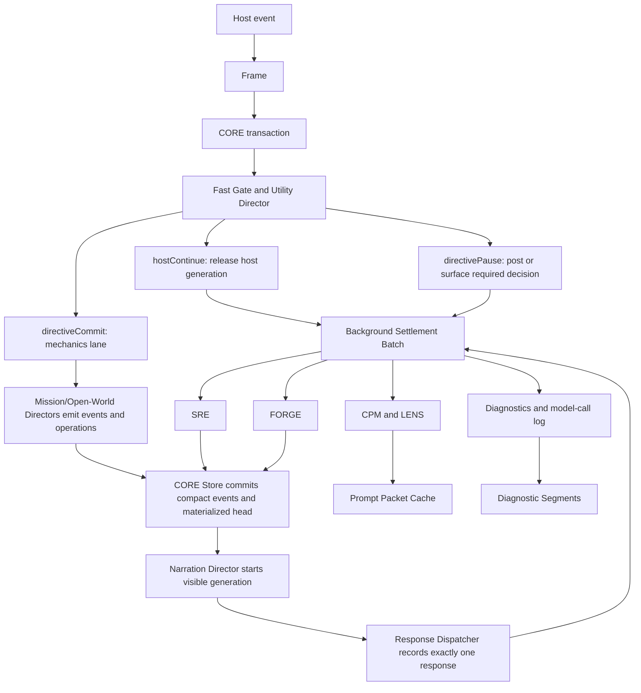

# Architecture Redesign Proposal

## Status

Discovery-backed proposal for a forward-only pre-alpha architecture break.

This document is not a compatibility plan. Directive is pre-alpha, so the redesign should replace the current save/runtime shape in place. A one-time importer from old full-save records is acceptable only as a development convenience; the runtime should stop writing the old architecture once the new one lands.

## Executive Decision

Directive should move from a distributed, save-centered turn pipeline to a transaction-centered runtime:

```text
Host event
  -> Frame
  -> CORE transaction
  -> fast route decision
  -> visible response lane
  -> background settlement/projection lane
  -> compact event store and materialized campaign head
```

The core change is ownership. Today, Scene Handshake, classification, Directors, response dispatch, prompt sync, sidecars, recovery, model-call journals, and save persistence each mutate campaign state through their own local rhythm. The redesign makes CORE own a player message from ingress through visible response and background settlement. Storage stops treating the full campaign save as the transaction log.

## Naming

These names are the human-facing architecture names. The implementation names in parentheses can remain as schema/API aliases during migration.

| Name | Expansion | Replaces |
| --- | --- | --- |
| SRE | Source Reconciliation Engine | Source Settlement Service / Scene Handshake / Scene Reconciliation source handling |
| CORE | Campaign Operation & Runtime Engine | Turn transaction runtime plus transaction store |
| REPAIR | Recovery Engine for Player/Assistant Integrity Repair | Recovery Director |
| FORGE | Follow-On Runtime Generation Engine | Post-turn projection batch / sidecar scheduler |
| Frame | Turn source frame | Turn source frame / range source frame |
| LENS | Live Evidence & Narrative Scheduler | Prompt projection scheduler / prompt dirty cache |

The target architecture has two hard product requirements:

1. Scale a single campaign chat beyond 5000 player/assistant messages without save payload growth becoming a turn-latency multiplier.
2. Keep player-submit-to-generation-begins under 60 seconds, even after thousands of messages.

For this metric:

- `hostContinue` generation begins when Directive releases the host-native generation path.
- `directiveCommit` generation begins when Directive starts the narration model call for the committed outcome.
- Provider completion time is tracked separately. A slow narration provider can still take longer than 60 seconds to finish, but Directive should not spend more than 60 seconds before starting that generation.

## Discovery Inputs

This proposal was built from current worktree discovery, the June 28 live Sam Vickers latency audit, and four parallel discovery lanes:

- Sidecars and auxiliary checks: host ingress, turn spine, journals, sidecar scheduler, thread director, recovery, Stop/cancellation.
- Directors and turn orchestration: chat orchestrator, provisional/commit flow, Mission Director, open-world coordinator, recovery boundaries.
- CPM and Handshake: continuity source frame, prompt projection, selected swipes, Scene Handshake, Scene Reconciliation.
- Data and persistence: save record shape, storage repository, runtime snapshots, turn ledger snapshots, full-save rewrite sequence.

Primary current files inspected:

- `src/runtime/chat-turn-orchestrator.mjs`
- `src/runtime/runtime-app.mjs`
- `src/runtime/state-delta-gateway.mjs`
- `src/runtime/turn-commit-coordinator.mjs`
- `src/runtime/response-dispatcher.mjs`
- `src/runtime/message-reconciler.mjs`
- `src/runtime/scene-handshake-settler.mjs`
- `src/runtime/scene-reconciliation.mjs`
- `src/jobs/campaign-sidecar-scheduler.mjs`
- `src/directors/open-world-turn-coordinator.mjs`
- `src/mission/director.mjs`
- `src/generation/player-safe-prompt-context-builder.mjs`
- `src/continuity/*`
- `src/storage/save-records.mjs`
- `src/storage/directive-storage-repository.mjs`
- `docs/development/TURN_LATENCY_AUDIT_2026_06_28.md`

## Current Architecture Summary

### Current Turn Spine

The current chat-native path is broadly:

```text
SillyTavern event
  -> runtime bridge
  -> chat-turn orchestrator
  -> ingress record and save
  -> Scene Handshake settlement
  -> Utility classification
  -> classification record and save
  -> route
     -> host continuation, pause, routine/counsel, or consequential Director turn
  -> mechanics commit and save
  -> narration or host handoff
  -> response record and save
  -> post-commit processors
  -> prompt sync and save
  -> sidecar queue
  -> sidecar journals/applies/prompt sync/save
```

The pieces are individually defensible, but the combined path is too broad. The visible turn path can include Scene Handshake, time adjudication, classification, advisory generation, Director preview, mechanics commit, narration, response dispatch, end-condition checks, post-commit conversation extraction, prompt rebuild, full-save persistence, and sidecar scheduling.

### Current Sidecar Shape

`campaign-sidecar-scheduler.mjs` has fixed workers:

- `continuity`
- `relationship`
- `crew`
- `ship`
- `commandBearing`

The scheduler snapshots campaign state and turn context for each worker, runs generation concurrently when possible, then applies results one worker at a time. Each worker can journal, persist, apply operations, and trigger prompt sync. The live audit showed sidecar generation was concurrent, but apply/reject/persist/prompt work stretched across later offsets.

### Current Director Shape

Mission Director is mostly deterministic and returns a turn packet. Runtime wraps that packet in provisional/commit behavior and then performs narration, command-log summary, end-condition checks, response dispatch, and prompt sync.

Open-world coordination currently computes a projected campaign state by committing once inside the coordinator, then packages broad `openWorld.rootsSet` replacements for the runtime commit. That makes preview/finalization heavy and encourages large root replacement deltas.

### Current CPM And Handshake Shape

CPM is a source-backed projection service with source frames, fact materializers, fact index, planner validation, prompt lanes, Director packets, diagnostics, and sidecar handoff.

Scene Handshake is a pre-classification pass. It reads the previous assistant message and current player reply, normalizes the selected assistant variant, calls a Utility model, validates narrow operations, records settlement, and may commit accepted-scene time before the current player message is classified.

Manual Scene Reconciliation is a separate service over selected ranges, with overlapping source anchoring, extraction, validation, pending review, prompt rebuild, and stale-source invalidation concerns.

### Current Data Shape

`save-records.mjs` stores:

```text
directive.campaignSave
  metadata
  payload.campaignState
```

Runtime persistence generally calls `controller.saveCurrentGame`, which overwrites the full save payload. Indexes are lightweight, but the active save itself contains game state, runtime journals, retained snapshots, turn ledger entries, prompt metadata, model-call summaries, sidecar journals, Scene Handshake records, and recovery records.

Two rollback/history systems coexist:

- `turnLedger.entries[].snapshotBefore`
- `runtimeTracking.history[].snapshot`

The June 28 audit measured a live save at 73,166,880 bytes at only about 33 chat rows. The largest roots were `turnLedger` at 21,836,975 minified bytes and `runtimeTracking` at 14,090,539 minified bytes. A follow-up code change now compacts nested `stateDelta.openWorld.rootsSet.runtimeTracking` inside retained turn-ledger deltas, but the larger architectural problem remains: runtime history and operational journals still live inside the hot save payload.

## Root-Cause Findings

### 1. The Visible Path Is Too Monolithic

The current design lets every local system decide whether it is part of the awaited turn path. Utility-lane work is not automatically non-blocking. In the live audit, `sceneHandshakeSettler` consumed a full 30 second timeout before classification, `utilityTurnClassifier` then ran, and `missionDirectorAdvisor` blocked a counsel turn before host handoff. For the directive-owned turn, narration took about 96.5 seconds, but there was still material pre-narration and post-narration overhead before visible response.

The redesign must make the blocking boundary explicit:

- Blocking work is only what is required to decide route, preserve state safety, commit required mechanics, and start visible generation.
- Everything else is background or recovery.

### 2. The Save Is Doing Too Many Jobs

The active save is currently:

- materialized campaign state;
- runtime transaction log;
- model-call diagnostic store;
- sidecar journal;
- recovery journal;
- prompt cache;
- rollback snapshot store;
- turn packet archive;
- manual save payload.

This makes every small runtime record a full-save rewrite. It also makes every retained snapshot grow with campaign size.

### 3. Recovery Has No Single Owner

Message edits and deletes touch:

- message reconciler;
- ingress ledger;
- response ledger;
- recovery journal;
- turn ledger snapshots;
- Scene Handshake invalidation;
- mission-component source status;
- sidecar stale checks;
- prompt sync;
- reobserve behavior in the orchestrator.

The June 28 edited-message loop is the failure shape: the original ingress became `recoveryRequired`, the edited text was reobserved as a fresh `sceneColor` ingress, old post-turn work continued, stale sidecars rejected late, and the replacement ingress was stranded at `classified`.

### 4. Open-World State Replacement Is Too Heavy

Open-world should emit bounded events and operations. It should not create broad root replacement payloads or run a transaction commit to project future state, then ask runtime to commit a broad projected root set again.

### 5. CPM Is Conceptually Strong But Operationally Too Entangled

CPM should remain the source-backed prompt and Director-packet projection service. The problem is not CPM's contract. The problem is when and how often prompt projection is rebuilt, recorded, and persisted.

Prompt sync should be dirty-domain driven and bounded. It should not become another full-save write after every minor journal mutation.

### 6. Sidecars Are Proposal-Safe But Persistence-Expensive

Sidecars correctly validate roots and stale revisions. The cost problem is that they can still spend provider time after source invalidation and then persist/journal/apply one worker at a time.

Stale checks must happen before provider calls when possible, not only before apply.

## Target Architecture

### High-Level Diagram



### Core Runtime Objects

#### Frame (`TurnSourceFrame`)

One canonical source boundary replaces separate ad hoc source frames for CPM, Scene Handshake, sidecars, and reconciliation.

Required fields:

```text
kind: directive.turnSourceFrame.v1
sourceKind: playerIngress | latestPair | explicitRange | recoveryRepair
campaignId
saveId
branchId
chatId
hostId
ingressId
turnId
outcomeId
responseId
responseMessageId
currentPlayer:
  hostMessageId
  messageOrdinal
  textHash
  textPreview
  fullTextRef
previousAssistant:
  hostMessageId
  responseKind
  selectedVariantId
  selectedSwipeIndex
  swipeCount
  selectedTextHash
  visibleTextHash
  sourceIntegrity:
    status
    reasons
  textPreview
  fullTextRef
stateRevision
mechanicsRevision
promptRevision
scene:
  locationId
  activeQuestId
  activeMissionId
  activePhaseId
  presentActorIds
sourceHash
rangeHash
```

Rules:

- Host adapters normalize accepted assistant variants. Downstream systems do not inspect raw SillyTavern swipe fields.
- If `sourceIntegrity` is stale or mismatched, automatic settlement is skipped and recovery/reconciliation owns the result.
- Full chat text is referenced by host message id and hash. Directive does not duplicate the whole chat transcript in the campaign save.
- Frame (`TurnSourceFrame`) is a compact provenance token, not a prompt packet, transcript copy, sidecar snapshot, rollback snapshot, or diagnostics record.
- CPM, latest-pair settlement, explicit-range reconciliation, and post-turn sidecars consume this token or a `RangeSourceFrame` composed from these tokens.
- Automatic settlement and sidecar apply are forbidden when source integrity is not clean: wrong chat/save/branch, deleted or invalidated source, selected-swipe mismatch, text-hash mismatch, mechanics revision mismatch, or range-hash drift.
- Do not store raw host swipe arrays, full prompt blocks, provider prompts/results, hidden Director state, sidecar full-state snapshots, or rollback snapshots in the source frame.

For explicit transcript ranges, `RangeSourceFrame` stores ordered source-frame ids, range hash, neighbor hashes, bounded previews, and derived ingress/turn/outcome ids. Full transcript text remains behind host/message references.

#### CORE Transaction (`TurnTransaction`)

One transaction owns all work for one player source revision.

```text
kind: directive.turnTransaction.v1
id
sourceFrame
phase
route
abortToken
startedAt
generationStartedAt
visibleResponsePostedAt
closedAt
classification
mechanics:
  outcomeId
  turnId
  operationEventIds
response:
  responseId
  hostMessageId
  strategy
  idempotencyKey
background:
  requestedEffects
  batchId
recovery:
  status
  reason
diagnosticsRef
```

Phases:

```text
ingressed
gated
routed
mechanicsCommitted
visibleGenerationStarted
visibleResponsePosted
backgroundSettling
recoveryRequired
closed
```

Only the transaction runtime advances phases. Other systems return proposals, events, or results.

#### CORE Ledger Ownership

Decision: ingress ledger, response ledger, turn ledger, runtime-tracking writes, and recovery status combine under CORE ownership and CORE Store (`TransactionStore`) persistence. They are not separate mutable campaign-state roots in v2.

The store may expose read projections named ingress ledger, response ledger, turn ledger, and recovery journal for UI and compatibility during migration. The only write path is typed transaction/store events:

```text
beginTurn(sourceFrame)
advanceTurn(txnId, phasePatch)
commitMechanics(txnId, operationBundle)
recordVisibleResponse(txnId, responseRef)
markRecoveryRequired(txnId, recoveryBundle)
commitBackgroundBatch(txnId, operationBundle)
appendDiagnostics(txnId, diagnosticsEvent)
```

CORE Runtime (`TurnTransactionRuntime`) owns phase movement and exactly-one visible response/delegation. CORE Store (`TransactionStore`) owns durable writes. This avoids the current pattern where ingress, classification, response dispatch, recovery, sidecars, model-call journals, prompt sync, and save persistence each mutate hot runtime roots independently.

### Lane Split

#### Fast Gate Lane

Hard budget: target 5 seconds, maximum 20 seconds.

Responsibilities:

- normalize host source;
- dedupe source revision;
- enforce latest-boundary and active-chat guards;
- detect edits/deletes/recovery-required state;
- run deterministic route checks;
- run Utility classification only when deterministic checks are insufficient;
- decide one route:
  - `hostContinue`;
  - `directiveCommit`;
  - `directivePause`;
  - `recoveryReview`.

Not allowed:

- advisory generation;
- model-backed Scene Handshake unless explicitly required by the route;
- prompt rebuild;
- sidecars;
- Command Log assisted summary;
- thread extraction;
- broad save writes.

#### Visible Response Lane

Hard budget: generation must start within 60 seconds of player submit.

For `hostContinue`:

- release host generation as soon as source safety and route are known;
- do not wait for Scene Handshake, advisory records, prompt rebuild, or sidecars;
- if prompt was dirty, mark the current host generation as using the prior prompt revision and rebuild for the next generation.

For `directiveCommit`:

- abort/default-stop host generation quickly once Directive owns the response;
- run required mechanics;
- commit compact outcome events and materialized head;
- start narration immediately after mechanics commit;
- record `generationStartedAt` before waiting for provider completion.

For `directivePause`:

- post or surface the required clarification/checkpoint as the visible response;
- defer advisory/context enrichments.

#### Background Settlement Lane

Runs after visible generation starts or after a visible pause/response is posted.

Responsibilities:

- model-backed Scene Handshake and range settlement when not critical;
- thread extraction;
- quest promotion;
- Command Log assisted summaries;
- sidecar projection workers;
- prompt rebuild;
- diagnostics;
- non-blocking advisory records.

The background lane has source tokens and abort signals. Edits, deletes, Stop, branch changes, or newer source revisions cancel work before provider calls when possible.

## Director Redesign

### Utility Director

Owns fast routing only.

Inputs:

- Frame (`TurnSourceFrame`);
- compact player-safe state projection;
- pending interaction summary;
- active prompt/route metadata.

Outputs:

```text
route
classification
confidence
requiredMechanics
requiredPause
backgroundEffects
```

It does not produce advisory prose and does not mutate state.

### Mission Director

Mission Director should stay deterministic-first and tactical.

Required change:

- return bounded operations/events instead of large packets that need broad retained state deltas;
- separate `preview` from `commit`;
- keep narration out of mechanics commit.

### Open-World Director

Replace `rootsSet` with event reduction.

Current shape:

```text
commit projected state inside coordinator
return openWorld.rootsSet with broad roots
runtime commits again
```

Target shape:

```text
foreground event
  -> open-world reducers
  -> bounded operation list
  -> event ids
  -> transaction store applies once
```

Open-world reducers own:

- quest lifecycle transitions;
- world boundary events;
- reaction rules;
- story milestone reconciliation;
- quest availability changes;
- campaign asset grants;
- event ledger entries.

They do not own `runtimeTracking`, prompt metadata, or broad root replacement.

### Narration Director

Owns visible prose generation from committed outcome data.

Rules:

- input is the committed outcome packet plus player-safe prompt context;
- cannot mutate mechanics;
- receives an abort token;
- starts within the 60 second submit-to-generation-start budget;
- response retry reuses the same outcome and idempotency key.

### REPAIR

Recovery becomes one service, not a side effect of several systems.

Rules:

- Edited latest player row with no dependent assistant response: cancel active work and restart the same transaction with the new text hash.
- Edited/deleted player row with a dependent Directive outcome: do not reobserve as a normal turn. Mark recovery required and offer rollback, replay, branch, or dependent-row replacement.
- Edited/deleted host assistant or selected-swipe change: invalidate derived source facts and require settlement/reconciliation before they can be continuity.
- Retry visible response: reuse outcome and response idempotency. Never rerun mechanics.
- Rerun outcome: create an explicit branch candidate from the retained checkpoint and require acceptance.

REPAIR owns:

- source invalidation;
- dependent turn lookup;
- snapshot/checkpoint selection;
- branch/replay/replace options;
- prompt dirtying after recovery;
- cancellation of stale background work.

## CPM And Prompt Redesign

CPM remains a core system. The redesign changes operational placement.

### Keep

- source-backed fact materializers;
- fact index;
- visibility gates;
- hard floors and contradiction guards;
- six stable prompt lanes;
- Director packets by audience;
- selected assistant variant as the only accepted assistant source;
- diagnostic hashes and source ids.

### Change

- Deterministic CPM is default for hot-path prompt construction.
- Utility planner becomes background hinting/compression, not a blocking requirement.
- Prompt rebuild is dirty-domain driven.
- Prompt packet cache is stored outside the campaign head.
- Projection runs are compact and bounded; full prompt block bodies are not embedded in runtime history snapshots.

### LENS

Combine prompt dirtying, prompt rebuild scheduling, and prompt-cache writes behind LENS (`PromptProjectionScheduler`). Do not merge CPM into LENS. CPM remains the deterministic source-backed projection builder; CORE Store emits dirty domains and background effects; LENS decides when a prompt packet is built, reused, installed, or deferred.

Dirty domains should be prompt-level categories, not raw storage roots only:

```text
identity
sceneTime
missionQuestThread
crewShipRelationship
command
continuity
sourceBinding
terminalRecovery
```

Diagnostics-only, model-call, journal-only, and activity-indicator writes must not dirty prompt context.

Prompt cache keys must include:

- cache audience/profile;
- campaign/save/branch/chat identity;
- mechanics revision or prompt-domain version vector;
- CPM `sourceHash` and `policyHash`;
- static prompt key version;
- package, crew, ship, and projection revisions;
- turn-source hash when player text, recent messages, or selected assistant variant are part of the packet.

Long-lived base CPM cache entries should be separate from turn-local prompt-frame overlays. Fact-use stats need special care: if prompt installation mutates fact-use stats and those stats are part of the cache key, prompt rebuild can self-invalidate without gameplay changes.

Prompt dirty rules:

| Dirty source | Rebuild timing |
| --- | --- |
| route-only ingress/classification | no rebuild |
| committed mechanics affecting prompt roots | before next visible generation when Directive owns response; otherwise next generation |
| background sidecar accepted | one rebuild after batch |
| recovery/rollback | rebuild after recovery transaction |
| diagnostics-only update | no rebuild |

For host-native generation, Directive must pick one honest product rule:

- If prompt correctness is critical for the immediate host response, Directive must hold or abort host generation until prompt sync is complete.
- Otherwise, Directive releases host generation quickly and records that the rebuild applies to the next response.

This proposal chooses the second rule for ordinary `hostContinue` turns because the under-60-second generation-start requirement is explicit.

## SRE Redesign

Scene Handshake and Scene Reconciliation should collapse into SRE (Source Reconciliation Engine).

Modes:

- `latestPair`: automatic settlement of the previous assistant selected variant and current player reply.
- `explicitRange`: operator-selected reconciliation over a transcript range.
- `recoveryRepair`: settlement after edit/delete/branch recovery.

Shared behavior:

- consume Frames or range Frames;
- validate chat/save/branch identity;
- use selected assistant variant only;
- enforce stale/mismatch as a hard no-auto-commit guard before provider call and before apply;
- return bounded operations;
- write one compact settlement event;
- queue review for ambiguous or high-risk material.

Blocking policy:

- Deterministic latest-pair checks can run before route.
- Model-backed settlement is background by default.
- Model-backed settlement blocks only when the current player action depends on accepted prior assistant facts that must be committed before mechanics.

Backend boundary:

- SRE owns source identity, selected-variant integrity, stale guards, settlement event shape, operation validation, and prompt-dirty domain output.
- It does not own recovery policy, prompt installation, response dispatch, or transaction persistence.
- `latestPair`, `explicitRange`, and `recoveryRepair` remain separate internal modes with their own prompts, schemas, review policy, and blocking budgets.
- The implementation target is a facade such as `src/runtime/source-settlement-service.mjs`, initially dispatching to mode modules while shared source-frame resolution and integrity checks move behind the service boundary.

Migration requirement:

Current settlement code computes selected-variant `sourceIntegrity`, but the v2 service must treat stale or mismatched integrity as a hard skip before model-backed settlement or state apply. Recording the mismatch is not enough.

## FORGE Redesign

### From Workers To FORGE

Current sidecars are safe but too expensive to apply independently. Replace the scheduler with FORGE (Follow-On Runtime Generation Engine).

Inputs:

- transaction id;
- source token;
- committed outcome id or host continuation id;
- compact turn source frame;
- compact materialized head;
- CPM digest;
- requested projection effects.

Workers can still be separate internally:

- continuity;
- relationship;
- crew;
- ship;
- command bearing;
- command log summary;
- thread extraction;
- quest/background architecture.

But the batch commits once:

```text
generate workers concurrently
  -> parse and validate all outputs
  -> reject stale source before provider call and before apply
  -> detect path conflicts
  -> build one operation bundle
  -> apply one transaction
  -> write one journal bundle
  -> rebuild prompt once if dirty
```

FORGE is a coordinator, not a monolithic sidecar or one generic prompt. It may run multiple typed provider sub-batches grouped by lane and timeout, but it owns one source token, one stale/cancel contract, one apply transaction, one journal/diagnostics bundle, and one prompt rebuild.

Domain adapters remain separate:

- state projection workers return state-delta proposals under allowed-root contracts;
- Command Log summaries return presentation-only `assistedSummary` updates;
- scene/thread extraction returns evidence for deterministic thread reducers;
- quest architecture returns a validated proposal for deterministic quest registration;
- advisory enrichment patches an existing advisory record or records diagnostics and does not block host continuation.

Batch API shape:

```text
FORGE.run({
  transactionId,
  sourceToken,
  committedOutcomeId | hostContinuationId,
  sourceFrame,
  baseRevisions,
  materializedHead,
  cpmDigest,
  requestedEffects,
  signal
}) -> ProjectionBatchResult
```

Batch order:

```text
validate source before provider calls
run compatible provider sub-batches
parse typed outputs
validate source again before apply
reduce accepted outputs into typed effects and operations
detect cross-effect path conflicts
apply one transaction bundle
write one journal/diagnostics bundle
rebuild prompt once if dirty
commit manifest pointer last
```

If edit/delete/recovery invalidates the source token, queued work is aborted before provider calls where possible. If an in-flight provider cannot abort, its result is discarded as diagnostics-only. Apply is attempted only when the source token is still current and accepted effects have no domain/path conflict with newer committed work.

### Worker Plan Replacement

Replace broad `workerPlan` booleans with explicit effects:

```text
backgroundEffects:
  promptProjection: required | optional | none
  sourceSettlement: latestPair | explicitRange | none
  threadExtraction: true | false
  commandLogSummary: true | false
  sidecarProjection:
    continuity: true | false
    relationship: true | false
    crew: true | false
    ship: true | false
    commandBearing: true | false
  advisoryRecord: true | false
```

The fast route can request effects, but effects are not automatically blocking.

## Auxiliary Turn Systems Redesign

Auxiliary systems need explicit ownership in the transaction model. They should not independently decide to join the blocking path or persist full state.

| System | Current pressure | Target owner | Blocking rule |
| --- | --- | --- | --- |
| Time adjudication | can run around accepted Scene Handshake and current turn boundaries | Transaction runtime plus time reducer | blocks only when current response header or mechanics requires the boundary |
| Command Bearing fit | can add Utility checks before commit | Fast lane only when a readied point is attached; otherwise background review | blocks only for player-selected spend validation |
| Command Bearing Mark Review | can run as sidecar/closure work | Background projection batch plus deterministic award reducer | never blocks generation start |
| End conditions | evaluated after mechanics commit and can post checkpoints | Mechanics commit lane | blocks only when a terminal checkpoint is the visible response |
| Outcome Integrity | protects edited Directive-owned assistant prose | REPAIR | blocks normal continuation only for protected dependent edits |
| Command Log assisted summary | can run during commit flow | Background projection batch | never blocks generation start; deterministic log entry exists first |
| Narrative Thread extraction | post-commit conversation processor can add work before prompt sync | Background projection batch | never blocks generation start |
| Quest architecture/promotion | can run after visible turn and become stale | Open-world reducers plus background projection batch | blocks only for foreground quest mechanics |
| Model-call journal | stored in runtime tracking and save history | Diagnostics segment writer | never advances mechanics revision |
| Activity indicator | receives phase events from many sources | CORE phase projection | reflects transaction phase, not every worker's internal state |
| Stop/cancel | currently covers host-cancelable work unevenly | turn-scoped `AbortSignal` | cancels queued and in-flight non-authoritative work before provider calls when possible |

The rule is simple: if an auxiliary system does not determine the route, commit required mechanics, start visible generation, or post the required visible pause/checkpoint, it belongs in background settlement.

## Data Architecture Redesign

### New Storage Layout

Stop writing one monolithic `payload.campaignState` as the hot runtime record.

Proposed files:

```text
directive-campaign-<campaignId>-manifest.v2.json
directive-campaign-<campaignId>-head.v2.json
directive-campaign-<campaignId>-events-<segment>.jsonl
directive-campaign-<campaignId>-turns-<segment>.jsonl
directive-campaign-<campaignId>-diagnostics-<segment>.jsonl
directive-campaign-<campaignId>-prompt-cache.v2.json
directive-campaign-<campaignId>-host-map.v2.json
directive-save-<saveId>-manifest.v2.json
directive-checkpoint-<campaignId>-<revision>.v2.json
directive-indexes-saves.v2.json
```

### Storage Classes

| Class | Purpose | Hot path? | Notes |
| --- | --- | --- | --- |
| Campaign manifest | campaign/package/save identity and current pointers | small | Commit last after other writes. |
| Materialized head | compact current authoritative state | yes | No runtime journals, no full history snapshots. |
| Event log | typed canonical mutations | yes | Append or segment write; source of replay. |
| Turn index/log | compact transaction records and response ids | yes | No full snapshots. |
| Diagnostics log | model calls, sidecar traces, provider errors | no | Bounded/segmented; not gameplay state. |
| Prompt cache | installed prompt packet digests and current blocks | no | Can be rebuilt from head and CPM. |
| Host map | chat ids, message ids, selected variants, source hashes | yes | Avoid duplicating chat text. |
| Checkpoints | periodic materialized snapshots | load/recovery | Referenced by save manifests. |
| Save manifest | named branch/autosave pointer | small | Autosave points to revision/checkpoint. |

### CORE Store

`state-delta-gateway` becomes the single transaction store:

```text
validate operation bundle
append typed events
apply to in-memory materialized head
write event/turn segments
write head when required
write manifest pointer last
emit prompt-dirty domains
emit background effects
```

Durable commit order:

```text
append canonical event segment
append/update compact turn segment
reduce in-memory materialized head
write head only when gameplay/head state changed
write diagnostics segment separately
commit small manifest pointer last
```

If a host storage adapter cannot append JSONL directly, it can rewrite a bounded segment file behind this API. Runtime modules still see append/commit semantics and never request a full `payload.campaignState` overwrite on the hot path.

Separate revisions:

- `mechanicsRevision`: authoritative gameplay state.
- `runtimeRevision`: turn/host/recovery state.
- `diagnosticRevision`: model-call and sidecar diagnostics.
- `promptRevision`: installed prompt packet.

Diagnostics do not advance mechanics revision and do not force head rewrites.

### Snapshot And Checkpoint Policy

Remove full `runtimeTracking.history[].snapshot` from the hot save.

Replace with:

- inverse operations for the latest few transactions where cheap;
- checkpoint references every N turns or M bytes;
- explicit branch checkpoints for Save As and terminal checkpoints;
- compact recovery records that point to event ids/checkpoint ids.

Suggested defaults:

- checkpoint every 100 committed player turns or when event segment exceeds 2 MB;
- keep latest 3 fast checkpoints loaded/indexed;
- keep branch and terminal checkpoints until the save/branch is deleted;
- compact old turn events into summaries only after a checkpoint proves replay.

### Autosave

Autosave becomes a pointer:

```text
saveManifest:
  slotType: autosave
  campaignId
  branchId
  revision
  checkpointId
  headHash
```

It does not clone the full campaign state every 20 messages.

### 5000-Message Storage Targets

These are design targets for pre-alpha gates, not guesses about final production limits:

| Artifact | Target at 5000 messages |
| --- | ---: |
| Materialized campaign head | <= 8 MB minified JSON |
| Current save manifest | <= 50 KB |
| Active prompt cache | <= 1 MB |
| Host map | <= 5 MB, excluding raw chat text |
| Current event segment | <= 2 MB before rollover |
| Current diagnostics segment | <= 5 MB before rollover |
| Hot-path full-save rewrites | 0 |
| Hot-path writes before generation start | <= 1 small transaction write |
| Writes per settled turn | target 2, max 4 excluding diagnostics rollovers |

The campaign can still have many historical event segments. The important invariant is that the current turn does not rewrite all history.

## Latency Architecture

### Hard Budgets

| Lane | Target | Hard limit |
| --- | ---: | ---: |
| Source normalization and latest-boundary guard | < 1s | 3s |
| Fast deterministic route | < 1s | 3s |
| Utility classification when needed | < 8s | 20s |
| Host continuation release | < 10s | 60s |
| Directive mechanics before narration start | < 30s | 50s |
| Narration generation start | < 45s | 60s |
| Background settlement | not visible-blocking | cancelable |

### Required Runtime Instrumentation

Every transaction records:

```text
playerSubmittedAt
turnObservedAt
routeDecidedAt
hostGenerationReleasedAt
directiveGenerationStartedAt
visibleResponsePostedAt
backgroundSettledAt
```

The under-60-second gate uses:

```text
min(hostGenerationReleasedAt, directiveGenerationStartedAt) - playerSubmittedAt
```

The provider completion gate is separate:

```text
visibleResponsePostedAt - directiveGenerationStartedAt
```

This distinction prevents slow providers from hiding architecture latency and prevents architecture latency from being blamed on providers.

## REPAIR Architecture

### Latest-Boundary Rule

A player edit can only re-enter the normal turn pipeline when the edited player row is still the latest actionable chat boundary and no dependent assistant row or committed outcome exists.

If there is a dependent assistant row:

- cancel active work for the old source token;
- mark the transaction `recoveryRequired`;
- show explicit recovery choices;
- do not classify the edit as a new `hostContinue` or `sceneColor` turn.

### Recovery Choices

| Situation | Allowed choices |
| --- | --- |
| Latest player row edited before response | restart same transaction revision |
| Player row edited after Directive response | rollback outcome, replace dependent response, or branch |
| Player row deleted with committed outcome | rollback or branch |
| Assistant selected swipe changed | invalidate derived facts and settle/reconcile |
| Provider failed after mechanics | retry response from same outcome |
| User requests rerun outcome | preview branch candidate from checkpoint |

### REPAIR Event Contract

REPAIR is the single authority for deciding whether a host mutation, failed response, stale source, rollback request, stopped generation, or branch/chat change may re-enter the normal turn pipeline. It does not own SRE, Outcome Integrity review, response dispatch, prompt rebuild, or FORGE internals. It owns the recovery case, source-token cancellation, allowed next actions, and idempotent transition rules.

Inputs:

- host message sent/rendered/edited/deleted events;
- selected assistant variant changes;
- Stop or host generation canceled events;
- chat/save/branch changes during a turn;
- response post failures;
- provider failures after mechanics commit;
- stale source detections from settlement or background batches;
- explicit retry, rerun, rollback, replay, or branch actions.

Outputs:

- `RecoveryCaseOpened`;
- `RecoveryCaseUpdated`;
- `RecoveryCaseResolved`;
- `TurnTransactionCanceled`;
- `TurnTransactionRestartRequested`;
- `SourceInvalidated`;
- `BackgroundWorkCanceled`;
- `PromptDirty`;
- `RollbackRequested`;
- `ResponseRetryRequested`;
- `RecoveryReviewRequired`.

Cycle-prevention rules:

- A host message id plus text hash maps to at most one active turn transaction.
- A player edit/delete with any dependent assistant row or committed outcome produces one recovery case and cannot create a replacement classified ingress.
- Only a latest player row with no dependent assistant response may restart the same transaction revision from the new text hash.
- Response retry reuses the same outcome and response idempotency key and never reruns mechanics.
- Rerun outcome creates an explicit branch/checkpoint candidate; it is not an automatic retry.
- Recovery actions are serialized per campaign and source token. Diagnostics writes may remain out of band.
- Prompt rebuild follows recovery transaction completion, not every intermediate journal update.

## Module Replacement Map

| Current area | Target replacement |
| --- | --- |
| `chat-turn-orchestrator.mjs` | `turn-transaction-runtime` plus small host ingress adapter |
| `state-delta-gateway.mjs` | transaction store, event appender, materialized head reducer |
| `turn-commit-coordinator.mjs` | mechanics commit lane inside transaction runtime |
| `message-reconciler.mjs` | REPAIR |
| `scene-handshake-settler.mjs` and `scene-reconciliation.mjs` | SRE |
| `campaign-sidecar-scheduler.mjs` | FORGE |
| open-world `rootsSet` deltas | event/reducer operation bundles |
| `runtimeTracking.history` | checkpoint refs and inverse operation refs |
| model-call and sidecar journals in save | diagnostics segments |
| autosave full save clone | save manifest pointer |
| scattered prompt sync callers | LENS |
| direct ledger writes | CORE Store typed events and read projections |

## Combination Audit Findings

The audit conclusion is to combine ownership of shared lifecycle mechanics, not to merge all domain judgment into a single orchestrator. Each combined surface below should expose one source, phase, persistence, cancellation, or prompt-scheduling contract while preserving typed internal adapters.

| Proposed combination | Architectural finding | Backend finding | Must remain separate |
| --- | --- | --- | --- |
| Scene Handshake + Scene Reconciliation + source invalidation | Combine as SRE with `latestPair`, `explicitRange`, and `recoveryRepair` modes. | Move source-frame resolution, selected-variant integrity, stale checks, event normalization, operation validation, and dirty-domain output behind one facade. Stale/mismatch integrity must hard-skip before model call and apply. | Recovery policy, prompt installation, response dispatch, and transaction persistence. |
| Ingress ledger + response ledger + turn ledger + runtimeTracking writes | Combine under CORE Runtime plus CORE Store. | Old ledgers become read projections over typed event/turn segments. The store is the only durable writer for ingress, response, recovery, sidecar, model-call diagnostics, mechanics, and background batch events. | Physical storage segments stay split: event log, turn log, diagnostics log, host map, prompt cache, compact head. |
| Retry + edit/delete recovery + stale response handling + rollback + loop detection | Combine under REPAIR. | REPAIR owns recovery cases, source-token invalidation, latest-boundary decisions, allowed next actions, idempotency, and cancellation. | SRE extraction, Outcome Integrity review internals, response posting, prompt rebuild, and FORGE workers. |
| Command Log summary + Narrative Thread extraction + quest/advisory enrichment + sidecars | Combine under FORGE. | Workers can run as typed provider sub-batches, but validation, conflict detection, apply, journal/diagnostics write, prompt dirtying, and persistence happen once per batch. | Worker prompts, structured schemas, allowed-root policies, and deterministic reducers. |
| CPM source frame + sidecar context + Handshake snapshot + reconciliation snapshots | Combine as Frame and range Frame. | Store ids, hashes, revisions, selected-variant metadata, bounded previews, and integrity state. Do not store full transcript text, prompt blocks, provider prompts/results, sidecar full-state snapshots, or rollback snapshots. | CPM materializers/projection logic, settlement mode prompts, reconciliation range UX, and sidecar worker context builders. |
| Prompt sync + dirty-domain updates + prompt-cache writes | Combine as LENS. | Transaction commits emit prompt dirty domains and background effects. LENS coalesces rebuilds, owns cache keys, installs prompt packets, and records when a visible generation used a prior prompt revision. | CPM remains the projection builder. CORE Store remains mutation/revision authority. Host adapters only install packets. |

This is the line to hold during implementation: one owner for transaction phase, source integrity, persistence, recovery, background batching, prompt scheduling, and cancellation; separate domain engines for mission, open-world, CPM, source extraction, narration, command bearing, time, end conditions, and presentation summaries.

## Implementation Plan

### Phase 1: Schemas And Metrics

Deliverables:

- Frame schema.
- CORE transaction schema.
- v2 storage manifest/head/event/checkpoint schema.
- performance instrumentation fields.
- synthetic 5000-message test fixture plan.

Exit criteria:

- docs and schema tests define the 5000-message and under-60-second gates.
- no runtime behavior changes required yet.

### Phase 2: CORE Store

Deliverables:

- event appender;
- materialized head reducer;
- manifest pointer commit;
- checkpoint writer;
- diagnostic segment writer;
- one-time old-save importer for development only.

Exit criteria:

- old full save can load and write v2 layout;
- new runtime writes no full hot-path `payload.campaignState` overwrites.
- no direct runtime writes to old ingress/response/recovery/sidecar/model-call ledger helpers outside CORE Store;
- no `runtimeTracking.history[].snapshot`;
- no full `turnLedger.entries[].snapshotBefore`;
- diagnostics are stored in diagnostics segments only;
- edit/delete recovery updates one transaction and cannot reobserve a dependent edited row as a normal turn.

### Phase 3: Fast Gate Runtime

Deliverables:

- host event creates Frame;
- fast gate returns `hostContinue`, `directiveCommit`, `directivePause`, or `recoveryReview`;
- host continuation releases without Scene Handshake/advisory/prompt-sync waits.

Exit criteria:

- hostContinue generation release is under 10 seconds in deterministic tests.
- player-submit-to-generation-begins is measured directly.

### Phase 4: Split Mechanics From Narration

Deliverables:

- `commitMechanics` applies bounded events/operations;
- narration starts after mechanics commit;
- response retry reuses outcome and idempotency key;
- command-log assisted summary moves to background.

Exit criteria:

- directive-owned narration generation starts under 60 seconds in deterministic slow-provider tests.
- provider completion latency is reported separately.

### Phase 5: Open-World Event Reducers

Deliverables:

- remove broad `rootsSet` output;
- represent quest/world/reaction/story changes as bounded events and operations;
- commit open-world effects once.

Exit criteria:

- no turn packet stores broad root replacement state.
- open-world fixture tests prove equivalent state outcomes.

### Phase 6: SRE

Deliverables:

- unify Scene Handshake and Scene Reconciliation source handling;
- automatic latest-pair deterministic gate;
- background model-backed settlement;
- hard source-integrity no-auto-commit guard.

Exit criteria:

- edited dependent rows cannot reobserve into normal turn classification.
- accepted selected swipe remains the only assistant-prose continuity source.

### Phase 7: FORGE

Deliverables:

- sidecar workers run under one source token;
- stale source is checked before provider calls and before apply;
- accepted worker outputs apply as one operation bundle;
- one prompt rebuild after batch.

Exit criteria:

- one background batch produces at most one state transaction and one prompt sync.
- Stop/edit/delete cancels queued background workers.

### Phase 8: REPAIR

Deliverables:

- latest-boundary edit/delete policy;
- dependent outcome recovery choices;
- branch/replay/replace flow;
- source invalidation and prompt dirtying.

Exit criteria:

- Sam Vickers edited-message loop cannot reproduce.
- recovery state has one owner and one visible product path.

### Phase 9: Scale And Live Gates

Deliverables:

- synthetic 5000-message campaign scale test;
- 5000-message prompt rebuild test;
- event-log load/replay test;
- live SillyTavern smoke for under-60-second generation-start instrumentation.

Exit criteria:

- materialized head <= 8 MB minified at 5000-message synthetic scale;
- no hot-path full-save rewrite;
- submit-to-generation-begins under 60 seconds for hostContinue and directiveCommit paths under controlled provider latency;
- sidecar/background work never blocks generation start.

## Verification Plan

### Deterministic Tests

- `test-turn-transaction-runtime.mjs`: route phases, exactly-one response, cancellation.
- `test-transaction-store-v2.mjs`: event append, head reduction, checkpoint, manifest commit.
- `test-storage-scale-5000.mjs`: 5000-message synthetic save size, write count, load time.
- `test-source-settlement-service.mjs`: latest-pair, explicit range, selected swipe, stale source.
- `test-recovery-director.mjs`: edited latest row, edited dependent row, delete, retry, rerun.
- `test-background-projection-batch.mjs`: concurrent generation, stale preflight, batch apply, conflict rejection.
- `test-open-world-event-reducers.mjs`: no `rootsSet`, equivalent quest/world outcomes.
- `test-prompt-dirty-domains.mjs`: prompt rebuild once per dirty bundle.

### Performance Tests

- controlled slow Utility provider;
- controlled slow narration provider;
- controlled huge campaign head;
- controlled diagnostics burst;
- controlled sidecar batch stale cancellation.

Required assertions:

- route decision time;
- generation-start time;
- response-post time;
- full-save rewrite count;
- event bytes written;
- head size;
- diagnostics segment rollover;
- prompt rebuild count.

### Live Smoke

Live SillyTavern proof should inspect persisted transaction records, not just chat output.

Required live evidence:

- `playerSubmittedAt`;
- `routeDecidedAt`;
- `hostGenerationReleasedAt` or `directiveGenerationStartedAt`;
- active head size;
- event segment size;
- prompt revision/hash;
- canceled background jobs after edit/delete;
- no old full-save rewrite in the hot path.

## Success Criteria

The redesign is successful when these are true:

1. A 5000-message synthetic campaign can load, route a turn, start visible generation, settle background work, save, and reload without full-history rewrites.
2. `hostContinue` starts host generation in under 60 seconds after player submit.
3. `directiveCommit` starts narration generation in under 60 seconds after player submit.
4. Sidecar, advisory, thread, quest, prompt, and diagnostic work cannot block generation start.
5. Save manifests and materialized heads remain bounded; old diagnostic/history data moves into segmented logs.
6. Edits/deletes with dependent assistant rows enter explicit recovery and cannot reobserve as ordinary turns.
7. Open-world turns commit bounded events/operations, not broad root replacements.
8. Prompt rebuilds are dirty-domain driven and occur at most once for the visible lane and once for the background bundle.

## Non-Goals

- Preserve old pre-alpha save schema as a runtime write format.
- Maintain old `runtimeTracking.history` snapshot behavior.
- Keep `rootsSet` compatibility.
- Let diagnostics remain in the canonical campaign head.
- Make all background sidecars successful before visible generation.
- Guarantee provider completion under 60 seconds. The architecture gate is generation start, not provider finish.

## Open Decisions

1. Should event segments be JSONL only, or should the SillyTavern storage adapter also support compact JSON arrays for hosts that cannot append?
2. What is the exact checkpoint interval: fixed turn count, byte threshold, or both?
3. Which domains require inverse operations for near-term undo, and which should rely on checkpoints?
4. Should hostContinue ever block for prompt rebuild, or should prompt rebuild always apply to the next generation unless the route is directive-owned?
5. What minimal transcript source cache is needed to survive host chat file corruption without duplicating all chat text?
6. Which current runtime panels should read diagnostics segments directly, and which should consume compact view models?

## Recommended First Slice

Start with the architecture-bearing slice:

1. Add v2 schemas for Frame, CORE transaction, event segments, materialized head, and save manifest.
2. Add deterministic instrumentation for submit-to-generation-start.
3. Implement transaction store in parallel with existing storage behind a feature flag.
4. Convert one simple `hostContinue` path to fast gate plus v2 transaction record.
5. Convert one simple `directiveCommit` path to split mechanics/narration start.
6. Add a 5000-message synthetic scale test before broad migration.

This first slice proves the two hard goals before refactoring every sidecar and Director:

- generation starts within 60 seconds;
- current-turn persistence does not rewrite all historical campaign data.
