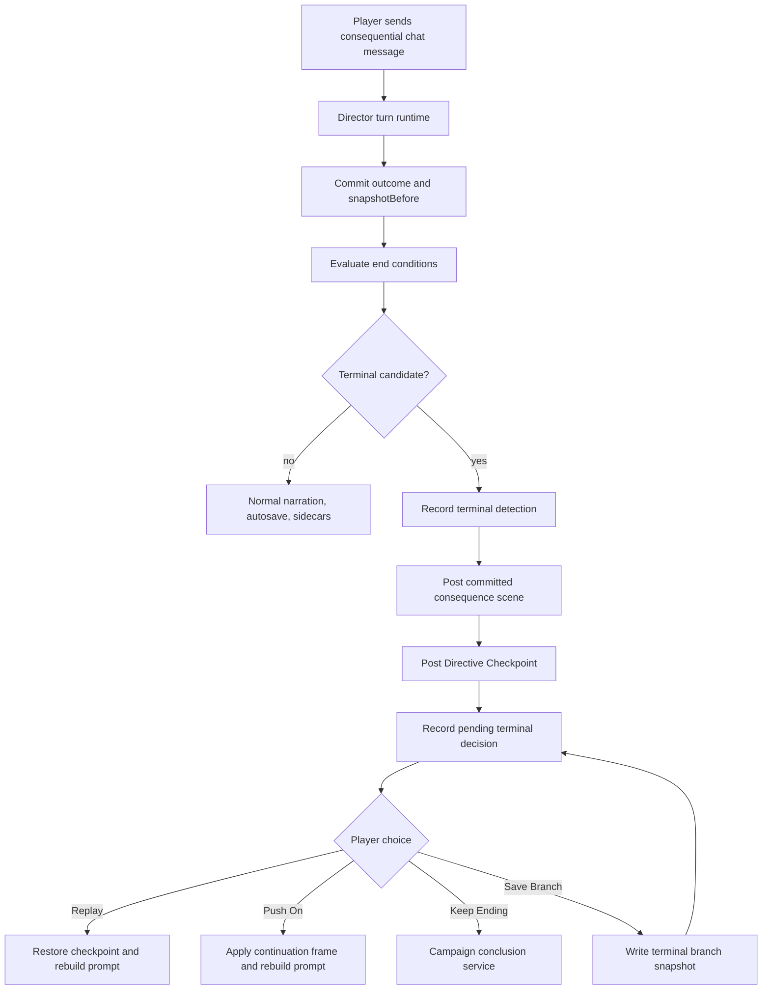

# Campaign End Conditions Implementation Plan

## Status

This is the full-system implementation plan for campaign end conditions. It turns the product contract in [Campaign End Conditions](../design/CAMPAIGN_END_CONDITIONS.md) into package schema, Ashes of Peace data, runtime services, chat and Mission controls, save branching behavior, conclusion metadata, and verification coverage.

Directive is pre-alpha, so this plan updates the package spine in place. There is no legacy compatibility layer for packages that omit end conditions once this work lands.

## Goal

Directive should treat severe branch-ending events as player-facing checkpoint decisions:

- the terminal event commits as real for that timeline;
- the player sees the consequence first;
- Directive posts a checkpoint decision in chat;
- the player can replay from checkpoint, push on, keep the ending, or preserve the terminal timeline as a branch;
- accepted endings record a final campaign band and ending-axis metadata;
- continuations preserve the severe event instead of undoing it.

The whole system is not complete until authored completion, catastrophic failure, player death, command removal, ship loss, objective collapse, player-choice endings, replay, push-on, branch preservation, conclusion, prompt rebuild, UI rendering, and hidden-state safety are all covered.

## Architectural Decision

Add `endConditions` as a formal top-level campaign-package root.

Rationale:

- end conditions are package-owned story contract data, not incidental runtime state;
- they need cross-cutting references to arcs, quests, world tracks, ship state, crew roles, guardrails, and ending profiles;
- validators need to reject hidden leaks in player-facing copy before a package ships;
- runtime should load one normalized end-condition contract instead of scraping source notes;
- pre-alpha lets us update the current package spine directly.

The package root should be required by `schemas/campaign-package.schema.json` and by `tools/scripts/validate-campaign-package.mjs` after Ashes has full records.

## Existing Primitives To Reuse

Use the existing runtime spine instead of building parallel recovery machinery:

- `src/campaign/transaction-state.mjs` already records `snapshotBefore` for committed Director turns and can delete or restore an outcome from that snapshot.
- `src/runtime/state-delta-gateway.mjs` already stores `runtimeTracking.pendingInteractions`, bounded snapshots, and recovery journals.
- `src/runtime/runtime-app.mjs` already exposes `saveCurrentGameAs`, `deleteCommittedOutcome`, `concludeCampaign`, prompt rebuild, and chat-native action routing.
- `src/runtime/campaign-conclusion-service.mjs` already commits conclusion mechanics before final narration and clears prompt injection after completion.
- `src/ui/mission-panel.js` already displays pending chat interaction cards.
- `src/ui/campaign-panel.js` already owns Records and manual branch controls.
- `tools/scripts/run-alpha-gate.mjs` already covers transaction, branch, recovery, package validation, prompt safety, and conclusion tests.

## Target Package Contract

### Root Shape

Add a required package root:

```json
{
  "endConditions": {
    "version": 1,
    "defaultCheckpointPolicy": {},
    "resultBands": {},
    "continuationFrames": [],
    "conditions": []
  }
}
```

Required subdomains:

- `version`: schema version for end-condition data.
- `defaultCheckpointPolicy`: fallback checkpoint and branch behavior for package conditions.
- `resultBands`: package wording and mapping for final campaign bands.
- `continuationFrames`: authored push-on frames available to one or more conditions.
- `conditions`: authored completion records and terminal candidate records.

### Condition Record

Each condition should support:

- `id`: stable package-local id, such as `terminal.ashes.breck-destroyed-objective-saved`.
- `title`: player-safe short title.
- `family`: one of `authoredCompletion`, `playerDeath`, `commandRemoval`, `shipOrBaseLoss`, `objectiveCollapse`, `playerChoice`, `packageSpecific`.
- `severity`: one of `completion`, `terminalCandidate`, `terminal`.
- `priority`: deterministic ordering when multiple conditions match.
- `modePolicy`: allowed behavior in `Exploration` and `Command`.
- `trigger`: deterministic predicate tree.
- `fairWarning`: visible-risk and causal-setup requirements.
- `checkpointPolicy`: preferred replay source, fallback replay source, and snapshot retention expectations.
- `resolutionPolicy`: which actions are available.
- `pushOnPolicy`: whether push-on is allowed, conditional, or unavailable.
- `continuationFrameIds`: authored frame ids available to push-on.
- `defaultTerminalOutcomeBand`: local severity of the terminal event.
- `finalCampaignBandRules`: accepted-ending band mapping.
- `endingAxisEffects`: updates or interpretations for package ending axes.
- `playerFacingSummary`: short safe reason for the checkpoint message.
- `directorNotes`: hidden adjudication notes that never enter player-facing copy.

### Predicate Model

The predicate evaluator should be deterministic and data-only. Supported predicate nodes should include:

- `all`, `any`, `none`, `not`;
- `questStatus`;
- `attentionFlag`;
- `campaignFlag`;
- `worldTrack`;
- `pressureRecord`;
- `shipState`;
- `actorStatus`;
- `crewStatus`;
- `playerStatus`;
- `campaignStatus`;
- `turnResultBand`;
- `lastOutcomeTag`;
- `eventObserved`;
- `mode`;
- `customPackageSignal`.

Validators must reject unknown refs where the package can know the ref at validation time. Runtime evaluation should fail closed with a diagnostic for malformed package predicates.

### Continuation Frame Record

A continuation frame defines how `Push On` remains playable:

- `id`;
- `title`;
- `summary`;
- `authorityModel`;
- `playableRole`;
- `requiredPlausibilitySignals`;
- `stateEffects`;
- `promptContextAdjustments`;
- `uiNotes`;
- `disallowedIf`;
- `playerFacingStartCopy`;
- `directorNotes`.

Examples for Ashes:

- `court-martial-and-inquiry`;
- `relieved-but-advising`;
- `survivors-after-breck-loss`;
- `allied-command-frame`;
- `aftermath-resistance`.

## Runtime State Contract

Add durable runtime tracking for end-condition decisions:

```json
{
  "runtimeTracking": {
    "endConditionLedger": {
      "schemaVersion": 1,
      "activeDecisionId": null,
      "detections": [],
      "decisions": [],
      "branchRecords": [],
      "continuationFrames": []
    }
  }
}
```

`detections` record every matched condition, including superseded matches. `decisions` record pending and resolved player checkpoint decisions. `branchRecords` record terminal timeline branch saves. `continuationFrames` record accepted push-on frames.

The pending interaction should remain the UI-facing pause:

```json
{
  "kind": "terminalOutcomeDecision",
  "status": "pending",
  "outcomeId": "outcome-123",
  "prompt": "Directive Checkpoint",
  "options": [
    { "action": "replayFromCheckpoint", "label": "Replay from checkpoint" },
    { "action": "pushOn", "label": "Push On" },
    { "action": "keepEnding", "label": "Keep this ending" },
    { "action": "saveTerminalBranch", "label": "Save as branch" }
  ],
  "metadata": {
    "terminalOutcomeId": "terminal.ashes.breck-destroyed-objective-saved",
    "terminalOutcomeBand": "Great Failure",
    "finalCampaignBandCandidate": "Partial Success",
    "checkpoint": { "source": "preOutcomeSnapshot", "outcomeId": "outcome-123" }
  }
}
```

Pending interaction metadata must be player-safe by default. Hidden details live in `endConditionLedger` records and diagnostics, not in visible prompt text.

## Runtime Services

### Pure Campaign Module

Create `src/campaign/end-conditions.mjs` for deterministic mechanics:

- normalize package `endConditions`;
- evaluate predicate trees against committed campaign state;
- enforce mode policy;
- choose the highest-priority active condition;
- compute checkpoint source;
- compute terminal and final band candidates;
- derive available resolution actions;
- build a player-safe pending interaction;
- apply push-on continuation state effects;
- build conclusion metadata for accepted endings.

This module should be dependency-free and directly fixture-tested.

### Runtime Service

Create `src/runtime/campaign-end-condition-service.mjs` for host/runtime side effects:

- evaluate after Director mechanics commit;
- defer checkpoint posting until the committed scene response is posted or recovered;
- record the end-condition ledger update through tracked state;
- post the checkpoint decision to chat with an idempotency key;
- resolve pending terminal decisions;
- save terminal branches without unintentionally transferring active chat binding;
- restore replay checkpoints;
- call `campaign-conclusion-service.mjs` only when the player chooses `Keep this ending`;
- rebuild prompt context after replay or push-on;
- return a fresh view envelope for UI projections.

### Runtime App Wiring

Update `src/runtime/runtime-app.mjs` to:

- create the end-condition service beside the existing chat-native services;
- call detection after `commitProvisionalDirectorTurnRuntime`;
- call checkpoint posting after committed narration/response succeeds;
- expose `resolveTerminalOutcomeDecision`;
- route terminal pending-interaction replies before starting a new Director turn;
- block ordinary consequential turns while a terminal decision is pending, unless the input is a push-on argument or resolution command.

### Chat Turn Orchestrator Wiring

Update `src/runtime/chat-turn-orchestrator.mjs` so direct replies like these resolve the terminal decision:

- "replay";
- "roll back";
- "try again";
- "push on";
- "continue anyway";
- "keep the ending";
- "save this as a branch";

If the player argues for a continuation instead of using exact button text, classify that as `pushOn` with `playerArgument` attached. The service may select the best continuation frame or ask one clarification if multiple frames are plausible.

## Resolution Actions

### Replay From Checkpoint

Behavior:

1. Mark the terminal decision resolved as `replayed`.
2. Record a compact terminal-timeline recovery entry.
3. Restore from the retained pre-outcome snapshot when available.
4. If the turn snapshot is unavailable, fall back to latest stable autosave or package checkpoint.
5. Rebuild prompt context.
6. Post or surface a short replay acknowledgement.

Replay should not silently create a named save branch. The terminal timeline remains in the ledger. The player can choose `Save as branch` when they want a full branch save.

### Save As Branch

The current `saveCurrentGameAs` action transfers the active chat binding to the new branch. Terminal preservation needs a lower-level branch snapshot operation:

- add a controller method that writes a branch save for a supplied campaign state without changing the active chat binding;
- use it for `saveTerminalBranch`;
- record branch id, parent save id, divergence outcome id, terminal outcome id, and branch reason;
- keep the terminal decision pending after the branch is saved.

The normal Records `Save Game As...` behavior should remain a branch transfer because that is the right user model outside terminal preservation.

### Keep This Ending

Behavior:

1. Mark the terminal decision resolved as `keptEnding`.
2. Build conclusion metadata:
   - `terminalOutcomeId`;
   - `terminalOutcomeBand`;
   - `finalCampaignBand`;
   - `endingAxisResults`;
   - `acceptedResolution: keepEnding`;
   - `sourceOutcomeId`.
3. Call `concludeCampaign`.
4. Include final-band and terminal-context fields in `campaign.conclusion` and `conclusion`.
5. Clear prompt injection through the existing conclusion service.

The final recap can use the accepted ending metadata, but must use player-safe projections only.

### Push On

Behavior:

1. Validate push-on is allowed or conditionally plausible.
2. Select an authored continuation frame.
3. Mark the terminal decision resolved as `pushedOn`.
4. Apply continuation frame state effects through tracked state.
5. Preserve the terminal event as true.
6. Record active continuation frame metadata.
7. Rebuild prompt context with changed authority, role, ship/base, mission, and risk framing.
8. Post a short continuation transition message.

Push-on must not:

- restore destroyed assets;
- pretend legal consequences disappeared;
- preserve impossible player authority;
- erase crew deaths or civilian catastrophe;
- reveal hidden trigger details.

## Package And Ashes Work

### Schema Files

Add or update:

- `schemas/campaign-package.schema.json`;
- `schemas/endings/end-conditions.schema.json`;
- `schemas/endings/end-condition-predicate.schema.json`;
- `schemas/endings/continuation-frame.schema.json`;
- `tools/scripts/lib/directive-contracts.mjs`;
- `tools/scripts/validate-campaign-package.mjs`.

The strict top-level package spine must include `endConditions`.

### Ashes Package Records

Add a complete Ashes end-condition inventory to `packages/bundled/breckenridge/ashes-of-peace.campaign-package.json`:

- `completion.ashes.terms-we-keep-resolved`;
- `terminal.ashes.player-death-command`;
- `terminal.ashes.permanent-command-removal`;
- `terminal.ashes.breck-destroyed-objective-failed`;
- `terminal.ashes.breck-destroyed-objective-saved`;
- `terminal.ashes.breck-lost-survivors-continue`;
- `terminal.ashes.nightfall-catastrophe`;
- `terminal.ashes.reach-legitimacy-collapse`;
- `terminal.ashes.farwatch-buries-accountability`;
- `terminal.ashes.compact-civilian-catastrophe`;
- `terminal.ashes.player-resignation-or-retirement`;
- `terminal.ashes.player-choice-conclude`.

Each record must map to existing Ashes axes:

- `ending.operational`;
- `ending.political`;
- `ending.accountability`;
- `ending.crew`.

Each record must define fair-warning, checkpoint, push-on, final-band, and player-facing copy.

### Ashes Continuation Frames

Add these authored frames:

- `court-martial-and-inquiry`;
- `relieved-but-advising`;
- `survivors-after-breck-loss`;
- `allied-command-frame`;
- `aftermath-resistance`;
- `medical-survival-and-command-gap`;
- `retired-but-testifying`.

Each frame must say what the player can still decide, who recognizes their authority, which package systems remain active, and how prompt context changes.

## Prompt Context And Hidden-State Safety

Update the player-safe prompt context builder so active terminal decisions and push-on frames expose only:

- visible terminal reason;
- available player choices;
- accepted continuation frame summary;
- final-band wording when accepted;
- changed public authority or ship/base status.

Do not expose:

- hidden clocks;
- unrevealed actors;
- raw predicate ids;
- Director-only notes;
- numeric hidden scores;
- alternate ending rules the player has not triggered.

Add prompt-injection tests proving terminal pending interactions and continuation frames cannot leak hidden predicate data.

## UI And Host Behavior

### Chat

The checkpoint offer appears in chat after the committed consequence scene. The message should use the host's action buttons when available, but must degrade to plain text commands.

Required response kinds:

- `terminalOutcomeCheckpoint`;
- `terminalOutcomeReplayAcknowledgement`;
- `terminalOutcomeBranchSaved`;
- `terminalOutcomePushOn`;
- `terminalOutcomeKeptEnding`.

Every chat post must use idempotency keys based on the terminal decision id.

### Mission

Update the pending interaction card in `src/ui/mission-panel.js` to render terminal decisions as a first-class state:

- terminal band;
- safe reason;
- checkpoint source;
- Replay from checkpoint;
- Push On;
- Keep this ending;
- Save as branch;
- saved terminal branch metadata when present.

Do not bury this under generic recovery controls. This is the current campaign state until the player resolves it.

### Campaign Records

Update `src/ui/campaign-panel.js` so Records can show terminal branches with branch reason and source terminal outcome. It should distinguish:

- ordinary Save Game As branch;
- terminal timeline branch;
- replay-restored active branch;
- completed ending save.

### Host Adapters

Update host bridges to expose the new runtime actions:

- `resolveTerminalOutcomeDecision`;
- `saveTerminalOutcomeBranch` if it remains separate;
- any required Lumiverse bridge action mappings.

SillyTavern should support plain chat resolution even if button rendering is unavailable.

## Data Flow



## Test Plan

### Schema And Package

Add tests that prove:

- `endConditions` is required by the package spine;
- every condition id is unique;
- every continuation frame id is unique;
- condition refs to quests, tracks, actors, crew, and axes are valid;
- player-facing copy does not contain hidden markers;
- Ashes has all required terminal families;
- malformed predicates fail validation.

### Pure Evaluator

Add `tools/scripts/test-end-condition-evaluator.mjs` covering:

- authored completion;
- player death in `Command`;
- player death softened in `Exploration`;
- command removal;
- ship loss with objective failed;
- ship loss with objective saved;
- objective collapse;
- player-choice ending;
- multiple matches resolved by priority;
- hidden malformed condition fails closed.

### Runtime Service

Add `tools/scripts/test-campaign-end-condition-service.mjs` covering:

- detection after mechanics commit;
- checkpoint message after committed response;
- no checkpoint message before narration recovery;
- pending interaction payload shape;
- replay restore from pre-outcome snapshot;
- replay fallback when snapshot is absent;
- terminal branch save without active binding transfer;
- push-on frame application;
- keep-ending conclusion metadata;
- idempotent retry of checkpoint chat post.

### Chat-Native Flow

Update or add tests for:

- terminal pending replies resolve before a new Director turn starts;
- free-text push-on argument is captured;
- unresolved terminal decision blocks ordinary consequential turns;
- Mission card actions and chat replies produce the same runtime result.

### UI Contract

Update visual/product tests so:

- Mission renders terminal decision controls;
- Campaign Records marks terminal branches;
- generic pending cards do not expose hidden ids;
- host action lists include terminal decision actions.

### Live Verification

Extend the SillyTavern smoke path with an opt-in terminal decision scenario:

- start a fresh Ashes campaign;
- inject or trigger a deterministic terminal candidate through a test-only fixture path;
- prove chat posts the consequence and checkpoint decision;
- save terminal timeline as a branch;
- replay from checkpoint;
- reload the branch from Records;
- push on from a fresh terminal candidate;
- keep an ending from a fresh terminal candidate;
- confirm prompt context is rebuilt for each path.

## Build Sequence

### Stage 1: Schema And Package Spine

Deliver:

- formal `endConditions` schemas;
- package spine updated;
- validator updated;
- authoring docs aligned from proposed to required;
- Ashes placeholder records sufficient to keep validation strict.

Acceptance:

- package validation fails without `endConditions`;
- Ashes validates with the new root;
- alpha gate passes.

### Stage 2: Full Ashes Authoring Pass

Deliver:

- full Ashes terminal candidate inventory;
- full Ashes continuation frame inventory;
- ending-axis mappings;
- final-band rules;
- player-facing checkpoint copy;
- Director-only edge-case notes.

Acceptance:

- validator proves every terminal family is represented;
- docs and Ashes package agree on condition ids;
- no player-facing field contains hidden-state language.

### Stage 3: Pure End-Condition Engine

Deliver:

- `src/campaign/end-conditions.mjs`;
- predicate evaluator;
- priority resolver;
- mode-policy handling;
- checkpoint resolver;
- pending interaction builder;
- continuation frame applier;
- conclusion metadata builder.

Acceptance:

- pure evaluator fixtures pass all terminal families;
- no runtime host dependency exists in the pure module.

### Stage 4: Runtime Service And Commit Hook

Deliver:

- `src/runtime/campaign-end-condition-service.mjs`;
- runtime app wiring after Director commit;
- checkpoint post after committed scene response;
- pending interaction persistence;
- idempotent checkpoint posting;
- replay, keep-ending, save-branch, and push-on action handlers.

Acceptance:

- fake-host runtime tests prove all four resolution actions;
- checkpoint does not post before committed consequence scene;
- conclusion service owns final completion.

### Stage 5: Branch Preservation And Prompt Rebuild

Deliver:

- lower-level terminal branch snapshot save;
- branch metadata extensions;
- prompt rebuild after replay and push-on;
- conclusion metadata extension;
- save index rendering fields.

Acceptance:

- terminal branch save does not steal active chat binding;
- replay restores the checkpoint and keeps a recovery trace;
- push-on prompt context reflects the new playable premise.

### Stage 6: Chat, Mission, Records, And Host Actions

Deliver:

- terminal checkpoint chat response kinds;
- terminal pending card in Mission;
- terminal branch labels in Records;
- SillyTavern and Lumiverse action mappings;
- free-text pending resolution.

Acceptance:

- button and text paths resolve the same decision;
- Mission is clear without becoming a separate play surface;
- unresolved terminal decision is visible from Mission and chat.

### Stage 7: End-To-End Verification

Deliver:

- schema, evaluator, runtime, UI, chat-native, and prompt-safety tests;
- alpha gate update;
- opt-in SillyTavern smoke scenario;
- docs updated from planned to implemented.

Acceptance:

- `node tools/scripts/run-alpha-gate.mjs` passes;
- live SillyTavern terminal scenario passes when enabled;
- user-facing docs describe the actual behavior, not future tense.

## Definition Of Done

The feature is complete when:

- every campaign package must define `endConditions`;
- Ashes defines authored completion and all major terminal families;
- terminal events commit before the checkpoint offer;
- the checkpoint offer appears in chat;
- Mission mirrors the decision clearly;
- Replay restores a checkpoint;
- Save as branch preserves the terminal timeline without unintended active binding transfer;
- Push On installs an authored continuation frame and preserves the severe event;
- Keep Ending records final campaign band, terminal band, and ending-axis data;
- campaign conclusion remains idempotent and clears prompt context;
- hidden trigger data never appears in player-facing copy;
- branch, replay, and push-on survive save/load;
- tests cover the full system;
- live host smoke proves the behavior in SillyTavern.

## Non-Goals

- No backward compatibility for packages without `endConditions`.
- No hard game-over state that bypasses checkpoint decision.
- No generic "continue anyway" that erases the committed consequence.
- No model-only terminal detection without deterministic package predicates.
- No hidden-state or raw predicate display in chat, Mission, Records, or conclusion prompts.

## Open Decisions To Close During Build

- Whether `Save as branch` should allow a custom branch name from the terminal card, or initially use generated names.
- Whether `Push On` should preview the selected continuation frame before accepting when multiple frames match.
- Whether terminal checkpoint posts should include host-native buttons in the first implementation or rely on Mission buttons plus plain chat text.
- How many terminal branch records should remain in `endConditionLedger`.
- Whether package authors can mark `pushOnPolicy.allowed` as `never`, or whether the runtime should always allow a Director-mediated player argument in pre-alpha.
