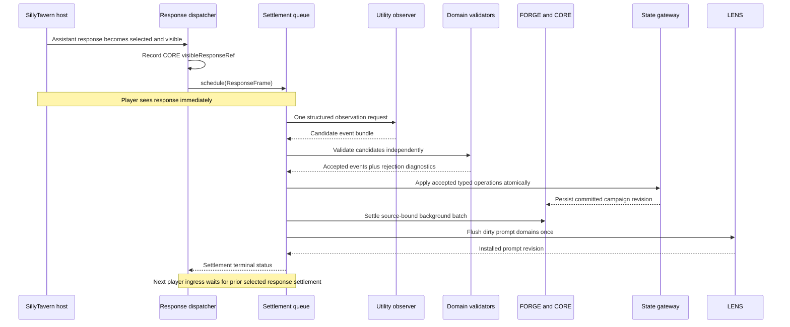

# Post-Visible Settlement Pipeline Design

**Status:** Approved design

**Date:** 2026-07-20

**Scope:** Replace fragmented narrative-derived tracking with one automatic, source-bound settlement boundary after every visible assistant response. The first authoritative migration covers scene time and mission state. Narrative threads and Command Log extraction join the same observation call; ship, relationship, and pressure adapters follow behind the same contract.

## Problem

Directive currently decides and records related facts at different moments:

- player intent and mechanics are adjudicated before narration;
- Directive responses and host-native continuations record visibility through different callbacks;
- host-native scene time may wait until the next player turn;
- narrative threads run through a Directive-only post-commit processor;
- Scene Handshake, sidecars, and domain-specific jobs independently reinterpret overlapping text;
- headers and countdown prose can therefore disagree with committed campaign time.

This is brittle because no single operation owns the transition from "this response became visible" to "all narrative-derived state for this response has settled." A model may correctly narrate that 12 minutes passed while the clock remains at 0900 because the prose and the authoritative state were observed and committed through different paths.

Adding more lexical triggers is not an acceptable repair. Phrases such as "we spend the week" can be dialogue, a thought, a plan, a quotation, a counterfactual, or an actual scene transition. Meaning must be interpreted in context.

## Decision

Every selected assistant response automatically schedules one hidden post-visible settlement. The settlement receives one immutable `ResponseFrame`, makes one structured Utility-model observation call, validates each proposed domain event deterministically, commits all accepted operations through the existing CORE/FORGE boundary, and performs one LENS prompt refresh.

There is no player confirmation, acceptance prompt, modal, or visible pause. "Accepted" means accepted by deterministic validators, not accepted by the player.

The system is one post-visible boundary, not one monolithic state writer:

- the observer interprets visible meaning;
- domain validators decide whether evidence is sufficient;
- domain reducers construct authorized operations;
- `stateDeltaGateway` applies state operations;
- CORE records source binding, idempotency, effects, and diagnostics;
- FORGE coordinates the background batch;
- LENS rebuilds player-safe prompt context once after settlement.

## Goals

- Settle narrative-derived time and mission state before the next player ingress is adjudicated.
- Cover both Directive-authored responses and host-native continuations.
- Interpret meaning without hardcoded statement-based time triggers.
- Keep mechanics and formal outcomes authoritative over narration.
- Make duplicate callbacks, swipes, edits, deletes, retries, and stale responses safe.
- Consolidate overlapping model work so model-call cost is flat or lower after migration.
- Preserve immersion: settlement is automatic and normally invisible.

## Non-Goals

- The observer does not roll dice, spend resources, apply damage, choose outcomes, or invent mission facts.
- The observer does not rewrite visible prose after it has been posted.
- The observer does not expose hidden clocks, private NPC facts, provider reasoning, or raw prompts.
- This design does not impose a deterministic one- or two-minute floor on every reply. Time pressure is represented by evidence-backed elapsed time and campaign-owned pressure rules, not a universal conversational tax.
- The first implementation does not make ship, relationship, and pressure mutations authoritative. It establishes adapters and shadow diagnostics for those domains before their later migration.

## Authority Model

| Concern | Authority | Observer role |
| --- | --- | --- |
| Player action result, rolls, damage, resources | Existing foreground adjudication and mechanics commit | May reference committed outcome; cannot change it |
| Explicit operator command in player input | Utility Turn Arbiter plus deterministic command validator | Does not reinterpret it |
| Elapsed scene time expressed or implied by visible response | Time settlement validator and reducer | Proposes evidence-backed elapsed time |
| Mission discovery/progress/blocking/completion | Mission settlement validator and reducer | Proposes event against known ids and visible evidence |
| Phase transition | Mission Director / strict phase validator | May suggest only |
| Threads and Command Log candidates | Existing domain reducers, moved behind common observation | Proposes candidates |
| Prompt context | LENS | Supplies dirty-domain list only |

The model never emits arbitrary JSON Patch operations. It emits typed candidate events. Reducers translate accepted events into operations with hardcoded root allowlists.

## Runtime Sequence



Visibility is not blocked on the Utility call. The next player ingress is the synchronization barrier. This preserves response latency while preventing a subsequent turn from reading stale time or mission state.

## ResponseFrame Contract

`ResponseFrame` is a player-safe, immutable snapshot built only after CORE has recorded the selected visible response.

```js
{
  kind: 'directive.postVisibleResponseFrame.v1',
  schemaVersion: 1,
  frameId: 'post-visible:txn:abc:response:def:sha256...',
  transactionId: 'txn:abc',
  campaignId: 'campaign-123',
  saveId: 'save-456',
  chatId: 'chat-789',
  source: {
    ingressId: 'ingress:abc',
    sourceFrameId: 'source:abc',
    playerHostMessageId: '42',
    playerTextHash: 'sha256...',
    playerText: 'Bring us alongside and begin rescue operations.'
  },
  response: {
    responseId: 'response:def',
    hostMessageId: '43',
    kind: 'hostContinue',
    selectedTextHash: 'sha256...',
    selectedText: 'Twelve minutes later, Hesperus is secured...'
  },
  committed: {
    outcomeId: 'outcome-12',
    turnId: 'turn-12',
    stateRevision: 81,
    mechanicsRevision: 19,
    outcomeSummary: { resultBand: 'mixed' }
  },
  scene: {
    dateTime: '2187-04-03T09:00:00.000Z',
    locationId: 'hesperus-approach',
    countdowns: [{ id: 'reactor-window', remainingMinutes: 41 }]
  },
  mission: {
    missionId: 'ashes-prelude',
    phaseId: 'hesperus-rescue',
    objectiveIds: ['stabilize-reactor', 'evacuate-passengers'],
    assignmentIds: ['rescue-detail']
  },
  transcript: {
    messages: [
      { role: 'user', id: '42', text: '...', textHash: 'sha256...' },
      { role: 'assistant', id: '43', text: '...', textHash: 'sha256...' }
    ]
  },
  createdAt: '2026-07-20T18:00:00.000Z'
}
```

The frame excludes raw system prompts, provider payloads, provider reasoning, hidden mission truth, raw relationship/pressure values, cookies, CSRF tokens, API keys, and unselected swipe text.

## Observation Contract

The new generation role is `postVisibleSettlementObserver`. It uses the Utility provider, structured JSON, a 30-second timeout, fail-soft behavior, and no direct state authority.

```js
{
  kind: 'directive.postVisibleObservation.v1',
  schemaVersion: 1,
  frameId: 'post-visible:txn:abc:response:def:sha256...',
  responseTextHash: 'sha256...',
  time: {
    status: 'elapsed',
    elapsedMinutes: 12,
    confidence: 0.98,
    evidence: [{ start: 0, end: 20, textHash: 'sha256...' }],
    interpretation: 'The narration advances from approach to secured alongside.'
  },
  missionEvents: [
    {
      type: 'objectiveProgressed',
      targetId: 'stabilize-reactor',
      confidence: 0.94,
      evidence: [{ start: 22, end: 71, textHash: 'sha256...' }],
      dedupeKey: 'objectiveProgressed:stabilize-reactor:sha256...'
    }
  ],
  assignmentEvents: [],
  discoveryEvents: [],
  threadCandidates: [],
  commandLogCandidates: [],
  shipCandidates: [],
  relationshipCandidates: [],
  pressureCandidates: []
}
```

Every non-empty candidate requires:

- the exact `frameId` and selected response hash;
- one or more bounded evidence spans into selected visible text;
- a known target id when mutating an existing entity;
- confidence in `[0, 1]`;
- a stable dedupe key derived from event type, target, and response hash.

The observer may return `status: 'none'` or `status: 'ambiguous'`. Ambiguity is not converted into deterministic elapsed time.

## Time Settlement

The time observer answers a semantic question: what elapsed time became true in the world represented by the selected response?

It distinguishes:

- actual narrated progression;
- quoted speech or written text;
- thoughts, plans, promises, and counterfactuals;
- estimates and deadlines;
- durations of sub-actions already contained by a larger montage;
- countdown changes that imply elapsed time;
- continuation text that merely restates time already committed by the player-side compression.

The validator accepts elapsed time only when all checks pass:

1. Frame and response hashes match the current selected response.
2. Evidence spans resolve exactly inside selected text.
3. `elapsedMinutes` is a positive integer within campaign safety bounds.
4. The candidate is not merely dialogue, thought, plan, hypothetical, estimate, or deadline.
5. Countdown deltas are internally consistent when the response gives both before/after values.
6. The same source pair has not already committed equivalent elapsed time.
7. The candidate does not conflict with a foreground mechanics time commit.

The reducer emits only authorized scene-time operations. Headers, clocks, and countdown displays are derived from the newly committed state. For the Ashes example, a response that changes a reactor report from 53 minutes remaining to 41 minutes remaining produces a 12-minute commit; the next header must render 0912, not 0900.

### Consecutive compression dedupe

Player-side operator compression and model continuation may both express the same jump. Dedupe is source-semantic, not phrase-based:

- store `timeSettlementRef` with source frame, response hash, prior scene time, committed scene time, and evidence hash;
- compare a candidate against time already committed in the same transaction/source pair;
- reject a continuation candidate when it describes the already-committed interval rather than a second interval;
- accept an additional interval only when evidence establishes a later boundary.

## Mission Settlement

Supported initial event types:

- `factDiscovered`
- `objectiveProgressed`
- `objectiveBlocked`
- `objectiveCompleted`
- `assignmentCreated`
- `assignmentChanged`
- `deadlineEstablished`
- `missionRiskChanged`
- `phaseTransitionSuggested`

Validation is event-specific:

- target ids must exist unless the event type explicitly creates an assignment;
- visible evidence must support the proposed event;
- narration cannot overwrite mechanics or reverse a formal outcome;
- completion requires objective-owned completion criteria or a committed outcome reference, not confident prose alone;
- phase transitions remain suggestions until the Mission Director's phase validator accepts them;
- discoveries may record player-visible facts but cannot reveal hidden truth absent visible evidence;
- one rejected event does not discard valid events in other domains.

Mission reducers produce the existing mission/quest/thread operation shapes. The observer does not receive or emit arbitrary paths.

## Queue, Idempotency, and Atomicity

There is one FIFO settlement lane per `{campaignId, saveId, chatId}`.

- Scheduling is idempotent on `{transactionId, responseId, selectedTextHash}`.
- A duplicate visible callback returns the existing queued/running/settled result.
- The next player ingress awaits terminal settlement for the currently selected prior response.
- UI-only callbacks and unrelated chats do not wait.
- Accepted domain operations apply to one cloned state and persist as one revision.
- CORE receives one background batch containing accepted effect refs and per-domain rejection diagnostics.
- LENS flushes once using the union of dirty domains.

If the observer times out or fails, the response remains visible, the queue records a retryable failure, and ingress waits only for the bounded retry policy. After one retry, ingress proceeds with a diagnostic marker rather than hanging indefinitely. Time/mission state remains unchanged on failure.

## Source Mutation

Swipes, edits, and deletes are source changes, not ordinary duplicate callbacks.

1. Invalidate settlement by `responseId` plus old selected text hash.
2. Restore or replay from the revision before that settlement using existing REPAIR/state revision mechanisms.
3. Build a new frame for the newly selected response variant.
4. Run settlement again and install one corrected prompt revision.

A late provider result for an invalidated hash is rejected before validation and again immediately before commit. Settlement diagnostics retain hashes and statuses, not raw provider output.

## Failure and Contradiction Policy

| Condition | Result |
| --- | --- |
| Invalid JSON | One constrained retry; otherwise no state change |
| Stale response hash | Reject whole observation as stale |
| Unknown mission target | Reject that event only |
| Unsupported time evidence | Reject time event only |
| Mechanics conflict | Keep mechanics; record contradiction diagnostic |
| State revision changed only in tracking domains | Revalidate against current state and rebase once |
| Mechanics revision changed | Reject and reschedule from a fresh frame |
| Persist failure | Do not mark CORE batch applied; open recovery diagnostic |
| LENS failure after state commit | Keep committed state; retry prompt synchronization |

## Model-Call Consolidation

The value is worth the cost only if this is a consolidation, not an additional permanent layer.

The first production migration replaces:

- accepted-pair host-native time settlement;
- post-commit narrative-thread extraction for the same response;
- overlapping mission interpretation in Scene Handshake;
- Command Log candidate interpretation that can be derived from the same visible pair.

Foreground mechanics calls remain. Enrichment that needs specialized hidden/domain context remains asynchronous. During shadow rollout both old and new observers may run for comparison, but production authority must never be duplicated and shadow mode has an explicit removal gate.

Target steady-state model cost is one Utility observation call per visible assistant response, replacing at least one overlapping call on eligible turns. Telemetry must report old-call equivalents, observer calls, retries, latency, and accepted/rejected event counts.

## Migration

### Phase 1: Foundation and shadow observation

- Add frame, observation, validator, coordinator, queue, role, and diagnostics contracts.
- Schedule from both Directive and host-native visible-response callbacks.
- Run observation in shadow mode; commit nothing.
- Replay Ashes fixtures and compare proposals with expected state transitions.

### Phase 2: Time and mission authority

- Enable time and mission reducers.
- Disable accepted-pair host-native time mutation and overlapping Scene Handshake mission mutation.
- Retain those modules only as diagnostic comparators until the release gate passes.
- Make player ingress await the prior selected-response settlement.

### Phase 3: Thread and Command Log consolidation

- Route existing thread and command-log candidate handling through the common observation result.
- Retire the separate post-commit narrative extraction call and redundant summary interpretation.

### Phase 4: Additional domains

- Add ship, relationship, and pressure validators one domain at a time.
- Each domain requires fixtures, authority rules, shadow comparison, and a retirement target before becoming authoritative.

## Observability

Per settlement, record:

- frame id and source/response hashes;
- queue latency, provider latency, validation latency, commit latency, and LENS latency;
- provider attempt count and terminal status;
- candidate, accepted, rejected, duplicate, and stale counts by domain;
- base and committed state/mechanics revisions;
- CORE background batch id and LENS prompt revision;
- rejection reason codes without raw prompts or raw provider output.

The UI may expose these in developer diagnostics, but ordinary players see no settlement status.

## Acceptance Criteria

- Every selected Directive and host-native response produces at most one authoritative settlement.
- The next player ingress cannot adjudicate against an unsettled prior selected response, except after bounded fail-soft exhaustion.
- Ashes countdown and header time remain derived from the same committed scene-time state.
- Dialogue, thoughts, plans, quotes, estimates, and hypotheticals containing durations do not advance time without actual world progression.
- Duplicate callbacks cannot double-advance time or mission state.
- A swipe/edit/delete cannot leave mutations from the old selected response active.
- Narration cannot override committed mechanics or complete objectives without required evidence.
- The full alpha gate passes, and live non-human soak proves both response routes.
- Steady-state eligible turns do not increase the number of semantic tracking calls after old paths are retired.
