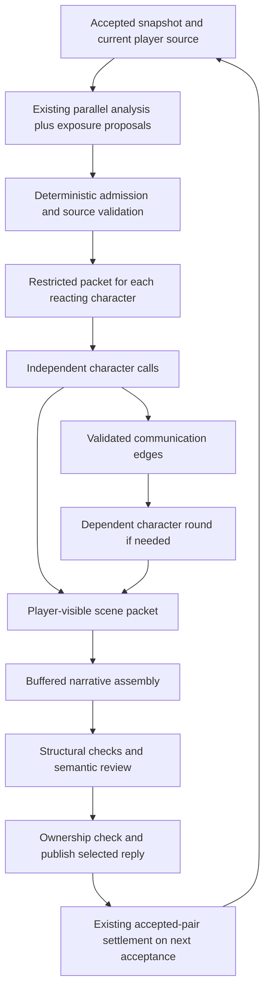

# Character knowledge boundaries

**Status:** Proposed design; no runtime implementation in this change.

**Date:** 2026-09-19

**Source baseline:** Directive `5b6a04cd5f5992171645cad67ed7b883eb9dbf2b`.

**Implementation plan:** [Task-by-task plan](../plans/2026-09-19-character-knowledge-boundaries.md).

## 1. Outcome

Characters should act intelligently from what they have experienced, been told, read, or reasonably inferred. A private conversation elsewhere must not silently become their knowledge because the writing model saw it. False reports must remain possible, expertise must remain useful, and disclosures within a reply must have a causal order.

We will retain the continuity archive as the authority for acquired information, compile restricted inputs for individual characters, generate their contributions separately, and assemble a buffered narrative from those contributions. A narrow reviewer checks the complete candidate before publication. This adds model calls deliberately, with explicit limits and measurement.

This is a containment architecture, not a claim of mathematically proving fictional knowledge. Deterministic checks can enforce source ownership, input separation, output structure, and exact insertion. Models still judge natural-language exposure, inference, and whether prose implies unsupported knowledge; those judgments need adversarial evaluation.

## 2. Why the current mechanism is insufficient

`createCharacterInformationProjection` in `src/story/character-information.mjs` correctly projects source-bound information access, but its default 4,000-character, eight-person, six-statement-per-person limits make it a summary. It cannot be treated as an exhaustive knowledge database.

`createV1RuntimePromptPacket` in `src/runtime/runtime-app.mjs` adds this projection and `CHARACTER_INFORMATION_POLICY` alongside accepted story, working story, direction, campaign, and other material. The narrator can still encounter private information in these surfaces or ordinary chat context. An instruction to forget it is weaker than excluding it from the character's request.

The live Bronn example illustrates the distinction: access records did not give him the private three-minute information, but the narrator used it in his response. Regenerating that reply repaired an instance, not the architecture. Nayar's earlier apparent access to a private plan belongs in the same regression family.

Output reliability is a separate, related problem. Large reasoning budgets can produce no visible content, and otherwise readable JSON can fail strict source-quote validation. Restricted inputs and source IDs reduce avoidable work; they do not justify weakening semantic validation or silently accepting empty output.

## 3. Lessons from Sonder

The reference inspected was `Sonder_Engine_Main` at `c0d9276d`, not the older `Sonder_Engine` checkout. Relevant seams are `agents/composer.py::render_view`, `agents/character.py::character_step`, `mind/memory_read.py::visible_memory_rows`, `mind/memory_lore_entries.py::knowledge_for_character`, and `agents/narration.py`'s dialogue substitution.

Useful principles are deterministic perception construction, character-owned memory, lore access checks, separate character generation, and exact dialogue insertion. Communication should disclose a message without granting remote visual perception. Sonder's mechanisms are precedents, not proof that all its narration is leak-free; its narrator also has contextual surfaces to consider.

Directive should adopt these boundaries using its existing accepted-pair and continuity machinery. We should not copy a second memory database, introduce a second campaign authority, or transplant Python services into the JavaScript runtime.

## 4. Requirements and decisions

| ID | Requirement / decision |
| --- | --- |
| K1 | Character requests contain only that character's admitted information, relevant authored competence, and explicitly permitted observations. Never raw shared history or hidden director plans. |
| K2 | Access means exposure, not truth, belief, agreement, certainty, or complete knowledge. Unknown access is unestablished, not a declaration of ignorance. |
| K3 | Continuity events and accepted-pair source custody remain authoritative. Retrieval indexes and generated packets are disposable projections. |
| K4 | An inference identifies accessible premises and stays an inference. A lie is deliberate speech, not a new world fact. |
| K5 | New disclosures follow validated audience and causal order. Same-reply knowledge stays provisional until that selected reply participates in settlement. |
| K6 | Dialogue and character contributions are checked before publication. Free prose cannot bypass the boundary through indirect speech, thought, anticipation, or an unexplained action. |
| K7 | Stop, Retry, Regenerate, swipes, source edits/deletions, chat changes, and reload cannot publish or preserve stale knowledge. |
| K8 | No role can bypass isolation through presets, world info, host history, retries, caches, or fallback transports. Check actual outbound messages. |
| K9 | Reliability improvements preserve evidence validation. Empty, reasoning-only, token-exhausted, malformed, and semantically invalid outputs remain distinct. |
| K10 | Calls, latency, token usage, retries, and quality are measurable. Only independent character reactions run in parallel. |
| K11 | Mission/objective/time/reward state changes still use existing validated reconciliation; character text and reviewer approval cannot commit them. |
| K12 | Existing saves load without fabricated access grants. Rollout is explicit and reversible without rewriting old story history. |

Initial protected mode uses at most three reacting NPCs, two causal rounds, four total character generations, and a concurrency of two. These are Advanced capacity controls, not fictional limits: when the scene requires more, pause or focus the reply on a smaller coherent beat. Never silently substitute unrestricted narration.

A semantic reviewer runs on every protected candidate containing character contributions or prose. Risk-based sampling is deferred until evaluation demonstrates that skipping reviews is acceptable. All protected output is buffered; no unreviewed token is streamed into the chat.

## 5. Data flow and ownership



Existing `createParallelTurnAnalysis` continues to analyze one immutable input snapshot. Character generation depends on its admitted results and therefore belongs in a subsequent coordinator, not another sibling in that initial `Promise.all`.

The coordinator owns one generation flight. It references the existing transcript/recovery owner and cancellation epoch, rather than creating a competing retry owner. Its identity includes binding, branch, accepted revision and state hash, source message/swipe/text hashes, gesture identity, configuration fingerprint, and packet digest. Reuse is permitted only when all relevant identity fields match.

The authoritative archive stores accepted events. The flight holds provisional packets, outputs, communication edges, and reviewer receipts. Published swipe metadata holds source-bound proposed disclosures and audit receipts pending accepted-pair validation. None of these projections can alter campaign state on their own.

## 6. Knowledge representation

Retain existing `informationAccess.recipientIds`, `acquisition` (`heard`, `observed`, `read`), audience evidence, event source anchors, and dependency IDs. Retain existing claim types, including `character-claim`, so hearing a false statement does not turn it into a narrated fact.

For compilation, normalize admitted records into a read-only view:

| Field | Meaning |
| --- | --- |
| `id`, `eventId`, `sourceIds` | Stable reference to accepted evidence or a flight-local disclosure. IDs do not contain the secret text. |
| `text`, `claimType` | Information as recorded, with its epistemic status. |
| `recipientIds`, `acquisition` | Who had established access and how. |
| `learnedAt` | Validated narrative position, not array order or retrieval rank. |
| `dependsOnIds` | Provenance needed to invalidate the record. |
| `status` | Current, superseded, or retracted. Superseded information may still be remembered as old information. |

Do not overwrite a character's old report when the world changes. Include both the old report and an accessible correction when established. An inaccessible correction must not update their belief. Acquired information and character belief are distinct; v1 records explicit expressed belief through source-backed continuity claims, without inventing a hidden numerical belief engine.

Authored background and professional competence enter through explicit authored access rules and stable authored references. A medic can know first aid without a transcript event for every skill. Being a medic does not reveal another person's secret diagnosis. Unknown biography, relationship secrets, dossier speculation, mission solutions, and director future plans are excluded.

### Restricted packet compiler: executable reference core

The following JavaScript is proposed code, not an existing API. It demonstrates the final allowlist after the archive adapter has checked source lineage and authored access. `candidates` must already be normalized by that adapter; trusting model-provided `recipientIds` here would defeat the design. The production compiler also retrieves task-relevant records and validates the packet schema.

```js
export function compileCharacterPacket({
  personId, identity, publicSituation, candidates,
  validSourceIds, beforeOrder, maxCharacters = 12000,
}) {
  if (!personId || !Number.isInteger(beforeOrder) || beforeOrder < 0) {
    throw new Error('knowledge_packet_invalid');
  }
  const admitted = candidates.filter(item =>
    item.recipientIds.includes(personId)
    && item.learnedAt < beforeOrder
    && item.status !== 'retracted'
    && item.sourceIds.length > 0
    && item.sourceIds.every(id => validSourceIds.has(id))
  );
  const packet = {
    kind: 'directive.characterPacket.v1',
    personId,
    identity: { name: identity.name, role: identity.role },
    situation: publicSituation,
    information: admitted.map(item => ({
      id: item.id,
      text: item.text,
      claimType: item.claimType,
      acquisition: item.acquisition,
      status: item.status,
    })),
  };
  if (JSON.stringify(packet).length > maxCharacters) {
    throw new Error('knowledge_packet_budget');
  }
  return packet;
}
```

`publicSituation` is an already validated, character-scoped perception packet, not the entire public chat. A shared chat can contain private scenes. Its scope must cover identity labels, task wording, timestamps, relationship descriptions, sensory descriptions, and any suggested response. A secret must not re-enter through “react to the captain's concealed plan.”

Retrieval runs over all eligible archive records, not the bounded `characterInformation` summary. It includes records needed for the current task, accessible corrections, and dependency closure. If required records cannot fit, return `knowledge_packet_budget`; do not silently truncate a premise or treat an omission as proof of ignorance. Token estimates must supplement the illustrative character cap in production.

## 7. Current player input and disclosure order

Player messages can mix speech, private thought, and physical action. Extend the existing continuity analyst output with source-referenced exposure proposals rather than adding an unconditional extraction call. Explicit host audience metadata takes precedence when available. Natural-language audience extraction remains probabilistic; ambiguous access stays unestablished.

An exposure proposal identifies source passage IDs, speaker, modality, proposed recipients, and a narrative position. Deterministic validation checks source membership, known identities, supported scene/channel membership, and ordering. Source membership alone does not prove that everyone nearby heard something: the analyst and reviewer must still check the passage's meaning.

A whispered conversation does not automatically disclose to everyone in the room. A radio recipient receives the transmission, not the sender's surroundings. A visible action is admitted only to established observers. A character's private thought is not ordinary narrator background for other characters.

Within one reply, model output proposes a small acyclic communication graph. The runtime validates IDs and edges, then assigns monotonically increasing positions. Round one may produce A's disclosure. Round two recompiles B's packet using that validated disclosure before B reacts. Independent speakers share a round; dependent speakers do not. Mutual conversation beyond the configured rounds becomes a later story beat.

Recipients are limited to the validated scene/channel audience. The character model cannot grant access to arbitrary offscreen people. Provisional edges are bound to exact generated contribution IDs and their text digests. The narrator cannot change a disclosure and retain its old authorization.

After publication, the next accepted-pair pass verifies the selected assistant source and converts eligible proposals through the existing continuity validator and reconciler. Discarded drafts, unselected swipes, and canceled flights contribute no accepted knowledge. Replay must reproduce the same admissions from persisted selected-source evidence.

## 8. Character contributions and inference

Each reacting NPC gets its own request. Never put multiple private packets in one shared conversation to save a call. A contribution contains a character ID, local contribution ID, speech or action, information basis IDs, and an epistemic mode: `recall`, `inference`, `question`, `ordinary`, or `deception`.

Use `ordinary` for routine visible behavior or professional competence, not as a blanket exemption. `inference` requires accessible premises and wording appropriate to uncertainty. `deception` permits a character to say something false; its audience learns that the statement was made, not that it is true. Deterministic validation verifies allowed IDs and structure; the reviewer judges whether the cited material supports the proposed knowledge or inference.

```js
export function validateContribution(value, packet) {
  const allowed = new Set(packet.information.map(item => item.id));
  const modes = new Set(['recall', 'inference', 'question', 'ordinary', 'deception']);
  if (!value || value.personId !== packet.personId
      || !['speech', 'action'].includes(value.kind)
      || !modes.has(value.mode)
      || typeof value.text !== 'string' || !value.text.trim()
      || !Array.isArray(value.basisIds)
      || !value.basisIds.every(id => typeof id === 'string' && allowed.has(id))) {
    throw new Error('character_contribution_invalid');
  }
  if (['recall', 'inference'].includes(value.mode) && value.basisIds.length === 0) {
    throw new Error('character_basis_required');
  }
  return {
    personId: value.personId, kind: value.kind, mode: value.mode,
    text: value.text.trim(), basisIds: [...new Set(value.basisIds)],
  };
}
```

This intentionally does not claim that ID membership proves entailment. Production schema validation additionally rejects unknown fields, duplicate contribution IDs, excessive lengths, invalid audience references, and control syntax. Each response is data, never executable markup or a new system instruction.

The player character is not generated as an NPC. The system may describe consequences of the player's supplied actions, but must not choose their speech, thoughts, commitments, or next decision. The reviewer checks this boundary too.

## 9. Narrative assembly and review

The narrator receives an allowlisted player-visible scene packet, approved character contributions, style instructions, and director constraints that are safe to express. It does not receive raw campaign secrets or complete character packets. Authored hidden state can influence validated world outcomes upstream, but hidden explanations do not become narrative exposition without player access.

Prefer structured segments to free-text `{{L1}}` markers. Character segments reference contribution IDs; prose segments contain scene description. Runtime inserts character text exactly. This avoids unknown placeholder substitution and lets the reviewer attribute surrounding prose to its segment.

```js
export function assembleNarration(segments, contributions) {
  const byId = new Map(contributions.map(item => [item.id, item]));
  if (byId.size !== contributions.length) throw new Error('duplicate_contribution');
  const used = new Set();
  const output = segments.map(segment => {
    if (segment.kind === 'prose' && typeof segment.text === 'string') {
      return segment.text;
    }
    if (segment.kind !== 'character' || !byId.has(segment.id) || used.has(segment.id)) {
      throw new Error('narration_reference_invalid');
    }
    used.add(segment.id);
    return byId.get(segment.id).text;
  });
  if (used.size !== byId.size) throw new Error('narration_contribution_missing');
  return output.join('\n\n');
}
```

Production validation additionally checks segment schema, causal order, required IDs, display escaping, and total size. It must reject narrative relocation that changes who heard a line or when. Exact insertion protects text, not all its implications: surrounding prose could still claim that someone already knew a secret or acted on it.

The reviewer therefore sees the final candidate, segment IDs, each participating character's restricted support packet, player-visible support, and causal edges. It returns structured findings with an exact segment reference, subject ID, violation type, and supporting/unsupported claim. It may see several packets to compare attribution, but cannot write dialogue, grant access, edit the archive, or send its full combined context to a character retry.

Violation types include unsupported knowledge, unsupported inference, audience mismatch, disclosure-order violation, narrator leakage, player-agency violation, and unsupported world-state change. A clean verdict requires successful parsing, valid references, no blocking findings, and a receipt bound to the candidate and packet digests. A malformed or unavailable reviewer is not an implicit pass.

One repair cycle is permitted. Narrator-only defects regenerate only narrative segments; defective character contributions regenerate the affected character and invalidate all dependent contributions and subsequent narration/review. Feedback sent to a character must be sanitized against that character's packet; do not reveal the secret while explaining the rejection. The repaired candidate is reviewed again. A second failure preserves the previous accepted state and offers a manual Retry.

## 10. Evidence passage IDs and output reliability

Create a request-local catalog of contiguous source passages before analysis. Each entry carries an opaque ID, exact original text, source slot, offsets, and existing source identity. Models return a passage ID; the runtime hydrates the existing `sourceSlot` / `evidenceQuote` shape before calling existing validators. Persist the established source anchors, not request-local IDs alone.

```js
export function hydrateEvidence(change, catalog, sourcePair) {
  const { evidencePassageId, ...rest } = change;
  const passage = catalog.get(evidencePassageId);
  const source = passage && sourcePair[passage.sourceSlot];
  if (!passage || !source
      || source.messageId !== passage.messageId
      || source.selectedSwipeId !== passage.selectedSwipeId
      || source.textHash !== passage.textHash
      || source.text.slice(passage.start, passage.end) !== passage.text) {
    throw new Error('evidence_passage_invalid');
  }
  return { ...rest, sourceSlot: passage.sourceSlot, evidenceQuote: passage.text };
}
```

The source-pair adapter in this example supplies `text`, `messageId`, `selectedSwipeId`, and `textHash`; production must normalize the actual accepted-pair source representation explicitly. Reject requests containing both an ID and model-authored quote/slot, invalid offsets, or an ID from another request. Catalog construction honors `resolveAnalysisLimits`, minimum quote length, and continuous-source requirements. Include overlapping bounded passages where a sentence boundary alone would lose necessary context; do not concatenate noncontiguous evidence.

Apply hydration to all quote-bearing fields, including audience evidence, interpreter time/People evidence, and continuity proposals. Retain legacy literal-quote input during migration. Passage IDs make copying more reliable; existing validators still decide whether the hydrated quote supports the claim. If no legal passage supports a claim, omit/reject the claim rather than weakening the evidence rule.

Use existing `resolveProviderMaxTokens` and `resolveAnalysisLimits` for capacity. Do not hard-code every new role to 16k, infer capacity from generic errors, or assume that a successful provider certification proves a complex response will complete. Preserve distinct outcomes for `provider_empty_content`, `provider_reasoning_only`, `provider_token_limit`, JSON/schema errors, and evidence/semantic rejection.

## 11. Transport, routing, and cost

Add registered roles `characterResponder`, `sceneNarrator`, and `characterKnowledgeReviewer`. Default character responses to the reasoning lane and review to utility. For protected narration, add an explicit **Narration** connection-profile selection within the existing provider settings owner. This is a third route using the same provider client, not a second provider subsystem. Enabling protected mode requires selecting or explicitly adopting the current narrator profile; do not silently switch the user's ordinary SillyTavern model. Existing utility/reasoning settings migrate unchanged.

For the requested soak, use only authorized NanoGPT connections. Do not select Claude or change saved credentials as part of this design. Codex's model used to write test turns or implement changes is separate from Directive's runtime provider routing.

Protected roles use a certified isolated request path with explicit messages and allowlisted generation parameters. They must not fall back to `generateQuietPrompt`, shared-history generation, or a full preset import whose injection behavior is unverified. Enforce the context contract at the final transport boundary after profile/preset handling. An unavailable isolated route returns `isolated_transport_required`.

Review all context surfaces: system prompt, messages, character card, author note, world info, macros, sampler/profile extras, retained conversations, caches, and retry prompts. Host integration tests must capture the final request handed to transport with hidden canaries planted in each forbidden surface. Logs retain hashes and categories by default, not private text or API keys.

Normal incremental cost is `C + 2` calls: C character responses, one protected narrator replacing the ordinary narrator, and one reviewer. Relative to the existing single narrator, the additional cost is `C + 1`. A scene with two independent NPCs uses four calls in this phase, with the two character calls parallel. Existing settlement/analysis calls remain additional and are measured separately.

Initial phase ceiling: ten physical provider attempts, including provider retries, visible-output continuation, repairs, and reviewer rechecks; four character generations maximum across causal rounds before repairs; one repair cycle. The shared physical-attempt ceiling wins over every role's configured retry allowance. Admission reserves enough remaining attempts for narration and review; if insufficient, fail before launching another character branch. Latency is approximately the sum of the slowest call in each causal round, narration, and review, not the sum of independent character calls.

```js
export function createAttemptBudget(limit = 10) {
  let used = 0;
  return {
    claim({ reserve = 0 } = {}) {
      if (!Number.isInteger(reserve) || reserve < 0 || used + 1 + reserve > limit) {
        throw new Error('character_turn_attempt_limit');
      }
      used += 1;
      return used;
    },
    get used() { return used; },
    get remaining() { return limit - used; },
  };
}
```

Production validates a positive integer limit and claims synchronously immediately before every actual transport attempt, not just once per logical role call. Concurrent branches share one budget object. Reserved capacity also needs phase-aware accounting so two branches cannot each assume ownership of the same finalization allowance.

## 12. Publication, cancellation, and state integrity

Intercept protected normal, continue, and regenerate gestures before unrestricted native output begins. Reuse the existing orchestrator/`runtime-bridge.mjs` response strategy and transcript ownership, but return an explicit owned protected-generation result that suppresses default generation. Quiet analysis and impersonation retain their existing handling. Unsupported paths must report a protected-mode limitation, not leak into ordinary generation.

The current `postAssistantMessage` supports `idempotencyKey` and `expectedBinding`; `appendAssistantMessageSwipe` handles Directive-owned swipes. These are useful seams, but binding alone is insufficient: add a host-adapter publication guard that checks the full flight identity immediately before mutation under the existing serialized lane. Carry ownership through persistence and read-back, not merely an earlier runtime check.

On a normal reply, post once with a stable publication ID. On Regenerate, append/select a source-bound swipe through the same guarded path. Store per-swipe receipt/proposal metadata. Duplicate text does not authorize overwriting a different swipe's provenance. If a save or UI update fails after mutation, reconcile persisted state by publication ID before retrying; never append a second message blindly. A crash before publication simply discards the draft. A crash after publication preserves source-bound pending evidence for replay.

Stop aborts all active actors, narration, review, retries, queued work, and deferred publication. Each await is followed by ownership and cancellation checks. A fresh gesture can start a new epoch using the existing recovery handoff. Changing source text, selected swipe, binding, branch, or relevant settings invalidates all affected draft descendants and cached receipts. Deleting evidence prunes accepted descendants through existing source invalidation as well.

Knowledge work must not replay settlement twice, advance time during retries, or mark mission objectives complete merely because a character says they are. `createTurnCommit` and current validated reconciliation retain ownership of campaign, world, mission, and time changes.

## 13. Compatibility and user experience

Introduce `characterKnowledge.mode` with `legacy` and `protected`. Existing saves remain legacy until explicitly enabled; new saves may default to protected only after the evaluation gate passes. Switching back affects future generation, not accepted history. Preserve unknown metadata safely and version all new receipts.

Old events lacking access metadata remain unestablished. Do not backfill every present character, reread all private chat into every packet, or manufacture a briefing. Authored baseline competence and established observations remain available. Optional historical reconstruction would be a separate, source-validated task, not an automatic migration.

Main settings expose “Character knowledge” and the three model routes. Advanced settings hold actor/round/attempt caps and exact role limits. Progress uses the existing turn activity surface: “Preparing character responses”, “Writing scene”, “Checking scene”. Errors say what can be retried without displaying secret rejected content. Stop stays responsive; prior readable output remains intact.

## 14. Verification and rollout gates

Five mandatory review areas: input contamination; false belief versus truth; causal disclosure and replay; cancellation/publication races; output reliability and bounded cost. Every area has tests assigned in the implementation plan.

Offline fixtures must cover: Bronn's private three-minute detail; Nayar's private plan; false reports and later corrections; withheld corrections; competence without a transcript citation; reasonable versus impossible inference; whispered and radio disclosures; A-tells-B-before-B-reacts; absent/unconscious characters; mixed player thought/speech/action; malformed/forged evidence IDs; quote boundaries and length limits; stale caches; edited/deleted sources; swipe selection; duplicate publication; failure after save; Stop at each phase; model retries and capacity exhaustion; player agency; objective/time/reward isolation.

Positive controls are essential. After Bronn is explicitly told the three-minute detail, he should be able to use it naturally. The system must not improve leakage scores by making every character refuse, ask unnecessary questions, or forget useful expertise.

Before default rollout: run all offline gates; exercise installed SillyTavern capture/publication paths; then run at least 30 scripted scenarios with three repetitions each on the proposed NanoGPT routes. Require zero observed critical private-information leaks, zero deterministic boundary/custody failures, at least 95% successful final visible replies, at least 95% positive-control successes, and no more than 10% reviewer false rejections on adjudicated clean cases. Report numerators/denominators, p50/p95 latency, physical attempts, tokens where available, and reviewer/repair rates. These are release criteria, not guarantees from a small sample.

Live evaluation must have a separately approved request/time budget; the earlier soak's expired window does not authorize it. Begin with synthetic fixtures and dry transport tests. Do not claim live quality from green unit tests or provider certification. Preserve a reviewed baseline and compare the same prompts, including their knowledge and mission state, before considering cheaper routing or optional reviewer sampling.

## 15. Scope and deferred work

This release does not simulate every offscreen character, add a vector database, rewrite all historical knowledge, implement a full psychological belief model, or create an unrestricted fallback writer. Richer private motivations and long dialogues can be added later if the same access, custody, and budget contracts hold.

The first implementation should deliver the whole protected path behind an explicit setting. Shipping only new prompt wording would leave the demonstrated failure path intact. Publication of this document records the design; it does not indicate that the protected path exists or has passed the proposed evaluation gates.
