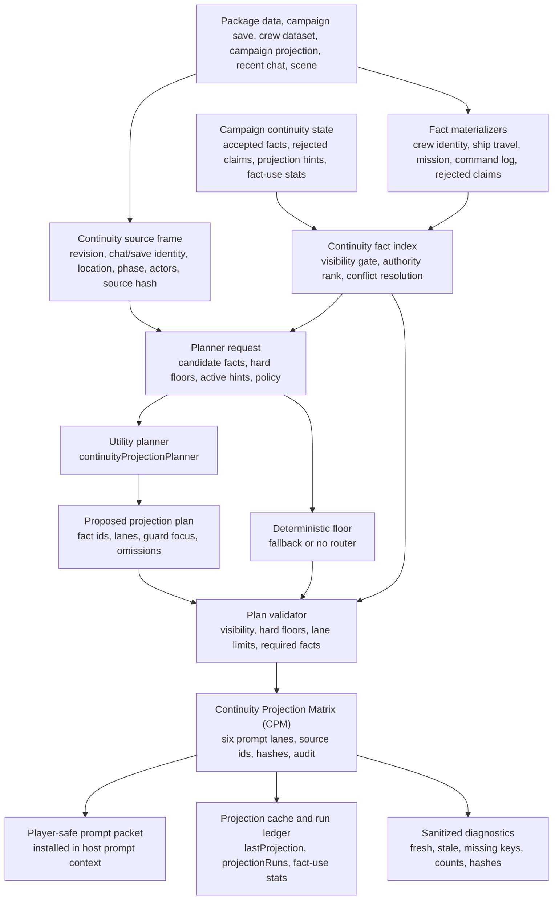
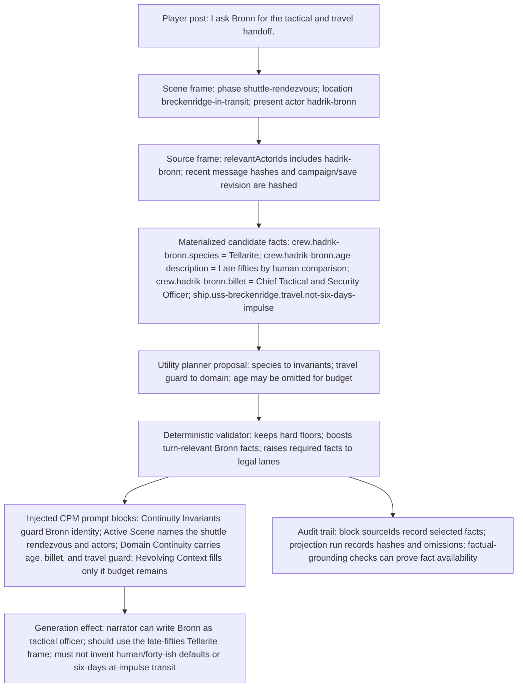
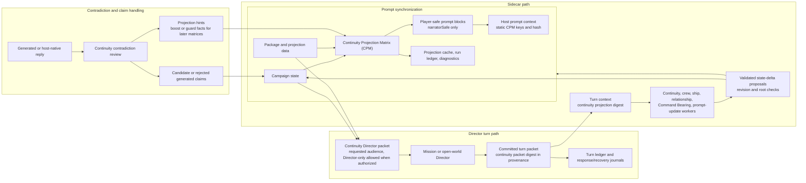

# Continuity Projection Matrix (CPM)

The Continuity Projection Matrix (CPM) is Directive's source-backed continuity router. It turns package data, campaign state, recent chat context, and committed continuity records into the small set of facts each model-facing surface is allowed to see.

CPM is not a memory dump. It is a filtered projection with source hashes, visibility gates, lane budgets, planner validation, contradiction feedback, and sanitized diagnostics.

## Status

Implemented pre-alpha behavior.

Primary implementation files:

| Area | Source |
| --- | --- |
| Matrix builder | `src/continuity/projection-matrix.mjs` |
| Source frame | `src/continuity/source-frame.mjs` |
| Fact index | `src/continuity/fact-index.mjs` |
| Prompt lanes | `src/continuity/prompt-keys.mjs` |
| Planner role | `src/continuity/projection-planner-client.mjs` |
| Plan validation | `src/continuity/projection-plan-validator.mjs` |
| Director packets | `src/continuity/director-packets.mjs` |
| Prompt integration | `src/generation/player-safe-prompt-context-builder.mjs` |
| Diagnostics | `src/continuity/diagnostics.mjs` |
| Sidecar handoff | `src/jobs/campaign-sidecar-scheduler.mjs` |

## Plain-Language Model

Directive keeps many different continuity records: ship facts, crew identity, mission state, command log memory, rejected claims, and campaign-owned accepted facts. A normal prompt cannot carry all of that forever, and it must not expose hidden or Director-only truth.

CPM answers one question before a prompt or Director packet is built:

> Which continuity facts are relevant, safe, high-priority, and fresh enough for this specific turn surface?

It produces two related outputs:

- Player-safe prompt blocks for the narrator and host prompt context.
- Director packets for Mission, Crew, Ship, Command, Narrative Thread, and contradiction-review workers.

Those outputs share source facts, but they do not share visibility. Narrator-safe blocks must not contain hidden or Director-only material. Director packets can include Director-only facts when the requested audience is allowed to see them.

## Infographic: How It Works



## Matrix Products

### Source Frame

`buildContinuitySourceFrame` records the current source boundary:

- campaign, package, save, branch, chat, revision, and mechanics revision;
- current location, active quest, active phase, and scene metadata;
- player text, recent message hashes, accepted selected-assistant variant hashes, present actors, and referenced actors;
- package, crew dataset, and projection revisions;
- projection hints, rejected claims, fact-use stats, and optional source document hashes.

The frame receives a `sourceHash`. Prompt blocks, Director packets, caches, and diagnostics use that hash to prove which state slice they came from.

### External Context Boundary

External context can explain model influence, but it does not satisfy CPM source authority. Native World Info entries, Memory Books generated entries, Summaryception summaries, VectFox retrieval hits, and other host extension prompt material may be present in the final SillyTavern prompt. CPM records their presence only as external prompt-environment diagnostics: prompt keys, placement classes, counts, hashes, statuses, unavailable reasons, fixture-depth labels, and redaction summaries.

External material cannot become an accepted fact, replace Command Log/CORE/FORGE summaries, resolve contradictions, satisfy required source ids, or override campaign-owned facts unless a future reviewed import/export flow creates an explicit Directive proposal with provenance and approval state. Until then, SRE may cite bounded external prompt-environment observations as non-authoritative evidence, but CPM source frames, fact indexes, and contradiction guards remain based on Directive-owned campaign state, selected host rows, accepted swipes, and reviewed imports.

### Selected Swipe Acceptance Boundary

Generated assistant prose is provisional when it appears in chat. If a host message has multiple swipes, CPM does not ingest every swipe and does not treat unselected variants as lore. The acceptance boundary is the next player send:

- Scene Handshake observes the immediately previous assistant message at player-send time.
- Only the selected assistant variant is eligible evidence: host message id, selected swipe index, swipe count, selected text hash, visible text hash, source-integrity status, response/outcome metadata when available, and the selected visible text excerpt.
- Discarded swipe text is not copied into the Scene Handshake snapshot, settlement ledger, CPM source frame, sidecar context, or prompt truth.
- If the player accepts, acts on, or asks a follow-up to the selected variant, constrained settlement operations may update campaign state and then rebuild CPM from that updated state.
- If the player rejects, corrects, rerolls, or ignores the selected variant, the assistant prose remains non-authoritative.

This keeps swipe count irrelevant: one accepted selected variant can become candidate continuity; unselected variants remain drafts.

### Fact Index

`buildContinuityFactIndex` materializes and resolves facts from:

- package and projection records;
- crew identity materializers;
- ship travel materializers;
- mission materializers;
- committed Command Log materializers;
- rejected generated-claim materializers;
- campaign-owned `continuity.acceptedFacts`.

Facts carry authority, visibility, criticality, confidence, conflict keys, tags, source records, and render strings. The index rejects facts blocked by audience visibility, merges duplicate ids, and resolves conflict-key siblings by authority rank, criticality, confidence, and revision.

### Projection Plan

The Utility role `continuityProjectionPlanner` may propose which candidate fact ids should appear in which lanes. It is a blocking Utility job because prompt construction depends on it, but it has no state authority and cannot inject prompt text itself.

Planner output is only a proposal. `validateContinuityProjectionPlan` enforces:

- the output shape `directive.continuityProjectionPlan.v1`;
- known fact ids only;
- narrator-safe visibility for player prompt lanes;
- hard facts and contradiction guards as mandatory floors;
- active projection hints;
- turn-relevant actor boosts;
- lane budgets;
- guard-only and audit-only actions;
- compression groups only for eligible non-hard facts.

If the Utility planner is missing, fails, returns invalid JSON, or proposes an invalid shape, Directive uses the deterministic floor. Hard facts and turn-relevant facts still enter the validated plan.

## Prompt Lanes

CPM emits six static player-safe prompt keys. These are stable because downstream host prompt inspection, diagnostics, and live soak evidence key off them.

| Prompt Key | Purpose | Placement | TTL |
| --- | --- | --- | --- |
| `directive.contract` | Global continuity contract: supplied facts outrank generic genre defaults, generated prose is not truth until committed, hidden state must not leak. | Prompt | Session |
| `directive.continuity.invariants` | Hard continuity floors and contradiction guards. | Prompt | Session |
| `directive.scene.active` | Current location, active mission, phase, question, stakes, and directly relevant actors. | Chat | Turn |
| `directive.continuity.domain` | Domain continuity for crew, ship, mission, travel, pressure, threads, and command facts. | Chat | Scene |
| `directive.recap.committed` | Recent committed outcomes and Command Log memory. | Chat | Scene |
| `directive.context.revolving` | Lower-priority revolving continuity that is useful but not a hard floor. | Chat | Revolving |

The matrix writes source ids onto each block. A later factual-grounding audit can distinguish "the model ignored an available fact" from "the fact was never in the active prompt."

## Infographic: Example Turn Injection

This example uses the same source-shaped facts as the Ashes of Peace CPM canaries: a player asks Hadrik Bronn for a tactical and travel handoff during the shuttle-rendezvous phase. The exact prompt hash and source hash vary by save revision, but the lane behavior is representative of the current runtime.



Example injected CPM excerpts:

```text
[Directive: Continuity Invariants]
- Lieutenant Commander Hadrik Bronn is Tellarite, not a default human unless campaign state explicitly changes that identity.

[Directive: Active Scene Continuity]
- Location id: breckenridge-in-transit
- Active phase: shuttle-rendezvous
- Present or directly relevant: hadrik-bronn

[Directive: Domain Continuity]
- Lieutenant Commander Hadrik Bronn should be described with this age frame: Late fifties by human comparison.
- Lieutenant Commander Hadrik Bronn serves as Chief Tactical and Security Officer.
- Do not describe the opening Breckenridge transit as six days at impulse from Utopia Planitia; use the structured underway, rendezvous, and final-approach facts instead.
```

The important point is that the injected text is not a loose character note. Each line has a source fact behind it, and each prompt block carries source ids and hashes in the packet metadata. If the generated response later says "Bronn, a human male in his early forties..." or "six days at impulse from Utopia Planitia," the contradiction guard and factual-grounding audit can tell whether the required fact was available before generation.

## Infographic: Directors And Sidecars



## Runtime Placement

### Prompt Installation And Rebuilds

`buildPlayerSafePromptContextWithContinuityPlanner` builds the source frame and narrator-safe fact index, optionally calls the Utility planner, validates the result, and embeds matrix blocks into the prompt packet.

`recordPromptContextRevision` stores the sanitized continuity projection summary in `runtimeTracking.promptContext`, writes the projection cache, appends a projection run, and updates fact-use stats. Prompt rebuilds after activation, load, save binding changes, accepted sidecars, and recovery can therefore prove the current context is fresh without storing raw prompts in diagnostics.

### Director Turns

Director turns do not read the narrator prompt as their continuity source. They call `buildContinuityDirectorPacket` for a named audience such as `missionDirector`, `crewDirector`, `shipDirector`, `commandDirector`, `narrativeThreadDirector`, or `contradictionGuard`.

Director packets use the same source frame and fact index concepts, but they request Director visibility where allowed. The committed turn packet stores a compact digest in `provenance.continuityProjection`, then transaction code preserves that digest in the turn ledger.

### Sidecars

Sidecars receive the continuity projection digest through `turnContext.continuityProjection`, job `source.continuityProjection`, and job snapshots. This gives workers enough provenance to explain what continuity basis they used without granting direct prompt-injection authority.

The ordinary sidecar rules still apply:

- sidecars are proposal-only;
- they carry a base revision;
- state-delta validation owns accepted roots;
- stale or cross-domain proposals are rejected;
- accepted proposals trigger prompt synchronization so the next matrix reflects the new campaign state.

## Safety Rules

- Narrator-safe projection is built from allowlisted facts, not from raw hidden state followed by redaction.
- Hidden facts are always blocked from narrator and player-facing lanes.
- Director-only facts can appear only in Director packets for authorized audiences.
- Planner calls return fact-id selection guidance only.
- The deterministic validator owns final lane selection, hard floors, guards, and budgets.
- Generated prose is quarantined as candidate or rejected claims until a deterministic state path accepts it.
- Contradiction findings create short-lived guard hints so recently violated facts become harder to omit.
- Prompt, diagnostics, and live-soak evidence use hashes, counts, source ids, and statuses rather than raw hidden prompts.

## Diagnostics And Certification

`buildContinuityProjectionDiagnostics` reports whether the projection is fresh, stale, missing static keys, or absent. It also reports prompt revision, prompt hash, source hash, policy hash, block count, selected fact count, conflict count, omitted count, validator rejection count, candidate/rejected claim counts, active hint count, projection run count, and latest sanitized review metadata.

The maintained deterministic coverage includes:

- `test-continuity-projection-foundation.mjs`
- `test-continuity-projection-diagnostics.mjs`
- `test-continuity-director-packets.mjs`
- `test-factual-grounding-matrix-prompt-proof.mjs`
- `test-continuity-matrix-five-user-soak-coordinator.mjs`
- `test-player-safe-prompt-context.mjs`
- `test-runtime-director-turn.mjs`
- `test-campaign-sidecar-scheduler.mjs`

The opt-in live certification path is `run-continuity-matrix-five-user-soak.mjs`. It requires SillyTavern live users and aggregates sanitized proof that required CPM prompt keys, required source ids, and deterministic factual-grounding checks were present across the Ashes soak lanes.

## Reusable Extension Pattern

Use this pattern when adding future continuity-like systems:

1. Materialize source facts from package data, committed state, and accepted records.
2. Assign visibility and authority before any prompt construction.
3. Build a source frame that can be hashed and audited.
4. Let cheap model calls propose selection, not authority.
5. Validate model proposals deterministically.
6. Emit stable prompt keys with source ids.
7. Give Directors audience-specific packets instead of asking them to infer from narrator prompt text.
8. Pass compact digests to sidecars for provenance.
9. Rebuild prompt context only after accepted state changes.
10. Certify factual grounding by checking both prompt availability and generated output.
