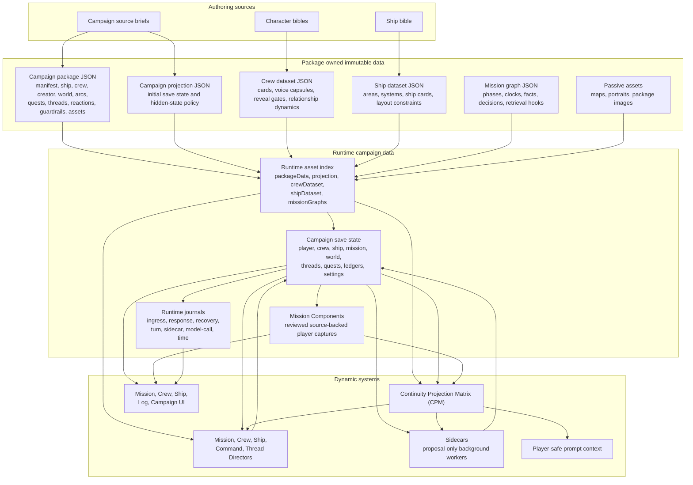
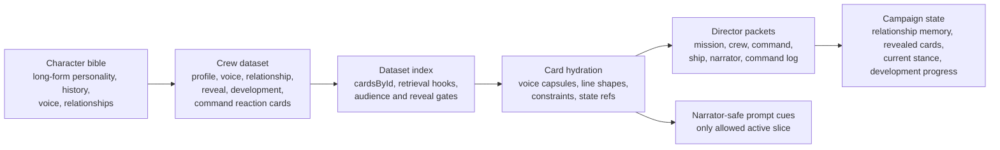
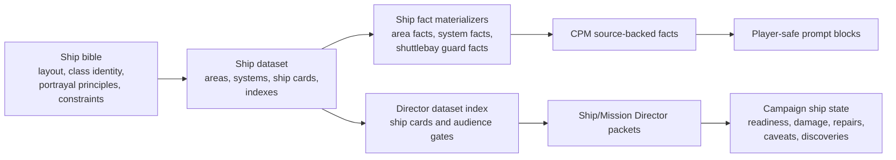
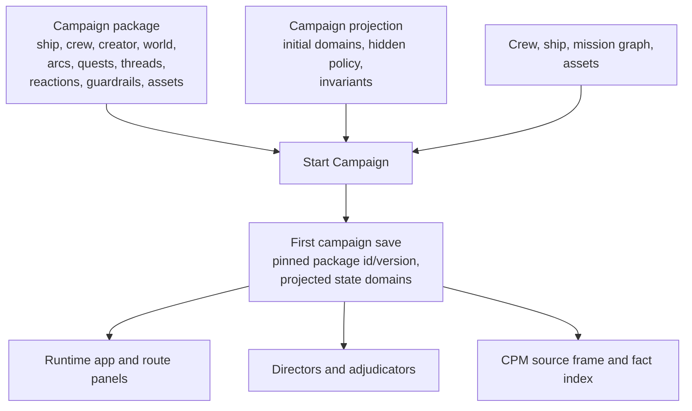

# Directive Datasets

Directive is data-heavy by design. Campaign packages, character bibles, crew datasets, ship datasets, mission graphs, projections, runtime saves, Mission Components, ledgers, and diagnostics all participate in the same rule:

```text
Package data is reusable source material.
Campaign state is playthrough authority.
Dynamic systems may propose, project, or summarize, but they do not mutate templates.
```

This document maps the datasets Directive currently uses and shows how they interact with CPM, Directors, sidecars, prompt context, and player-facing UI.

## Dataset Stack



## Authority Rules

| Rule | Meaning |
| --- | --- |
| Source bibles are authoring inputs. | Character and ship bibles can be long-form prose. Runtime systems consume structured datasets derived from them, not the whole bible. |
| Campaign packages are templates. | Package JSON, crew datasets, ship datasets, mission graphs, and passive assets are immutable during play. |
| Projections initialize saves. | Campaign projection JSON converts package templates into the first campaign-owned state for one playthrough. |
| Saves own reality after start. | Relationships, damage, revealed facts, Command Bearing, time, Mission Components, turns, and recovery status belong to the save. |
| Model calls produce proposals. | Utility, Reasoning, Directors, and sidecars may suggest state changes or summaries; deterministic validators decide what can commit. |
| Player-facing surfaces use projections. | UI and prompt context should consume player-safe projections, selected facts, source ids, hashes, and summaries rather than raw hidden state. |

## Current Dataset Catalog

| Dataset | Main Artifacts | Owns | Main Consumers | Mutability |
| --- | --- | --- | --- | --- |
| Campaign source briefs | `docs/source/*` | Long-form campaign, character, and ship authoring truth. | Human authors, dataset migration scripts, package maintainers. | Edited by authors between package versions. |
| Campaign package | `*.campaign-package.json`, `schemas/campaign-package.schema.json` | Manifest, ship baseline, compact crew roster, Character Creator contract, world, arcs, end conditions, quest/thread/reaction templates, Director cards, context policy, guardrails, assets. | Campaign Library, activation, package import, Directors, UI summaries, validators. | Immutable once a save pins it. |
| Campaign projection | `*.campaign-projection.json`, `schemas/campaign/campaign-state-projection.schema.json` | Initial campaign save domains, hidden-state policy, projection policy, invariants. | Campaign start, save creation, projection validators, runtime assets. | Template only; copied/derived into save state. |
| Crew dataset | `*.crew-dataset.json`, `schemas/packages/crew-dataset.schema.json` | Character-bible-derived officer cards, voice capsules, reveal gates, relationship dynamics, development hooks, command reactions, retrieval indexes. | Director retrieval, crew hydration, narrator voice cues, CPM materializers, Crew UI projections. | Package-owned; campaign state records revealed cards and relationship history. |
| Ship dataset | `*.ship-dataset.json`, `schemas/packages/ship-dataset.schema.json` | Ship-bible-derived areas, systems, hard layout facts, scene uses, ship cards, constraints, retrieval indexes. | CPM ship materializers, prompt context, Mission Director, Ship Director, intro generation, Ship UI. | Package-owned; campaign state records actual damage, readiness, caveats, repairs, and discoveries. |
| Mission graphs | `*.mission-graph.json`, `schemas/mission/mission-graph.schema.json` | Authored tactical/opening phase structure, clocks, facts, pressures, decisions, command decisions, outcome flags, retrieval hooks. | Mission Director, quest graph adapter, runtime Director turn, retrieval packet builder. | Package-owned graph; save owns active phase, flags, clocks, and outcomes. |
| Passive assets | Package `assets`, map PNGs, portraits, package images | Player/director maps, package media, portrait references, asset fallbacks. | Campaign Library, Character Creator, Mission/Crew/Ship panels, asset resolver. | Passive files; save stores references and earned/unearned campaign asset state. |
| Mission Components | `campaignState.knowledgeLedger.components`, `src/runtime/mission-components.mjs` | Reviewed source-backed records captured from selected chat text: notes, items, ship issues, leads, claims, memories, questions, quotes, procedures, source documents. | Mission Components panel, source inspection, future/limited CPM evidence use, sidecars, recovery. | Campaign-owned and editable by player review; never package template data. |
| Campaign save state | Stored save payloads through host storage | Player dossier, active package binding, crew, ship, mission, world, quests, threads, relationships, command culture, Command Bearing, time, turn ledger, Command Log, settings, UI state. | Runtime app, Directors, CPM, prompt context, sidecars, all route panels. | Authoritative mutable playthrough state. |
| Runtime journals and CORE projections | `runtimeTracking`, CORE recovery projections, turn ledger, ingress/response bridge journals, model-call journal, sidecar journal, time ledger | Evidence of what happened, what was posted, what failed, which model role ran, what recovery is required, and which time boundaries committed. Recovery authority is CORE/REPAIR projection evidence; old recovery journals are compatibility telemetry during cutover. | Recovery, diagnostics, testing, Log, Settings, sidecar scheduling, factual-grounding proof. | Append/update campaign-owned operational data. |
| Operator configuration | Settings, provider routing, preset status, UI preferences | Utility/Reasoning provider choices, role routing, safety settings, shell geometry, tutorial preferences. | Settings, generation router, provider client, runtime shell. | Operator-owned configuration, not campaign authoring truth. |
| Test and release artifacts | Soak reports, screenshots, prompt/source proof, render manifests | External verification evidence for runtime behavior and docs. | Release validation, documentation, debugging. | Generated artifacts; not runtime authority. |

## Bundled Package Inventory

| Campaign | Package | Projection | Crew Dataset | Ship Dataset | Mission Graphs |
| --- | --- | --- | --- | --- | --- |
| Ashes of Peace | `packages/bundled/breckenridge/ashes-of-peace.campaign-package.json` | `packages/bundled/breckenridge/ashes-of-peace.campaign-projection.json` | `packages/bundled/breckenridge/breckenridge-senior-staff.crew-dataset.json` | `packages/bundled/breckenridge/breckenridge-intrepid-class.ship-dataset.json` | `prelude-a-ship-underway`, `chapter-1-the-empty-convoy`, `chapter-2-false-colors` |
| Drowned Constellation | `packages/bundled/glass-harbor/drowned-constellation.campaign-package.json` | `packages/bundled/glass-harbor/drowned-constellation.campaign-projection.json` | `packages/bundled/glass-harbor/glass-harbor-senior-staff.crew-dataset.json` | `packages/bundled/glass-harbor/glass-harbor-steamrunner-class.ship-dataset.json` | `prelude-soundings`, `chapter-1-aster-basin`, `chapter-2-caligo-sounding` |
| Black Current | `packages/bundled/serein/black-current.campaign-package.json` | `packages/bundled/serein/black-current.campaign-projection.json` | `packages/bundled/serein/serein-senior-staff.crew-dataset.json` | `packages/bundled/serein/serein-steamrunner-class.ship-dataset.json` | `prelude-wreckfall`, `chapter-1-first-manifest`, `chapter-2-forty-seven-hours-late` |
| Broken Accord | `packages/bundled/eudora-vale/broken-accord.campaign-package.json` | `packages/bundled/eudora-vale/broken-accord.campaign-projection.json` | `packages/bundled/eudora-vale/eudora-vale-senior-staff.crew-dataset.json` | None yet | `prelude-the-captains-chair`, `chapter-1-bread-and-weather`, `chapter-2-the-weight-of-water` |
| Unseen Border | `packages/bundled/aster-vale/unseen-border.campaign-package.json` | `packages/bundled/aster-vale/unseen-border.campaign-projection.json` | `packages/bundled/aster-vale/aster-vale-senior-staff.crew-dataset.json` | `packages/bundled/aster-vale/aster-vale-new-orleans-class.ship-dataset.json` | `prelude-the-blank-route`, `chapter-1-the-missing-colony`, `chapter-2-haldens-shuttle` |
| Enemy's Garden | `packages/bundled/celandine/enemys-garden.campaign-package.json` | `packages/bundled/celandine/enemys-garden.campaign-projection.json` | `packages/bundled/celandine/celandine-senior-staff.crew-dataset.json` | `packages/bundled/celandine/celandine-norway-class.ship-dataset.json` | `prelude-the-first-harvest`, `chapter-1-the-old-seed`, `chapter-2-a-marker-in-the-blood` |

`src/packages/bundled-package-registry.mjs` is the current bundled registry. `src/runtime/package-library.mjs` loads those JSON assets, merges imported package records, and indexes package-adjacent datasets by package id.

## Character Bible To Crew Dataset

Crew datasets are the runtime personality API for senior officers.



The compact package `crew.senior` roster owns stable public identity: name, rank, billet, species, role, public profile, and public age/appearance facts. The richer crew dataset owns characterization records derived from the bible:

- `crew.profile`
- `crew.voice`
- `crew.relationship`
- `crew.reveal`
- `crew.development`
- `command.styleReaction`
- future `crew.bplot` and `crew.coalitionRule` cards

Runtime hydration happens through `src/retrieval/dataset-index.mjs`, `src/retrieval/card-hydration.mjs`, and `src/generation/crew-voice-capsules.mjs`. Narrator-safe voice cues must come from cards allowed for narrator use; hidden reveal cards stay Director-only until campaign state says they are revealed.

Detailed contract: [Crew Dataset Contract](../packages/CREW_DATASET_CONTRACT.md) and [Crew Dataset Rich Character Design](../packages/CREW_DATASET_RICH_CHARACTER_DESIGN.md).

## Ship Bible To Ship Dataset

The Breckenridge ship dataset is the structured runtime form of the Intrepid-class ship bible.



The current ship dataset shape is:

```text
manifest
sources
areas
systems
cards
indexes
```

The Breckenridge dataset includes:

- Deck/zone anchors for spaces like bridge, ready room, sickbay, engineering, astrometrics, cargo bays, and shuttlebay.
- Hard layout facts, textures, constraints, and scene uses.
- System records for capabilities, dependencies, and failure modes.
- Ship Director cards with audience and reveal gates.
- A specific shuttlebay guard used by CPM to prevent saucer-underside/ventral shuttlebay drift for Intrepid-class shuttle recovery.

Source bibles: [Directive Intrepid-Class Starship Bible](../source/Directive_Intrepid_Class_Starship_Bible.md), [Directive Steamrunner-Class Starship Bible](../source/Directive_Steamrunner_Class_Starship_Bible.md), [Directive New Orleans-Class Starship Bible](../source/Directive_New_Orleans_Class_Starship_Bible.md), and [Directive Norway-Class Starship Bible](../source/Directive_Norway_Class_Starship_Bible.md). Runtime materialization: `src/continuity/materializers/ship-dataset-facts.mjs`.

## Campaign Package And Projection Data

Campaign package JSON is the reusable template. Campaign projection JSON is the first-state recipe for one playthrough.



The package top-level spine is:

```text
manifest
ship
crew
characterCreation
world
storyArcs
endConditions
questTemplates
threadTemplates
reactionRules
directorCards
contextPolicy
guardrails
assets
```

The projection initializes domains such as:

```text
campaign
activeCampaignPackage
player
crew
ship
mission
worldState
storyArcLedger
questLedger
dynamicQuestCatalog
knowledgeLedger
threadLedger
eventLedger
attentionState
runtimeTracking
relationships
commandCulture
commandBearing
values
directives
canon
campaignTracks
campaignAssets
turnLedger
commandLog
ui
settings
```

After campaign start, package data remains source material. Save state owns actual outcomes.

Detailed references: [Campaign Package Schema](../packages/CAMPAIGN_PACKAGE_SCHEMA.md), [Campaign State Projection](../packages/CAMPAIGN_STATE_PROJECTION.md), and [Campaign Authoring Guide](../authoring/CAMPAIGN_AUTHORING_GUIDE.md).

## Mission Components

Mission Components are player-reviewed campaign data created from selected chat text. They are not package templates and they are not automatic memory scraping.

Current component types:

```text
note
item
itemStat
shipIssue
lead
claim
memory
question
quote
procedure
sourceDocument
```

Current statuses:

```text
active
unresolved
confirmed
disputed
superseded
archived
```

Each normalized component record contains:

| Field | Purpose |
| --- | --- |
| `id`, `title`, `type`, `status` | Component identity and current review state. |
| `summary`, `verbatim` | Player-visible summary plus exact captured source text. |
| `sourceAuthority` | Whether the source is an official packet, dialogue, narration, player observation, system status, or unknown. |
| `tags`, `links` | Search and links to crew ids, ship system ids, mission ids, and other component ids. |
| `source` | Host, chat id, host message id, selected text hash, message text hash, selection offsets, role/name, outcome/ingress links, and source status. |
| `derived` | Utility/local proposal metadata and summary hash. |
| `lifecycle` | Created/updated/archive timestamps and review status. |

The source hash and host-message fields make Components useful as an evidence spine for future CPM and sidecar work, but the review boundary matters: a captured quote or claim is evidence, not automatically accepted campaign truth.

Design reference: [Mission Components](../design/MISSION_COMPONENTS.md).

## Interaction With Dynamic Systems

### CPM

CPM builds a source frame from campaign state, package data, crew dataset, ship dataset, campaign projection, recent chat, accepted selected-assistant variants, projection hints, and rejected claims. It materializes facts, validates lane selection, emits prompt blocks, builds Director packets, and records sanitized diagnostics.

Dataset inputs to CPM:

- Package/public crew identity facts.
- Crew dataset narrator-safe and Director-only card facts where allowed.
- Ship dataset area/system facts and hard constraints.
- Campaign projection and save state.
- Mission Components as reviewed source-backed evidence where current runtime paths allow safe use.
- Runtime continuity state: accepted facts, rejected claims, projection hints, fact-use stats, projection cache, and projection run summaries.

Output: player-safe prompt lanes, Director packets, sidecar provenance digests, contradiction guard hints, and diagnostics.

### Directors

Directors use datasets as retrieval sources, not as mutable state. `indexDirectorDatasets` combines crew dataset cards, ship dataset cards, and mission-graph retrieval hooks. `hydrateDirectorCards` then prepares an audience-specific packet for Mission, Crew, Ship, Command, narrator, or Command Log use.

Important separation:

- Package and dataset cards describe what is generally true.
- Campaign state describes what is currently true.
- Director output must commit through validated state deltas before it becomes campaign authority.

### Sidecars

Sidecars consume campaign state snapshots, turn packets, Command Log records, and CPM provenance digests. They propose relationship, crew, ship, command, prompt, thread, or summary updates.

They do not own datasets. They do not edit package JSON. They must carry base revisions and accepted-root authorization before any proposal applies to the save.

### Prompt Context

Prompt context is a projection, not a datastore. The prompt builder consumes campaign state and dataset-derived facts, then emits player-safe blocks. It must not serialize hidden state and then redact it. Hidden data should be filtered before prompt text exists.

Ship datasets can add layout anchors. Crew datasets can add active narrator-safe voice cues. CPM adds static continuity keys and source ids.

### UI

UI routes consume player-safe views of state:

- Campaign shows package library, active campaign cards, records, import state, and activation state.
- Mission shows active context, Open Threads/Open World, Components, pending interactions, and recovery.
- Crew shows roster, player character, service records, relationship-visible summaries, and allowed officer context.
- Ship shows readiness, systems, caveats, and discovered/visible ship state.
- Log shows Command Log records and summaries.
- Settings shows provider, safety, preset, diagnostics, model-call, and state-safety controls.

The UI should not reveal raw relationship values, hidden tracks, private NPC thoughts, Director-only card payloads, provider prompts, or hidden clocks.

## Validation Commands

Use the alpha gate for the maintained full suite:

```powershell
node tools\scripts\run-alpha-gate.mjs
```

Focused dataset checks:

```powershell
node tools\scripts\validate-campaign-package.mjs schemas\campaign-package.schema.json packages\bundled\breckenridge\ashes-of-peace.campaign-package.json
node tools\scripts\validate-campaign-projection.mjs packages\bundled\breckenridge\ashes-of-peace.campaign-projection.json packages\bundled\breckenridge\ashes-of-peace.campaign-package.json
node tools\scripts\validate-crew-dataset.mjs schemas\packages\crew-dataset.schema.json packages\bundled\breckenridge\ashes-of-peace.campaign-package.json packages\bundled\breckenridge\breckenridge-senior-staff.crew-dataset.json
node tools\scripts\validate-ship-dataset.mjs schemas\packages\ship-dataset.schema.json packages\bundled\breckenridge\ashes-of-peace.campaign-package.json packages\bundled\breckenridge\breckenridge-intrepid-class.ship-dataset.json
node tools\scripts\test-rich-crew-voice-capsules.mjs
node tools\scripts\test-rich-crew-runtime-hydration.mjs
node tools\scripts\test-mission-components.mjs
node tools\scripts\test-mission-components-capture.mjs
node tools\scripts\test-continuity-projection-foundation.mjs
node tools\scripts\test-player-safe-prompt-context.mjs
```

Use live checks only when host behavior matters:

```powershell
node tools\scripts\test-ship-dataset-live.mjs
node tools\scripts\run-continuity-matrix-five-user-soak.mjs --live --write-artifacts
```

## Extension Rules For New Datasets

1. Give every package-adjacent dataset a manifest with `kind`, `schemaVersion`, stable `id`, owning `packageId`, `version`, and `status`.
2. Keep source provenance in the dataset, including bible/source document paths and section refs where practical.
3. Add schema coverage before relying on the dataset in runtime logic.
4. Register bundled datasets in `src/packages/bundled-package-registry.mjs` and ensure `src/runtime/package-library.mjs` can index imported equivalents.
5. Separate package-owned template fields from campaign-owned mutable state.
6. Define narrator-safe, player-known, Director-only, and hidden visibility before data reaches prompt construction.
7. Add deterministic validation plus at least one runtime consumer test.
8. Use source ids, hashes, and compact digests for diagnostics instead of raw hidden payloads.

## See Also

- [Directive Technical Manual](DIRECTIVE_TECHNICAL_MANUAL.md)
- [Continuity Projection Matrix (CPM)](CONTINUITY_PROJECTION_MATRIX.md)
- [Campaign Package Schema](../packages/CAMPAIGN_PACKAGE_SCHEMA.md)
- [Campaign State Projection](../packages/CAMPAIGN_STATE_PROJECTION.md)
- [Crew Dataset Contract](../packages/CREW_DATASET_CONTRACT.md)
- [Crew Dataset Rich Character Design](../packages/CREW_DATASET_RICH_CHARACTER_DESIGN.md)
- [Mission Components](../design/MISSION_COMPONENTS.md)
- [State Transactions And Recovery](STATE_TRANSACTIONS_AND_RECOVERY.md)
