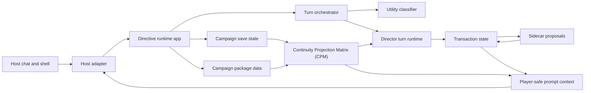
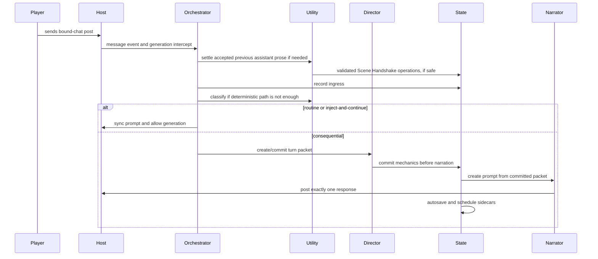
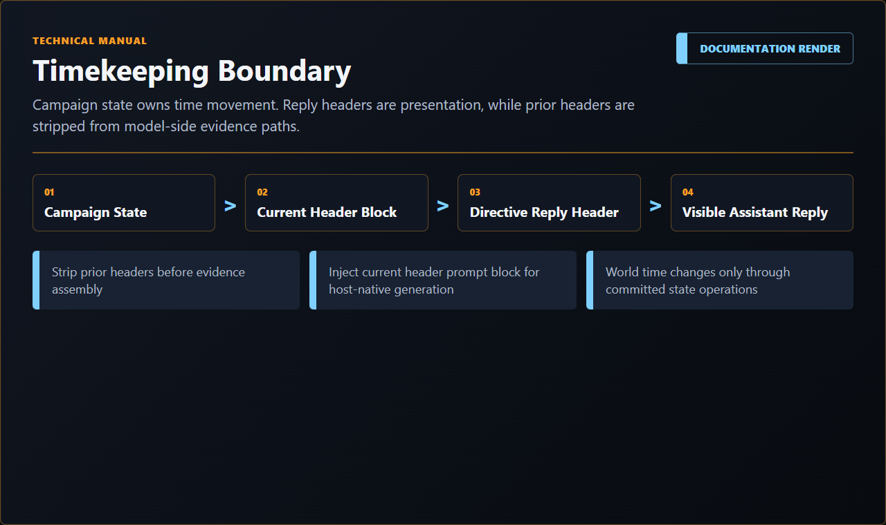
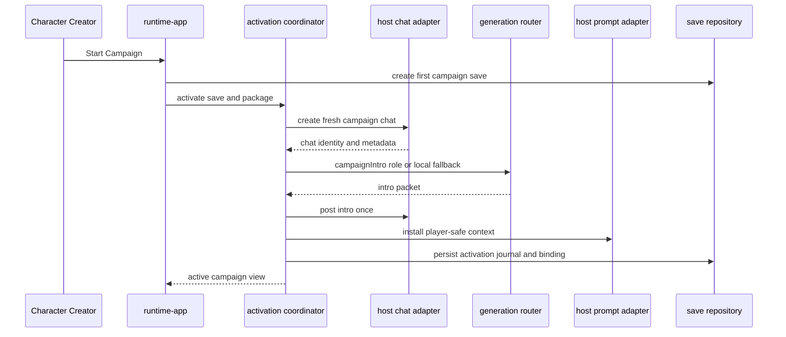
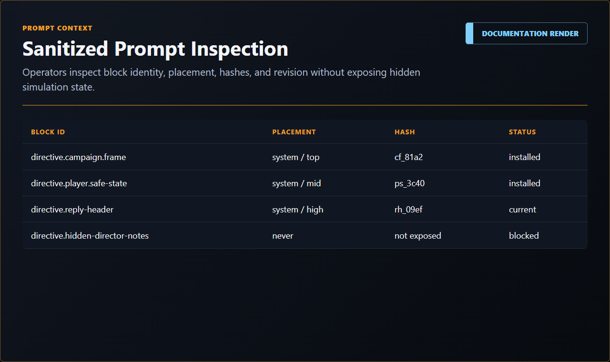
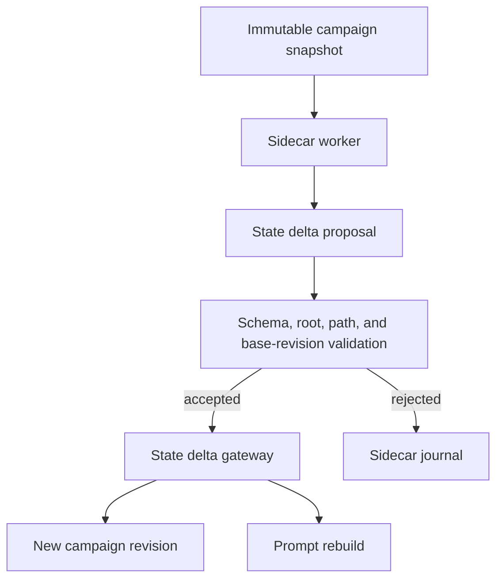
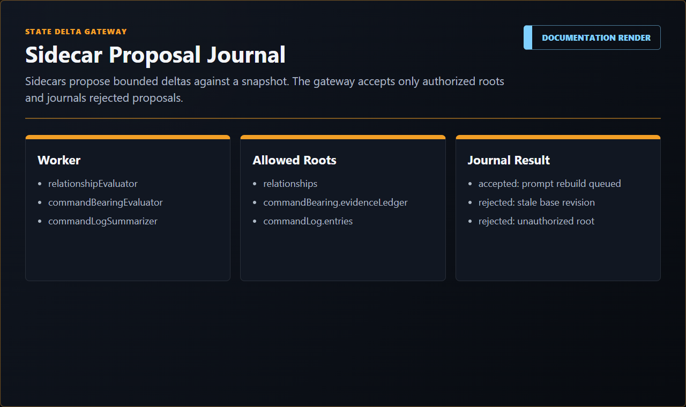

# Directive Technical Manual

This manual explains how Directive works behind the curtain. It is written in the "Haynes manual" style: each major system starts with a plain-language explanation, then moves into reusable implementation detail for future Directive work and host-adapter work.

This manual combines reusable technical diagrams with final SillyTavern-hosted runtime captures from `assets/documentation/renders/`. Remaining technical-diagram gaps are tracked in [Documentation Render Capture Plan](../planning/DOCUMENTATION_RENDER_CAPTURE_PLAN.md).

## Reading Map

- [Player Turn Sequence](PLAYER_TURN_SEQUENCE.md): full post-to-response lifecycle.
- [Continuity Projection Matrix (CPM)](CONTINUITY_PROJECTION_MATRIX.md): source-backed continuity projection, prompt lanes, Director packets, sidecar handoff, contradiction hints, diagnostics, and certification diagrams.
- [Model Calls And Provider Routing](MODEL_CALLS_AND_PROVIDER_ROUTING.md): Utility/Reasoning lanes, role routing, authority, and diagnostics.
- [State Transactions And Recovery](STATE_TRANSACTIONS_AND_RECOVERY.md): campaign revision, snapshots, ledgers, sidecars, saves, edits, deletes, and branches.
- [Host Integration Manual](HOST_INTEGRATION_MANUAL.md): SillyTavern, fake host, storage, prompt, generation, and shell boundaries.
- [Chat-Native Runtime Architecture](../architecture/CHAT_NATIVE_RUNTIME.md): architecture record for the implemented runtime spine.
- [Timekeeping System](../architecture/TIMEKEEPING_SYSTEM.md): Stardate/ship-time header, deterministic time ownership, model sanitization, and implemented deterministic/Utility-backed time adjudication.
- [Mission Components](../design/MISSION_COMPONENTS.md): highlighted-text capture, source anchoring, review-first component state, and CPM evidence spine.
- [Scene Handshake Protocol](../design/SCENE_HANDSHAKE_PROTOCOL.md): implemented settlement pass that turns accepted host prose into source-backed campaign state before normal turn classification.
- [Directive Tutorial Revision](../design/DIRECTIVE_TUTORIAL_REVISION.md): implemented guidance, Show Me targeting, Settings tutorial library, and inert training scenario architecture.
- [Outcome Integrity](../design/OUTCOME_INTEGRITY.md): edit-review trust contract for protecting committed outcome authority while allowing cosmetic narration repair.
- [Mission Director As-Coded](../architecture/MISSION_DIRECTOR_AS_CODED.md): current Director loop behavior.
- [Campaign Package Schema](../packages/CAMPAIGN_PACKAGE_SCHEMA.md): package data contract.

## System Shape

### Layman's View

Directive is not just a prompt helper. It is closer to a campaign computer bolted onto the host chat. The host chat remains where the player talks. Directive watches that chat, decides whether a player post is routine or consequential, updates structured campaign state when something real happens, then keeps the host model supplied with player-safe context.

The important rule is simple: narration is not the source of truth. The structured campaign state is. If a provider fails after mechanics are committed, Directive retries the prose from the same committed outcome instead of rerolling the result.

### Deep View

The current runtime is composed by `src/runtime/runtime-app.mjs`. It loads bundled package records, creates the campaign start controller, creates host-neutral runtime services, builds UI view envelopes, and exposes actions used by the shell and host adapters.

The main working domains are:

| Domain | Primary Source | Responsibility |
| --- | --- | --- |
| Runtime app | `src/runtime/runtime-app.mjs` | Composition root, view envelope, package loading, active save guard, prompt sync, Director turn orchestration, runtime actions. |
| Shell | `src/runtime/runtime-shell.js`, `src/ui/directive-command-spine-shell.js` | Route frame, drawer/fullscreen behavior, desktop command spine, phone fallback. |
| Campaign start | `src/runtime/campaign-start-controller.mjs`, `src/campaign/campaign-start-service.mjs` | Package library view, creator drafts, first save, active save recovery, manual save actions. |
| Chat turns | `src/runtime/chat-turn-orchestrator.mjs` | Host ingress, serialization, Utility classification, exact-one response arbitration, pause/recovery handling. |
| Scene handshake | `src/runtime/scene-handshake-settler.mjs` | Utility-lane settlement of accepted host-generated prose into source-backed assignments, Command Log notes, ship readiness notes, and thread signals. |
| Director turns | `src/runtime/director-turn-runtime.mjs`, `src/directors/open-world-turn-coordinator.mjs`, `src/mission/director.mjs` | Scene snapshots, mission/quest/world resolution, provisional and committed turn packets. |
| Mission Components | `src/runtime/mission-components.mjs`, `src/hosts/sillytavern/mission-components-capture.js`, `src/ui/mission-components-panel.js` | Highlighted chat-text capture, Utility proposal, player review, source anchoring, component CRUD, Mission drawer projection. |
| Transactions | `src/campaign/transaction-state.mjs`, `src/runtime/state-delta-gateway.mjs`, `src/runtime/turn-commit-coordinator.mjs` | Mechanics-first commits, revisioned tracked state, recovery snapshots, journals, sidecar application. |
| Generation | `src/generation/generation-roles.mjs`, `src/generation/generation-router.mjs` | Host-neutral model-call roles and routing through active host generation clients. |
| CPM | `src/continuity`, `src/generation/player-safe-prompt-context-builder.mjs`, `src/jobs/campaign-sidecar-scheduler.mjs` | Source-backed continuity facts, static prompt lanes, planner validation, Director packets, sidecar provenance, sanitized audits, contradiction guard/quarantine, and factual-grounding certification. |
| Timekeeping | `src/time/campaign-time-header.mjs`, `src/time/campaign-time-state.mjs`, `src/time/time-advance-adjudicator.mjs` | Deterministic reply-header formatting, stale-header stripping, campaign time-ledger normalization, deterministic time boundaries, and Utility-backed elapsed-time proposals. |
| Rich crew hydration | `src/retrieval/card-hydration.mjs`, `src/generation/crew-voice-capsules.mjs`, package crew datasets | Audience-specific hydration of voice capsules, line-shape examples, relationship dynamics, reveal gates, and narrator-safe crew guidance. |
| Guidance | `src/guidance/directive-guidance.js`, `src/guidance/directive-training-scenario.mjs` | Tips, tutorials, Show Me preparation, and inert populated training views. |
| Sidecars | `src/jobs/campaign-sidecar-scheduler.mjs`, `src/jobs/sidecar-job-runner.mjs` | Proposal-only background state analysis and command-log summarization. |
| Hosts | `src/hosts/sillytavern`, `src/hosts/fake` | Host lifecycle, storage, prompt, generation, events, shell mount, and test seams. |



The Mermaid diagram above is the current system overview. A designed static infographic can replace or accompany it if the documentation visual style later requires one.

## Package Data Versus Campaign State

### Layman's View

A campaign package is the box of parts: ship, crew, region, story arcs, quests, thread templates, reaction rules, context policy, guardrails, and assets. A campaign save is one playthrough built from that box. Package data can be reused. Campaign state records what actually happened.

### Deep View

The required package roots are defined by `schemas/campaign-package.schema.json`:

```text
manifest
ship
crew
characterCreation
world
storyArcs
endConditions
questTemplates
threadTemplates
reactionRules
directorCards
contextPolicy
guardrails
assets
```

The primary bundled reference package is `packages/bundled/breckenridge/ashes-of-peace.campaign-package.json`. Additional bundled draft packages live under `packages/bundled/glass-harbor/`, `packages/bundled/serein/`, `packages/bundled/eudora-vale/`, `packages/bundled/aster-vale/`, and `packages/bundled/celandine/`. Runtime code must treat package data as immutable source material. When the player starts a campaign, Directive projects package data into campaign-owned state, then future changes belong to the save.

Reusable extension rule: keep templates and playthrough state in separate stores. Once a player has committed outcomes, do not patch those outcomes by editing the template.

## Player Turn Lifecycle

### Layman's View

When the player writes in the campaign chat, Directive first asks, "Is this just ordinary chat, or does it need the campaign engine?" Routine posts can continue with normal host generation after prompt context is synchronized. Consequential posts go through Directive's Director machinery so mechanics, state, and recovery are under control.

### Deep View

The detailed turn sequence lives in [Player Turn Sequence](PLAYER_TURN_SEQUENCE.md). The core runtime path is:



The orchestrator serializes work per campaign and deduplicates ingress. The commit path records mechanics before narration. Response posting uses idempotency keys so retries do not duplicate introductions, outcomes, or conclusions.

Before classification, Scene Handshake may settle accepted host-generated prose from the previous assistant response into source-backed state. It is intentionally narrow: assignments, player-visible Command Log notes, low-risk ship readiness notes, and thread signals. The model role proposes; deterministic validation and the state-delta gateway decide whether anything can be written.

The same accepted prior-scene pair can also feed time adjudication. Deterministic parsing handles explicit cuts, waits, shipboard transitions, and obvious quiet-conversation no-ops. If the elapsed-time boundary is ambiguous, the `timeAdvanceAdjudicator` Utility role proposes a bounded delta. Runtime validation owns the commit through the time ledger and prompt rebuild.

After a committed turn, the end-condition service evaluates package `endConditions` against the committed outcome and campaign state. A match records a terminal detection and a `terminalOutcomeDecision` pending interaction in `runtimeTracking.endConditionLedger`. The Mission route then exposes a **Directive Checkpoint** card rather than silently ending the campaign.

Terminal checkpoint actions are state transactions:

- Replay From Checkpoint restores the retained checkpoint snapshot, falling back from the turn-ledger `snapshotBefore` to runtime history snapshots when needed.
- Push On applies a package-authored continuation frame and rebuilds prompt context.
- Keep This Ending records conclusion metadata and completes the branch.
- Save As Branch writes a terminal timeline save and rewrites the cloned `campaignChatBinding.saveId` to the new branch save id.

## Timekeeping Boundary

Directive-owned campaign replies use `src/time/campaign-time-header.mjs` to prefix the current display header:

```text
*Stardate #####.# | HHMM hours*
```

The header is presentation, not evidence. Directive strips prior headers from model-side transcript/evidence paths that it controls and injects a current-header prompt block for host-native SillyTavern generation. Deterministic campaign state, explicit world-time operations, travel, and adjudicated time-boundary commits own actual time movement.

<p align="center">
  
</p>

<!-- directive-render: id=docs-directive-time-adjudication-flow; target=assets/documentation/renders/docs-directive-time-adjudication-flow.png; source=diagram; -->
Render needed: time adjudication flow showing deterministic parser, Utility proposal, validator, time-ledger commit, prompt rebuild, and next reply header.

## Mission Components

### Layman's View

Mission Components are source-backed campaign notes created from text the player highlights in the active campaign chat. They are not automatic truth. The selected chat text is preserved as evidence, the Utility lane proposes structure, and the player reviews or edits the component before it becomes campaign state.

### Deep View

`src/hosts/sillytavern/mission-components-capture.js` owns the host-side selection affordance. It appears only for valid selections inside the active bound campaign chat, rejects cross-message and unsupported source selections, and sends selected text plus source metadata into runtime actions.

`src/runtime/mission-components.mjs` normalizes the selected source, builds a local fallback proposal, optionally asks the `utilityJson` role for title/type/status/summary/tags/links/source authority, rejects overreaching summaries, and preserves the verbatim source text. Saving, updating, and archiving components are tracked state transactions against the campaign save.

`src/ui/mission-components-panel.js` renders the Mission drawer Components tab with search, type/status/source/scope/tag/crew/ship-system filters, sorting, count chips, source preview, and source-open actions when the bound chat can be verified.

Reusable extension rule: source capture should preserve the original selected text separately from model summaries. The model can classify and compress; it cannot overwrite evidence or promote a highlighted sentence into hidden truth.

<!-- directive-render: id=docs-directive-mission-components-lifecycle; target=assets/documentation/renders/docs-directive-mission-components-lifecycle.png; source=diagram; -->
Render needed: Mission Components lifecycle infographic showing highlighted source text, Utility proposal, player review, saved component state, Mission tab projection, and CPM evidence handoff.

## Campaign Activation

### Layman's View

Starting a campaign is not just opening a screen. Directive turns the reviewed officer draft into a save, creates a fresh host chat, binds the save to that chat, posts one introduction, installs prompt context, and records each step so recovery can resume without duplicating work.

### Deep View

`src/runtime/campaign-activation-coordinator.mjs` owns the activation journal. SillyTavern chat creation and binding are host adapter work. Prompt installation is host adapter work. The campaign state and save metadata remain shared runtime work.



Reusable extension rule: multi-step activation should be journaled. A retry should complete missing steps, not replay completed steps.

## Model Calls And Authority

### Layman's View

Directive has two model-call lanes. The Utility lane is for cheaper, faster, bounded work like classification, compact summaries, and proposal-only sidecars. The Reasoning lane is for larger interpretive or prose work like narration, campaign intros, conclusions, and character creator drafting.

### Deep View

Model-call roles are declared in `src/generation/generation-roles.mjs`. Authority boundaries are declared in `src/generation/model-call-authority-matrix.mjs`. Settings can route each role to Utility or Reasoning, but routing does not grant new authority.

Important reusable principle: model calls should be typed jobs with explicit authority, not freeform helper calls. Each role should define:

- trigger;
- default provider lane;
- blocking behavior;
- output type;
- parser schema;
- fallback behavior;
- whether it may propose state;
- whether it may inject prompt context;
- allowed state roots, if any;
- owning module and tests.

See [Model Calls And Provider Routing](MODEL_CALLS_AND_PROVIDER_ROUTING.md) for the role table and routing diagram.

Character Creator section assist is a good example of this boundary. The `characterCreatorSectionDraft` role can draft editable Identity, Service, Personality, or Review fields, but the preview must be applied by the operator and still belongs to creator draft data until Start Campaign creates real campaign state. Mission Components use a different pattern: `utilityJson` proposes component structure, but the saved component transaction preserves the selected source text and validates the final record.

Provider-routing diagnostic examples:

<p align="center">
  
</p>

<p align="center">
  
</p>

<p align="center">
  
</p>

## State Transactions

### Layman's View

Directive works like a campaign ledger. Before it writes a result, it takes a snapshot. Then it applies an authorized state change, records what changed, and saves the new revision. If narration fails, the ledger still knows what happened. If the player edits or deletes later, Directive can decide whether rollback is safe or review is required.

### Deep View

`src/runtime/state-delta-gateway.mjs` owns tracked campaign revisions and bounded snapshots. `src/campaign/transaction-state.mjs` applies Director turn packets to campaign domains. `src/runtime/turn-commit-coordinator.mjs` records mechanics, narration, and response status around the committed outcome.

Key invariants:

- state changes name authorized domains;
- sidecar operations are checked against allowed roots;
- snapshots are bounded and compacted;
- ingress, response, recovery, sidecar, model-call, and pending-interaction journals live under runtime tracking;
- terminal detections, decisions, continuation frames, and terminal branch records live under `runtimeTracking.endConditionLedger`;
- restore operations preserve current sidecar/model-call journals where appropriate;
- narration retry uses the same outcome id.

See [State Transactions And Recovery](STATE_TRANSACTIONS_AND_RECOVERY.md).

## Prompt Context

### Layman's View

Directive does not dump the entire save into the host prompt. It builds a set of player-safe blocks: campaign frame, player character, active scene, known facts, crew context, ship status, command history, active pressures, and narrator constraints.

### Deep View

Prompt context is built through `src/generation/player-safe-prompt-context-builder.mjs` and validated by `src/generation/prompt-injection-safety.mjs`. The SillyTavern adapter installs blocks through `setExtensionPrompt`.

Prompt packets use stable block ids, placement/depth metadata, hashes, and revisions. Prompt sync is chat-affine: it installs only into the bound campaign chat, suspends when the active chat does not match, and clears on completion, archive, or extension disable.

<p align="center">
  
</p>

## Rich Crew Hydration

### Layman's View

Directive does not paste full character bibles into the model. Package authors write rich bibles, but runtime uses compact crew dataset cards and voice capsules. The active turn receives only the small, relevant, player-safe slice needed for characters who are present, speaking, or causally important.

### Deep View

Package crew datasets contain the six-card senior-staff structure described by the Crew Dataset Contract: `crew.profile`, `crew.voice`, `crew.relationship`, `crew.reveal`, `crew.development`, and `command.styleReaction`. The `crew.voice` card can include a `voiceCapsule` with core engine, contradiction, speech mechanics, pressure shift, warmth/humor, physical tells, example line shapes, and avoid rules.

`src/retrieval/card-hydration.mjs` turns those cards into audience-specific guidance. It limits line-shape examples, preserves `bibleAxes`, respects narrator safety, and avoids equal-time biography dumping. `src/generation/crew-voice-capsules.mjs` selects line shapes by axis so prompt context can carry syntax and posture without encouraging catchphrase repetition.

Reusable extension rule: deep authoring sources should compile into small runtime packets. A whole bible is for authors and validators; a hydrated card is for one prompt audience at one moment.

<!-- directive-render: id=docs-directive-rich-crew-hydration; target=assets/documentation/renders/docs-directive-rich-crew-hydration.png; source=diagram; -->
Render needed: rich crew data flow from character bible to six-card dataset, voice capsule, hydration audience, and narrator/Director prompt packet.

## Sidecars

### Layman's View

Sidecars are background advisors. They can suggest updates to things like relationships, crew state, ship state, continuity, Command Bearing, side work, or command-log summaries. They do not get to rewrite the save directly.

### Deep View

Sidecar workers are scheduled by `src/jobs/campaign-sidecar-scheduler.mjs` and validated by contracts in `src/jobs/sidecar-output-contracts.mjs`. The model-call authority matrix defines allowed roots per worker. `state-delta-gateway.applyOperations` rejects stale base revisions and unauthorized roots.



Runtime diagnostics example:

<p align="center">
  
</p>

<p align="center">
  
</p>

## Host Boundary

### Layman's View

Directive's engine is separated from SillyTavern-specific plumbing through host contracts. The SillyTavern adapter handles lifecycle, storage, prompt injection, generation access, event observation, UI mounting, and host-specific diagnostics. The fake host keeps deterministic tests fast without a live browser.

### Deep View

Host adapters must not fork core game logic. They should expose the same logical services:

- storage;
- generation;
- prompt;
- chat identity and chat operations;
- event observation;
- shell mount;
- host logger/notifications;
- capabilities.

SillyTavern owns the active pre-alpha flow: extension launcher, command-spine shell, chat creation, message observation, generation interceptor, `setExtensionPrompt`, `/user/files` storage, provider routing through host/current/profile/direct endpoint modes, and message actions.

Future host adapters can reuse these contracts after the SillyTavern alpha stabilizes. The fake host owns repeatable tests.

See [Host Integration Manual](HOST_INTEGRATION_MANUAL.md).

Runtime shell examples:

<p align="center">
  
</p>

<p align="center">
  
</p>

## Diagnostics And Verification

### Layman's View

Diagnostics answer "what failed?" without leaking hidden campaign facts. They should distinguish provider failure, prompt sync suspension, save mismatch, stale sidecar proposals, recoverable message changes, and storage corruption.

### Deep View

Important verification commands:

```powershell
node tools\scripts\verify-repo-structure.mjs
node tools\scripts\test-chat-turn-orchestrator.mjs
node tools\scripts\test-directive-provider-routing.mjs
node tools\scripts\test-model-call-authority-matrix.mjs
node tools\scripts\test-state-delta-gateway.mjs
node tools\scripts\test-campaign-sidecar-scheduler.mjs
node tools\scripts\test-player-safe-prompt-context.mjs
node tools\scripts\test-runtime-director-turn.mjs
node tools\scripts\run-alpha-gate.mjs
```

Do not treat a green narrow test as proof of the entire runtime contract. Match verification scope to the claim being made.

## Render Backlog

Use [Documentation Render Capture Plan](../planning/DOCUMENTATION_RENDER_CAPTURE_PLAN.md) for the current live renderer and capture matrix. Technical manual visuals still needed before final signoff:

- prompt context inspection;
- sidecar proposal diagnostics;
- terminal checkpoint decision and terminal branch save flow;
- host boundary or shell mount capture for SillyTavern-specific integration surfaces.

Runtime diagnostic coverage now available:

<p align="center">
  
</p>

<p align="center">
  
</p>
