# Directive Technical Manual

This manual explains how Directive works behind the curtain. It is written in the "Haynes manual" style: each major system starts with a plain-language explanation, then moves into reusable implementation detail for future Directive work and other host-portable extensions.

This manual combines reusable technical diagrams with final SillyTavern-hosted runtime captures from `assets/documentation/renders/`. Remaining technical-diagram gaps are tracked in [Documentation Render Capture Plan](../planning/DOCUMENTATION_RENDER_CAPTURE_PLAN.md).

## Reading Map

- [Player Turn Sequence](PLAYER_TURN_SEQUENCE.md): full post-to-response lifecycle.
- [Model Calls And Provider Routing](MODEL_CALLS_AND_PROVIDER_ROUTING.md): Utility/Reasoning lanes, role routing, authority, and diagnostics.
- [State Transactions And Recovery](STATE_TRANSACTIONS_AND_RECOVERY.md): campaign revision, snapshots, ledgers, sidecars, saves, edits, deletes, and branches.
- [Host Integration Manual](HOST_INTEGRATION_MANUAL.md): SillyTavern, Lumiverse, fake host, storage, prompt, generation, and shell boundaries.
- [Chat-Native Runtime Architecture](../architecture/CHAT_NATIVE_RUNTIME.md): architecture record for the implemented runtime spine.
- [Mission Director As-Coded](../architecture/MISSION_DIRECTOR_AS_CODED.md): current Director loop behavior.
- [Campaign Package Schema](../packages/CAMPAIGN_PACKAGE_SCHEMA.md): package data contract.

## System Shape

### Layman's View

Directive is not just a prompt helper. It is closer to a campaign computer bolted onto the host chat. The host chat remains where the player talks. Directive watches that chat, decides whether a player post is routine or consequential, updates structured campaign state when something real happens, then keeps the host model supplied with player-safe context.

The important rule is simple: narration is not the source of truth. The structured campaign state is. If a provider fails after mechanics are committed, Directive retries the prose from the same committed outcome instead of rerolling the result.

### Deep View

The current runtime is composed by `src/runtime/runtime-app.mjs`. It loads bundled package records, creates the campaign start controller, creates host-neutral runtime services, builds UI view envelopes, and exposes actions used by the shell and host adapters.

The main working domains are:

| Domain | Primary Source | Responsibility |
| --- | --- | --- |
| Runtime app | `src/runtime/runtime-app.mjs` | Composition root, view envelope, package loading, active save guard, prompt sync, Director turn orchestration, runtime actions. |
| Shell | `src/runtime/runtime-shell.js`, `src/ui/directive-command-spine-shell.js` | Route frame, drawer/fullscreen behavior, desktop command spine, phone fallback. |
| Campaign start | `src/runtime/campaign-start-controller.mjs`, `src/campaign/campaign-start-service.mjs` | Package library view, creator drafts, first save, active save recovery, manual save actions. |
| Chat turns | `src/runtime/chat-turn-orchestrator.mjs` | Host ingress, serialization, Utility classification, exact-one response arbitration, pause/recovery handling. |
| Director turns | `src/runtime/director-turn-runtime.mjs`, `src/directors/open-world-turn-coordinator.mjs`, `src/mission/director.mjs` | Scene snapshots, mission/quest/world resolution, provisional and committed turn packets. |
| Transactions | `src/campaign/transaction-state.mjs`, `src/runtime/state-delta-gateway.mjs`, `src/runtime/turn-commit-coordinator.mjs` | Mechanics-first commits, revisioned tracked state, recovery snapshots, journals, sidecar application. |
| Generation | `src/generation/generation-roles.mjs`, `src/generation/generation-router.mjs` | Host-neutral model-call roles and routing through active host generation clients. |
| Sidecars | `src/jobs/campaign-sidecar-scheduler.mjs`, `src/jobs/sidecar-job-runner.mjs` | Proposal-only background state analysis and command-log summarization. |
| Hosts | `src/hosts/sillytavern`, `src/hosts/lumiverse`, `src/hosts/fake` | Host lifecycle, storage, prompt, generation, events, shell mount, and test seams. |

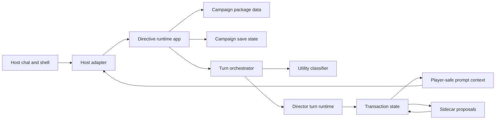

The Mermaid diagram above is the current system overview. A designed static infographic can replace or accompany it if the documentation visual style later requires one.

## Package Data Versus Campaign State

### Layman's View

A campaign package is the box of parts: ship, crew, region, story arcs, quests, thread templates, reaction rules, context policy, guardrails, and assets. A campaign save is one playthrough built from that box. Package data can be reused. Campaign state records what actually happened.

### Deep View

The required package roots are defined by `schemas/campaign-package.schema.json`:

```text
manifest
ship
crew
characterCreation
world
storyArcs
questTemplates
threadTemplates
reactionRules
directorCards
contextPolicy
guardrails
assets
```

The bundled reference package is `packages/bundled/breckenridge/ashes-of-peace.campaign-package.json`. Runtime code must treat this data as immutable source material. When the player starts a campaign, Directive projects package data into campaign-owned state, then future changes belong to the save.

Reusable extension rule: keep templates and playthrough state in separate stores. Once a player has committed outcomes, do not patch those outcomes by editing the template.

## Player Turn Lifecycle

### Layman's View

When the player writes in the campaign chat, Directive first asks, "Is this just ordinary chat, or does it need the campaign engine?" Routine posts can continue with normal host generation after prompt context is synchronized. Consequential posts go through Directive's Director machinery so mechanics, state, and recovery are under control.

### Deep View

The detailed turn sequence lives in [Player Turn Sequence](PLAYER_TURN_SEQUENCE.md). The core runtime path is:

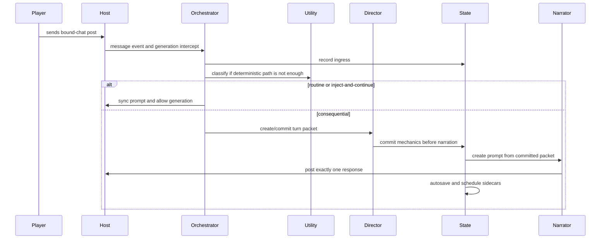

The orchestrator serializes work per campaign and deduplicates ingress. The commit path records mechanics before narration. Response posting uses idempotency keys so retries do not duplicate introductions, outcomes, or conclusions.

## Campaign Activation

### Layman's View

Starting a campaign is not just opening a screen. Directive turns the reviewed officer draft into a save, creates a fresh host chat, binds the save to that chat, posts one introduction, installs prompt context, and records each step so recovery can resume without duplicating work.

### Deep View

`src/runtime/campaign-activation-coordinator.mjs` owns the activation journal. SillyTavern chat creation and binding are host adapter work. Prompt installation is host adapter work. The campaign state and save metadata remain shared runtime work.

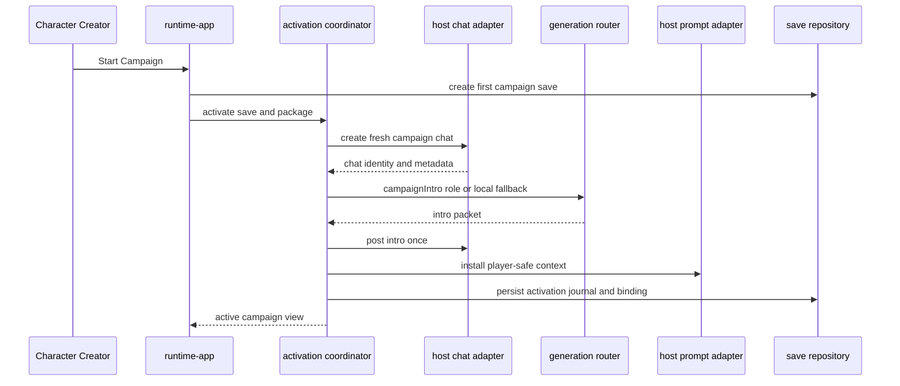

Reusable extension rule: multi-step activation should be journaled. A retry should complete missing steps, not replay completed steps.

## Model Calls And Authority

### Layman's View

Directive has two model-call lanes. The Utility lane is for cheaper, faster, bounded work like classification, compact summaries, and proposal-only sidecars. The Reasoning lane is for larger interpretive or prose work like narration, campaign intros, conclusions, and character creator drafting.

### Deep View

Model-call roles are declared in `src/generation/generation-roles.mjs`. Authority boundaries are declared in `src/generation/model-call-authority-matrix.mjs`. Settings can route each role to Utility or Reasoning, but routing does not grant new authority.

Important reusable principle: model calls should be typed jobs with explicit authority, not freeform helper calls. Each role should define:

- trigger;
- default provider lane;
- blocking behavior;
- output type;
- parser schema;
- fallback behavior;
- whether it may propose state;
- whether it may inject prompt context;
- allowed state roots, if any;
- owning module and tests.

See [Model Calls And Provider Routing](MODEL_CALLS_AND_PROVIDER_ROUTING.md) for the role table and routing diagram.

Provider-routing diagnostic examples:

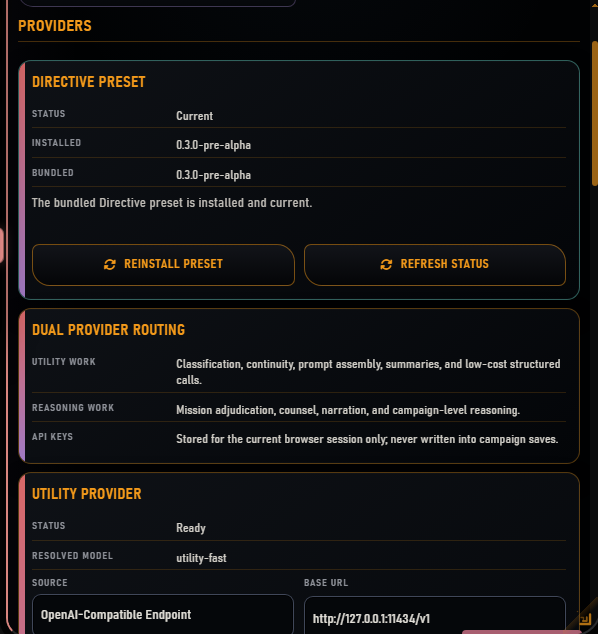

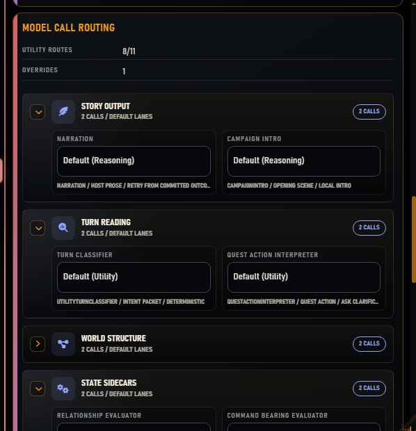

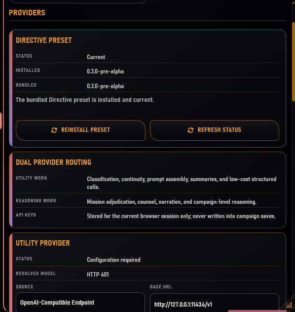

## State Transactions

### Layman's View

Directive works like a campaign ledger. Before it writes a result, it takes a snapshot. Then it applies an authorized state change, records what changed, and saves the new revision. If narration fails, the ledger still knows what happened. If the player edits or deletes later, Directive can decide whether rollback is safe or review is required.

### Deep View

`src/runtime/state-delta-gateway.mjs` owns tracked campaign revisions and bounded snapshots. `src/campaign/transaction-state.mjs` applies Director turn packets to campaign domains. `src/runtime/turn-commit-coordinator.mjs` records mechanics, narration, and response status around the committed outcome.

Key invariants:

- state changes name authorized domains;
- sidecar operations are checked against allowed roots;
- snapshots are bounded and compacted;
- ingress, response, recovery, sidecar, model-call, and pending-interaction journals live under runtime tracking;
- restore operations preserve current sidecar/model-call journals where appropriate;
- narration retry uses the same outcome id.

See [State Transactions And Recovery](STATE_TRANSACTIONS_AND_RECOVERY.md).

## Prompt Context

### Layman's View

Directive does not dump the entire save into the host prompt. It builds a set of player-safe blocks: campaign frame, player character, active scene, known facts, crew context, ship status, command history, active pressures, and narrator constraints.

### Deep View

Prompt context is built through `src/generation/player-safe-prompt-context-builder.mjs` and validated by `src/generation/prompt-injection-safety.mjs`. The SillyTavern adapter installs blocks through `setExtensionPrompt`; Lumiverse creates prompt blocks through its Spindle-facing adapter path.

Prompt packets use stable block ids, placement/depth metadata, hashes, and revisions. Prompt sync is chat-affine: it installs only into the bound campaign chat, suspends when the active chat does not match, and clears on completion, archive, or extension disable.

Prompt inspection render pending: sanitized Settings view showing prompt block ids, placement, hashes, and revision without hidden state.

## Sidecars

### Layman's View

Sidecars are background advisors. They can suggest updates to things like relationships, crew state, ship state, continuity, Command Bearing, side work, or command-log summaries. They do not get to rewrite the save directly.

### Deep View

Sidecar workers are scheduled by `src/jobs/campaign-sidecar-scheduler.mjs` and validated by contracts in `src/jobs/sidecar-output-contracts.mjs`. The model-call authority matrix defines allowed roots per worker. `state-delta-gateway.applyOperations` rejects stale base revisions and unauthorized roots.

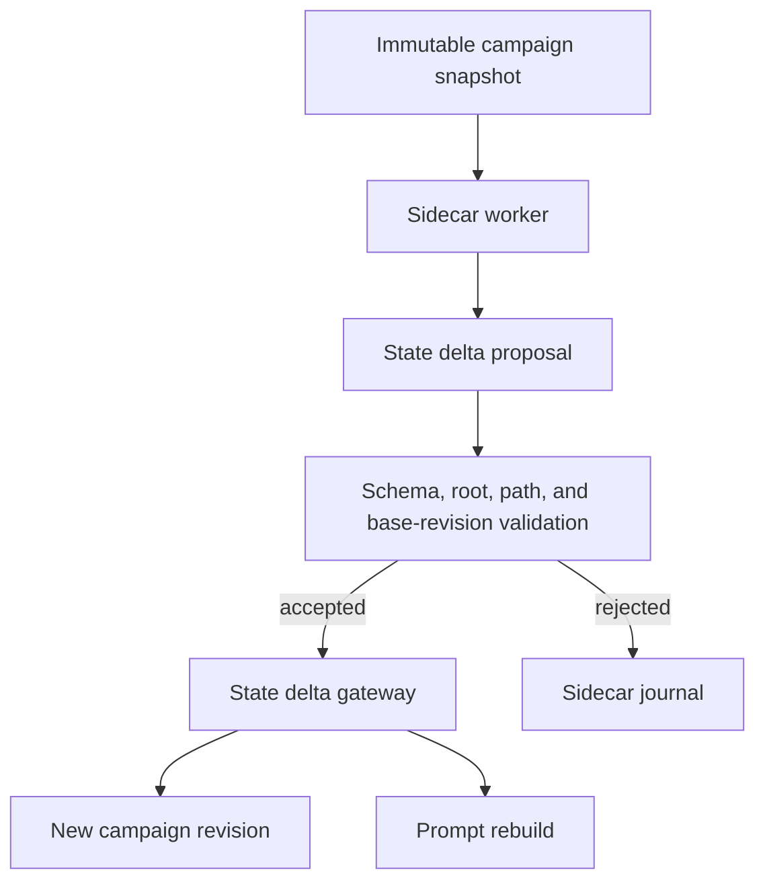

Runtime diagnostics example:

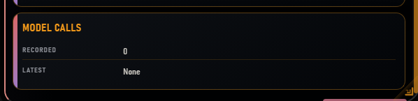

Sidecar-specific proposal journal render pending.

## Host Boundary

### Layman's View

Directive's engine is host-neutral. SillyTavern and Lumiverse are different cars around the same engine block. Each host adapter handles lifecycle, storage, prompt injection, generation access, event observation, UI mounting, and host-specific diagnostics.

### Deep View

Host adapters must not fork core game logic. They should expose the same logical services:

- storage;
- generation;
- prompt;
- chat identity and chat operations;
- event observation;
- shell mount;
- host logger/notifications;
- capabilities.

SillyTavern currently owns the primary pre-alpha flow: extension launcher, command-spine shell, chat creation, message observation, generation interceptor, `setExtensionPrompt`, `/user/files` storage, provider routing through host/current/profile/direct endpoint modes, and message actions.

Lumiverse owns Spindle entrypoints, scoped storage, generation, tools, runtime bridge, app overlay, and prompt block creation. The fake host owns repeatable tests.

See [Host Integration Manual](HOST_INTEGRATION_MANUAL.md).

Runtime shell examples:


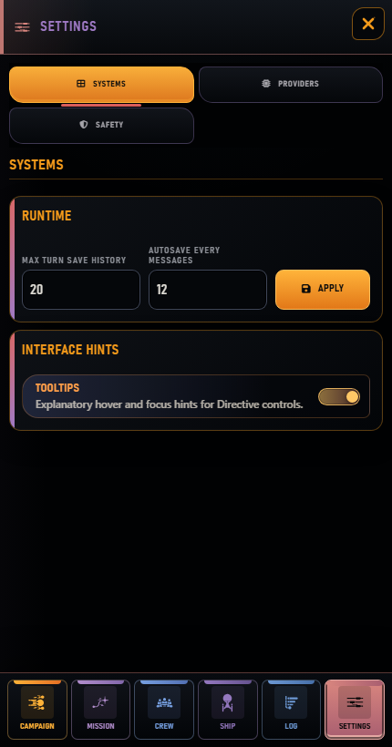

## Diagnostics And Verification

### Layman's View

Diagnostics answer "what failed?" without leaking hidden campaign facts. They should distinguish provider failure, prompt sync suspension, save mismatch, stale sidecar proposals, recoverable message changes, and storage corruption.

### Deep View

Important verification commands:

```powershell
node tools\scripts\verify-repo-structure.mjs
node tools\scripts\test-chat-turn-orchestrator.mjs
node tools\scripts\test-directive-provider-routing.mjs
node tools\scripts\test-model-call-authority-matrix.mjs
node tools\scripts\test-state-delta-gateway.mjs
node tools\scripts\test-campaign-sidecar-scheduler.mjs
node tools\scripts\test-player-safe-prompt-context.mjs
node tools\scripts\test-runtime-director-turn.mjs
node tools\scripts\run-alpha-gate.mjs
```

Do not treat a green narrow test as proof of the entire runtime contract. Match verification scope to the claim being made.

## Render Backlog

Use [Documentation Render Capture Plan](../planning/DOCUMENTATION_RENDER_CAPTURE_PLAN.md) for the current live renderer and capture matrix. Technical manual visuals still needed before final signoff:

- prompt context inspection;
- sidecar proposal diagnostics;
- host boundary or shell mount capture where SillyTavern and Lumiverse differ.

Runtime diagnostic coverage now available:

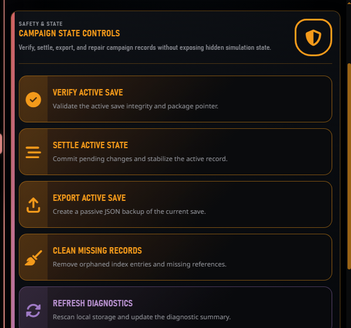

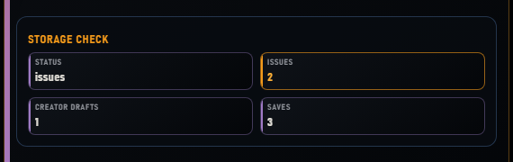
