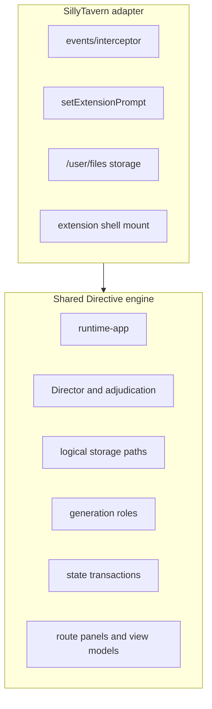
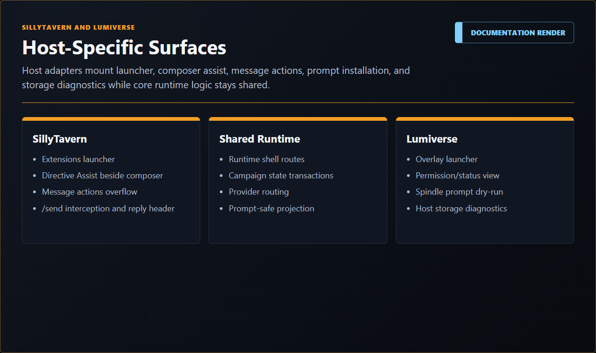

# Host Integration Manual

This document explains how Directive integrates with SillyTavern and the fake test host.

## Plain-Language Model

Directive keeps its campaign engine behind host contracts. Host adapters are translators. They know how to open UI, read/write storage, observe chat, call generation, install prompt context, and post responses in a specific host. They should not contain campaign rules.

## Shared Host Contract

Host adapters should provide these services:

| Service | Responsibility |
| --- | --- |
| Lifecycle | Enable, disable, update, clean, delete, refresh. |
| Storage | Map logical Directive records to host storage. |
| Generation | Run role-based generation requests and batch sidecars if supported. |
| Prompt | Install, update, rebuild, inspect, suspend, and clear prompt blocks. |
| Chat | Identify current chat, create/open campaign chat, post assistant messages, store binding metadata. |
| Events | Observe player message, edit, delete, and chat switch events. |
| Shell | Mount the Directive runtime shell into the host UI. |
| Diagnostics | Report capabilities, failures, and host-specific state without leaking hidden campaign facts. |

## SillyTavern Adapter

Primary source folder: `src/hosts/sillytavern`.

Current responsibilities:

- extension lifecycle through `lifecycle.js`;
- feature enablement through `feature-toggle.mjs` and settings store;
- host factory in `host-factory.mjs`;
- file API and logical storage mapping;
- prompt adapter over `setExtensionPrompt`;
- chat adapter for chat identity and fresh campaign chat creation;
- event wiring for player messages, edits, deletes, chat changes, and extension disable;
- generation client and narration provider;
- provider client for current host model, Connection Profile, and direct OpenAI-compatible endpoints;
- runtime bridge and generation interceptor;
- message actions for reconciliation;
- Assist button integration beside the SillyTavern input.

## Fake Host

Primary source folder: `src/hosts/fake`.

The fake host is for repeatable tests. It should model the host contract without importing SillyTavern globals.

## Future Hosts

Future host adapters, including possible Lumiverse support, should be added only after the SillyTavern alpha contract is stable. They should reuse the host contract, route-panel view models, logical storage boundary, and sidecar orchestration without forking campaign rules.

## Host Boundary Diagram

## Integration Rules

- Host adapters may reference host globals; shared engine modules should not.
- Host adapters may translate storage paths; shared runtime should use logical keys.
- Host adapters may call host generation; shared runtime should call generation roles.
- Host adapters may mount UI; shared UI route order and view models should stay host-neutral.
- Host adapters may expose diagnostics; diagnostics should be sanitized.

## Render Slots

Runtime shell examples:

  

  

  

