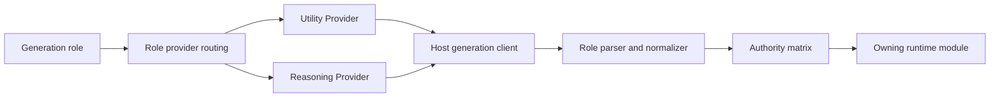

# Model Calls And Provider Routing

This document explains Directive's Utility and Reasoning provider lanes, model-call roles, and authority boundaries.

## Plain-Language Model

Directive does not ask one model to do everything. It separates work into named jobs.

- Utility is for fast, low-cost, bounded jobs.
- Reasoning is for deeper interpretation, prose, and authoring assistance.
- Role routing can move a job between lanes, but routing never changes what the job is allowed to do.

That last point matters. A sidecar routed to a powerful model still cannot directly rewrite the save. A narrator routed to Utility still cannot decide mechanics.

## Routing Diagram

## Provider Sources

Settings exposes two independent provider cards: Utility Provider and Reasoning Provider.

Each lane can use:

| Source | Meaning | Notes |
| --- | --- | --- |
| Current Host Model | Use the model already selected in the host. | Fastest setup, depends on host state. |
| Host Connection Profile | Use a saved host profile. | Keeps provider selection inside the host. |
| OpenAI-Compatible Endpoint | Use a direct compatible endpoint. | Session key is not persisted; only key-present state is stored. |

Each lane has temperature, top-p, and maximum-token settings. Role routing is stored as non-secret configuration.

## Role Groups

Settings groups roles by operator meaning:

| Group | Roles |
| --- | --- |
| Story Output | `narration`, `campaignIntro`, `campaignConclusion`, `missionDirectorAdvisor` |
| Turn Reading | `utilityTurnClassifier`, `questActionInterpreter` |
| World Structure | `questArchitect`, `sceneDeltaExtractor`, `sceneReconciliationExtractor` |
| State Sidecars | `relationshipEvaluator`, `continuityTracker`, `crewDirector`, `shipDirector` |
| Command Bearing | `commandBearingFitChecker`, `commandBearingSpendValidator`, `commandBearingEvaluator` |
| Outcome Integrity | `outcomeIntegrityReview` |
| Context & Summaries | `promptContextBuilder`, `commandLogSummarizer`, `recapSummarizer`, `utilityJson` |
| Authoring Helpers | `characterCreatorSectionDraft`, `directiveAssist` |

## Authority Table

The source authority table lives in `src/generation/model-call-authority-matrix.mjs`. The defaults below are current at this documentation pass.

| Role | Default Lane | May Propose State | Allowed Roots | Player-Visible Output |
| --- | --- | --- | --- | --- |
| `narration` | Reasoning | No | None | Narration prose after mechanics commit. |
| `campaignIntro` | Reasoning | No | None | Campaign introduction prose. |
| `campaignConclusion` | Reasoning | No | None | Campaign conclusion prose. |
| `missionDirectorAdvisor` | Reasoning | No | None | Player-safe counsel text. |
| `utilityTurnClassifier` | Utility | No | None | None; routing decision only. |
| `questActionInterpreter` | Utility | No | None | None; deterministic quest services validate action. |
| `questArchitect` | Reasoning | No | None | None directly; deterministic registration owns state. |
| `sceneDeltaExtractor` | Utility | No | None | Evidence only until deterministic processors apply it. |
| `sceneReconciliationExtractor` | Utility | No | None | Evidence only until reconciliation validates it. |
| `relationshipEvaluator` | Utility | Yes | `relationships`, `crew` | None directly. |
| `commandBearingFitChecker` | Utility | No | None | Command Bearing fit report and tips; no replacement prose. |
| `commandBearingSpendValidator` | Utility | No | None | None directly; invalid or failed validation returns the readied point. |
| `commandBearingEvaluator` | Utility | Yes | `commandBearing`, `commandCulture` | Generic sidecar writes are limited to validated evidence appends/upserts plus command-culture observations. Dedicated Mark Review calls may propose review records, but deterministic transaction code owns awards. |
| `outcomeIntegrityReview` | Utility | No | None | Edit acceptance, rejection, or repair guidance for protected assistant prose. |
| `promptContextBuilder` | Utility | No | None | Host prompt blocks only. |
| `continuityTracker` | Utility | Yes | `continuity`, `mission` | None directly. |
| `crewDirector` | Utility | Yes | `crew` | None directly. |
| `shipDirector` | Utility | Yes | `ship` | None directly. |
| `commandLogSummarizer` | Utility | No | None | Assisted Command Log summary. |
| `recapSummarizer` | Utility | No | None | Player-facing recap text or structure. |
| `directiveAssist` | Reasoning | No | None | Editable assist text and warnings. |
| `characterCreatorSectionDraft` | Reasoning | No | None | Creator draft text. |
| `utilityJson` | Utility | No | None | Caller-owned structured output. |

## Structured Output

Structured model roles must return parseable JSON or recoverable JSON-like text. `src/providers/structured-output-parser.mjs` handles strict parse, fenced JSON, and limited recovery. `src/providers/provider-response-normalizer.mjs` extracts visible content and distinguishes empty, reasoning-only, and token-limit failures.

The parser is not authority. Authority comes from the caller's validator and the model-call authority matrix.

## Diagnostics

Runtime model-call events are sanitized and recorded through `recordModelCallEvent` into `runtimeTracking.modelCallJournal`. Records should be useful for debugging without exposing prompts or hidden state.

Useful fields include:

- role id;
- provider kind;
- status;
- duration;
- fallback;
- failure category;
- sanitized error message.

Model-call diagnostics renders:

  

  

  

  

## Reusable Extension Pattern

Use this pattern in other extensions:

1. Define named roles before adding provider calls.
2. Give each role a default lane and timeout.
3. Define whether the role blocks user response.
4. Define output type and parser.
5. Define state authority separately from routing.
6. Log sanitized events for operators.
7. Keep provider keys out of persisted settings.
