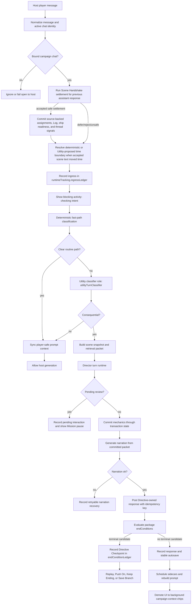
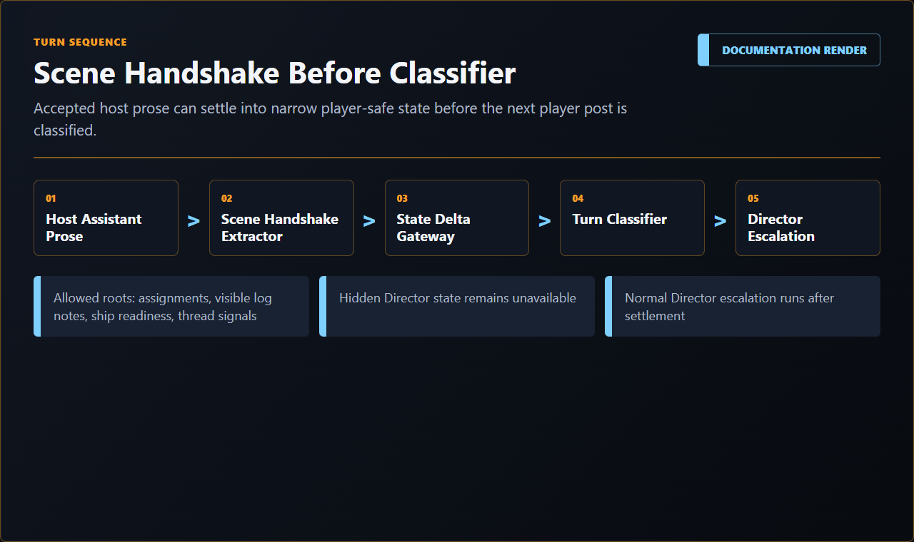
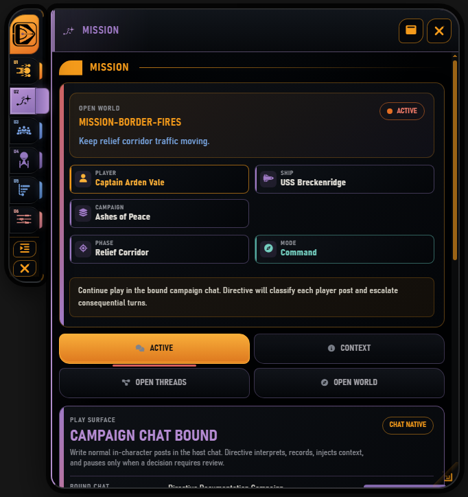
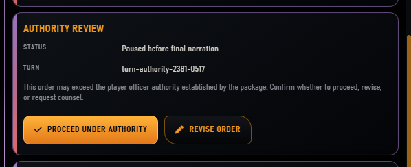
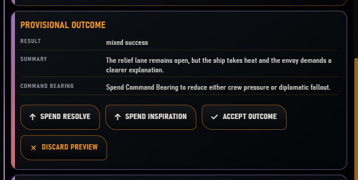
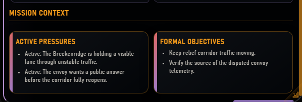
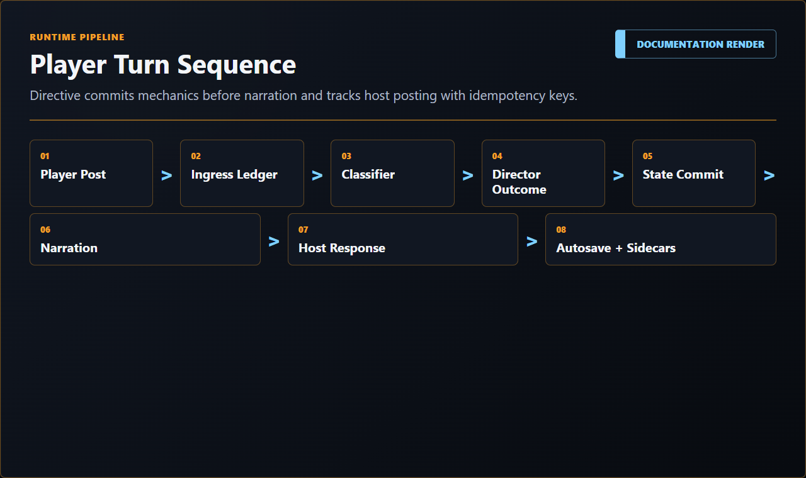

# Player Turn Sequence

This document explains the current player-post lifecycle from host ingress to stable save.

## Plain-Language Flow

1. The player writes in the bound campaign chat.
2. Directive checks whether the previous assistant response and the new player reply create a Scene Handshake settlement.
3. If the handshake is accepted and safe, Directive commits source-backed assignments, Command Log notes, ship readiness notes, or thread signals before normal turn classification.
4. If the accepted scene pair implies elapsed time, Directive resolves a deterministic or Utility-proposed time boundary and commits it before classification.
5. Directive shows a delayed chat activity pill such as `Directive is reading your post...`.
6. Directive records the current post as an ingress event.
7. Directive decides whether the post is scene color, scene navigation, routine, counsel, a pause, or a Director turn.
8. The activity pill updates to the current blocking phase, such as checking intent, advancing the scene, logging the action, resolving the command, or writing the response.
9. Routine turns synchronize prompt context and let the host continue; the activity pill remains through handoff until SillyTavern confirms native generation is starting.
10. Consequential turns commit structured mechanics before prose.
11. Narration is generated from the committed packet.
12. The response is posted exactly once with the current campaign reply header.
13. Directive checks package end conditions and may pause on a terminal checkpoint.
14. Directive autosaves and may schedule sidecars.
15. After the visible response is settled, sidecar work demotes to quiet `Updating campaign context...` chips rather than holding the main spinner at full weight.
16. If something fails, recovery resumes from the last durable step and the UI leaves a review state instead of disappearing immediately.

## Infographic

## Deep Flow

### Ingress

SillyTavern events enter through `src/hosts/sillytavern/shell-events.js`, which forwards player messages, edits, deletes, chat changes, and disable events into the runtime bridge. The generation interceptor enters through `src/hosts/sillytavern/runtime-bridge.mjs` and delegates to `runtimeApp.interceptGeneration`.

The runtime app exposes `observeHostPlayerMessage` and `interceptGeneration` from `src/runtime/runtime-app.mjs`. Those calls create or use the chat-native services built around `src/runtime/chat-turn-orchestrator.mjs`.

The orchestrator normalizes host messages, records ingress through `recordTurnIngress`, and serializes work per campaign id so duplicate or overlapping host events cannot race the same save.

### Active Binding Check

The active campaign is chat-affine. The orchestrator checks the current host chat id against campaign binding before taking authority over a turn. If the chat is not bound, Directive should not mutate campaign state for that post.

Operator-facing symptoms:

- the Mission route can show the campaign chat as bound or unbound;
- Campaign Records can block manual save when the active host chat does not match the loaded save;
- Rebind Chat is recovery/admin behavior, not normal first-start flow.

### Scene Handshake Settlement

Before normal intent classification, Directive can run the `sceneHandshakeSettler` role over the previous assistant message, the current player reply, and a compact player-safe runtime snapshot. The purpose is to settle accepted host-generated prose into structured state when the player treats that prose as true.

The settlement pass can propose only narrow, player-visible state:

- Mission open assignments;
- source-backed Command Log notes;
- low-risk ship readiness or technical-debt notes;
- thread signals.

Deterministic code validates source hashes, chat/save binding, duplicate settlement keys, allowed roots, stale source status, player acceptance, and hidden-state boundaries before applying operations through the state-delta gateway. Rejected, corrected, stale, wrong-chat, edited, or ambiguous source prose records a defer/review result instead of mutating campaign state.

Scene Handshake uses the Utility lane and cannot award Command Bearing, resolve quests, change hidden state, commit destructive outcomes, or produce chat prose.

### Time Adjudication

After accepted prior-scene settlement and before the current player post is classified, Directive can resolve elapsed time for the accepted assistant/player pair. Deterministic rules handle clear cases such as no-op conversation, short intra-ship movement, explicit waits, briefing review, travel/open-world boundaries, and direct scene cuts. If deterministic rules cannot confidently choose a delta, the `timeAdvanceAdjudicator` Utility role proposes a bounded elapsed-minute record.

The Utility proposal is not authority. Runtime validation clamps or rejects the proposed delta against current clock state, schedules, scene state, package constraints, and safe maximums, then commits an approved boundary through the campaign time ledger. Prompt context is marked dirty before classification continues, so the next reply header reflects committed campaign time rather than model inference.

### Classification

The turn classifier has layered behavior:

- deterministic fast paths for obvious cases;
- `utilityTurnClassifier` model role for ambiguous cases;
- deterministic arbitration of the final worker plan.

The classifier may choose inject-and-continue behavior, a Directive-owned turn, or a pending interaction. It does not mutate state by itself.

### Turn Activity Feedback

The SillyTavern host shows a delayed activity pill for blocking visible work. It should appear only after the short reveal delay so fast deterministic turns do not flash. The label is phase-specific:

- `Directive is reading your post...`
- `Directive is checking the prior scene...`
- `Scene details filed.`
- `Directive is syncing scene details...`
- `Directive is checking intent...`
- `Directive is advancing the scene...`
- `Directive is logging the action...`
- `Directive is filing an advisory note...`
- `Directive is preparing a clarification...`
- `Directive is preparing a checkpoint...`
- `Directive is reviewing the command...`
- `Directive is committing outcome mechanics...`
- `Directive is writing the response...`
- `Directive is handing the scene back to chat...`
- `Directive is syncing campaign context...`

The label should not call every post an order. `order`-style copy is reserved for command-resolution states, not scene color, scene navigation, counsel, or ordinary prose.

Scene Handshake uses the same activity pill instead of a separate toast. When it runs long enough to be visible, the pill says `Directive is checking the prior scene...`. If it commits accepted scene facts, it briefly reports `Scene details filed.` and keeps compact chips for the committed player-visible domains: `Orders`, `Log`, `Ship`, and `Threads`. If the settlement routes to internal review or operator recovery, the pill enters review mode as `Scene details need review.` with Mission access. Deferred or no-op settlements should not expose provider/model details or hidden-state reasons in the chat-facing copy.

For `injectAndContinue`, `Directive is handing the scene back to chat...` remains visible after Directive has finished classification, Scene Handshake, persistence, and prompt sync. It clears when the SillyTavern generation interceptor returns an allowed host-generation result for the same continuation path. A bounded timeout clears stale handoff feedback if the host never provides that generation-start signal.

When the host-visible outcome is settled but sidecar workers are still running, the activity demotes to `Updating campaign context...` with compact worker chips such as `Continuity`, `Crew`, `Ship`, or `Command Bearing`. Each chip clears as that worker settles. A failed or rejected background worker leaves a short review state with Mission access instead of vanishing at the same moment the visible response posts.

### Director Escalation

Consequential turns enter Director runtime. The runtime builds a scene snapshot from current campaign state, package data, mission graph, quest state, pressure state, crew context, and player input. It may call open-world/quest services or the current deterministic Mission Director.

The output is a turn packet containing:

- scene snapshot;
- command competence packet;
- outcome packet;
- state delta;
- narrator packet;
- Command Log packet;
- optional warning or Command Bearing eligibility.

### Pending Review

Some turns pause before commit:

- clarification needed;
- serious-risk confirmation;
- authority review;
- Command Bearing choice;
- replacement/outcome preview.

Pending interactions live in `runtimeTracking.pendingInteractions` and surface in Mission. They should be player-safe and should tell the operator what decision is required.

### Mechanics Commit

The commit path applies the turn packet before narration. `commitDirectorTurn` updates campaign-owned domains such as mission state, open-world state, clocks, Command Bearing, relationships, pressure ledger, actors/fronts, command competence records, relationship memory, Command Log, and turn ledger.

The turn commit coordinator then records mechanics status and persists the save. At this point the outcome exists even if narration fails.

### End-Condition Checkpoint

After mechanics commit, the runtime evaluates the package `endConditions` root against the committed outcome and current campaign state. A matched terminal candidate records:

- a detection entry;
- a `terminalOutcomeDecision` pending interaction;
- checkpoint metadata;
- allowed resolution actions;
- optional `Push On` continuation frames.

Mission renders this as a **Directive Checkpoint**. Replay restores the best retained checkpoint snapshot. `Push On` applies the selected continuation frame. `Keep This Ending` concludes the branch. `Save As Branch` writes a terminal timeline save so the terminal outcome can be preserved without forcing it to remain the active path.

### Narration

Narration uses the `narration` model role through the active generation route. The prompt must come from committed/player-safe packets. Narration cannot change mechanics. If narration fails, Directive records recovery and can retry from the same outcome id.

### Response Posting

Directive-owned turns abort normal host generation and post exactly one assistant response. Response records carry status and idempotency data so retry does not duplicate the same outcome. Directive-owned responses are prefixed with the current campaign reply header, such as `*Stardate 53049.2 | 0830 hours*`, using deterministic campaign state rather than model inference.

Host-native `injectAndContinue` generations are still host-authored prose, but Directive observes the resulting assistant message when the host path exposes it. The Continuity Projection Matrix (CPM) guard reviews observed text for protected identity and travel contradictions, quarantines generated claims, records rejected claims, and marks the ingress/response `recoveryRequired` instead of treating retry-class continuity violations as accepted output. When the host cannot safely edit/delete/regenerate the bad message through a supported API, recovery is explicit rather than silent acceptance.

Directive also installs a high-priority reply-header prompt block that names the exact current header and tells the model not to infer elapsed time from prior headers.

For host-native swipes, Directive treats the currently selected assistant variant as the continuity source on the next accepted player reply. Raw JSONL rows, visible message indices, and selected swipe text are separate layers; recovery and source-capture code should use the live selected text that the player accepted, not an unselected alternate.

### Autosave And Sidecars

After stable narration, the runtime creates a stable autosave. Sidecars may run after committed state is available. They operate on snapshots and propose validated deltas, or they journal failures without mutating state.

## Reusable Extension Pattern

For a new extension, reuse the pattern rather than the Star Trek specifics:

1. Keep host ingress narrow and normalized.
2. Make classification explicit before expensive work.
3. Commit authoritative mechanics before prose.
4. Make generated prose a presentation layer.
5. Store ingress, response, model-call, recovery, and sidecar journals separately.
6. Require idempotency for host posting.
7. Make edit/delete recovery snapshot-based, not guess-based.

## Render Slots

Runtime turn-sequence examples:

  

  

  

  

  

  

