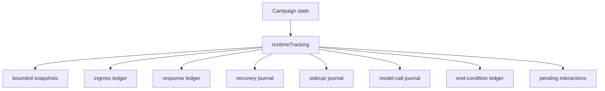
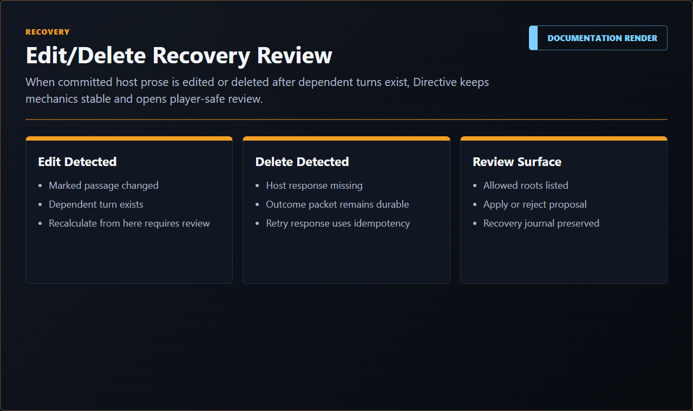

# State Transactions And Recovery

This document explains Directive's tracked state, save model, turn ledger, sidecar application, and recovery rules.

## Plain-Language Model

Directive treats campaign state like an aircraft flight recorder. Every important operation should leave enough trace to answer:

- what did the player send?
- what did Directive decide?
- what structured outcome was committed?
- what response was posted?
- what failed?
- which save revision can recover the campaign?

The user-facing version of this contract is [Storage And State Safety](../user/STORAGE_AND_STATE_SAFETY.md).

## Authoritative Stores

| Store | Meaning |
| --- | --- |
| Package records | Reusable campaign templates. |
| Draft records | Character Creator work before campaign state exists. |
| Save index | List of saves, autosaves, branches, and current save references. |
| Save records | Full campaign state snapshots. |
| Host settings | Preferences, provider config without secrets, pointers, lightweight diagnostics. |

Mission Components live inside campaign save state under the reviewed knowledge/component ledger, not in host lorebook storage. They are playthrough records tied to selected source text and source metadata.

External context-extension observations are diagnostics, not campaign state. Native World Info entries, generated Memory Books entries, Summaryception summaries, VectFox vector hits, prompt keys, and retrieval timings can be recorded as bounded counts, hashes, refs, statuses, unavailable reasons, and redaction summaries. They must not dirty mechanics, prompt context, rollback snapshots, or committed facts merely because an external snapshot changed. A future import/export path must be explicit, reviewed, source-referenced, and approval-backed before any external material becomes Directive authority.

## Campaign Runtime Tracking

`runtimeTracking` contains the operational ledger around the campaign state:

- `revision`;
- `history`;
- `ingressLedger`;
- `responseLedger`;
- `recoveryJournal`;
- `sidecarJournal`;
- `modelCallJournal`;
- `endConditionLedger`;
- `pendingInteractions`.

## Commit Rules

### Layman's View

Every state change must say which part of the campaign it is allowed to touch. If it tries to touch a different part, Directive rejects it.

### Deep View

`src/runtime/state-delta-gateway.mjs` defines mutable campaign domains and checks domain names before commit. `commitTrackedCampaignState` creates a new tracked revision and records history. `applyTrackedStatePatch` and `applyStateDeltaOperations` are used when callers need patch/operation style updates.

Director turn packets are applied by `src/campaign/transaction-state.mjs`, which updates campaign domains and appends turn-ledger and command-log records.

## Turn Ledger

The turn ledger records committed outcomes and bounded snapshots. It supports:

- no reroll on narration swipe;
- narration success/failure records;
- replacement narration against same outcome;
- edit committed outcome from retained snapshot;
- delete committed outcome by restoring pre-outcome snapshot;
- branch-safe save behavior.

## End-Condition Ledger

`runtimeTracking.endConditionLedger` records terminal detections and their resolution state. It contains:

- detections;
- pending or resolved terminal decisions;
- continuation frames selected through `Push On`;
- terminal timeline branch records.

Terminal detection happens after mechanics commit, so the terminal consequence is a committed timeline fact until the operator resolves the checkpoint. Replay restores the retained checkpoint snapshot. If the direct turn-ledger snapshot is unavailable, the runtime falls back to runtime history snapshots tied to the outcome id, then pre-last-stable and latest retained snapshots. `Push On`, `Keep This Ending`, and terminal branch saves are ordinary tracked state transactions.

## Time Ledger

Campaign time is campaign state. The reply header reads from that state; it does not create elapsed time by appearing in chat.

`src/time/campaign-time-state.mjs` normalizes package-authored opening ship time, derived elapsed minutes, and `timeLedger` entries. Deterministic world-time and travel operations can append time boundaries directly. The `timeAdvanceAdjudicator` Utility role can propose elapsed minutes for ambiguous accepted-scene movement, but it has no state roots. Runtime validation owns the commit and records the boundary before prompt context is rebuilt.

Time boundary records should preserve:

- source action or accepted-scene id;
- prior and new stardate/minute;
- elapsed minutes;
- reason;
- validation path;
- prompt-rebuild requirement.

## Mission Components

Mission Components are reviewed player-curated records created from highlighted chat text. The saved record preserves the selected source text separately from editable title, type, status, source authority, tags, links, and summary.

Saving, updating, and archiving a component are tracked state transactions. The Utility model can propose structure through `utilityJson`, but the final record is committed only after runtime validation and operator review. Components do not directly settle hidden truth, mutate package data, award Command Bearing, or rewrite the Mission Director outcome ledger.

## Narration Recovery

Narration happens after mechanics commit. If narration fails:

1. the outcome remains committed;
2. Directive records pending narration recovery;
3. retry uses the same outcome id and narrator packet;
4. the save remains consistent.

This prevents provider failure from becoming a hidden mechanics reroll.

## Message Edit And Delete

Message edits and deletes flow through the message reconciler. A safe, dependent-free change can roll back to a retained snapshot. A change with dependent committed turns becomes review-required instead of silently corrupting continuity.

Native assistant swipes add another source-truth layer. The raw chat file can contain multiple assistant variants for the same visible message, while the player sees and accepts only the selected variant. Directive-owned response records, Scene Handshake, Continuity Projection Matrix (CPM) checks, Mission Components source matching, and recovery should treat the selected visible text as the accepted continuity source. If a later edit, delete, or swipe change invalidates a dependent committed turn, recovery should create a review-required state instead of silently adopting an unselected alternate.

External visibility metadata is not delete evidence by itself. Summaryception `extra.sc_ghosted` or `ghostedIndices`, Memory Books hide/unhide markers, VectFox prompt exclusion, and native hidden flags should be preserved as visibility reasons while source ids and text hashes continue to prove row existence. True deletes and text edits dominate visibility metadata, but the recovery record must say which kind of mutation occurred.

<!-- directive-render: id=docs-directive-message-recovery-swipes; target=assets/documentation/renders/docs-directive-message-recovery-swipes.png; source=diagram-or-fixture; -->
Render needed: recovery/source-truth diagram showing edits, deletes, swipes, selected assistant variants, ingress/response ledgers, snapshot restore, review-required state, and prompt rebuild.

Recovery and save-guard renders:

  

  

  

  

## Manual Saves And Branches

Manual saves are chat-affine. Save Game and Save Game As are available only when the active host chat matches the loaded campaign save binding.

Save Game overwrites the active save. Save Game As creates a named branch with parent/divergence metadata and updates the active binding to the new save branch.

Records also supports load and delete without requiring the selected save's chat to be active.

Terminal timeline branches are created from a committed terminal checkpoint. The saved branch preserves terminal metadata and rewrites the cloned `campaignChatBinding.saveId` to the branch save id, so loading the branch does not retain the source save binding.

## Sidecar Application

Sidecars submit operation proposals with:

- worker id;
- base revision;
- operations;
- allowed roots;
- summary/reason.

The state gateway rejects stale base revisions and unauthorized roots. Accepted operations commit a new revision, journal the result, persist, and rebuild prompt context.

## Reusable Extension Pattern

1. Keep state templates separate from playthrough saves.
2. Use monotonic revisions.
3. Record snapshots before consequential commits.
4. Track ingress and response separately.
5. Make sidecars proposal-only.
6. Make manual save guard check the host identity that actually owns the save.
7. Store enough diagnostics to recover without leaking hidden content.
