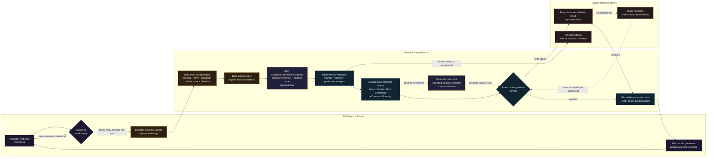

# Story Director Turn Flow

This diagram shows how Directive turns a player message into durable, replayable story state. The model proposes interpretation; deterministic runtime code validates and commits consequences; SillyTavern's main model narrates the next provisional response.

## Core boundary

**Model proposes. Runtime commits. Narrator continues.**

- Assistant swipes are provisional until a player reply accepts one exact pair.
- The Utility interpretation call has no direct authority over campaign state.
- Deterministic validation and planners derive the accepted consequences.
- Persistence retries reuse the validated interpretation instead of issuing new model calls.
- If durable settlement cannot be completed, narration is blocked rather than partially applied.
