# Directive Operator Manual

This manual describes Directive's implemented pre-alpha chat-native runtime. It is written as the practical operator guide: what each control surface is for, what its sub-elements mean, and what to do when the campaign needs recovery.

Runtime visuals in this manual use final SillyTavern-hosted captures from `assets/documentation/renders/`. Remaining host-specific and micro-interaction gaps are tracked in [Documentation Render Capture Plan](../planning/DOCUMENTATION_RENDER_CAPTURE_PLAN.md).

For implementation detail, see [Directive Technical Manual](../technical/DIRECTIVE_TECHNICAL_MANUAL.md).

## Before You Start

Directive is pre-alpha. The active pre-alpha host is SillyTavern. Other host adapters, including possible future Lumiverse support, are deferred until after the SillyTavern alpha stabilizes.

Before running a campaign:

1. Install or refresh Directive in the host.
2. In SillyTavern, install or update the [Directive preset](SILLYTAVERN_PRESET.md).
3. Open Directive.
4. Configure Utility and Reasoning providers under **Settings > Providers** if the current host model should not handle every role.
5. Choose or import a campaign package.
6. Create the player officer.
7. Start the campaign and play in the fresh campaign chat Directive creates.

Directive creates and selects a Directive-owned host character card during first-start activation. You do not need to create or select a SillyTavern character/group to own the campaign chat.

<p align="center">
  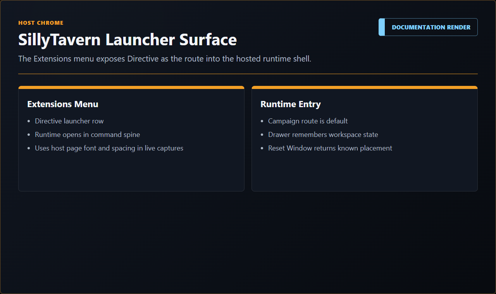
</p>

## Reply Header And Time

Every Directive-bound campaign reply should begin with the current campaign display header:

```text
*Stardate #####.# | HHMM hours*
```

The header is a display wrapper. It is not evidence that time advanced, and older headers in chat history should not be treated as campaign facts. Directive-owned replies prefix the header deterministically from campaign state. Host-native SillyTavern generations receive a prompt block that tells the model to use the current header and ignore older headers as time evidence.

If the clock looks wrong, treat it as a campaign-state or prompt-sync issue, not as something to fix by editing prior chat prose. The current timekeeping contract lives in [Timekeeping System](../architecture/TIMEKEEPING_SYSTEM.md).

<p align="center">
  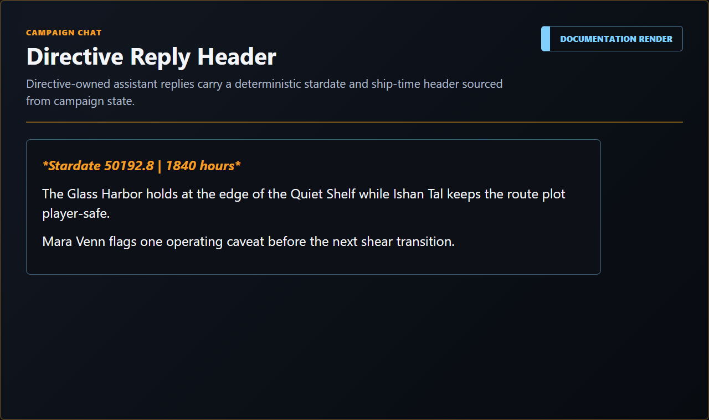
</p>

## Runtime Shell

### Purpose

The runtime shell is the operator console. It is not the source of campaign truth. It displays and controls the current save, package library, mission state, crew, ship, log, and settings.

### Desktop And Tablet Layout

Desktop and tablet use a left command spine with six routes:

| Route | Shelf Label | Use It For |
| --- | --- | --- |
| Campaign | Library & Records | Package selection, active campaigns, saves, branches, import, recovery, conclusion. |
| Mission | Command & Context | Active mission support, pending reviews, committed outcomes, Open Threads, Open World work. |
| Crew | Roster & Roles | Senior staff, public crew state, relationships, crew-linked threads. |
| Ship | Status & Systems | Ship baseline, condition, damage, restrictions, technical debt, active advisories. |
| Log | Index & Recall | Player-facing command history, consequences, committed inputs, assisted summaries. |
| Settings | Providers & Controls | Runtime controls, providers, model routing, prompt/preset controls, state safety. |

### Phone Layout

Phone width uses a full-screen shell with bottom navigation. The same six routes exist, but dense route content may stack into mobile-specific layouts.

### Shell Controls

The shell owns:

- opening and closing the command drawer;
- route switching;
- drawer width;
- fullscreen/workspace escalation for dense workflows;
- Reset Window behavior;
- mobile bottom navigation;
- persisted UI geometry.

### Reset Window

Use **Reset Window** when shell geometry or route-local UI state becomes awkward. It resets transient UI state such as drawer geometry and route-local selections. It does not delete packages, saves, campaign state, provider settings, or host chat content.

Runtime shell renders:

<p align="center">
  
</p>

<p align="center">
  
</p>

<p align="center">
  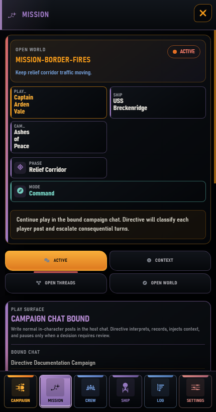
</p>

<p align="center">
  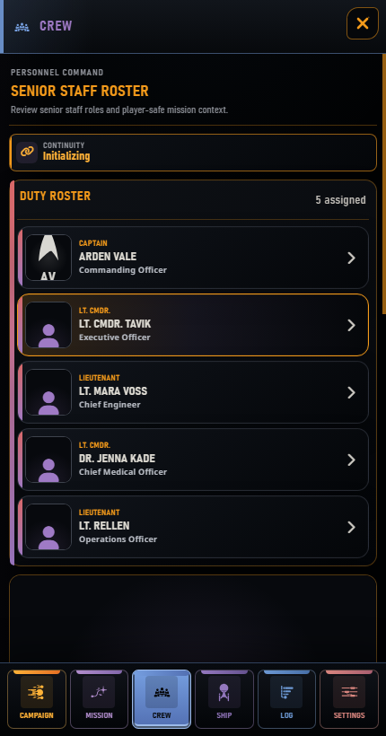
</p>

<p align="center">
  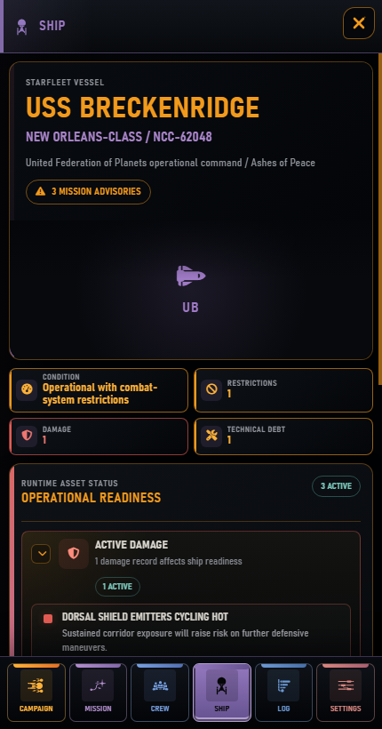
</p>

<p align="center">
  
</p>

<p align="center">
  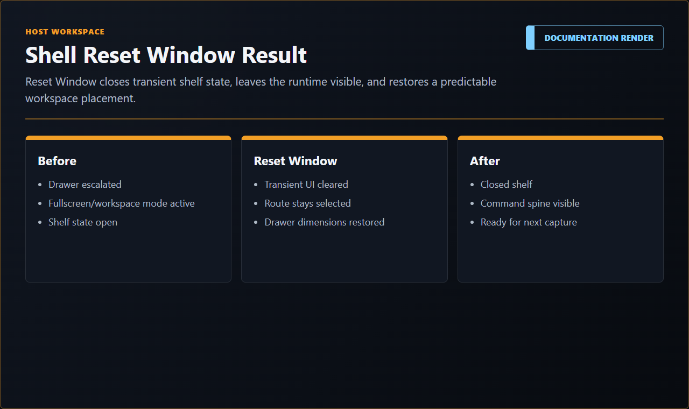
</p>

## Campaign Route

Campaign is the library, campaign index, package import, and save-record surface. Normal play continues in the bound campaign chat and Mission route; Campaign is for setup and campaign records.

Campaign has three subtabs:

1. **Command**
2. **Library & Import**
3. **Records**

### Campaign Command

Use **Command** as the active campaign overview.

When no campaign is loaded, Command tells you to choose a campaign package or load a save.

Command shows one card per campaign/playthrough. If a campaign has multiple manual saves, autosaves, or Save Game As branches, the Command card represents the latest save by timestamp. Records remains the place to inspect every individual save and branch.

When a campaign is loaded, Command can show:

- campaign title;
- active player officer;
- ship;
- mission and phase;
- stardate;
- Campaign Difficulty;
- bound chat identity;
- prompt-context revision;
- latest committed moment;
- latest save;
- save count;
- Open Orders status;
- recovery actions.

Common actions:

| Action | Meaning |
| --- | --- |
| Open Campaign Chat | Opens the host chat bound to the latest save. Use this to return to play. |
| Load Latest Save | Loads the latest save for the campaign and opens Mission. |
| Change Campaign Difficulty | Changes this campaign between `Exploration` and `Command` for future outcomes. Prior Command Log entries and committed consequences are not rewritten. |
| Rebind Chat | Recovery/admin action. Binds the loaded save to the currently open host chat and rebuilds prompt context. |
| Finish Chat Setup | Continues an interrupted campaign activation from the last successful journaled step. |
| Retry Chat Setup | Retries a failed activation step. |
| Conclude Campaign | Begins recoverable campaign conclusion. |
| Retry Conclusion | Continues a failed conclusion. |
| Archive Campaign | Marks a completed campaign inactive while preserving final save state. |

Rebind Chat is not the normal first-start path. New campaigns create a fresh campaign chat during activation.

Campaign Difficulty is campaign-owned, not a global Settings preference. `Exploration` keeps causality but blocks player and senior-staff death; `Command` preserves full causal severity when serious risk is established. If a provisional outcome is pending, resolve or discard it before changing difficulty.

Campaign Command renders:

<p align="center">
  
</p>

<p align="center">
  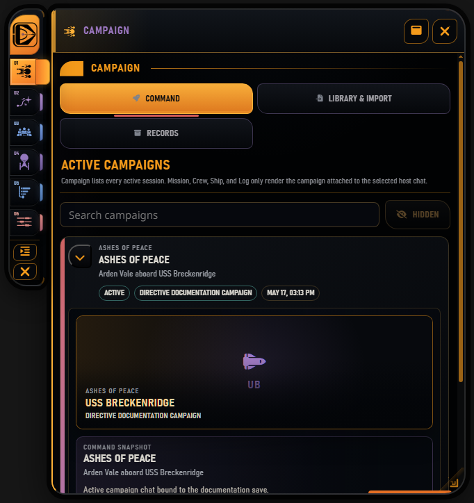
</p>

<p align="center">
  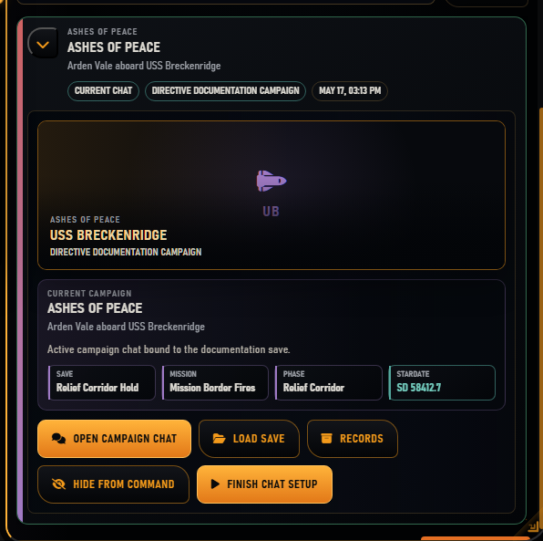
</p>

<p align="center">
  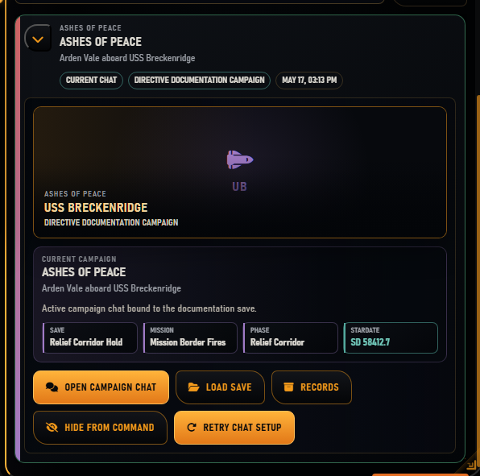
</p>

<p align="center">
  
</p>

<p align="center">
  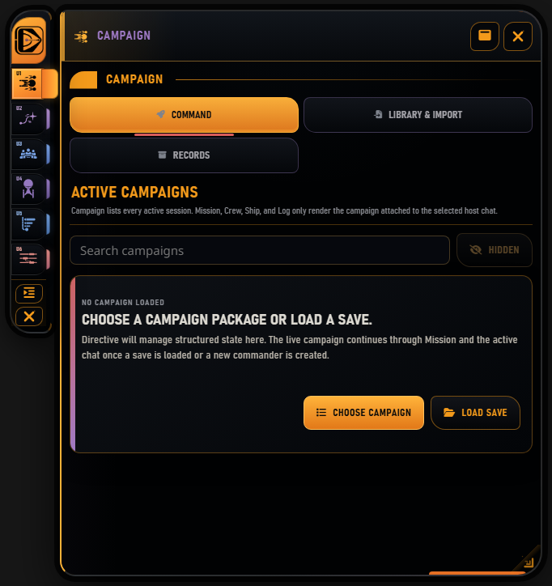
</p>

<p align="center">
  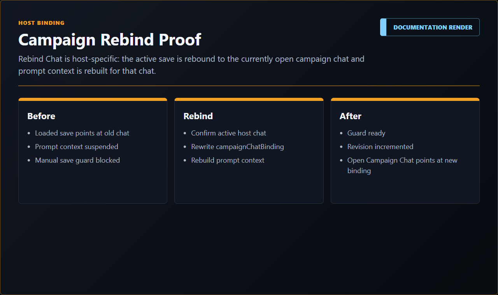
</p>

### Campaign Library & Import

Use **Library & Import** to browse campaign packages and import `.directive-campaign.zip` packages.

Package browsing does not create campaign state and does not install prompt context.

Package detail can include:

- package title and status;
- premise and player role;
- ship context;
- campaign hook;
- tone and expected length;
- chapter/quest summary;
- package health;
- package image or fallback;
- available records;
- package actions.

Common actions:

| Action | Meaning |
| --- | --- |
| New Campaign | Opens Character Creator for the selected package. |
| Load Save | Loads the latest matching campaign save when available. |
| Choose File | Selects a `.directive-campaign.zip` package to import. |
| Drop Zone | Imports a dropped package archive. |

Import diagnostics can report invalid transport extension, unsafe archive paths, active content rejection, invalid JSON, missing or ambiguous package JSON, package id mismatch, or schema/package health issues.

Campaign Library and import renders:

<p align="center">
  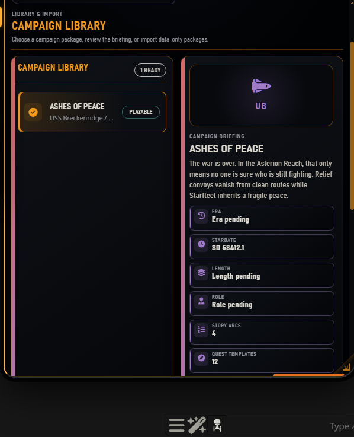
</p>

<p align="center">
  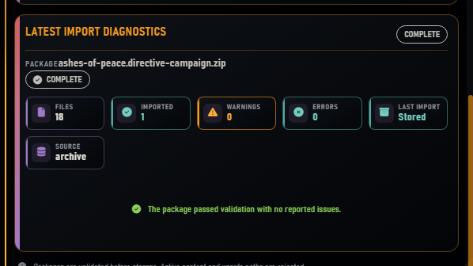
</p>

<p align="center">
  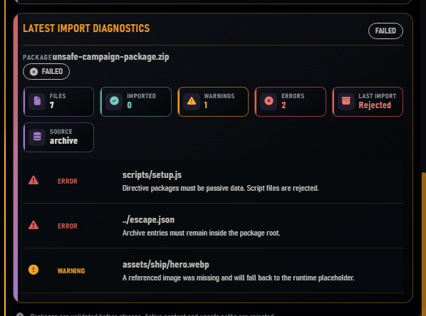
</p>

### Campaign Records

Use **Records** to inspect, load, branch, and delete campaign saves.

Records groups saves by campaign folder. Each group can be expanded or collapsed. Each save row shows whether it is active, stored, user-created, or an autosave.

Save selection supports:

- single click for detail selection;
- Shift-click for a range;
- Ctrl-click or Command-click for multi-select;
- bulk delete for selected saves.

The save inspector can show:

- campaign;
- stardate;
- active mission;
- phase;
- Campaign Difficulty;
- summary;
- active save guard status;
- save actions.

Common actions:

| Action | Meaning |
| --- | --- |
| Save Game | Overwrites the active save if the active host chat matches the loaded save binding. |
| Save Game As... | Creates a named save branch from the active campaign state. |
| Load Save | Loads the selected save and opens Mission. |
| Delete Save | Deletes the selected save payload. |
| Delete Selected | Deletes multiple selected saves. |
| Open Campaign Chat | Recovery action shown when the save guard can open the correct bound chat. |

### Active-Chat Save Guard

Manual save is chat-affine. Save Game and Save Game As are disabled when Directive cannot confirm that the active host chat belongs to the loaded save. The guard protects against accidentally overwriting one campaign with another chat's state.

Blocked save cases include:

- active host chat is missing;
- selected chat belongs to another save branch of the same Directive campaign;
- selected chat belongs to another Directive campaign;
- selected chat has conflicting Directive metadata;
- host cannot report enough chat identity to prove safety.

Records renders:

<p align="center">
  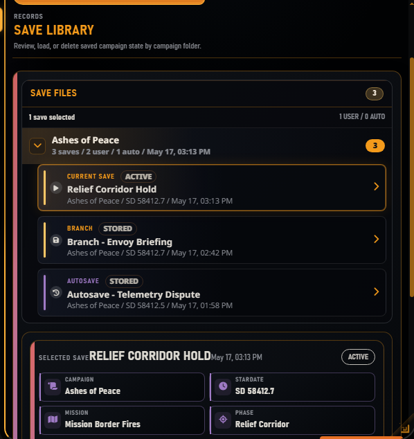
</p>

<p align="center">
  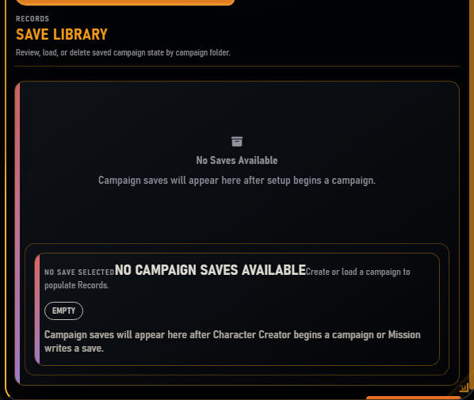
</p>

<p align="center">
  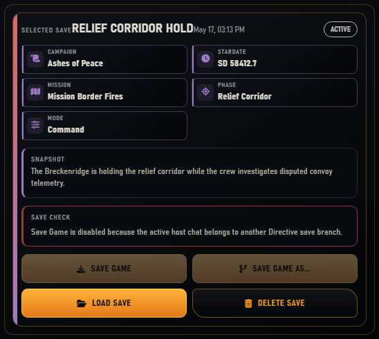
</p>

<p align="center">
  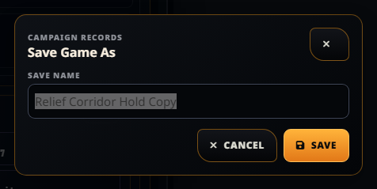
</p>

<p align="center">
  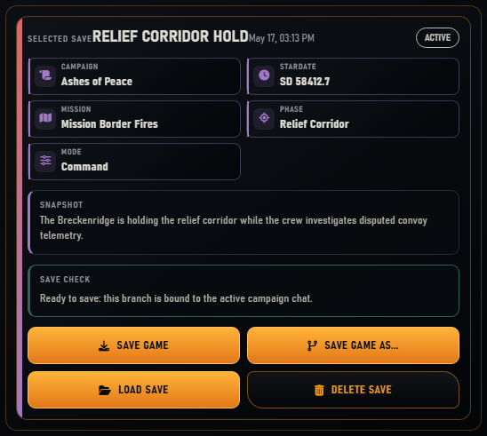
</p>

<p align="center">
  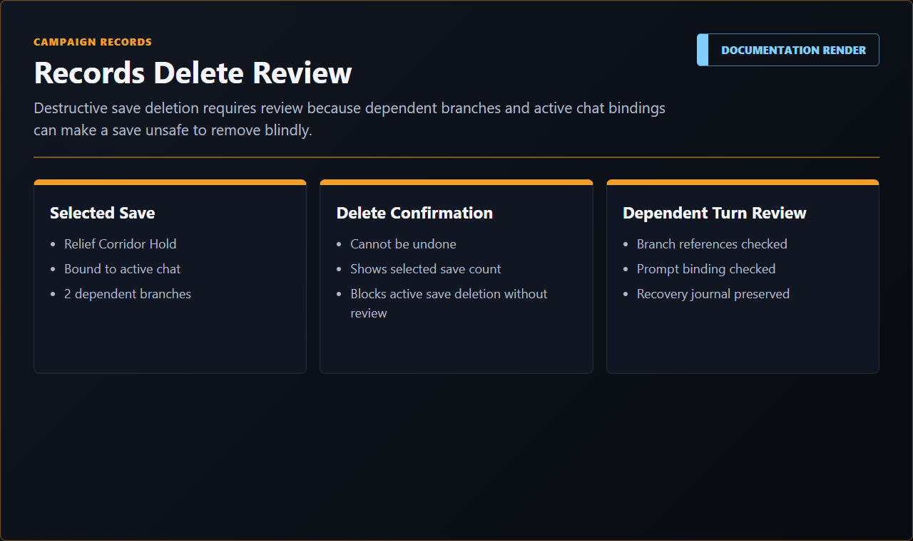
</p>

## Character Creator

Character Creator creates the player officer before campaign state exists. The package owns the available choices and role framing.

### Draft Lifecycle

| State | Meaning |
| --- | --- |
| New Draft | No meaningful player-officer setup has been saved. |
| Resume Draft | A meaningful draft exists for the package. |
| Save Draft | Preserves setup without creating campaign state. |
| Discard Character | Clears the draft after confirmation. |
| Start Campaign | Accepts the reviewed officer and begins campaign activation. |

### Step Navigation

The current guided creator uses package-owned steps:

1. Identity
2. Service
3. Personality
4. Review

Step controls can appear active, complete, locked, or needing attention.

### Identity

Identity fields include:

- Given Name;
- Family Name;
- Species;
- Age Band;
- Appearance.

These fields define visible identity and play context. They should not create hidden campaign state.

### Service

Service fields include:

- Career Background;
- Formative Experience;
- Assignment Reason;
- Service Summary.

The dropdowns define the structured service choices. Service Summary is editable dossier text; **Draft This Section** should turn the selected choices into a concise service record rather than merely confirming that the choices are valid.

### Personality

Personality fields include:

- Insight;
- Connection;
- Execution;
- Flaw;
- Command Style.

The dropdowns are characterization controls, not a visible XP system. Command Style is editable dossier text; **Draft This Section** should summarize how the selected traits and flaw read in play.

### Review

Review shows the assembled dossier and readiness state. Validation failures should tell the operator which required setup is missing.

### Player Portrait

Portrait controls may include:

- Import;
- Change;
- Remove;
- unsupported-state messaging when the host cannot store portraits.

Player portrait assets are user-owned campaign setup data, not package-owned crew art.

### Section Wand Assistance

Creator assistance can draft or revise sections. It uses the `characterCreatorSectionDraft` role and should produce editable text, not hidden campaign outcomes.

For Service and Personality, assistance uses the selected dropdown values as structured inputs and writes editable dossier text into Service Summary or Command Style. Provider fallback should be visible as fallback, not silently applied as if it were provider output.

Expected sub-elements:

- section assist command;
- preview;
- apply;
- regenerate;
- dismiss;
- provider failure fallback;
- validation warning if output is incomplete.

Character Creator renders:

<p align="center">
  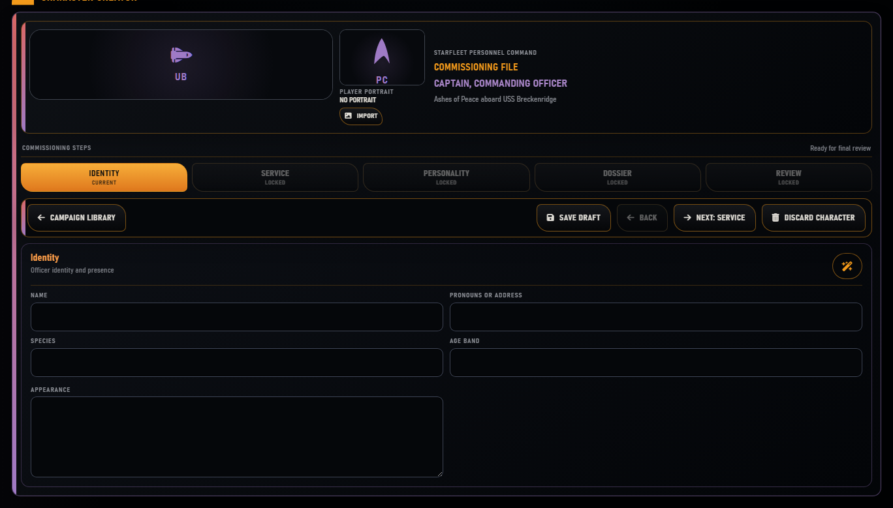
</p>

<p align="center">
  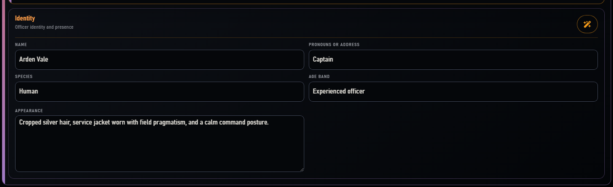
</p>

<p align="center">
  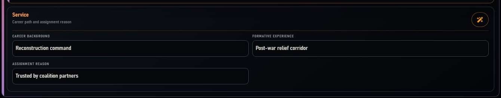
</p>

<p align="center">
  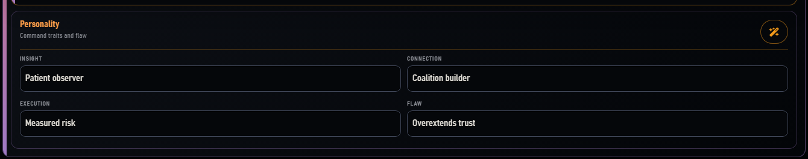
</p>

<p align="center">
  
</p>

<p align="center">
  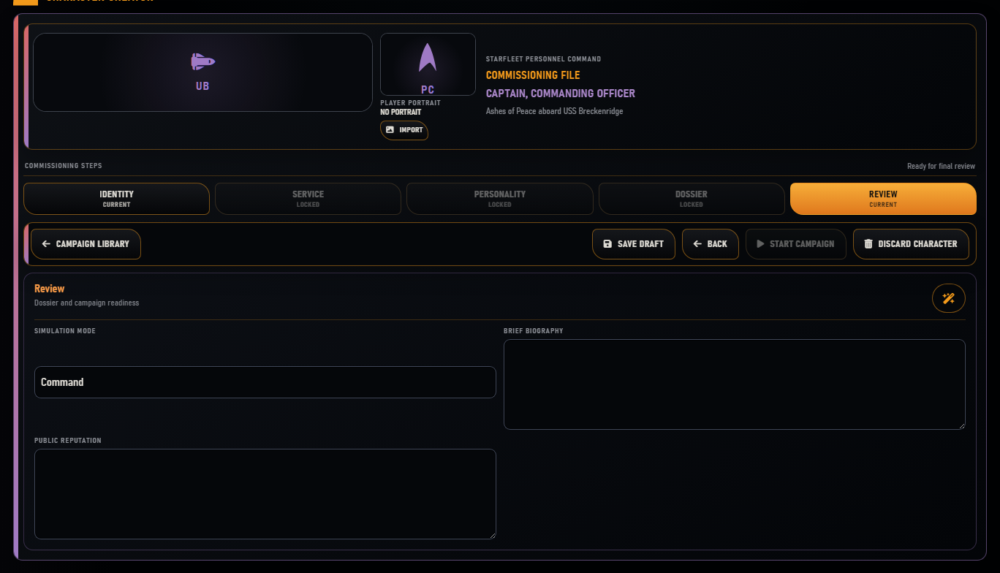
</p>

<p align="center">
  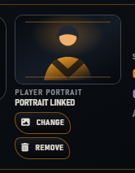
</p>

<p align="center">
  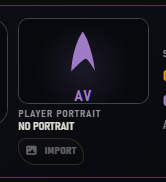
</p>

<p align="center">
  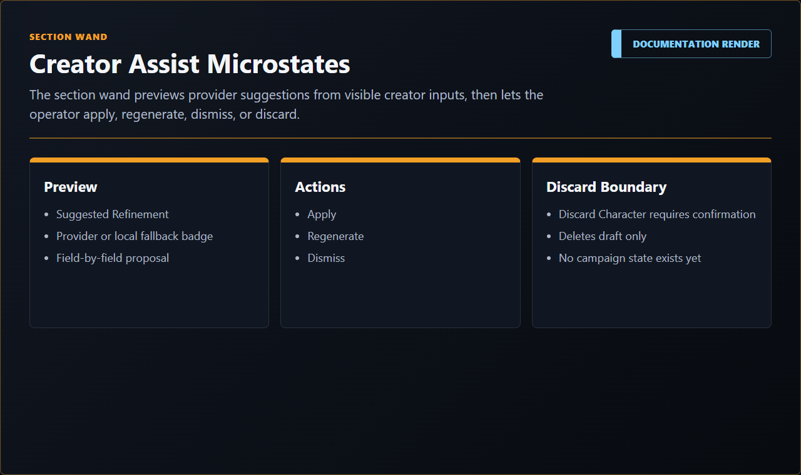
</p>

## Campaign Activation

### Purpose

Activation turns an accepted creator draft into a playable campaign save and chat.

### Activation Steps

Directive activation is journaled and idempotent. It can resume after a partial failure.

The expected sequence:

1. accept the creator draft;
2. create the first save;
3. create and select a Directive-owned host character card;
4. create a fresh campaign chat under that card;
5. bind campaign/save/chat metadata;
6. generate or compose the intro;
7. post the intro once;
8. install player-safe prompt context;
9. open the campaign chat;
10. mark activation active/complete.

During activation, SillyTavern displays the shared Directive activity pill in the chat surface. The long campaign-intro generation step uses **Writing opening scene...** with Save, Chat, and Opening Scene chips, then advances through prompt installation and **Campaign ready.** `Rewrite Intro` uses the same opening-scene activity feedback before play begins.

### Activation Recovery

If activation is interrupted, use **Finish Chat Setup**. If a step fails, use **Retry Chat Setup**. Recovery resumes journaled steps instead of repeating already-completed actions.

Activation renders:

<p align="center">
  
</p>

<p align="center">
  
</p>

<p align="center">
  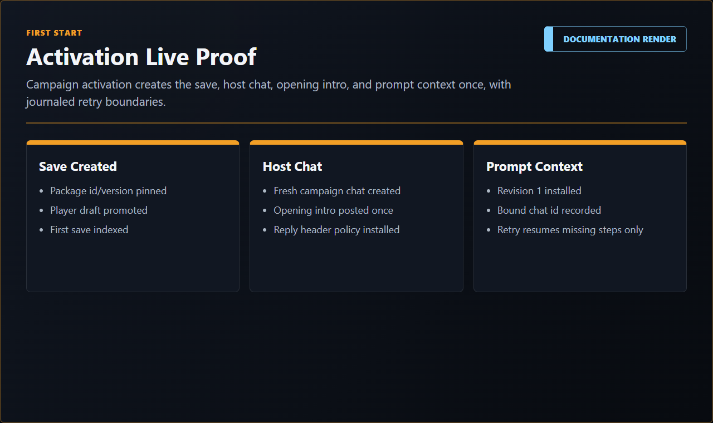
</p>

## Mission Route

Mission is the campaign support surface. It is not the default text entry surface; ordinary play continues in the bound campaign chat.

Mission has four subtabs:

1. **Active**
2. **Context**
3. **Open Threads**
4. **Open World**

### Mission Active

Use Active to see play status and recovery controls.

It can show:

- active campaign and mission;
- bound chat state;
- prompt context revision;
- committed revision;
- next suggested operator action;
- last outcome;
- pending interactions;
- committed outcome preview;
- recovery console.

Common actions:

| Action | Meaning |
| --- | --- |
| Open Campaign Chat | Returns to the bound host chat. |
| Finish/Retry Chat Setup | Continues activation recovery. |
| Confirm Risk | Confirms a serious-risk order and allows resolution. |
| Revise Order | Returns the player to chat to change the order. |
| Request Counsel | Asks for player-safe professional counsel. |
| Accept Outcome | Accepts a pending outcome or replacement. |
| Discard Preview | Drops an uncommitted preview. |
| Rewrite Narration | Regenerates prose without rerolling mechanics. |
| Rerun Outcome | Reruns mechanics from the retained pre-outcome snapshot where allowed. |
| Delete Outcome | Restores the campaign to the pre-outcome snapshot for the last outcome. |
| Retry Chat Response | Reposts a failed Directive-owned chat response. |
| Retry Narration | Retries narration for the same committed outcome id. |
| Replay From Checkpoint | Restores the retained checkpoint for a terminal outcome decision. |
| Push On | Accepts a package-authored playable continuation frame after a terminal candidate. |
| Keep This Ending | Accepts the terminal ending and concludes this campaign branch. |
| Save As Branch | Preserves the terminal timeline as a separate Records branch. |

### Pending Interactions

Mission can pause for:

- clarification;
- serious-risk confirmation;
- authority review;
- Command Bearing choice;
- outcome replacement review;
- terminal outcome checkpoint;
- recovery decision.

Pending interactions should be player-safe and specific about the decision required.

### Command Bearing Points

Command Bearing has two player-facing tracks:

- **Inspiration**: trust, courage, morale, and rallying leadership.
- **Resolve**: lawful authority, preparation, discipline, boundaries, and accepted responsibility.

Directive can show available points and an eligible Command Bearing choice after a provisional outcome is known. A point is not spent by opening Assist or asking whether a draft fits. It becomes readied only when the operator explicitly chooses an eligible Inspiration or Resolve intervention, and the spend applies to the exact sent player message and outcome context. If validation fails or the message changes out from under the readied point, Directive should cancel or return it rather than silently mutating the outcome.

Command Bearing cannot make impossible actions possible, erase anchored consequences, reveal hidden facts, or rewrite committed mechanics. It can improve an eligible provisional outcome within the rules described by the Command Bearing system and logged runtime state.

<p align="center">
  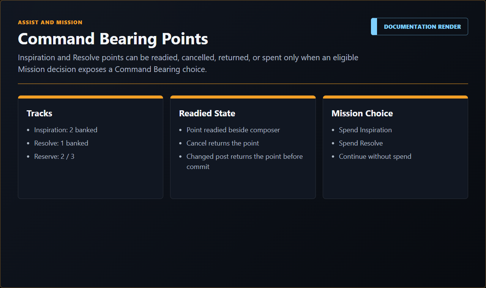
</p>

### Scene Handshake Settlement

Scene Handshake is the background pass that notices when the player accepts useful host-generated scene prose. If the prior assistant response gave clear assignments, operational status, readiness notes, or other player-visible obligations, and the player's next post treats that response as true, Directive can settle those facts into structured campaign state before classifying the new post.

Typical settled records include:

- open assignments in Mission;
- source-backed Command Log notes;
- ship readiness or technical-debt notes;
- player-visible thread signals.

Scene Handshake should not commit rejected, corrected, edited, stale, wrong-chat, hidden, or ambiguous prose. It is a narrow Utility-lane settlement pass, not a way for the model to invent new outcomes or award Command Bearing.

<p align="center">
  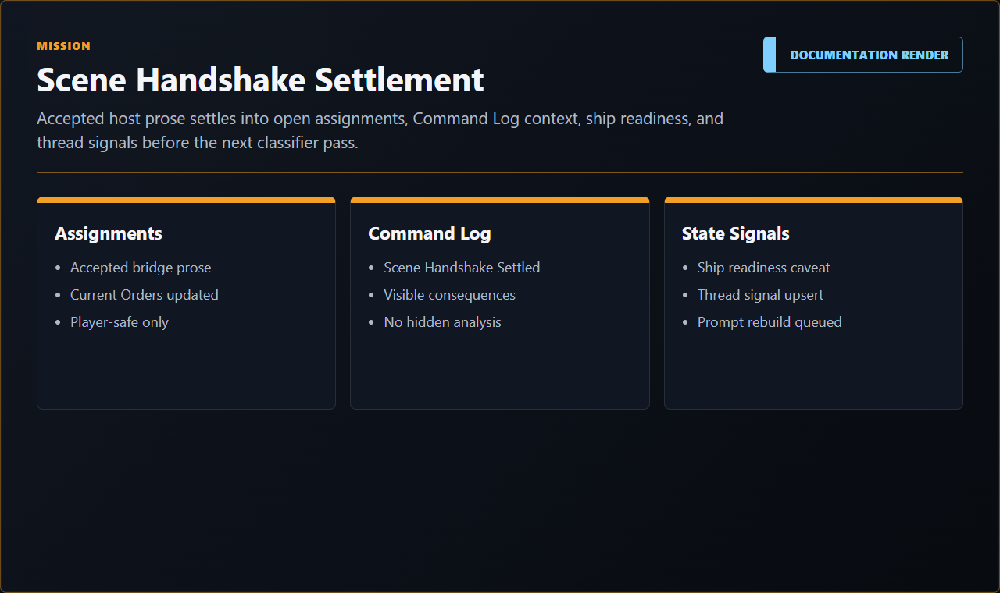
</p>

### Terminal Checkpoints

When an authored `endConditions` record matches a committed outcome, Mission shows a **Directive Checkpoint** card instead of silently ending the campaign. The committed consequence remains true on the current timeline until the operator resolves the checkpoint.

Possible checkpoint actions are package-defined:

| Action | Meaning |
| --- | --- |
| Replay From Checkpoint | Restores the selected pre-terminal checkpoint and rebuilds prompt context. |
| Push On | Continues through a package-authored aftermath frame when meaningful player agency remains. |
| Keep This Ending | Accepts the terminal outcome, writes conclusion metadata, and completes the branch. |
| Save As Branch | Saves the terminal timeline as a Records branch without making it the active path. |

Terminal timeline branches appear in Campaign Records with terminal-branch metadata. Loading one should preserve its own save binding rather than inheriting the source save id.

### Mission Context

Context shows player-safe operational situation:

- current objectives;
- active directives;
- established facts;
- uncertainties;
- pressure;
- chapter checkpoint;
- safe alpha actions where relevant.

Context is for orientation; it should not reveal hidden Director-only truth.

### Open Threads

Open Threads are player-visible ongoing concerns. They can be story, crew, ship, or operational threads.

Each visible thread can show:

- shape;
- title;
- status;
- summary;
- source;
- stakes;
- linked crew or ship systems;
- last engaged information;
- More/Less disclosure for long copy.

Hidden, latent, and watchlisted threads remain out of this view until runtime state makes them visible.

### Open World

Open World shows side work and quest opportunities.

Possible sub-elements:

- available opportunities;
- active side work;
- focus action;
- delegate action;
- pause action;
- abandon action;
- progress and scene beats;
- empty state when no visible open-world work is active.

### Recovery Console

Recovery tools are grouped away from normal command play. Use them when a response, narration, reconciliation, or outcome state needs repair.

Mission renders:

<p align="center">
  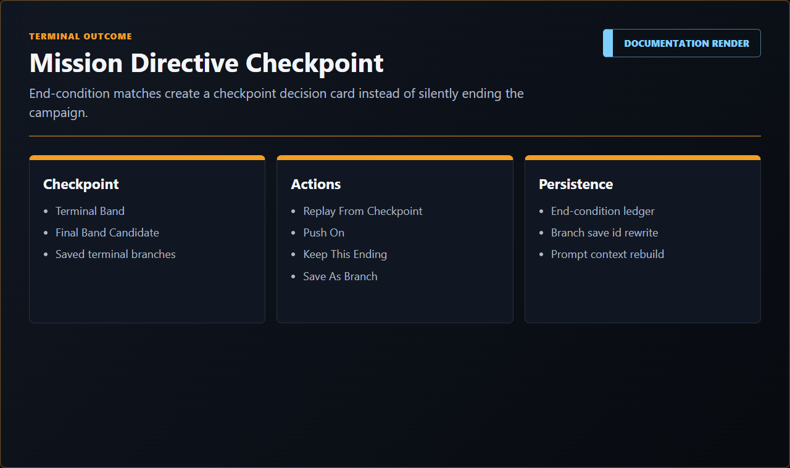
</p>

<p align="center">
  
</p>

<p align="center">
  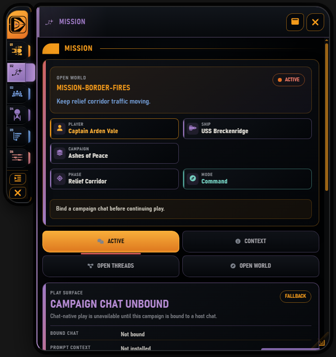
</p>

<p align="center">
  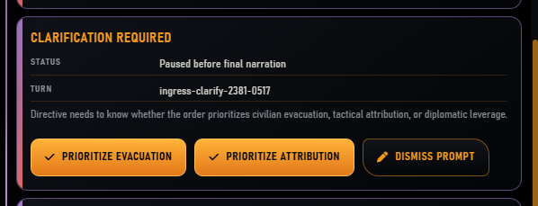
</p>

<p align="center">
  
</p>

<p align="center">
  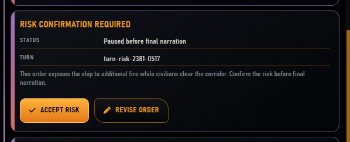
</p>

<p align="center">
  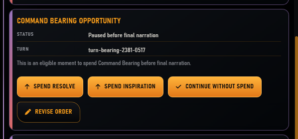
</p>

<p align="center">
  
</p>

<p align="center">
  
</p>

<p align="center">
  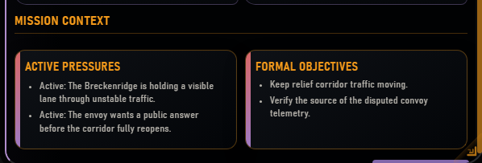
</p>

<p align="center">
  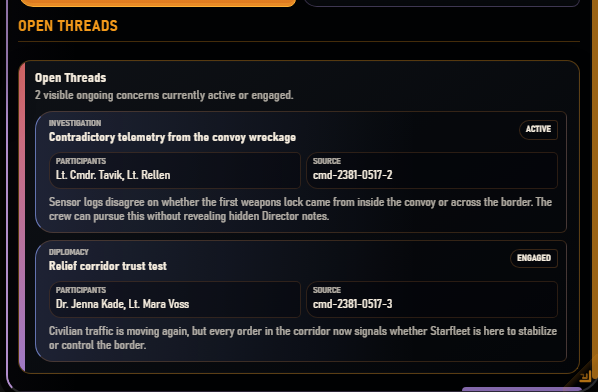
</p>

<p align="center">
  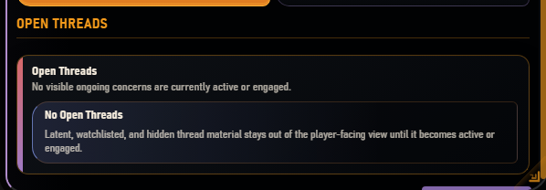
</p>

<p align="center">
  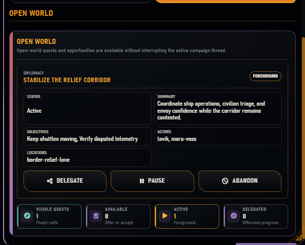
</p>

<p align="center">
  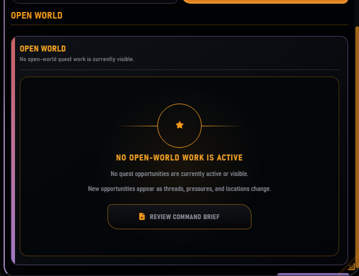
</p>

<p align="center">
  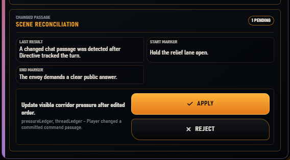
</p>

## Crew Route

Crew presents player-safe senior staff context. It does not expose raw hidden metrics.

### Duty Roster

The roster lists known officers and roles. It can include:

- player commander;
- senior staff;
- division/rank indicators;
- billet;
- portrait or fallback;
- selection state.

### Officer Dossier

The selected officer can show:

- name, rank, billet;
- public profile;
- biography with More/Less disclosure;
- public relationship posture;
- current pressure;
- open work;
- recent command memory;
- Open Threads;
- portrait controls where allowed.

### Relationship And Development Display

Crew relationship and development are qualitative. The UI should avoid raw hidden numbers and reveal only player-safe posture.

### Portrait Controls

Depending on the selected record and host support, Crew can expose:

- Import;
- Change;
- Remove.

Package-owned crew portraits and user-owned player portrait imports are different asset categories.

Crew renders:

<p align="center">
  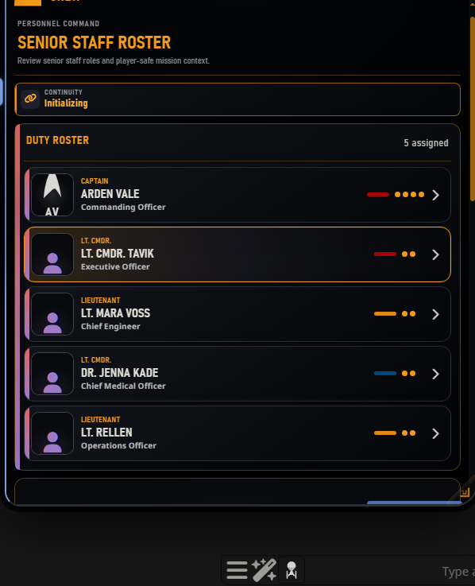
</p>

<p align="center">
  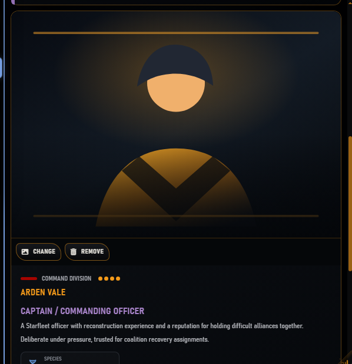
</p>

<p align="center">
  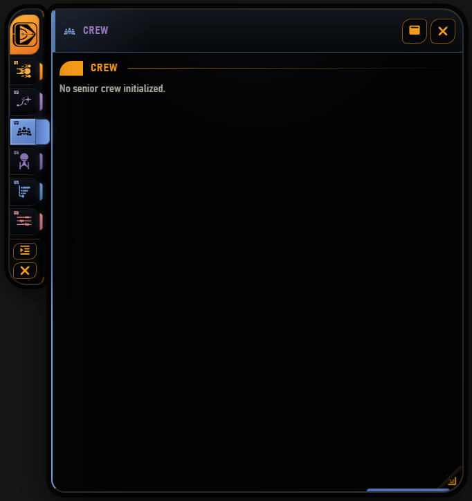
</p>

<p align="center">
  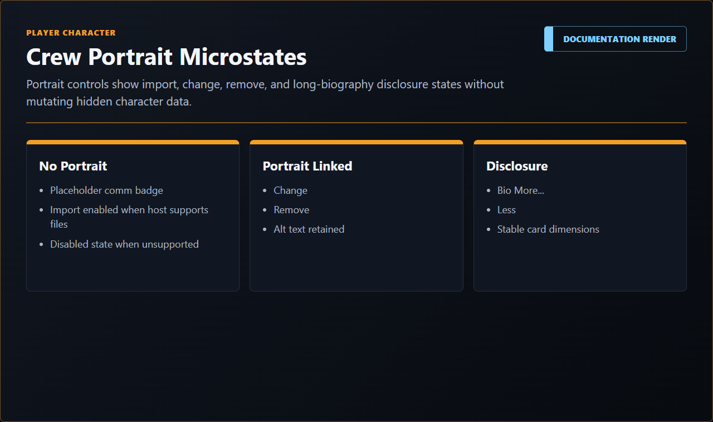
</p>

## Ship Route

Ship presents the current player-safe vessel state.

### Hero And Identity

The route can show:

- ship image or fallback;
- ship name;
- class;
- registry when known;
- affiliation or mission profile;
- active advisory count.

### Runtime Asset Status

Status folders and tiles can show:

- advisories;
- damage;
- restrictions;
- repairs;
- technical debt;
- clean/empty states.

### Engineering Report

The engineering report summarizes current ship condition from campaign-owned state and package baseline.

Ship renders:

<p align="center">
  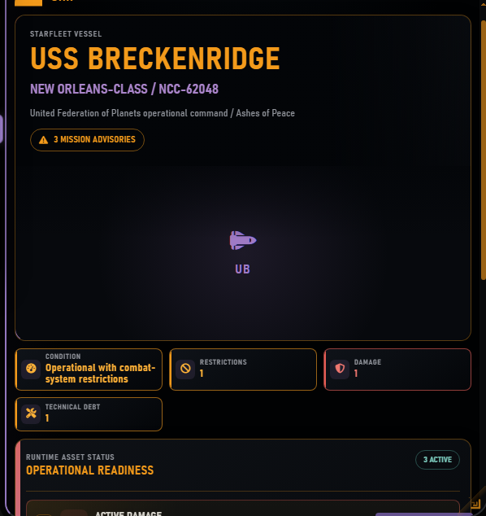
</p>

<p align="center">
  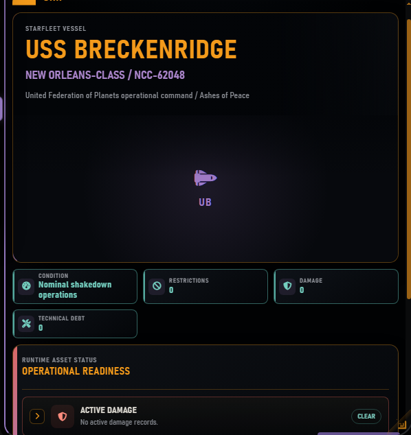
</p>

<p align="center">
  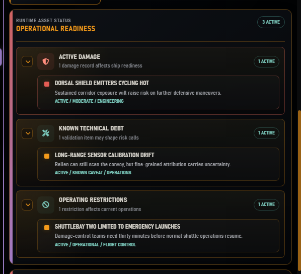
</p>

## Log Route

Log is the player-facing campaign memory index.

### Command History

Log shows committed outcomes from newest to oldest. Each record can include:

- chronological marker;
- latest-record marker;
- stardate;
- summary;
- visible consequences count;
- committed player input;
- details toggle.

### Details

Expanded details can include:

- player-facing summary;
- visible consequences;
- committed input;
- assisted summary when available;
- source or outcome metadata that is safe to show.

### Filters

Where exposed, filters/search should help find command history without changing campaign state.

Log renders:

<p align="center">
  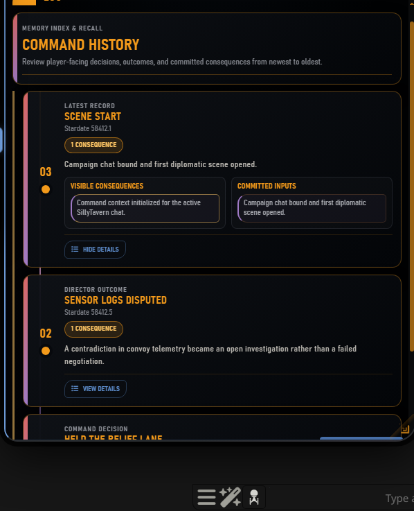
</p>

<p align="center">
  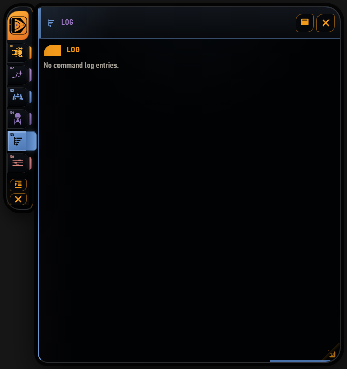
</p>

<p align="center">
  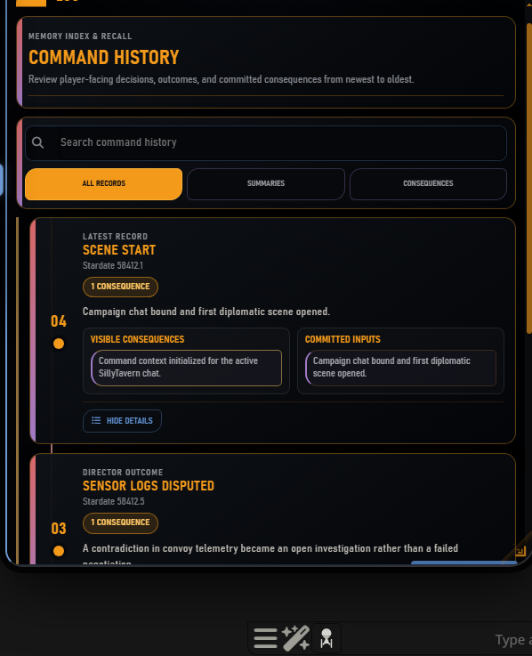
</p>

<p align="center">
  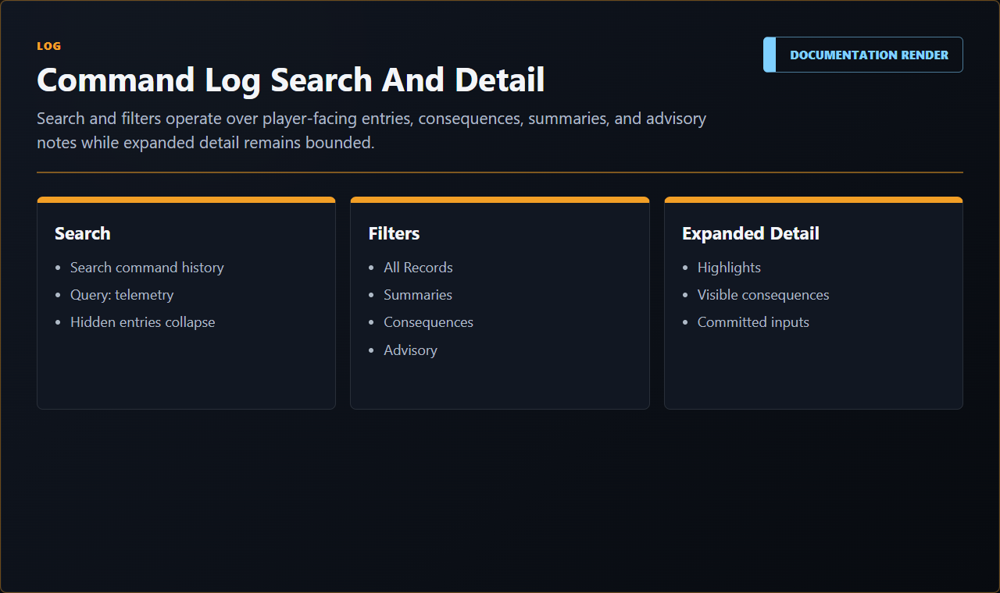
</p>

## Directive Assist

Directive Assist is the SillyTavern input-side helper. It is pre-send assistance, not an automatic campaign-state mutator.

### Actions

| Action | Use |
| --- | --- |
| Draft In Character | Turns rough intent into editable player-character wording. |
| Brief Me | Produces a player-safe brief with knowns, uncertainties, routine context, pressures, and decision focus. |
| Frame as Order | Rewrites rough text as a command/order. |
| Frame as Report | Rewrites rough text as a report. |
| Continue Scene | Drafts a local scene-continuation cue. The final sent message still goes through the normal scene-navigation guards. |
| Cut Within Scene | Drafts a local transition cue for the current unresolved situation without skipping durable outcomes. |
| Reconcile Marked Passage | Starts reconciliation for selected/marked chat passage. |
| Open Pending Reconciliation | Opens Mission to the pending reconciliation card. |

### Result Controls

Assist result modals can include:

- Apply to Chat;
- Replace Selection;
- Insert Summary;
- Restore Rough Text;
- Try Again;
- Cancel.

Provider fallback should warn the operator when output was recovered, replaced, or rejected.
While an Assist generation is pending, SillyTavern shows a notification and the Assist launcher swaps its ship icon for a spinner.

<p align="center">
  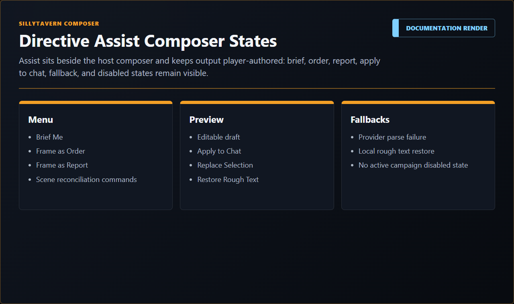
</p>

## Settings Route

Settings has three subtabs:

1. **Systems**
2. **Providers**
3. **Safety**

### Systems

Systems shows runtime controls and host state. It can include:

- active save status;
- runtime history/autosave settings;
- interface hints;
- tips and tutorials;
- Reset Window related expectations;
- storage or host capability summaries.

#### Tips & Tutorials

On first start, Directive can offer the basic walkthrough in the same guidance popover used for tips. The startup choices are:

- **Begin Tutorial** starts the basic walkthrough immediately.
- **Later** closes the offer without changing the tutorial or tip toggles.
- **Disable Tutorial** stops automatic tutorial offers while keeping manual tutorials available.
- **Disable Tips** stops automatic tips without disabling manual tutorials.

After the basic walkthrough is completed, automatic tutorial offers stop. Startup tips can still appear when **Startup Tips** is enabled. Tips include **Show Me**, **Disable Tips**, an icon-only X close control in the popover header, and icon-only left/right arrows with `Last Tip` and `Next Tip` hover text.

Settings > Systems includes a **Tips & Tutorials** card with:

- **Tutorial Prompts** toggle;
- **Startup Tips** toggle;
- **Begin Tutorial**;
- **Show Tip**;
- **Reset Tutorial Progress**.

`Show Me` opens the relevant Directive route or host-adjacent menu first, then highlights the narrowest available target. For example, Assist tips highlight the exact Assist action button, message-action tips highlight the exact Directive message-action item, and provider tips highlight the relevant provider control instead of the whole Settings page.

The tutorial can temporarily show a populated **Training Scenario** state. This is inert preview data: it does not create a SillyTavern chat, write saves, inject prompt context, or call providers. Use it to learn what Mission, Crew, Ship, Log, Assist, message actions, saves, recovery, and Command Bearing look like once a real campaign is active.

<p align="center">
  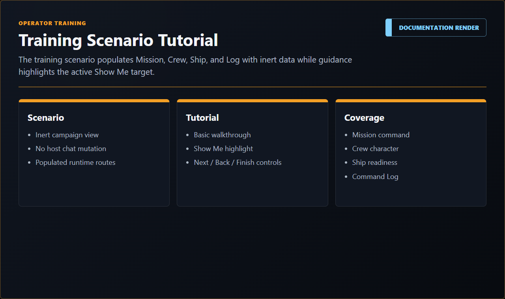
</p>

### Providers

Providers controls:

- Directive Preset status;
- Utility Provider;
- Reasoning Provider;
- model-call role routing;
- provider tests;
- model-call diagnostics.

#### Directive Preset

The preset card can show missing, current, update available, unknown, newer installed, or legacy-name states. Actions include Install/Reinstall/Update and Refresh Status.

#### Provider Lanes

Each lane can use:

- Current Host Model;
- Host Connection Profile;
- OpenAI-Compatible Endpoint.

Each lane can configure:

- source;
- connection profile;
- base URL;
- model id;
- session API key;
- temperature;
- top-p;
- maximum tokens;
- Save Provider;
- Test Provider;
- Clear Session Key where available.

Direct endpoint keys are session-only. Persisted settings only record whether a key is present.

#### Model-Call Routing

Routing folders group roles by meaning:

- Story Output;
- Turn Reading;
- World Structure;
- State Sidecars;
- Context & Summaries;
- Authoring Helpers;
- Other Calls.

Each role shows label, role id, output type, fallback, default lane, current lane, and override state. Changing a route affects which provider lane handles the call; it does not change the role's authority.

### Safety

Safety exposes state and storage diagnostics:

- Verify Active Save;
- Settle Active State;
- Export Active Save;
- Refresh Storage;
- Clean Missing Records;
- stale preview cleanup if available;
- last safety result;
- storage counts and issue summaries.

Use Safety to diagnose storage problems, not to invent missing campaign state.

Settings renders:

<p align="center">
  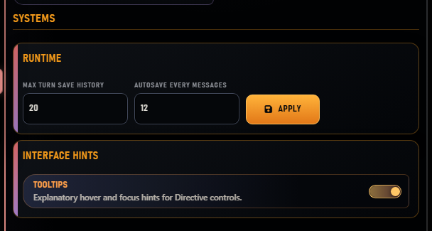
</p>

<p align="center">
  
</p>

<p align="center">
  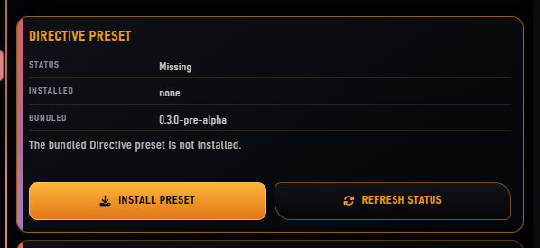
</p>

<p align="center">
  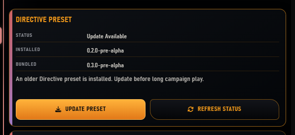
</p>

<p align="center">
  
</p>

<p align="center">
  
</p>

<p align="center">
  
</p>

<p align="center">
  
</p>

<p align="center">
  
</p>

<p align="center">
  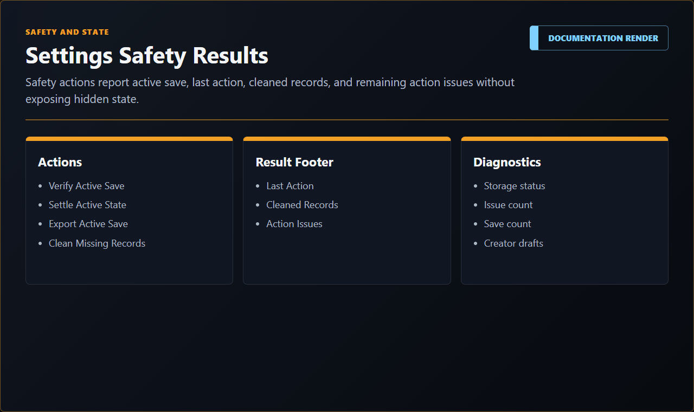
</p>

## Saves, Transactions, And Recovery

### Operator Rule

If an action changes campaign truth, Directive should either commit it through tracked state or refuse and ask for review. Chat prose and Command Log text are presentation; structured campaign state is authoritative.

### Stable Turn Behavior

Directive commits mechanics before narration. Narration retry uses the same outcome and cannot reroll mechanics. Autosaves are created after stable narration.

### Branch Behavior

Use Save Game As to create a named branch. The branch becomes the active save branch and updates chat binding metadata so future manual saves target the branch.

### Edit/Delete Recovery

If the player edits or deletes a message that affected committed outcomes, Directive uses retained snapshots where possible. If dependent committed turns make the change unsafe, Directive marks the situation for review instead of silently corrupting continuity.

For deeper detail, see [State Transactions And Recovery](../technical/STATE_TRANSACTIONS_AND_RECOVERY.md).

## SillyTavern Host Controls

SillyTavern-specific controls include:

- Extensions menu launcher;
- Directive enable/disable lifecycle;
- command-spine shell mount;
- Reset Window;
- Tips & Tutorials startup guidance;
- Directive Assist button beside host input controls;
- message actions overflow;
- Reconcile This Message;
- Set Reconciliation Start;
- Set Reconciliation End;
- Reconcile From Here;
- Directive preset install/status card;
- `/user/files` storage-backed package/save records.

<p align="center">
  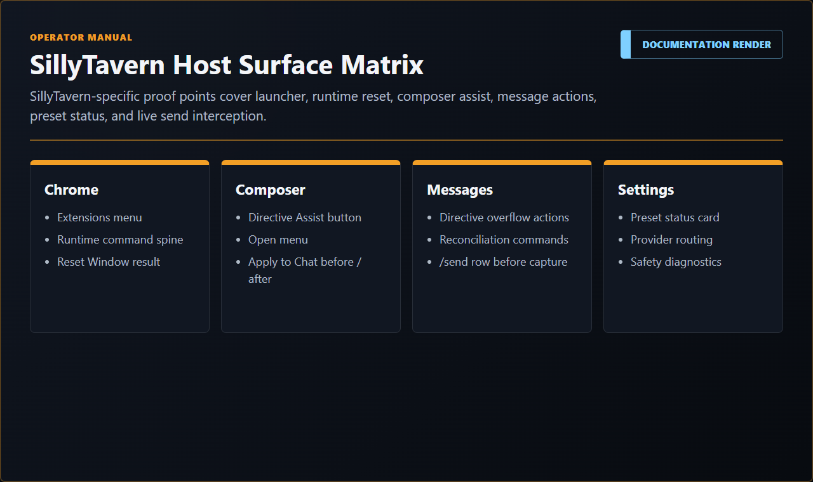
</p>

## Troubleshooting

| Problem | First Check |
| --- | --- |
| Directive opens with no campaign | Campaign > Library & Import, then choose a package or load Records. |
| New Campaign is disabled | Package diagnostics may be failing or runtime assets may be incomplete. |
| Start Campaign fails | Confirm SillyTavern exposes character-card and chat-creation APIs, then retry chat setup. |
| Prompt context is suspended | Open the bound campaign chat or use Open Campaign Chat from Campaign/Mission. |
| Save Game is disabled | Records save guard probably cannot prove the active chat matches the loaded save. |
| Provider actions fail | Settings > Providers, then test Utility and Reasoning lanes. |
| Assist returns odd output | Check provider failure warning; use Restore Rough Text or Try Again. |
| Narration fails after outcome | Use Mission recovery; retry narration without rerolling mechanics. |
| Message edit/delete caused recovery | Open Mission and review the pending reconciliation/recovery state. |
| Package import fails | Check import diagnostics for unsafe path, active content, missing package JSON, or schema errors. |
| Storage reports missing files | Settings > Safety, Verify Active Save, then use cleanup only for stale records. |

## Verification

Operator-manual claims should be checked against:

```powershell
node tools\scripts\verify-repo-structure.mjs
node tools\scripts\test-runtime-shell-creator-flow.mjs
node tools\scripts\test-chat-native-activation-conclusion.mjs
node tools\scripts\test-chat-turn-orchestrator.mjs
node tools\scripts\test-directive-provider-routing.mjs
node tools\scripts\test-directive-guidance.mjs
node tools\scripts\test-directive-storage-repository.mjs
node tools\scripts\test-sillytavern-message-actions.mjs
node tools\scripts\run-alpha-gate.mjs
```

Runtime screenshots were captured through [Documentation Render Capture Plan](../planning/DOCUMENTATION_RENDER_CAPTURE_PLAN.md). Remaining host-surface captures are tracked there.
